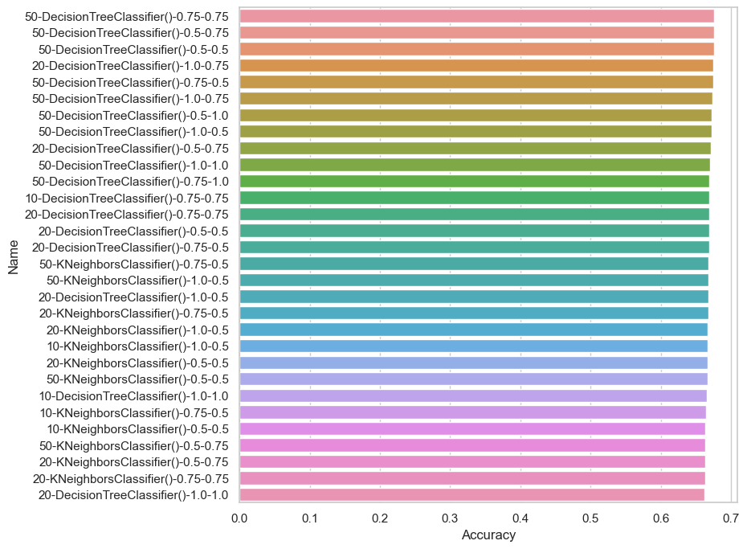
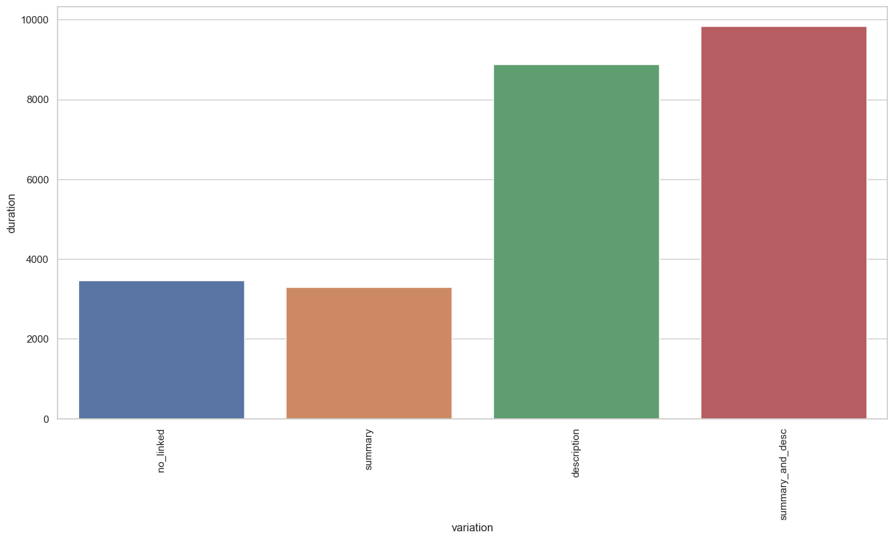

# Comparing variations  
Validating feature set no_linked  
Standardizing text columns:  {'summary'}  
## no_linked  
Start comparing 2021-11-17 00:01:05+01:00  
Using non cached frame with columns:  Index(['Unnamed: 0', 'assignee', 'component_names', 'components_descriptions',
       'created', 'description', 'harm', 'id', 'labels',
       'last_sprint_activatedDate', 'last_sprint_autoStartStop',
       'last_sprint_completeDate', 'last_sprint_endDate', 'last_sprint_goal',
       'last_sprint_id', 'last_sprint_name', 'last_sprint_rapidViewId',
       'last_sprint_sequence', 'last_sprint_startDate', 'last_sprint_state',
       'link', 'points', 'probability', 'probability_final', 'project',
       'requirement_prio', 'resolution', 'resolutiondate', 'risk_impact',
       'risk_likelyhood', 'severity', 'sprint_count', 'status', 'status_key',
       'summary', 'type', 'updated', 'urgent', 'component_count',
       'labels_count', 'summary_raw', 'summary_stopword_count',
       '_lda_summary_dominant_topic', '_lda_summary_topics',
       '_lda_summary_topic_0', '_lda_summary_topic_1', '_lda_summary_topic_2',
       '_lda_summary_topic_3', '_lda_summary_topic_4', '_lda_summary_topic_5',
       '_lda_summary_topic_6', '_lda_summary_topic_7', '_lda_summary_topic_8',
       '_lda_summary_topic_9'],
      dtype='object')  
Preprocessing for no_linked, looking at ['summary']  
Extracted columns from non cached frame:  Index(['Unnamed: 0', 'assignee', 'component_names', 'components_descriptions',
       'created', 'description', 'harm', 'id', 'labels',
       'last_sprint_activatedDate', 'last_sprint_autoStartStop',
       'last_sprint_completeDate', 'last_sprint_endDate', 'last_sprint_goal',
       'last_sprint_id', 'last_sprint_name', 'last_sprint_rapidViewId',
       'last_sprint_sequence', 'last_sprint_startDate', 'last_sprint_state',
       'link', 'points', 'probability', 'probability_final', 'project',
       'requirement_prio', 'resolution', 'resolutiondate', 'risk_impact',
       'risk_likelyhood', 'severity', 'sprint_count', 'status', 'status_key',
       'summary', 'type', 'updated', 'urgent', 'component_count',
       'labels_count', 'summary_raw', 'summary_stopword_count',
       '_lda_summary_dominant_topic', '_lda_summary_topics',
       '_lda_summary_topic_0', '_lda_summary_topic_1', '_lda_summary_topic_2',
       '_lda_summary_topic_3', '_lda_summary_topic_4', '_lda_summary_topic_5',
       '_lda_summary_topic_6', '_lda_summary_topic_7', '_lda_summary_topic_8',
       '_lda_summary_topic_9', '_sentiment', '_urgency', '_general_topic',
       '_se_topic', '_type_topic', '_clarity', '_buzzwords', '_complexity',
       '_emotion', '_testability', '_dependency', '_other_sentiment'],
      dtype='object')  
Using seed for random split 1  
SIZES:   
	train 0.7  
	test 0.15  
	validate 0.15  
  
Data shape
	Training rows:	6099  
	columns:	21  
  
### Working on RandomForrest -- no_linked [2021-11-16 23:55:06]  
Using columns:  ['_dependency', '_type_topic', '_general_topic', '_buzzwords', '_other_sentiment', '_se_topic', '_complexity', '_clarity', '_emotion', '_urgency', '_testability', '_lda_summary_topic_0', '_lda_summary_topic_1', '_lda_summary_topic_2', '_lda_summary_topic_3', '_lda_summary_topic_4', '_lda_summary_topic_5', '_lda_summary_topic_6', '_lda_summary_topic_7', '_lda_summary_topic_8', '_lda_summary_topic_9']  
Using Gridsearch to find optimal model, using -1 cores  
Grid search to find best params took 71.91 seconds  
Fitted using gridsearch  
Best parameters found:
 {'class_weight': None, 'criterion': 'entropy', 'max_depth': 9, 'max_features': 'auto', 'n_estimators': 50} 
  
Start prediction  
Finished prediction in 0.04  

Accuracy train set = 		{}
Accuracy test set = 		{}
Accuracy validation set = 	{}
Average Accuracy = 		0.6696179701590425
  
Showing 6 best and 6 worst results  

  
|     |     mean |         std |     time | class_weight       | criterion   |   max_depth | max_features   |   n_estimators |
|----:|---------:|------------:|---------:|:-------------------|:------------|------------:|:---------------|---------------:|
| 216 | 0.661092 | 0.00160649  | 0.322663 |                    | entropy     |           9 | auto           |             50 |
| 175 | 0.660764 | 0.000836042 | 0.481666 |                    | gini        |           9 | auto           |            100 |
| 217 | 0.660764 | 0.00221196  | 0.633666 |                    | entropy     |           9 | auto           |            100 |
| 149 | 0.660764 | 0.00630345  | 1.32866  | balanced_subsample | entropy     |        4574 | log2           |            100 |
| 218 | 0.6606   | 0.00244297  | 0.324332 |                    | entropy     |           9 | sqrt           |             50 |
| 219 | 0.6606   | 0.00244297  | 0.645332 |                    | entropy     |           9 | sqrt           |            100 |
|  82 | 0.415314 | 0.00945589  | 0.217999 | balanced           | entropy     |           5 | log2           |             50 |
|  80 | 0.414494 | 0.0303811   | 0.220332 | balanced           | entropy     |           5 | sqrt           |             50 |
| 164 | 0.414002 | 0.019052    | 0.290665 | balanced_subsample | entropy     |           5 | sqrt           |             50 |
|  81 | 0.413019 | 0.00766596  | 0.44133  | balanced           | entropy     |           5 | sqrt           |            100 |
| 162 | 0.412035 | 0.0074309   | 0.288998 | balanced_subsample | entropy     |           5 | auto           |             50 |
| 166 | 0.408264 | 0.00175063  | 0.291998 | balanced_subsample | entropy     |           5 | log2           |             50 | 

  
Force ordering of graph due to size, limiting output to 30 best performers  
  

-------------------------------------  

  
Using seed for random split 1  
SIZES:   
	train 0.7  
	test 0.15  
	validate 0.15  
  
Data shape
	Training rows:	6099  
	columns:	21  
  
### Working on AdaBoost -- no_linked [2021-11-16 23:56:18]  
Using columns:  ['_dependency', '_type_topic', '_general_topic', '_buzzwords', '_other_sentiment', '_se_topic', '_complexity', '_clarity', '_emotion', '_urgency', '_testability', '_lda_summary_topic_0', '_lda_summary_topic_1', '_lda_summary_topic_2', '_lda_summary_topic_3', '_lda_summary_topic_4', '_lda_summary_topic_5', '_lda_summary_topic_6', '_lda_summary_topic_7', '_lda_summary_topic_8', '_lda_summary_topic_9']  
Using Gridsearch to find optimal model, using -1 cores  
Grid search to find best params took 6.39 seconds  
Fitted using gridsearch  
Best parameters found:
 {'base_estimator': LogisticRegression(), 'n_estimators': 50} 
  
Start prediction  
Finished prediction in 0.08  

Accuracy train set = 		{}
Accuracy test set = 		{}
Accuracy validation set = 	{}
Average Accuracy = 		0.6574848335792753
  
Showing 6 best and 6 worst results  

  
|    |     mean |         std |    time | base_estimator           |   n_estimators |
|---:|---------:|------------:|--------:|:-------------------------|---------------:|
|  2 | 0.657485 | 0.000231876 | 1.43933 | LogisticRegression()     |             50 |
|  3 | 0.657485 | 0.000231876 | 2.38133 | LogisticRegression()     |            100 |
|  1 | 0.626988 | 0.00334417  | 4.18966 | DecisionTreeClassifier() |            100 |
|  0 | 0.616986 | 0.00635443  | 2.95    | DecisionTreeClassifier() |             50 | 

  
  

-------------------------------------  

  
Using seed for random split 1  
SIZES:   
	train 0.7  
	test 0.15  
	validate 0.15  
  
Data shape
	Training rows:	6099  
	columns:	21  
  
### Working on Bagging -- no_linked [2021-11-16 23:56:25]  
Using columns:  ['_dependency', '_type_topic', '_general_topic', '_buzzwords', '_other_sentiment', '_se_topic', '_complexity', '_clarity', '_emotion', '_urgency', '_testability', '_lda_summary_topic_0', '_lda_summary_topic_1', '_lda_summary_topic_2', '_lda_summary_topic_3', '_lda_summary_topic_4', '_lda_summary_topic_5', '_lda_summary_topic_6', '_lda_summary_topic_7', '_lda_summary_topic_8', '_lda_summary_topic_9']  
Using Gridsearch to find optimal model, using -1 cores  
Grid search to find best params took 52.35 seconds  
Fitted using gridsearch  
Best parameters found:
 {'base_estimator': DecisionTreeClassifier(), 'max_features': 0.5, 'max_samples': 0.5, 'n_estimators': 50} 
  
Start prediction  
Finished prediction in 0.07  

Accuracy train set = 		{}
Accuracy test set = 		{}
Accuracy validation set = 	{}
Average Accuracy = 		0.897524184292507
  
Showing 6 best and 6 worst results  

  
|    |     mean |         std |      time | base_estimator           |   max_features |   max_samples |   n_estimators |
|---:|---------:|------------:|----------:|:-------------------------|---------------:|--------------:|---------------:|
| 26 | 0.665683 | 0.00444211  | 0.566334  | DecisionTreeClassifier() |           0.5  |          0.5  |             50 |
| 47 | 0.664863 | 0.000613487 | 1.11367   | KNeighborsClassifier()   |           0.5  |          1    |             50 |
| 23 | 0.663551 | 0.00184046  | 0.698999  | DecisionTreeClassifier() |           0.5  |          0.75 |             50 |
| 41 | 0.66306  | 0.00321297  | 0.891664  | KNeighborsClassifier()   |           0.75 |          0.75 |             50 |
| 50 | 0.66306  | 0.00184046  | 0.703998  | KNeighborsClassifier()   |           0.5  |          0.75 |             50 |
| 46 | 0.662404 | 0.00255064  | 0.472998  | KNeighborsClassifier()   |           0.5  |          1    |             20 |
|  0 | 0.625512 | 0.00898352  | 0.324998  | DecisionTreeClassifier() |           1    |          1    |             10 |
| 30 | 0.623381 | 0.00341575  | 0.0460021 | KNeighborsClassifier()   |           1    |          0.75 |             10 |
| 31 | 0.623217 | 0.00481946  | 0.068333  | KNeighborsClassifier()   |           1    |          0.75 |             20 |
| 29 | 0.617478 | 0.00167208  | 0.223333  | KNeighborsClassifier()   |           1    |          1    |             50 |
| 28 | 0.615839 | 0.00343146  | 0.080668  | KNeighborsClassifier()   |           1    |          1    |             20 |
| 27 | 0.606329 | 0.0040229   | 0.0293299 | KNeighborsClassifier()   |           1    |          1    |             10 | 

  
Force ordering of graph due to size, limiting output to 30 best performers  
  

-------------------------------------  

  
Using seed for random split 1  
SIZES:   
	train 0.7  
	test 0.15  
	validate 0.15  
  
Data shape
	Training rows:	6099  
	columns:	21  
  
### Working on Stacking -- no_linked [2021-11-16 23:57:18]  
Using columns:  ['_dependency', '_type_topic', '_general_topic', '_buzzwords', '_other_sentiment', '_se_topic', '_complexity', '_clarity', '_emotion', '_urgency', '_testability', '_lda_summary_topic_0', '_lda_summary_topic_1', '_lda_summary_topic_2', '_lda_summary_topic_3', '_lda_summary_topic_4', '_lda_summary_topic_5', '_lda_summary_topic_6', '_lda_summary_topic_7', '_lda_summary_topic_8', '_lda_summary_topic_9']  
Using Gridsearch to find optimal model, using -1 cores  
Grid search to find best params took 77.44 seconds  
Fitted using gridsearch  
Best parameters found:
 {'passthrough': True} 
  
Start prediction  
Finished prediction in 4.02  

Accuracy train set = 		{}
Accuracy test set = 		{}
Accuracy validation set = 	{}
Average Accuracy = 		0.661911788817839
  
Showing 6 best and 6 worst results  

  
|    |     mean |         std |    time | passthrough   |
|---:|---------:|------------:|--------:|:--------------|
|  0 | 0.657321 | 0.000231876 | 29.304  | True          |
|  1 | 0.657321 | 0.000231876 | 29.2387 | False         | 

  
  

-------------------------------------  

  
Using seed for random split 1  
SIZES:   
	train 0.7  
	test 0.15  
	validate 0.15  
  
Data shape
	Training rows:	6099  
	columns:	21  
  
### Working on GradientBoost -- no_linked [2021-11-16 23:58:39]  
Using columns:  ['_dependency', '_type_topic', '_general_topic', '_buzzwords', '_other_sentiment', '_se_topic', '_complexity', '_clarity', '_emotion', '_urgency', '_testability', '_lda_summary_topic_0', '_lda_summary_topic_1', '_lda_summary_topic_2', '_lda_summary_topic_3', '_lda_summary_topic_4', '_lda_summary_topic_5', '_lda_summary_topic_6', '_lda_summary_topic_7', '_lda_summary_topic_8', '_lda_summary_topic_9']  
Using Gridsearch to find optimal model, using -1 cores  
Grid search to find best params took 7.93 seconds  
Fitted using gridsearch  
Best parameters found:
 {'criterion': 'mse', 'loss': 'deviance', 'max_features': 'sqrt', 'n_estimators': 100} 
  
Start prediction  
Finished prediction in 0.02  

Accuracy train set = 		{}
Accuracy test set = 		{}
Accuracy validation set = 	{}
Average Accuracy = 		0.6776520741105099
  
Showing 6 best and 6 worst results  

  
|    |       mean |           std |       time | criterion    | loss        | max_features   |   n_estimators |
|---:|-----------:|--------------:|-----------:|:-------------|:------------|:---------------|---------------:|
| 27 |   0.658305 |   0.00327102  | 0.949334   | mse          | deviance    | sqrt           |            100 |
| 28 |   0.657649 |   0.00175063  | 0.479001   | mse          | deviance    | log2           |             50 |
|  2 |   0.657485 |   0.000836042 | 0.477331   | friedman_mse | deviance    | sqrt           |             50 |
|  4 |   0.656829 |   0.000463753 | 0.483666   | friedman_mse | deviance    | log2           |             50 |
| 29 |   0.656829 |   0.00221196  | 0.88066    | mse          | deviance    | log2           |            100 |
|  5 |   0.656665 |   0.00318777  | 1.003      | friedman_mse | deviance    | log2           |            100 |
| 30 | nan        | nan           | 0.00499805 | mse          | exponential | auto           |             50 |
| 31 | nan        | nan           | 0.00466426 | mse          | exponential | auto           |            100 |
| 32 | nan        | nan           | 0.00466315 | mse          | exponential | sqrt           |             50 |
| 33 | nan        | nan           | 0.00566379 | mse          | exponential | sqrt           |            100 |
| 34 | nan        | nan           | 0.00766222 | mse          | exponential | log2           |             50 |
| 35 | nan        | nan           | 0.00466275 | mse          | exponential | log2           |            100 | 

  
Force ordering of graph due to size, limiting output to 30 best performers  
  

-------------------------------------  

  
Finished comparing 2021-11-17 00:58:48+01:00  
Total seconds: 3462.3797953128815:  
Exact: HH:0.00 	MM:57.00 	 ss:42.38  
Time: 00:57:43  

### model comparisons for no_linked  

  
|    | name          | variation   |   accuracy_overall |   accuracy_train |   accuracy_test |   accuracy_val |   fit_time | model_config                                                                 |   column_count |
|---:|:--------------|:------------|-------------------:|-----------------:|----------------:|---------------:|-----------:|:-----------------------------------------------------------------------------|---------------:|
|  0 | RandomForrest | no_linked   |           0.659404 |         0.669618 |        0.651376 |       0.667431 | 0.0150013  | RandomForestClassifier(criterion='entropy', max_depth=9, n_estimators=50)    |             21 |
|  1 | AdaBoost      | no_linked   |           0.657875 |         0.657485 |        0.649847 |       0.665902 | 0.0316664  | AdaBoostClassifier(base_estimator=LogisticRegression())                      |             21 |
|  2 | Bagging       | no_linked   |           0.65711  |         0.897524 |        0.642202 |       0.672018 | 0.0340013  | BaggingClassifier(base_estimator=DecisionTreeClassifier(), max_features=0.5, |             21 |
|    |               |             |                    |                  |                 |                |            |                   max_samples=0.5, n_estimators=50)                          |                |
|  3 | Stacking      | no_linked   |           0.65711  |         0.661912 |        0.650612 |       0.663609 | 0.776666   | StackingClassifier(estimators=[('DT', DecisionTreeClassifier()),             |             21 |
|    |               |             |                    |                  |                 |                |            |                                ('KNN', KNeighborsClassifier()),              |                |
|    |               |             |                    |                  |                 |                |            |                                ('SVC', SVC(probability=True))],              |                |
|    |               |             |                    |                  |                 |                |            |                    passthrough=True)                                         |                |
|  4 | GradientBoost | no_linked   |           0.654052 |         0.677652 |        0.646789 |       0.661315 | 0.00933154 | GradientBoostingClassifier(criterion='mse', max_features='sqrt')             |             21 | 

  

  
|    | name          | variation   |   accuracy_overall |   accuracy_train |   accuracy_test |   accuracy_val |   fit_time | model_config                                                                 |   column_count |
|---:|:--------------|:------------|-------------------:|-----------------:|----------------:|---------------:|-----------:|:-----------------------------------------------------------------------------|---------------:|
|  0 | RandomForrest | no_linked   |           0.659404 |         0.669618 |        0.651376 |       0.667431 | 0.0150013  | RandomForestClassifier(criterion='entropy', max_depth=9, n_estimators=50)    |             21 |
|  1 | AdaBoost      | no_linked   |           0.657875 |         0.657485 |        0.649847 |       0.665902 | 0.0316664  | AdaBoostClassifier(base_estimator=LogisticRegression())                      |             21 |
|  2 | Bagging       | no_linked   |           0.65711  |         0.897524 |        0.642202 |       0.672018 | 0.0340013  | BaggingClassifier(base_estimator=DecisionTreeClassifier(), max_features=0.5, |             21 |
|    |               |             |                    |                  |                 |                |            |                   max_samples=0.5, n_estimators=50)                          |                |
|  3 | Stacking      | no_linked   |           0.65711  |         0.661912 |        0.650612 |       0.663609 | 0.776666   | StackingClassifier(estimators=[('DT', DecisionTreeClassifier()),             |             21 |
|    |               |             |                    |                  |                 |                |            |                                ('KNN', KNeighborsClassifier()),              |                |
|    |               |             |                    |                  |                 |                |            |                                ('SVC', SVC(probability=True))],              |                |
|    |               |             |                    |                  |                 |                |            |                    passthrough=True)                                         |                |
|  4 | GradientBoost | no_linked   |           0.654052 |         0.677652 |        0.646789 |       0.661315 | 0.00933154 | GradientBoostingClassifier(criterion='mse', max_features='sqrt')             |             21 | 

  
  

  

 |    | Name          |   Accuracy |       Time |   Optimization_time |
|---:|:--------------|-----------:|-----------:|--------------------:|
|  0 | RandomForrest |   0.659404 | 0.0150013  |              72.389 |
|  1 | AdaBoost      |   0.657875 | 0.0316664  |               6.644 |
|  2 | Bagging       |   0.65711  | 0.0340013  |              52.821 |
|  3 | Stacking      |   0.65711  | 0.776666   |              81.589 |
|  4 | GradientBoost |   0.654052 | 0.00933154 |               8.323 | 

  
Best in set was RandomForrest with an accuracy 0.6594036697247707  

==  no_linked == 
================================  

  
Validating feature set summary  
Standardizing text columns:  {'summary'}  
## summary  
Start comparing 2021-11-17 00:58:48+01:00  
Using non cached frame with columns:  Index(['Unnamed: 0', 'assignee', 'component_names', 'components_descriptions',
       'created', 'description', 'harm', 'id', 'labels',
       'last_sprint_activatedDate', 'last_sprint_autoStartStop',
       'last_sprint_completeDate', 'last_sprint_endDate', 'last_sprint_goal',
       'last_sprint_id', 'last_sprint_name', 'last_sprint_rapidViewId',
       'last_sprint_sequence', 'last_sprint_startDate', 'last_sprint_state',
       'link', 'points', 'probability', 'probability_final', 'project',
       'requirement_prio', 'resolution', 'resolutiondate', 'risk_impact',
       'risk_likelyhood', 'severity', 'sprint_count', 'status', 'status_key',
       'summary', 'type', 'updated', 'urgent', 'component_count',
       'labels_count', 'summary_raw', 'summary_stopword_count',
       '_lda_summary_dominant_topic', '_lda_summary_topics',
       '_lda_summary_topic_0', '_lda_summary_topic_1', '_lda_summary_topic_2',
       '_lda_summary_topic_3', '_lda_summary_topic_4', '_lda_summary_topic_5',
       '_lda_summary_topic_6', '_lda_summary_topic_7', '_lda_summary_topic_8',
       '_lda_summary_topic_9'],
      dtype='object')  
Preprocessing for summary, looking at ['summary']  
Extracted columns from non cached frame:  Index(['Unnamed: 0', 'assignee', 'component_names', 'components_descriptions',
       'created', 'description', 'harm', 'id', 'labels',
       'last_sprint_activatedDate', 'last_sprint_autoStartStop',
       'last_sprint_completeDate', 'last_sprint_endDate', 'last_sprint_goal',
       'last_sprint_id', 'last_sprint_name', 'last_sprint_rapidViewId',
       'last_sprint_sequence', 'last_sprint_startDate', 'last_sprint_state',
       'link', 'points', 'probability', 'probability_final', 'project',
       'requirement_prio', 'resolution', 'resolutiondate', 'risk_impact',
       'risk_likelyhood', 'severity', 'sprint_count', 'status', 'status_key',
       'summary', 'type', 'updated', 'urgent', 'component_count',
       'labels_count', 'summary_raw', 'summary_stopword_count',
       '_lda_summary_dominant_topic', '_lda_summary_topics',
       '_lda_summary_topic_0', '_lda_summary_topic_1', '_lda_summary_topic_2',
       '_lda_summary_topic_3', '_lda_summary_topic_4', '_lda_summary_topic_5',
       '_lda_summary_topic_6', '_lda_summary_topic_7', '_lda_summary_topic_8',
       '_lda_summary_topic_9', '_sentiment', '_urgency', '_general_topic',
       '_se_topic', '_type_topic', '_clarity', '_buzzwords', '_complexity',
       '_emotion', '_testability', '_dependency', '_other_sentiment'],
      dtype='object')  
Using seed for random split 1  
SIZES:   
	train 0.7  
	test 0.15  
	validate 0.15  
  
Data shape
	Training rows:	6099  
	columns:	23  
  
### Working on RandomForrest -- summary [2021-11-17 00:49:57]  
Using columns:  ['_dependency', '_type_topic', '_general_topic', '_buzzwords', 'sprint_count', '_other_sentiment', '_se_topic', 'points', '_clarity', '_complexity', '_emotion', '_urgency', '_testability', '_lda_summary_topic_0', '_lda_summary_topic_1', '_lda_summary_topic_2', '_lda_summary_topic_3', '_lda_summary_topic_4', '_lda_summary_topic_5', '_lda_summary_topic_6', '_lda_summary_topic_7', '_lda_summary_topic_8', '_lda_summary_topic_9']  
Using Gridsearch to find optimal model, using -1 cores  
Grid search to find best params took 62.09 seconds  
Fitted using gridsearch  
Best parameters found:
 {'class_weight': 'balanced', 'criterion': 'entropy', 'max_depth': None, 'max_features': 'log2', 'n_estimators': 50} 
  
Start prediction  
Finished prediction in 0.07  

Accuracy train set = 		{}
Accuracy test set = 		{}
Accuracy validation set = 	{}
Average Accuracy = 		0.9970486965076242
  
Showing 6 best and 6 worst results  

  
|     |     mean |        std |     time | class_weight       | criterion   |   max_depth | max_features   |   n_estimators |
|----:|---------:|-----------:|---------:|:-------------------|:------------|------------:|:---------------|---------------:|
|  46 | 0.673881 | 0.00463173 | 0.484666 | balanced           | entropy     |         nan | log2           |             50 |
|  58 | 0.673061 | 0.00465488 | 0.482666 | balanced           | entropy     |          78 | log2           |             50 |
| 141 | 0.672733 | 0.00637976 | 1.092    | balanced_subsample | entropy     |          78 | sqrt           |            100 |
|  35 | 0.672733 | 0.00327102 | 0.717668 | balanced           | gini        |        1525 | log2           |            100 |
|   1 | 0.672405 | 0.0043442  | 0.725663 | balanced           | gini        |         nan | auto           |            100 |
|  77 | 0.672241 | 0.00346265 | 0.96     | balanced           | entropy     |        1525 | log2           |            100 |
|  83 | 0.556485 | 0.0321306  | 0.407665 | balanced           | entropy     |           5 | log2           |            100 |
| 164 | 0.555337 | 0.0376497  | 0.269667 | balanced_subsample | entropy     |           5 | sqrt           |             50 |
|  38 | 0.554681 | 0.0231424  | 0.17333  | balanced           | gini        |           5 | sqrt           |             50 |
|  39 | 0.554189 | 0.0430491  | 0.344666 | balanced           | gini        |           5 | sqrt           |            100 |
|  82 | 0.550582 | 0.02562    | 0.200998 | balanced           | entropy     |           5 | log2           |             50 |
| 120 | 0.546975 | 0.032734   | 0.244331 | balanced_subsample | gini        |           5 | auto           |             50 | 

  
Force ordering of graph due to size, limiting output to 30 best performers  
  

-------------------------------------  

  
Using seed for random split 1  
SIZES:   
	train 0.7  
	test 0.15  
	validate 0.15  
  
Data shape
	Training rows:	6099  
	columns:	23  
  
### Working on AdaBoost -- summary [2021-11-17 00:51:00]  
Using columns:  ['_dependency', '_type_topic', '_general_topic', '_buzzwords', 'sprint_count', '_other_sentiment', '_se_topic', 'points', '_clarity', '_complexity', '_emotion', '_urgency', '_testability', '_lda_summary_topic_0', '_lda_summary_topic_1', '_lda_summary_topic_2', '_lda_summary_topic_3', '_lda_summary_topic_4', '_lda_summary_topic_5', '_lda_summary_topic_6', '_lda_summary_topic_7', '_lda_summary_topic_8', '_lda_summary_topic_9']  
Using Gridsearch to find optimal model, using -1 cores  
Grid search to find best params took 7.87 seconds  
Fitted using gridsearch  
Best parameters found:
 {'base_estimator': DecisionTreeClassifier(), 'n_estimators': 100} 
  
Start prediction  
Finished prediction in 0.2  

Accuracy train set = 		{}
Accuracy test set = 		{}
Accuracy validation set = 	{}
Average Accuracy = 		0.9973766191178882
  
Showing 6 best and 6 worst results  

  
|    |     mean |         std |    time | base_estimator           |   n_estimators |
|---:|---------:|------------:|--------:|:-------------------------|---------------:|
|  1 | 0.661092 | 0.00139126  | 3.442   | DecisionTreeClassifier() |            100 |
|  2 | 0.657485 | 0.000231876 | 1.421   | LogisticRegression()     |             50 |
|  3 | 0.657485 | 0.000231876 | 2.27833 | LogisticRegression()     |            100 |
|  0 | 0.653714 | 0.00637554  | 1.79433 | DecisionTreeClassifier() |             50 | 

  
  

-------------------------------------  

  
Using seed for random split 1  
SIZES:   
	train 0.7  
	test 0.15  
	validate 0.15  
  
Data shape
	Training rows:	6099  
	columns:	23  
  
### Working on Bagging -- summary [2021-11-17 00:51:08]  
Using columns:  ['_dependency', '_type_topic', '_general_topic', '_buzzwords', 'sprint_count', '_other_sentiment', '_se_topic', 'points', '_clarity', '_complexity', '_emotion', '_urgency', '_testability', '_lda_summary_topic_0', '_lda_summary_topic_1', '_lda_summary_topic_2', '_lda_summary_topic_3', '_lda_summary_topic_4', '_lda_summary_topic_5', '_lda_summary_topic_6', '_lda_summary_topic_7', '_lda_summary_topic_8', '_lda_summary_topic_9']  
Using Gridsearch to find optimal model, using -1 cores  
Grid search to find best params took 68.2 seconds  
Fitted using gridsearch  
Best parameters found:
 {'base_estimator': DecisionTreeClassifier(), 'max_features': 0.5, 'max_samples': 1.0, 'n_estimators': 50} 
  
Start prediction  
Finished prediction in 0.08  

Accuracy train set = 		{}
Accuracy test set = 		{}
Accuracy validation set = 	{}
Average Accuracy = 		0.9913100508280046
  
Showing 6 best and 6 worst results  

  
|    |     mean |        std |      time | base_estimator           |   max_features |   max_samples |   n_estimators |
|---:|---------:|-----------:|----------:|:-------------------------|---------------:|--------------:|---------------:|
| 20 | 0.67093  | 0.00637554 | 0.728     | DecisionTreeClassifier() |           0.5  |          1    |             50 |
| 26 | 0.670274 | 0.00267413 | 0.518672  | DecisionTreeClassifier() |           0.5  |          0.5  |             50 |
| 11 | 0.669618 | 0.00502161 | 1.07033   | DecisionTreeClassifier() |           0.75 |          1    |             50 |
| 14 | 0.668962 | 0.00383123 | 0.893     | DecisionTreeClassifier() |           0.75 |          0.75 |             50 |
| 17 | 0.66847  | 0.00710541 | 0.672328  | DecisionTreeClassifier() |           0.75 |          0.5  |             50 |
| 23 | 0.668306 | 0.00930977 | 0.628003  | DecisionTreeClassifier() |           0.5  |          0.75 |             50 |
| 31 | 0.631415 | 0.00322133 | 0.0833302 | KNeighborsClassifier()   |           1    |          0.75 |             20 |
| 32 | 0.630431 | 0.00346265 | 0.205332  | KNeighborsClassifier()   |           1    |          0.75 |             50 |
| 30 | 0.629939 | 0.00129103 | 0.0573302 | KNeighborsClassifier()   |           1    |          0.75 |             10 |
| 28 | 0.621085 | 0.00645516 | 0.0913328 | KNeighborsClassifier()   |           1    |          1    |             20 |
| 29 | 0.61879  | 0.00724034 | 0.249326  | KNeighborsClassifier()   |           1    |          1    |             50 |
| 27 | 0.61715  | 0.00440565 | 0.0353371 | KNeighborsClassifier()   |           1    |          1    |             10 | 

  
Force ordering of graph due to size, limiting output to 30 best performers  
  

-------------------------------------  

  
Using seed for random split 1  
SIZES:   
	train 0.7  
	test 0.15  
	validate 0.15  
  
Data shape
	Training rows:	6099  
	columns:	23  
  
### Working on Stacking -- summary [2021-11-17 00:52:17]  
Using columns:  ['_dependency', '_type_topic', '_general_topic', '_buzzwords', 'sprint_count', '_other_sentiment', '_se_topic', 'points', '_clarity', '_complexity', '_emotion', '_urgency', '_testability', '_lda_summary_topic_0', '_lda_summary_topic_1', '_lda_summary_topic_2', '_lda_summary_topic_3', '_lda_summary_topic_4', '_lda_summary_topic_5', '_lda_summary_topic_6', '_lda_summary_topic_7', '_lda_summary_topic_8', '_lda_summary_topic_9']  
Using Gridsearch to find optimal model, using -1 cores  
Grid search to find best params took 72.51 seconds  
Fitted using gridsearch  
Best parameters found:
 {'passthrough': True} 
  
Start prediction  
Finished prediction in 3.85  

Accuracy train set = 		{}
Accuracy test set = 		{}
Accuracy validation set = 	{}
Average Accuracy = 		0.6904410559108051
  
Showing 6 best and 6 worst results  

  
|    |     mean |        std |    time | passthrough   |
|---:|---------:|-----------:|--------:|:--------------|
|  0 | 0.66224  | 0.0028209  | 27.7703 | True          |
|  1 | 0.661912 | 0.00122697 | 27.495  | False         | 

  
  

-------------------------------------  

  
Using seed for random split 1  
SIZES:   
	train 0.7  
	test 0.15  
	validate 0.15  
  
Data shape
	Training rows:	6099  
	columns:	23  
  
### Working on GradientBoost -- summary [2021-11-17 00:53:34]  
Using columns:  ['_dependency', '_type_topic', '_general_topic', '_buzzwords', 'sprint_count', '_other_sentiment', '_se_topic', 'points', '_clarity', '_complexity', '_emotion', '_urgency', '_testability', '_lda_summary_topic_0', '_lda_summary_topic_1', '_lda_summary_topic_2', '_lda_summary_topic_3', '_lda_summary_topic_4', '_lda_summary_topic_5', '_lda_summary_topic_6', '_lda_summary_topic_7', '_lda_summary_topic_8', '_lda_summary_topic_9']  
Using Gridsearch to find optimal model, using -1 cores  
Grid search to find best params took 7.36 seconds  
Fitted using gridsearch  
Best parameters found:
 {'criterion': 'friedman_mse', 'loss': 'deviance', 'max_features': 'sqrt', 'n_estimators': 50} 
  
Start prediction  
Finished prediction in 0.01  

Accuracy train set = 		{}
Accuracy test set = 		{}
Accuracy validation set = 	{}
Average Accuracy = 		0.6884735202492211
  
Showing 6 best and 6 worst results  

  
|    |       mean |          std |       time | criterion    | loss        | max_features   |   n_estimators |
|---:|-----------:|-------------:|-----------:|:-------------|:------------|:---------------|---------------:|
|  2 |   0.663387 |   0.00258207 | 0.463332   | friedman_mse | deviance    | sqrt           |             50 |
| 26 |   0.661748 |   0.00364422 | 0.475333   | mse          | deviance    | sqrt           |             50 |
|  4 |   0.660764 |   0.00181101 | 0.494001   | friedman_mse | deviance    | log2           |             50 |
|  5 |   0.660436 |   0.00719938 | 0.966334   | friedman_mse | deviance    | log2           |            100 |
| 28 |   0.660108 |   0.00120486 | 0.460667   | mse          | deviance    | log2           |             50 |
|  3 |   0.658469 |   0.00842767 | 0.948332   | friedman_mse | deviance    | sqrt           |            100 |
| 30 | nan        | nan          | 0.00666189 | mse          | exponential | auto           |             50 |
| 31 | nan        | nan          | 0.00633113 | mse          | exponential | auto           |            100 |
| 32 | nan        | nan          | 0.00733145 | mse          | exponential | sqrt           |             50 |
| 33 | nan        | nan          | 0.00599806 | mse          | exponential | sqrt           |            100 |
| 34 | nan        | nan          | 0.00633311 | mse          | exponential | log2           |             50 |
| 35 | nan        | nan          | 0.00633311 | mse          | exponential | log2           |            100 | 

  
Force ordering of graph due to size, limiting output to 30 best performers  
  

-------------------------------------  

  
Finished comparing 2021-11-17 01:53:41+01:00  
Total seconds: 3293.4543795585632:  
Exact: HH:0.00 	MM:54.00 	 ss:53.45  
Time: 00:54:54  

### model comparisons for summary  

  
|    | name          | variation   |   accuracy_overall |   accuracy_train |   accuracy_test |   accuracy_val |   fit_time | model_config                                                                  |   column_count |
|---:|:--------------|:------------|-------------------:|-----------------:|----------------:|---------------:|-----------:|:------------------------------------------------------------------------------|---------------:|
|  0 | RandomForrest | summary     |           0.666284 |         0.997049 |        0.665138 |       0.667431 | 0.0239989  | RandomForestClassifier(class_weight='balanced', criterion='entropy',          |             23 |
|    |               |             |                    |                  |                 |                |            |                        max_features='log2', n_estimators=50)                  |                |
|  1 | AdaBoost      | summary     |           0.666284 |         0.997377 |        0.662844 |       0.669725 | 0.0596659  | AdaBoostClassifier(base_estimator=DecisionTreeClassifier(), n_estimators=100) |             23 |
|  2 | Bagging       | summary     |           0.665138 |         0.99131  |        0.661315 |       0.66896  | 0.0283301  | BaggingClassifier(base_estimator=DecisionTreeClassifier(), max_features=0.5,  |             23 |
|    |               |             |                    |                  |                 |                |            |                   n_estimators=50)                                            |                |
|  3 | Stacking      | summary     |           0.657875 |         0.690441 |        0.651376 |       0.664373 | 0.740331   | StackingClassifier(estimators=[('DT', DecisionTreeClassifier()),              |             23 |
|    |               |             |                    |                  |                 |                |            |                                ('KNN', KNeighborsClassifier()),               |                |
|    |               |             |                    |                  |                 |                |            |                                ('SVC', SVC(probability=True))],               |                |
|    |               |             |                    |                  |                 |                |            |                    passthrough=True)                                          |                |
|  4 | GradientBoost | summary     |           0.669343 |         0.688474 |        0.66896  |       0.669725 | 0.00699751 | GradientBoostingClassifier(max_features='sqrt', n_estimators=50)              |             23 | 

  

  
|    | name          | variation   |   accuracy_overall |   accuracy_train |   accuracy_test |   accuracy_val |   fit_time | model_config                                                                  |   column_count |
|---:|:--------------|:------------|-------------------:|-----------------:|----------------:|---------------:|-----------:|:------------------------------------------------------------------------------|---------------:|
|  4 | GradientBoost | summary     |           0.669343 |         0.688474 |        0.66896  |       0.669725 | 0.00699751 | GradientBoostingClassifier(max_features='sqrt', n_estimators=50)              |             23 |
|  0 | RandomForrest | summary     |           0.666284 |         0.997049 |        0.665138 |       0.667431 | 0.0239989  | RandomForestClassifier(class_weight='balanced', criterion='entropy',          |             23 |
|    |               |             |                    |                  |                 |                |            |                        max_features='log2', n_estimators=50)                  |                |
|  1 | AdaBoost      | summary     |           0.666284 |         0.997377 |        0.662844 |       0.669725 | 0.0596659  | AdaBoostClassifier(base_estimator=DecisionTreeClassifier(), n_estimators=100) |             23 |
|  2 | Bagging       | summary     |           0.665138 |         0.99131  |        0.661315 |       0.66896  | 0.0283301  | BaggingClassifier(base_estimator=DecisionTreeClassifier(), max_features=0.5,  |             23 |
|    |               |             |                    |                  |                 |                |            |                   n_estimators=50)                                            |                |
|  3 | Stacking      | summary     |           0.657875 |         0.690441 |        0.651376 |       0.664373 | 0.740331   | StackingClassifier(estimators=[('DT', DecisionTreeClassifier()),              |             23 |
|    |               |             |                    |                  |                 |                |            |                                ('KNN', KNeighborsClassifier()),               |                |
|    |               |             |                    |                  |                 |                |            |                                ('SVC', SVC(probability=True))],               |                |
|    |               |             |                    |                  |                 |                |            |                    passthrough=True)                                          |                | 

  
  

  

 |    | Name          |   Accuracy |       Time |   Optimization_time |
|---:|:--------------|-----------:|-----------:|--------------------:|
|  0 | RandomForrest |   0.666284 | 0.0239989  |            62.5687  |
|  1 | AdaBoost      |   0.666284 | 0.0596659  |             8.23325 |
|  2 | Bagging       |   0.665138 | 0.0283301  |            68.6857  |
|  3 | Stacking      |   0.657875 | 0.740331   |            76.5082  |
|  4 | GradientBoost |   0.669343 | 0.00699751 |             7.74311 | 

  
Best in set was GradientBoost with an accuracy 0.6693425076452599  

==  summary == 
================================  

  
Validating feature set description  
Standardizing text columns:  {'description'}  
## description  
Start comparing 2021-11-17 01:53:42+01:00  
Using non cached frame with columns:  Index(['Unnamed: 0', 'assignee', 'component_names', 'components_descriptions',
       'created', 'description', 'harm', 'id', 'labels',
       'last_sprint_activatedDate', 'last_sprint_autoStartStop',
       'last_sprint_completeDate', 'last_sprint_endDate', 'last_sprint_goal',
       'last_sprint_id', 'last_sprint_name', 'last_sprint_rapidViewId',
       'last_sprint_sequence', 'last_sprint_startDate', 'last_sprint_state',
       'link', 'points', 'probability', 'probability_final', 'project',
       'requirement_prio', 'resolution', 'resolutiondate', 'risk_impact',
       'risk_likelyhood', 'severity', 'sprint_count', 'status', 'status_key',
       'summary', 'type', 'updated', 'urgent', 'component_count',
       'labels_count', 'description_raw', 'description_stopword_count',
       '_lda_description_dominant_topic', '_lda_description_topics',
       '_lda_description_topic_0', '_lda_description_topic_1',
       '_lda_description_topic_2', '_lda_description_topic_3',
       '_lda_description_topic_4', '_lda_description_topic_5',
       '_lda_description_topic_6', '_lda_description_topic_7',
       '_lda_description_topic_8', '_lda_description_topic_9'],
      dtype='object')  
Preprocessing for description, looking at ['description']  
Extracted columns from non cached frame:  Index(['Unnamed: 0', 'assignee', 'component_names', 'components_descriptions',
       'created', 'description', 'harm', 'id', 'labels',
       'last_sprint_activatedDate', 'last_sprint_autoStartStop',
       'last_sprint_completeDate', 'last_sprint_endDate', 'last_sprint_goal',
       'last_sprint_id', 'last_sprint_name', 'last_sprint_rapidViewId',
       'last_sprint_sequence', 'last_sprint_startDate', 'last_sprint_state',
       'link', 'points', 'probability', 'probability_final', 'project',
       'requirement_prio', 'resolution', 'resolutiondate', 'risk_impact',
       'risk_likelyhood', 'severity', 'sprint_count', 'status', 'status_key',
       'summary', 'type', 'updated', 'urgent', 'component_count',
       'labels_count', 'description_raw', 'description_stopword_count',
       '_lda_description_dominant_topic', '_lda_description_topics',
       '_lda_description_topic_0', '_lda_description_topic_1',
       '_lda_description_topic_2', '_lda_description_topic_3',
       '_lda_description_topic_4', '_lda_description_topic_5',
       '_lda_description_topic_6', '_lda_description_topic_7',
       '_lda_description_topic_8', '_lda_description_topic_9', '_sentiment',
       '_urgency', '_general_topic', '_se_topic', '_type_topic', '_clarity',
       '_buzzwords', '_complexity', '_emotion', '_testability', '_dependency',
       '_other_sentiment'],
      dtype='object')  
Using seed for random split 1  
SIZES:   
	train 0.7  
	test 0.15  
	validate 0.15  
  
Data shape
	Training rows:	5371  
	columns:	23  
  
### Working on RandomForrest -- description [2021-11-17 03:18:15]  
Using columns:  ['_dependency', '_type_topic', '_general_topic', '_buzzwords', 'sprint_count', '_other_sentiment', '_se_topic', 'points', '_clarity', '_complexity', '_emotion', '_urgency', '_testability', '_lda_description_topic_0', '_lda_description_topic_1', '_lda_description_topic_2', '_lda_description_topic_3', '_lda_description_topic_4', '_lda_description_topic_5', '_lda_description_topic_6', '_lda_description_topic_7', '_lda_description_topic_8', '_lda_description_topic_9']  
Using Gridsearch to find optimal model, using -1 cores  
Grid search to find best params took 73.41 seconds  
Fitted using gridsearch  
Best parameters found:
 {'class_weight': 'balanced_subsample', 'criterion': 'entropy', 'max_depth': None, 'max_features': 'log2', 'n_estimators': 50} 
  
Start prediction  
Finished prediction in 0.06  

Accuracy train set = 		{}
Accuracy test set = 		{}
Accuracy validation set = 	{}
Average Accuracy = 		0.9955315583690189
  
Showing 6 best and 6 worst results  

  
|     |     mean |         std |     time | class_weight       | criterion   |   max_depth | max_features   |   n_estimators |
|----:|---------:|------------:|---------:|:-------------------|:------------|------------:|:---------------|---------------:|
| 130 | 0.680694 | 0.0060114   | 0.678664 | balanced_subsample | entropy     |         nan | log2           |             50 |
| 127 | 0.680507 | 0.000385485 | 1.33966  | balanced_subsample | entropy     |         nan | auto           |            100 |
| 235 | 0.680506 | 0.0012891   | 1.22067  |                    | entropy     |        2686 | auto           |            100 |
| 115 | 0.680506 | 0.00320283  | 0.925664 | balanced_subsample | gini        |        1343 | auto           |            100 |
| 156 | 0.680321 | 0.00270678  | 0.678333 | balanced_subsample | entropy     |        1343 | auto           |             50 |
|  20 | 0.680134 | 0.00382225  | 0.407662 | balanced           | gini        |        4028 | sqrt           |             50 |
|  36 | 0.607893 | 0.0115547   | 0.21533  | balanced           | gini        |           5 | auto           |             50 |
|  80 | 0.606774 | 0.0277313   | 0.275996 | balanced           | entropy     |           5 | sqrt           |             50 |
|  38 | 0.606037 | 0.0191243   | 0.200998 | balanced           | gini        |           5 | sqrt           |             50 |
| 162 | 0.604918 | 0.0104362   | 0.339664 | balanced_subsample | entropy     |           5 | auto           |             50 |
| 120 | 0.596166 | 0.0277579   | 0.267332 | balanced_subsample | gini        |           5 | auto           |             50 |
|  40 | 0.581637 | 0.0193927   | 0.205332 | balanced           | gini        |           5 | log2           |             50 | 

  
Force ordering of graph due to size, limiting output to 30 best performers  
  

-------------------------------------  

  
Using seed for random split 1  
SIZES:   
	train 0.7  
	test 0.15  
	validate 0.15  
  
Data shape
	Training rows:	5371  
	columns:	23  
  
### Working on AdaBoost -- description [2021-11-17 03:19:29]  
Using columns:  ['_dependency', '_type_topic', '_general_topic', '_buzzwords', 'sprint_count', '_other_sentiment', '_se_topic', 'points', '_clarity', '_complexity', '_emotion', '_urgency', '_testability', '_lda_description_topic_0', '_lda_description_topic_1', '_lda_description_topic_2', '_lda_description_topic_3', '_lda_description_topic_4', '_lda_description_topic_5', '_lda_description_topic_6', '_lda_description_topic_7', '_lda_description_topic_8', '_lda_description_topic_9']  
Using Gridsearch to find optimal model, using -1 cores  
Grid search to find best params took 9.9 seconds  
Fitted using gridsearch  
Best parameters found:
 {'base_estimator': DecisionTreeClassifier(), 'n_estimators': 100} 
  
Start prediction  
Finished prediction in 0.15  

Accuracy train set = 		{}
Accuracy test set = 		{}
Accuracy validation set = 	{}
Average Accuracy = 		0.9955315583690189
  
Showing 6 best and 6 worst results  

  
|    |     mean |         std |    time | base_estimator           |   n_estimators |
|---:|---------:|------------:|--------:|:-------------------------|---------------:|
|  1 | 0.671755 | 0.0063462   | 4.416   | DecisionTreeClassifier() |            100 |
|  0 | 0.663378 | 0.00945361  | 2.342   | DecisionTreeClassifier() |             50 |
|  2 | 0.660771 | 0.000173952 | 1.28233 | LogisticRegression()     |             50 |
|  3 | 0.660585 | 0.000231957 | 1.98167 | LogisticRegression()     |            100 | 

  
  

-------------------------------------  

  
Using seed for random split 1  
SIZES:   
	train 0.7  
	test 0.15  
	validate 0.15  
  
Data shape
	Training rows:	5371  
	columns:	23  
  
### Working on Bagging -- description [2021-11-17 03:19:39]  
Using columns:  ['_dependency', '_type_topic', '_general_topic', '_buzzwords', 'sprint_count', '_other_sentiment', '_se_topic', 'points', '_clarity', '_complexity', '_emotion', '_urgency', '_testability', '_lda_description_topic_0', '_lda_description_topic_1', '_lda_description_topic_2', '_lda_description_topic_3', '_lda_description_topic_4', '_lda_description_topic_5', '_lda_description_topic_6', '_lda_description_topic_7', '_lda_description_topic_8', '_lda_description_topic_9']  
Using Gridsearch to find optimal model, using -1 cores  
Grid search to find best params took 54.92 seconds  
Fitted using gridsearch  
Best parameters found:
 {'base_estimator': DecisionTreeClassifier(), 'max_features': 0.75, 'max_samples': 0.75, 'n_estimators': 50} 
  
Start prediction  
Finished prediction in 0.07  

Accuracy train set = 		{}
Accuracy test set = 		{}
Accuracy validation set = 	{}
Average Accuracy = 		0.9878979705827593
  
Showing 6 best and 6 worst results  

  
|    |     mean |        std |      time | base_estimator           |   max_features |   max_samples |   n_estimators |
|---:|---------:|-----------:|----------:|:-------------------------|---------------:|--------------:|---------------:|
| 14 | 0.675852 | 0.00251815 | 1.094     | DecisionTreeClassifier() |           0.75 |          0.75 |             50 |
| 17 | 0.675666 | 0.00176389 | 0.798996  | DecisionTreeClassifier() |           0.75 |          0.5  |             50 |
| 26 | 0.675665 | 0.00218316 | 0.600999  | DecisionTreeClassifier() |           0.5  |          0.5  |             50 |
| 10 | 0.675108 | 0.00615299 | 0.533664  | DecisionTreeClassifier() |           0.75 |          1    |             20 |
| 23 | 0.674548 | 0.00412738 | 0.807999  | DecisionTreeClassifier() |           0.5  |          0.75 |             50 |
| 11 | 0.673431 | 0.0021509  | 1.28233   | DecisionTreeClassifier() |           0.75 |          1    |             50 |
| 30 | 0.632844 | 0.00341064 | 0.0296664 | KNeighborsClassifier()   |           1    |          0.75 |             10 |
| 32 | 0.632657 | 0.00845288 | 0.157001  | KNeighborsClassifier()   |           1    |          0.75 |             50 |
| 31 | 0.632286 | 0.00614348 | 0.0643325 | KNeighborsClassifier()   |           1    |          0.75 |             20 |
| 29 | 0.625024 | 0.00136834 | 0.211666  | KNeighborsClassifier()   |           1    |          1    |             50 |
| 28 | 0.623535 | 0.00628115 | 0.0720026 | KNeighborsClassifier()   |           1    |          1    |             20 |
| 27 | 0.620927 | 0.0011408  | 0.0263331 | KNeighborsClassifier()   |           1    |          1    |             10 | 

  
Force ordering of graph due to size, limiting output to 30 best performers  
  

-------------------------------------  

  
Using seed for random split 1  
SIZES:   
	train 0.7  
	test 0.15  
	validate 0.15  
  
Data shape
	Training rows:	5371  
	columns:	23  
  
### Working on Stacking -- description [2021-11-17 03:20:35]  
Using columns:  ['_dependency', '_type_topic', '_general_topic', '_buzzwords', 'sprint_count', '_other_sentiment', '_se_topic', 'points', '_clarity', '_complexity', '_emotion', '_urgency', '_testability', '_lda_description_topic_0', '_lda_description_topic_1', '_lda_description_topic_2', '_lda_description_topic_3', '_lda_description_topic_4', '_lda_description_topic_5', '_lda_description_topic_6', '_lda_description_topic_7', '_lda_description_topic_8', '_lda_description_topic_9']  
Using Gridsearch to find optimal model, using -1 cores  
Grid search to find best params took 55.35 seconds  
Fitted using gridsearch  
Best parameters found:
 {'passthrough': True} 
  
Start prediction  
Finished prediction in 3.0  

Accuracy train set = 		{}
Accuracy test set = 		{}
Accuracy validation set = 	{}
Average Accuracy = 		0.7017315211320052
  
Showing 6 best and 6 worst results  

  
|    |     mean |        std |    time | passthrough   |
|---:|---------:|-----------:|--------:|:--------------|
|  0 | 0.663005 | 0.00137952 | 21.4013 | True          |
|  1 | 0.662819 | 0.00063221 | 21.248  | False         | 

  
  

-------------------------------------  

  
Using seed for random split 1  
SIZES:   
	train 0.7  
	test 0.15  
	validate 0.15  
  
Data shape
	Training rows:	5371  
	columns:	23  
  
### Working on GradientBoost -- description [2021-11-17 03:21:33]  
Using columns:  ['_dependency', '_type_topic', '_general_topic', '_buzzwords', 'sprint_count', '_other_sentiment', '_se_topic', 'points', '_clarity', '_complexity', '_emotion', '_urgency', '_testability', '_lda_description_topic_0', '_lda_description_topic_1', '_lda_description_topic_2', '_lda_description_topic_3', '_lda_description_topic_4', '_lda_description_topic_5', '_lda_description_topic_6', '_lda_description_topic_7', '_lda_description_topic_8', '_lda_description_topic_9']  
Using Gridsearch to find optimal model, using -1 cores  
Grid search to find best params took 11.01 seconds  
Fitted using gridsearch  
Best parameters found:
 {'criterion': 'friedman_mse', 'loss': 'deviance', 'max_features': 'auto', 'n_estimators': 50} 
  
Start prediction  
Finished prediction in 0.01  

Accuracy train set = 		{}
Accuracy test set = 		{}
Accuracy validation set = 	{}
Average Accuracy = 		0.7145782908210762
  
Showing 6 best and 6 worst results  

  
|    |       mean |          std |       time | criterion    | loss        | max_features   |   n_estimators |
|---:|-----------:|-------------:|-----------:|:-------------|:------------|:---------------|---------------:|
|  0 |   0.677341 |   0.00603807 | 1.845      | friedman_mse | deviance    | auto           |             50 |
| 24 |   0.677341 |   0.00634585 | 1.74667    | mse          | deviance    | auto           |             50 |
|  3 |   0.676412 |   0.00842549 | 1.10266    | friedman_mse | deviance    | sqrt           |            100 |
|  2 |   0.676411 |   0.00333646 | 0.521665   | friedman_mse | deviance    | sqrt           |             50 |
| 28 |   0.676224 |   0.00376653 | 0.532663   | mse          | deviance    | log2           |             50 |
|  1 |   0.675667 |   0.00690192 | 3.73867    | friedman_mse | deviance    | auto           |            100 |
| 30 | nan        | nan          | 0.00466402 | mse          | exponential | auto           |             50 |
| 31 | nan        | nan          | 0.00666364 | mse          | exponential | auto           |            100 |
| 32 | nan        | nan          | 0.00433159 | mse          | exponential | sqrt           |             50 |
| 33 | nan        | nan          | 0.00533183 | mse          | exponential | sqrt           |            100 |
| 34 | nan        | nan          | 0.00533239 | mse          | exponential | log2           |             50 |
| 35 | nan        | nan          | 0.00533048 | mse          | exponential | log2           |            100 | 

  
Force ordering of graph due to size, limiting output to 30 best performers  
  

-------------------------------------  

  
Finished comparing 2021-11-17 04:21:45+01:00  
Total seconds: 8883.055357217789:  
Exact: HH:2.00 	MM:28.00 	 ss:3.06  
Time: 02:28:04  

### model comparisons for description  

  
|    | name          | variation   |   accuracy_overall |   accuracy_train |   accuracy_test |   accuracy_val |   fit_time | model_config                                                                   |   column_count |
|---:|:--------------|:------------|-------------------:|-----------------:|----------------:|---------------:|-----------:|:-------------------------------------------------------------------------------|---------------:|
|  0 | RandomForrest | description |           0.680122 |         0.995532 |        0.679688 |       0.680556 | 0.0213345  | RandomForestClassifier(class_weight='balanced_subsample', criterion='entropy', |             23 |
|    |               |             |                    |                  |                 |                |            |                        max_features='log2', n_estimators=50)                   |                |
|  1 | AdaBoost      | description |           0.662326 |         0.995532 |        0.659722 |       0.664931 | 0.0460005  | AdaBoostClassifier(base_estimator=DecisionTreeClassifier(), n_estimators=100)  |             23 |
|  2 | Bagging       | description |           0.673611 |         0.987898 |        0.672743 |       0.674479 | 0.025001   | BaggingClassifier(base_estimator=DecisionTreeClassifier(), max_features=0.75,  |             23 |
|    |               |             |                    |                  |                 |                |            |                   max_samples=0.75, n_estimators=50)                           |                |
|  3 | Stacking      | description |           0.656684 |         0.701732 |        0.649306 |       0.664062 | 0.555667   | StackingClassifier(estimators=[('DT', DecisionTreeClassifier()),               |             23 |
|    |               |             |                    |                  |                 |                |            |                                ('KNN', KNeighborsClassifier()),                |                |
|    |               |             |                    |                  |                 |                |            |                                ('SVC', SVC(probability=True))],                |                |
|    |               |             |                    |                  |                 |                |            |                    passthrough=True)                                           |                |
|  4 | GradientBoost | description |           0.675347 |         0.714578 |        0.664931 |       0.685764 | 0.00600115 | GradientBoostingClassifier(max_features='auto', n_estimators=50)               |             23 | 

  

  
|    | name          | variation   |   accuracy_overall |   accuracy_train |   accuracy_test |   accuracy_val |   fit_time | model_config                                                                   |   column_count |
|---:|:--------------|:------------|-------------------:|-----------------:|----------------:|---------------:|-----------:|:-------------------------------------------------------------------------------|---------------:|
|  0 | RandomForrest | description |           0.680122 |         0.995532 |        0.679688 |       0.680556 | 0.0213345  | RandomForestClassifier(class_weight='balanced_subsample', criterion='entropy', |             23 |
|    |               |             |                    |                  |                 |                |            |                        max_features='log2', n_estimators=50)                   |                |
|  4 | GradientBoost | description |           0.675347 |         0.714578 |        0.664931 |       0.685764 | 0.00600115 | GradientBoostingClassifier(max_features='auto', n_estimators=50)               |             23 |
|  2 | Bagging       | description |           0.673611 |         0.987898 |        0.672743 |       0.674479 | 0.025001   | BaggingClassifier(base_estimator=DecisionTreeClassifier(), max_features=0.75,  |             23 |
|    |               |             |                    |                  |                 |                |            |                   max_samples=0.75, n_estimators=50)                           |                |
|  1 | AdaBoost      | description |           0.662326 |         0.995532 |        0.659722 |       0.664931 | 0.0460005  | AdaBoostClassifier(base_estimator=DecisionTreeClassifier(), n_estimators=100)  |             23 |
|  3 | Stacking      | description |           0.656684 |         0.701732 |        0.649306 |       0.664062 | 0.555667   | StackingClassifier(estimators=[('DT', DecisionTreeClassifier()),               |             23 |
|    |               |             |                    |                  |                 |                |            |                                ('KNN', KNeighborsClassifier()),                |                |
|    |               |             |                    |                  |                 |                |            |                                ('SVC', SVC(probability=True))],                |                |
|    |               |             |                    |                  |                 |                |            |                    passthrough=True)                                           |                | 

  
  

  

 |    | Name          |   Accuracy |       Time |   Optimization_time |
|---:|:--------------|-----------:|-----------:|--------------------:|
|  0 | RandomForrest |   0.680122 | 0.0213345  |              73.87  |
|  1 | AdaBoost      |   0.662326 | 0.0460005  |              10.21  |
|  2 | Bagging       |   0.673611 | 0.025001   |              55.394 |
|  3 | Stacking      |   0.656684 | 0.555667   |              58.494 |
|  4 | GradientBoost |   0.675347 | 0.00600115 |              11.401 | 

  
Best in set was RandomForrest with an accuracy 0.6801215277777778  

==  description == 
================================  

  
Validating feature set summary_and_desc  
Standardizing text columns:  {'summary', 'description'}  
## summary_and_desc  
Start comparing 2021-11-17 04:21:45+01:00  
Using non cached frame with columns:  Index(['Unnamed: 0', 'assignee', 'component_names', 'components_descriptions',
       'created', 'description', 'harm', 'id', 'labels',
       'last_sprint_activatedDate', 'last_sprint_autoStartStop',
       'last_sprint_completeDate', 'last_sprint_endDate', 'last_sprint_goal',
       'last_sprint_id', 'last_sprint_name', 'last_sprint_rapidViewId',
       'last_sprint_sequence', 'last_sprint_startDate', 'last_sprint_state',
       'link', 'points', 'probability', 'probability_final', 'project',
       'requirement_prio', 'resolution', 'resolutiondate', 'risk_impact',
       'risk_likelyhood', 'severity', 'sprint_count', 'status', 'status_key',
       'summary', 'type', 'updated', 'urgent', 'component_count',
       'labels_count', 'summary_raw', 'summary_stopword_count',
       'description_raw', 'description_stopword_count',
       '_lda_summary_dominant_topic', '_lda_summary_topics',
       '_lda_summary_topic_0', '_lda_summary_topic_1', '_lda_summary_topic_2',
       '_lda_summary_topic_3', '_lda_summary_topic_4', '_lda_summary_topic_5',
       '_lda_summary_topic_6', '_lda_summary_topic_7', '_lda_summary_topic_8',
       '_lda_summary_topic_9', '_lda_description_dominant_topic',
       '_lda_description_topics', '_lda_description_topic_0',
       '_lda_description_topic_1', '_lda_description_topic_2',
       '_lda_description_topic_3', '_lda_description_topic_4',
       '_lda_description_topic_5', '_lda_description_topic_6',
       '_lda_description_topic_7', '_lda_description_topic_8',
       '_lda_description_topic_9'],
      dtype='object')  
Preprocessing for summary_and_desc, looking at ['summary', 'description']  
Extracted columns from non cached frame:  Index(['Unnamed: 0', 'assignee', 'component_names', 'components_descriptions',
       'created', 'description', 'harm', 'id', 'labels',
       'last_sprint_activatedDate', 'last_sprint_autoStartStop',
       'last_sprint_completeDate', 'last_sprint_endDate', 'last_sprint_goal',
       'last_sprint_id', 'last_sprint_name', 'last_sprint_rapidViewId',
       'last_sprint_sequence', 'last_sprint_startDate', 'last_sprint_state',
       'link', 'points', 'probability', 'probability_final', 'project',
       'requirement_prio', 'resolution', 'resolutiondate', 'risk_impact',
       'risk_likelyhood', 'severity', 'sprint_count', 'status', 'status_key',
       'summary', 'type', 'updated', 'urgent', 'component_count',
       'labels_count', 'summary_raw', 'summary_stopword_count',
       'description_raw', 'description_stopword_count',
       '_lda_summary_dominant_topic', '_lda_summary_topics',
       '_lda_summary_topic_0', '_lda_summary_topic_1', '_lda_summary_topic_2',
       '_lda_summary_topic_3', '_lda_summary_topic_4', '_lda_summary_topic_5',
       '_lda_summary_topic_6', '_lda_summary_topic_7', '_lda_summary_topic_8',
       '_lda_summary_topic_9', '_lda_description_dominant_topic',
       '_lda_description_topics', '_lda_description_topic_0',
       '_lda_description_topic_1', '_lda_description_topic_2',
       '_lda_description_topic_3', '_lda_description_topic_4',
       '_lda_description_topic_5', '_lda_description_topic_6',
       '_lda_description_topic_7', '_lda_description_topic_8',
       '_lda_description_topic_9', '_sentiment', '_urgency', '_general_topic',
       '_se_topic', '_type_topic', '_clarity', '_buzzwords', '_complexity',
       '_emotion', '_testability', '_dependency', '_other_sentiment'],
      dtype='object')  
Using seed for random split 1  
SIZES:   
	train 0.7  
	test 0.15  
	validate 0.15  
  
Data shape
	Training rows:	5371  
	columns:	33  
  
### Working on RandomForrest -- summary_and_desc [2021-11-17 06:01:26]  
Using columns:  ['_dependency', '_type_topic', '_general_topic', '_buzzwords', 'sprint_count', '_other_sentiment', '_se_topic', 'points', '_clarity', '_complexity', '_emotion', '_urgency', '_testability', '_lda_summary_topic_0', '_lda_summary_topic_1', '_lda_summary_topic_2', '_lda_summary_topic_3', '_lda_summary_topic_4', '_lda_summary_topic_5', '_lda_summary_topic_6', '_lda_summary_topic_7', '_lda_summary_topic_8', '_lda_summary_topic_9', '_lda_description_topic_0', '_lda_description_topic_1', '_lda_description_topic_2', '_lda_description_topic_3', '_lda_description_topic_4', '_lda_description_topic_5', '_lda_description_topic_6', '_lda_description_topic_7', '_lda_description_topic_8', '_lda_description_topic_9']  
Using Gridsearch to find optimal model, using -1 cores  
Grid search to find best params took 89.57 seconds  
Fitted using gridsearch  
Best parameters found:
 {'class_weight': None, 'criterion': 'gini', 'max_depth': 73, 'max_features': 'log2', 'n_estimators': 100} 
  
Start prediction  
Finished prediction in 0.12  

Accuracy train set = 		{}
Accuracy test set = 		{}
Accuracy validation set = 	{}
Average Accuracy = 		0.9983243343883821
  
Showing 6 best and 6 worst results  

  
|     |     mean |        std |     time | class_weight       | criterion   |   max_depth | max_features   |   n_estimators |
|----:|---------:|-----------:|---------:|:-------------------|:------------|------------:|:---------------|---------------:|
| 185 | 0.680879 | 0.00411011 | 1.05167  |                    | gini        |          73 | log2           |            100 |
| 237 | 0.67883  | 0.00360974 | 1.52166  |                    | entropy     |        2686 | sqrt           |            100 |
| 203 | 0.678458 | 0.00639548 | 1.047    |                    | gini        |        1343 | log2           |            100 |
| 169 | 0.678273 | 0.00292378 | 1.035    |                    | gini        |         nan | auto           |            100 |
| 173 | 0.678087 | 0.00315593 | 1.02033  |                    | gini        |         nan | log2           |            100 |
| 195 | 0.677714 | 0.0020265  | 1.01633  |                    | gini        |        2686 | sqrt           |            100 |
| 162 | 0.602869 | 0.0146148  | 0.400334 | balanced_subsample | entropy     |           5 | auto           |             50 |
| 125 | 0.601376 | 0.0253052  | 0.588663 | balanced_subsample | gini        |           5 | log2           |            100 |
|  36 | 0.601375 | 0.0275669  | 0.241667 | balanced           | gini        |           5 | auto           |             50 |
|  78 | 0.601192 | 0.0011407  | 0.339333 | balanced           | entropy     |           5 | auto           |             50 |
| 120 | 0.595791 | 0.0163503  | 0.299997 | balanced_subsample | gini        |           5 | auto           |             50 |
|  40 | 0.592259 | 0.022383   | 0.243    | balanced           | gini        |           5 | log2           |             50 | 

  
Force ordering of graph due to size, limiting output to 30 best performers  
  

-------------------------------------  

  
Using seed for random split 1  
SIZES:   
	train 0.7  
	test 0.15  
	validate 0.15  
  
Data shape
	Training rows:	5371  
	columns:	33  
  
### Working on AdaBoost -- summary_and_desc [2021-11-17 06:02:56]  
Using columns:  ['_dependency', '_type_topic', '_general_topic', '_buzzwords', 'sprint_count', '_other_sentiment', '_se_topic', 'points', '_clarity', '_complexity', '_emotion', '_urgency', '_testability', '_lda_summary_topic_0', '_lda_summary_topic_1', '_lda_summary_topic_2', '_lda_summary_topic_3', '_lda_summary_topic_4', '_lda_summary_topic_5', '_lda_summary_topic_6', '_lda_summary_topic_7', '_lda_summary_topic_8', '_lda_summary_topic_9', '_lda_description_topic_0', '_lda_description_topic_1', '_lda_description_topic_2', '_lda_description_topic_3', '_lda_description_topic_4', '_lda_description_topic_5', '_lda_description_topic_6', '_lda_description_topic_7', '_lda_description_topic_8', '_lda_description_topic_9']  
Using Gridsearch to find optimal model, using -1 cores  
Grid search to find best params took 14.28 seconds  
Fitted using gridsearch  
Best parameters found:
 {'base_estimator': DecisionTreeClassifier(), 'n_estimators': 100} 
  
Start prediction  
Finished prediction in 0.16  

Accuracy train set = 		{}
Accuracy test set = 		{}
Accuracy validation set = 	{}
Average Accuracy = 		0.9983243343883821
  
Showing 6 best and 6 worst results  

  
|    |     mean |         std |    time | base_estimator           |   n_estimators |
|---:|---------:|------------:|--------:|:-------------------------|---------------:|
|  1 | 0.663935 | 0.00758977  | 6.23633 | DecisionTreeClassifier() |            100 |
|  0 | 0.66375  | 0.00551846  | 3.73833 | DecisionTreeClassifier() |             50 |
|  2 | 0.660771 | 0.000173952 | 1.304   | LogisticRegression()     |             50 |
|  3 | 0.660771 | 0.000173952 | 2.22533 | LogisticRegression()     |            100 | 

  
  

-------------------------------------  

  
Using seed for random split 1  
SIZES:   
	train 0.7  
	test 0.15  
	validate 0.15  
  
Data shape
	Training rows:	5371  
	columns:	33  
  
### Working on Bagging -- summary_and_desc [2021-11-17 06:03:11]  
Using columns:  ['_dependency', '_type_topic', '_general_topic', '_buzzwords', 'sprint_count', '_other_sentiment', '_se_topic', 'points', '_clarity', '_complexity', '_emotion', '_urgency', '_testability', '_lda_summary_topic_0', '_lda_summary_topic_1', '_lda_summary_topic_2', '_lda_summary_topic_3', '_lda_summary_topic_4', '_lda_summary_topic_5', '_lda_summary_topic_6', '_lda_summary_topic_7', '_lda_summary_topic_8', '_lda_summary_topic_9', '_lda_description_topic_0', '_lda_description_topic_1', '_lda_description_topic_2', '_lda_description_topic_3', '_lda_description_topic_4', '_lda_description_topic_5', '_lda_description_topic_6', '_lda_description_topic_7', '_lda_description_topic_8', '_lda_description_topic_9']  
Using Gridsearch to find optimal model, using -1 cores  
Grid search to find best params took 75.46 seconds  
Fitted using gridsearch  
Best parameters found:
 {'base_estimator': DecisionTreeClassifier(), 'max_features': 0.75, 'max_samples': 1.0, 'n_estimators': 50} 
  
Start prediction  
Finished prediction in 0.08  

Accuracy train set = 		{}
Accuracy test set = 		{}
Accuracy validation set = 	{}
Average Accuracy = 		0.9979519642524669
  
Showing 6 best and 6 worst results  

  
|    |     mean |         std |      time | base_estimator           |   max_features |   max_samples |   n_estimators |
|---:|---------:|------------:|----------:|:-------------------------|---------------:|--------------:|---------------:|
| 11 | 0.680505 | 0.00578943  | 1.981     | DecisionTreeClassifier() |           0.75 |          1    |             50 |
| 14 | 0.676968 | 0.00387942  | 1.62233   | DecisionTreeClassifier() |           0.75 |          0.75 |             50 |
| 20 | 0.676224 | 0.000777577 | 1.37966   | DecisionTreeClassifier() |           0.5  |          1    |             50 |
| 17 | 0.676039 | 0.00367023  | 1.175     | DecisionTreeClassifier() |           0.75 |          0.5  |             50 |
| 23 | 0.674176 | 0.000315089 | 1.132     | DecisionTreeClassifier() |           0.5  |          0.75 |             50 |
|  8 | 0.672872 | 0.0062357   | 1.572     | DecisionTreeClassifier() |           1    |          0.5  |             50 |
| 32 | 0.632656 | 0.00626991  | 0.218     | KNeighborsClassifier()   |           1    |          0.75 |             50 |
| 31 | 0.631911 | 0.00510032  | 0.0953325 | KNeighborsClassifier()   |           1    |          0.75 |             20 |
| 28 | 0.624649 | 0.00564566  | 0.0766658 | KNeighborsClassifier()   |           1    |          1    |             20 |
| 29 | 0.623532 | 0.00804867  | 0.254666  | KNeighborsClassifier()   |           1    |          1    |             50 |
| 30 | 0.622042 | 0.00767188  | 0.057666  | KNeighborsClassifier()   |           1    |          0.75 |             10 |
| 27 | 0.615341 | 0.00396797  | 0.0329983 | KNeighborsClassifier()   |           1    |          1    |             10 | 

  
Force ordering of graph due to size, limiting output to 30 best performers  
  

-------------------------------------  

  
Using seed for random split 1  
SIZES:   
	train 0.7  
	test 0.15  
	validate 0.15  
  
Data shape
	Training rows:	5371  
	columns:	33  
  
### Working on Stacking -- summary_and_desc [2021-11-17 06:04:27]  
Using columns:  ['_dependency', '_type_topic', '_general_topic', '_buzzwords', 'sprint_count', '_other_sentiment', '_se_topic', 'points', '_clarity', '_complexity', '_emotion', '_urgency', '_testability', '_lda_summary_topic_0', '_lda_summary_topic_1', '_lda_summary_topic_2', '_lda_summary_topic_3', '_lda_summary_topic_4', '_lda_summary_topic_5', '_lda_summary_topic_6', '_lda_summary_topic_7', '_lda_summary_topic_8', '_lda_summary_topic_9', '_lda_description_topic_0', '_lda_description_topic_1', '_lda_description_topic_2', '_lda_description_topic_3', '_lda_description_topic_4', '_lda_description_topic_5', '_lda_description_topic_6', '_lda_description_topic_7', '_lda_description_topic_8', '_lda_description_topic_9']  
Using Gridsearch to find optimal model, using -1 cores  
Grid search to find best params took 53.18 seconds  
Fitted using gridsearch  
Best parameters found:
 {'passthrough': True} 
  
Start prediction  
Finished prediction in 3.0  

Accuracy train set = 		{}
Accuracy test set = 		{}
Accuracy validation set = 	{}
Average Accuracy = 		0.7188605473840998
  
Showing 6 best and 6 worst results  

  
|    |     mean |        std |    time | passthrough   |
|---:|---------:|-----------:|--------:|:--------------|
|  0 | 0.660586 | 0.00478633 | 20.63   | True          |
|  1 | 0.659467 | 0.00185839 | 20.3383 | False         | 

  
  

-------------------------------------  

  
Using seed for random split 1  
SIZES:   
	train 0.7  
	test 0.15  
	validate 0.15  
  
Data shape
	Training rows:	5371  
	columns:	33  
  
### Working on GradientBoost -- summary_and_desc [2021-11-17 06:05:23]  
Using columns:  ['_dependency', '_type_topic', '_general_topic', '_buzzwords', 'sprint_count', '_other_sentiment', '_se_topic', 'points', '_clarity', '_complexity', '_emotion', '_urgency', '_testability', '_lda_summary_topic_0', '_lda_summary_topic_1', '_lda_summary_topic_2', '_lda_summary_topic_3', '_lda_summary_topic_4', '_lda_summary_topic_5', '_lda_summary_topic_6', '_lda_summary_topic_7', '_lda_summary_topic_8', '_lda_summary_topic_9', '_lda_description_topic_0', '_lda_description_topic_1', '_lda_description_topic_2', '_lda_description_topic_3', '_lda_description_topic_4', '_lda_description_topic_5', '_lda_description_topic_6', '_lda_description_topic_7', '_lda_description_topic_8', '_lda_description_topic_9']  
Using Gridsearch to find optimal model, using -1 cores  
Grid search to find best params took 18.15 seconds  
Fitted using gridsearch  
Best parameters found:
 {'criterion': 'mse', 'loss': 'deviance', 'max_features': 'auto', 'n_estimators': 100} 
  
Start prediction  
Finished prediction in 0.02  

Accuracy train set = 		{}
Accuracy test set = 		{}
Accuracy validation set = 	{}
Average Accuracy = 		0.7549804505678644
  
Showing 6 best and 6 worst results  

  
|    |       mean |          std |       time | criterion    | loss        | max_features   |   n_estimators |
|---:|-----------:|-------------:|-----------:|:-------------|:------------|:---------------|---------------:|
| 25 |   0.675666 |   0.00340213 | 4.165      | mse          | deviance    | auto           |            100 |
| 29 |   0.674735 |   0.0037752  | 1.15066    | mse          | deviance    | log2           |            100 |
|  4 |   0.674361 |   0.00740851 | 0.642336   | friedman_mse | deviance    | log2           |             50 |
|  1 |   0.674177 |   0.00379366 | 5.467      | friedman_mse | deviance    | auto           |            100 |
|  5 |   0.673803 |   0.00306974 | 1.304      | friedman_mse | deviance    | log2           |            100 |
| 27 |   0.673431 |   0.00242229 | 1.298      | mse          | deviance    | sqrt           |            100 |
| 30 | nan        | nan          | 0.00533104 | mse          | exponential | auto           |             50 |
| 31 | nan        | nan          | 0.00699886 | mse          | exponential | auto           |            100 |
| 32 | nan        | nan          | 0.00599885 | mse          | exponential | sqrt           |             50 |
| 33 | nan        | nan          | 0.00633256 | mse          | exponential | sqrt           |            100 |
| 34 | nan        | nan          | 0.0056657  | mse          | exponential | log2           |             50 |
| 35 | nan        | nan          | 0.0063324  | mse          | exponential | log2           |            100 | 

  
Force ordering of graph due to size, limiting output to 30 best performers  
  

-------------------------------------  

  
Finished comparing 2021-11-17 07:05:42+01:00  
Total seconds: 9836.52987408638:  
Exact: HH:2.00 	MM:43.00 	 ss:56.53  
Time: 02:43:57  

### model comparisons for summary_and_desc  

  
|    | name          | variation        |   accuracy_overall |   accuracy_train |   accuracy_test |   accuracy_val |   fit_time | model_config                                                                  |   column_count |
|---:|:--------------|:-----------------|-------------------:|-----------------:|----------------:|---------------:|-----------:|:------------------------------------------------------------------------------|---------------:|
|  0 | RandomForrest | summary_and_desc |           0.669271 |         0.998324 |        0.669271 |       0.669271 | 0.0463327  | RandomForestClassifier(max_depth=73, max_features='log2')                     |             33 |
|  1 | AdaBoost      | summary_and_desc |           0.661892 |         0.998324 |        0.658854 |       0.664931 | 0.0440014  | AdaBoostClassifier(base_estimator=DecisionTreeClassifier(), n_estimators=100) |             33 |
|  2 | Bagging       | summary_and_desc |           0.669271 |         0.997952 |        0.677951 |       0.66059  | 0.0266661  | BaggingClassifier(base_estimator=DecisionTreeClassifier(), max_features=0.75, |             33 |
|    |               |                  |                    |                  |                 |                |            |                   n_estimators=50)                                            |                |
|  3 | Stacking      | summary_and_desc |           0.658854 |         0.718861 |        0.658854 |       0.658854 | 0.558331   | StackingClassifier(estimators=[('DT', DecisionTreeClassifier()),              |             33 |
|    |               |                  |                    |                  |                 |                |            |                                ('KNN', KNeighborsClassifier()),               |                |
|    |               |                  |                    |                  |                 |                |            |                                ('SVC', SVC(probability=True))],               |                |
|    |               |                  |                    |                  |                 |                |            |                    passthrough=True)                                          |                |
|  4 | GradientBoost | summary_and_desc |           0.648438 |         0.75498  |        0.669271 |       0.627604 | 0.00566689 | GradientBoostingClassifier(criterion='mse', max_features='auto')              |             33 | 

  

  
|    | name          | variation        |   accuracy_overall |   accuracy_train |   accuracy_test |   accuracy_val |   fit_time | model_config                                                                  |   column_count |
|---:|:--------------|:-----------------|-------------------:|-----------------:|----------------:|---------------:|-----------:|:------------------------------------------------------------------------------|---------------:|
|  0 | RandomForrest | summary_and_desc |           0.669271 |         0.998324 |        0.669271 |       0.669271 | 0.0463327  | RandomForestClassifier(max_depth=73, max_features='log2')                     |             33 |
|  2 | Bagging       | summary_and_desc |           0.669271 |         0.997952 |        0.677951 |       0.66059  | 0.0266661  | BaggingClassifier(base_estimator=DecisionTreeClassifier(), max_features=0.75, |             33 |
|    |               |                  |                    |                  |                 |                |            |                   n_estimators=50)                                            |                |
|  1 | AdaBoost      | summary_and_desc |           0.661892 |         0.998324 |        0.658854 |       0.664931 | 0.0440014  | AdaBoostClassifier(base_estimator=DecisionTreeClassifier(), n_estimators=100) |             33 |
|  3 | Stacking      | summary_and_desc |           0.658854 |         0.718861 |        0.658854 |       0.658854 | 0.558331   | StackingClassifier(estimators=[('DT', DecisionTreeClassifier()),              |             33 |
|    |               |                  |                    |                  |                 |                |            |                                ('KNN', KNeighborsClassifier()),               |                |
|    |               |                  |                    |                  |                 |                |            |                                ('SVC', SVC(probability=True))],               |                |
|    |               |                  |                    |                  |                 |                |            |                    passthrough=True)                                          |                |
|  4 | GradientBoost | summary_and_desc |           0.648438 |         0.75498  |        0.669271 |       0.627604 | 0.00566689 | GradientBoostingClassifier(criterion='mse', max_features='auto')              |             33 | 

  
  

  

 |    | Name          |   Accuracy |       Time |   Optimization_time |
|---:|:--------------|-----------:|-----------:|--------------------:|
|  0 | RandomForrest |   0.669271 | 0.0463327  |             90.0741 |
|  1 | AdaBoost      |   0.661892 | 0.0440014  |             14.608  |
|  2 | Bagging       |   0.669271 | 0.0266661  |             75.942  |
|  3 | Stacking      |   0.658854 | 0.558331   |             56.3256 |
|  4 | GradientBoost |   0.648438 | 0.00566689 |             18.5431 | 

  
Best in set was RandomForrest with an accuracy 0.6692708333333334  

==  summary_and_desc == 
================================  

  
# Configs  
[  
[('no_linked', 0.6594036697247707, 'RandomForrest', RandomForestClassifier(criterion='entropy', max_depth=9, n_estimators=50))] ,  
[('summary', 0.6693425076452599, 'GradientBoost', GradientBoostingClassifier(max_features='sqrt', n_estimators=50))] ,  
[('description', 0.6801215277777778, 'RandomForrest', RandomForestClassifier(class_weight='balanced_subsample', criterion='entropy',
                       max_features='log2', n_estimators=50))] ,  
[('summary_and_desc', 0.6692708333333334, 'RandomForrest', RandomForestClassifier(max_depth=73, max_features='log2'))] ,  
]  
# RESULTS:  
  
## all  

  
|    | name          | variation        |   accuracy_overall |   accuracy_train |   accuracy_test |   accuracy_val |   fit_time | model_config                                                                   |   column_count |
|---:|:--------------|:-----------------|-------------------:|-----------------:|----------------:|---------------:|-----------:|:-------------------------------------------------------------------------------|---------------:|
| 10 | RandomForrest | description      |           0.680122 |         0.995532 |        0.679688 |       0.680556 | 0.0213345  | RandomForestClassifier(class_weight='balanced_subsample', criterion='entropy', |             23 |
|    |               |                  |                    |                  |                 |                |            |                        max_features='log2', n_estimators=50)                   |                |
| 14 | GradientBoost | description      |           0.675347 |         0.714578 |        0.664931 |       0.685764 | 0.00600115 | GradientBoostingClassifier(max_features='auto', n_estimators=50)               |             23 |
| 12 | Bagging       | description      |           0.673611 |         0.987898 |        0.672743 |       0.674479 | 0.025001   | BaggingClassifier(base_estimator=DecisionTreeClassifier(), max_features=0.75,  |             23 |
|    |               |                  |                    |                  |                 |                |            |                   max_samples=0.75, n_estimators=50)                           |                |
|  9 | GradientBoost | summary          |           0.669343 |         0.688474 |        0.66896  |       0.669725 | 0.00699751 | GradientBoostingClassifier(max_features='sqrt', n_estimators=50)               |             23 |
| 15 | RandomForrest | summary_and_desc |           0.669271 |         0.998324 |        0.669271 |       0.669271 | 0.0463327  | RandomForestClassifier(max_depth=73, max_features='log2')                      |             33 |
| 17 | Bagging       | summary_and_desc |           0.669271 |         0.997952 |        0.677951 |       0.66059  | 0.0266661  | BaggingClassifier(base_estimator=DecisionTreeClassifier(), max_features=0.75,  |             33 |
|    |               |                  |                    |                  |                 |                |            |                   n_estimators=50)                                             |                |
|  5 | RandomForrest | summary          |           0.666284 |         0.997049 |        0.665138 |       0.667431 | 0.0239989  | RandomForestClassifier(class_weight='balanced', criterion='entropy',           |             23 |
|    |               |                  |                    |                  |                 |                |            |                        max_features='log2', n_estimators=50)                   |                |
|  6 | AdaBoost      | summary          |           0.666284 |         0.997377 |        0.662844 |       0.669725 | 0.0596659  | AdaBoostClassifier(base_estimator=DecisionTreeClassifier(), n_estimators=100)  |             23 |
|  7 | Bagging       | summary          |           0.665138 |         0.99131  |        0.661315 |       0.66896  | 0.0283301  | BaggingClassifier(base_estimator=DecisionTreeClassifier(), max_features=0.5,   |             23 |
|    |               |                  |                    |                  |                 |                |            |                   n_estimators=50)                                             |                |
| 11 | AdaBoost      | description      |           0.662326 |         0.995532 |        0.659722 |       0.664931 | 0.0460005  | AdaBoostClassifier(base_estimator=DecisionTreeClassifier(), n_estimators=100)  |             23 |
| 16 | AdaBoost      | summary_and_desc |           0.661892 |         0.998324 |        0.658854 |       0.664931 | 0.0440014  | AdaBoostClassifier(base_estimator=DecisionTreeClassifier(), n_estimators=100)  |             33 |
|  0 | RandomForrest | no_linked        |           0.659404 |         0.669618 |        0.651376 |       0.667431 | 0.0150013  | RandomForestClassifier(criterion='entropy', max_depth=9, n_estimators=50)      |             21 |
| 18 | Stacking      | summary_and_desc |           0.658854 |         0.718861 |        0.658854 |       0.658854 | 0.558331   | StackingClassifier(estimators=[('DT', DecisionTreeClassifier()),               |             33 |
|    |               |                  |                    |                  |                 |                |            |                                ('KNN', KNeighborsClassifier()),                |                |
|    |               |                  |                    |                  |                 |                |            |                                ('SVC', SVC(probability=True))],                |                |
|    |               |                  |                    |                  |                 |                |            |                    passthrough=True)                                           |                |
|  1 | AdaBoost      | no_linked        |           0.657875 |         0.657485 |        0.649847 |       0.665902 | 0.0316664  | AdaBoostClassifier(base_estimator=LogisticRegression())                        |             21 |
|  8 | Stacking      | summary          |           0.657875 |         0.690441 |        0.651376 |       0.664373 | 0.740331   | StackingClassifier(estimators=[('DT', DecisionTreeClassifier()),               |             23 |
|    |               |                  |                    |                  |                 |                |            |                                ('KNN', KNeighborsClassifier()),                |                |
|    |               |                  |                    |                  |                 |                |            |                                ('SVC', SVC(probability=True))],                |                |
|    |               |                  |                    |                  |                 |                |            |                    passthrough=True)                                           |                |
|  3 | Stacking      | no_linked        |           0.65711  |         0.661912 |        0.650612 |       0.663609 | 0.776666   | StackingClassifier(estimators=[('DT', DecisionTreeClassifier()),               |             21 |
|    |               |                  |                    |                  |                 |                |            |                                ('KNN', KNeighborsClassifier()),                |                |
|    |               |                  |                    |                  |                 |                |            |                                ('SVC', SVC(probability=True))],                |                |
|    |               |                  |                    |                  |                 |                |            |                    passthrough=True)                                           |                |
|  2 | Bagging       | no_linked        |           0.65711  |         0.897524 |        0.642202 |       0.672018 | 0.0340013  | BaggingClassifier(base_estimator=DecisionTreeClassifier(), max_features=0.5,   |             21 |
|    |               |                  |                    |                  |                 |                |            |                   max_samples=0.5, n_estimators=50)                            |                |
| 13 | Stacking      | description      |           0.656684 |         0.701732 |        0.649306 |       0.664062 | 0.555667   | StackingClassifier(estimators=[('DT', DecisionTreeClassifier()),               |             23 |
|    |               |                  |                    |                  |                 |                |            |                                ('KNN', KNeighborsClassifier()),                |                |
|    |               |                  |                    |                  |                 |                |            |                                ('SVC', SVC(probability=True))],                |                |
|    |               |                  |                    |                  |                 |                |            |                    passthrough=True)                                           |                |
|  4 | GradientBoost | no_linked        |           0.654052 |         0.677652 |        0.646789 |       0.661315 | 0.00933154 | GradientBoostingClassifier(criterion='mse', max_features='sqrt')               |             21 |
| 19 | GradientBoost | summary_and_desc |           0.648438 |         0.75498  |        0.669271 |       0.627604 | 0.00566689 | GradientBoostingClassifier(criterion='mse', max_features='auto')               |             33 | 

  
Image for accuracy over variation  
  
Accuracy over time  
  
Acc over colcount for feature variation   
  
  
Could not create heatmap Index contains duplicate entries, cannot reshape  
## best  

  
|    | name          | variation        |   accuracy_overall |   accuracy_train |   accuracy_test |   accuracy_val |   fit_time | model_config                                                                   |   column_count |
|---:|:--------------|:-----------------|-------------------:|-----------------:|----------------:|---------------:|-----------:|:-------------------------------------------------------------------------------|---------------:|
|  2 | RandomForrest | description      |           0.680122 |         0.995532 |        0.679688 |       0.680556 | 0.0213345  | RandomForestClassifier(class_weight='balanced_subsample', criterion='entropy', |             23 |
|    |               |                  |                    |                  |                 |                |            |                        max_features='log2', n_estimators=50)                   |                |
|  1 | GradientBoost | summary          |           0.669343 |         0.688474 |        0.66896  |       0.669725 | 0.00699751 | GradientBoostingClassifier(max_features='sqrt', n_estimators=50)               |             23 |
|  3 | RandomForrest | summary_and_desc |           0.669271 |         0.998324 |        0.669271 |       0.669271 | 0.0463327  | RandomForestClassifier(max_depth=73, max_features='log2')                      |             33 |
|  0 | RandomForrest | no_linked        |           0.659404 |         0.669618 |        0.651376 |       0.667431 | 0.0150013  | RandomForestClassifier(criterion='entropy', max_depth=9, n_estimators=50)      |             21 | 

  
## best_no_dt  

  
|    | variation        | name          |   accuracy_overall |   accuracy_train |   accuracy_test |   accuracy_val |   fit_time | model_config                                                                   |   column_count |
|---:|:-----------------|:--------------|-------------------:|-----------------:|----------------:|---------------:|-----------:|:-------------------------------------------------------------------------------|---------------:|
|  0 | description      | RandomForrest |           0.680122 |         0.995532 |        0.679688 |       0.680556 | 0.0213345  | RandomForestClassifier(class_weight='balanced_subsample', criterion='entropy', |             23 |
|    |                  |               |                    |                  |                 |                |            |                        max_features='log2', n_estimators=50)                   |                |
|  2 | summary          | GradientBoost |           0.669343 |         0.688474 |        0.66896  |       0.669725 | 0.00699751 | GradientBoostingClassifier(max_features='sqrt', n_estimators=50)               |             23 |
|  3 | summary_and_desc | RandomForrest |           0.669271 |         0.998324 |        0.669271 |       0.669271 | 0.0463327  | RandomForestClassifier(max_depth=73, max_features='log2')                      |             33 |
|  1 | no_linked        | RandomForrest |           0.659404 |         0.669618 |        0.651376 |       0.667431 | 0.0150013  | RandomForestClassifier(criterion='entropy', max_depth=9, n_estimators=50)      |             21 | 

  
Image for accuracy over variation  
  
Accuracy over time  
  
Acc over colcount for feature variation   
  
  
  
# Data distribution  
Using seed for random split 1  
SIZES:   
	train 0.7  
	test 0.15  
	validate 0.15  
  
Data shape
	Training rows:	6099  
	columns:	15  
  
Distribution for: TRAIN, status with a rowcount of 6099  
  
Distribution for: VALIDATE, status with a rowcount of 1308  
  
Distribution for: TEST, status with a rowcount of 1308  
  
# duration
Times are described in utc.
  
Started 2021-11-16 23:01:05  
Finished 2021-11-17 06:05:45  
Duration: 7:04:39.537258  
## Detailed duration  
  
