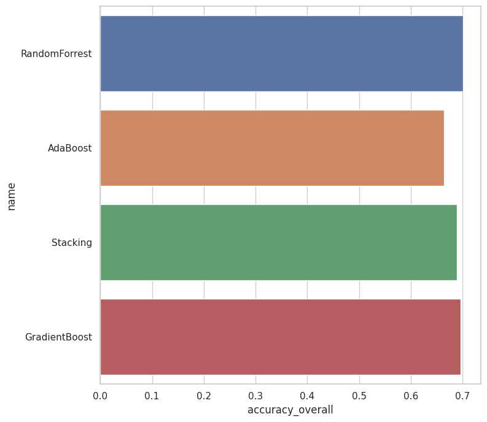
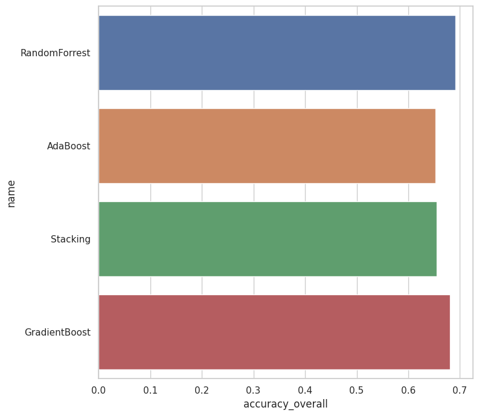
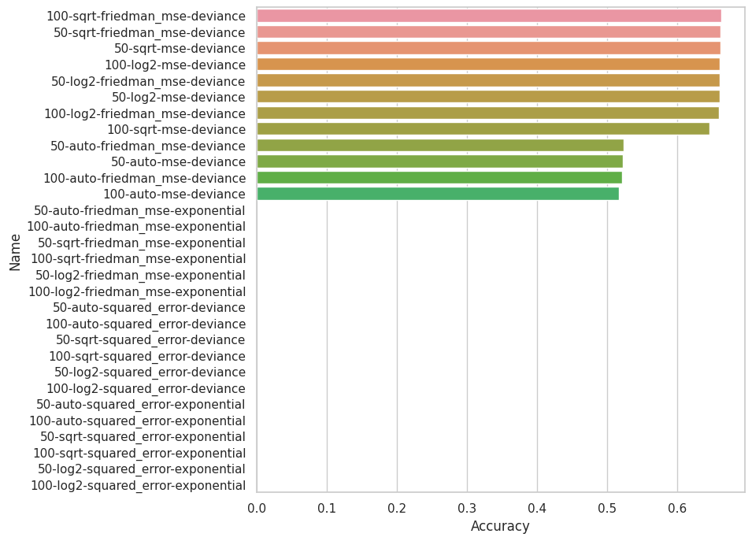

# Comparing variations  
Validating feature set no_linked  
Standardizing text columns:  {'summary'}  
## no_linked  
Start comparing 2021-11-17 14:43:34+01:00  
Using non cached frame with columns:  Index(['Unnamed: 0', 'assignee', 'component_names', 'components_descriptions',
       'created', 'description', 'harm', 'id', 'labels',
       'last_sprint_activatedDate', 'last_sprint_autoStartStop',
       'last_sprint_completeDate', 'last_sprint_endDate', 'last_sprint_goal',
       'last_sprint_id', 'last_sprint_name', 'last_sprint_rapidViewId',
       'last_sprint_sequence', 'last_sprint_startDate', 'last_sprint_state',
       'link', 'points', 'probability', 'probability_final', 'project',
       'requirement_prio', 'resolution', 'resolutiondate', 'risk_impact',
       'risk_likelyhood', 'severity', 'sprint_count', 'status', 'status_key',
       'summary', 'type', 'updated', 'urgent', 'component_count',
       'labels_count', 'summary_raw', 'summary_stopword_count'],
      dtype='object')  
No preprocess fields found returning df no_linked  
Extracted columns from non cached frame:  Index(['Unnamed: 0', 'assignee', 'component_names', 'components_descriptions',
       'created', 'description', 'harm', 'id', 'labels',
       'last_sprint_activatedDate', 'last_sprint_autoStartStop',
       'last_sprint_completeDate', 'last_sprint_endDate', 'last_sprint_goal',
       'last_sprint_id', 'last_sprint_name', 'last_sprint_rapidViewId',
       'last_sprint_sequence', 'last_sprint_startDate', 'last_sprint_state',
       'link', 'points', 'probability', 'probability_final', 'project',
       'requirement_prio', 'resolution', 'resolutiondate', 'risk_impact',
       'risk_likelyhood', 'severity', 'sprint_count', 'status', 'status_key',
       'summary', 'type', 'updated', 'urgent', 'component_count',
       'labels_count', 'summary_raw', 'summary_stopword_count'],
      dtype='object')  
Using seed for random split 1  
SIZES:   
	train 0.7  
	test 0.15  
	validate 0.15  
  
Data shape
	Training rows:	6099  
	columns:	1  
  
Vectorizing summary  
Vectorizing summary  
Vectorizing summary  
### Working on RandomForrest -- no_linked [2021-11-17 13:43:38]  
Using columns:  []  
Using Gridsearch to find optimal model, using -1 cores  
Grid search to find best params took 845.46 seconds  
Fitted using gridsearch  
Best parameters found:
 {'class_weight': None, 'criterion': 'entropy', 'max_depth': 3050, 'max_features': 'sqrt', 'n_estimators': 50} 
  
Start prediction  
Finished prediction in 0.55  

Accuracy train set = 		{}
Accuracy test set = 		{}
Accuracy validation set = 	{}
Average Accuracy = 		0.999344154779472
  
Showing 6 best and 6 worst results  

  
|     |     mean |        std |     time | class_weight       | criterion   |   max_depth | max_features   |   n_estimators |
|----:|---------:|-----------:|---------:|:-------------------|:------------|------------:|:---------------|---------------:|
| 236 | 0.681259 | 0.0067084  | 21.3776  |                    | entropy     |        3050 | sqrt           |             50 |
| 149 | 0.680603 | 0.00723291 | 20.0063  | balanced_subsample | entropy     |        4574 | log2           |            100 |
| 107 | 0.680275 | 0.00591625 | 20.0065  | balanced_subsample | gini        |        4574 | log2           |            100 |
| 241 | 0.67962  | 0.00562748 | 36.6819  |                    | entropy     |        1525 | auto           |            100 |
| 172 | 0.679292 | 0.00763081 | 10.7905  |                    | gini        |         nan | log2           |             50 |
| 112 | 0.679292 | 0.00512756 | 10.2794  | balanced_subsample | gini        |        3050 | log2           |             50 |
| 120 | 0.506476 | 0.0105676  |  1.84524 | balanced_subsample | gini        |           5 | auto           |             50 |
|  36 | 0.505985 | 0.00379598 |  1.60395 | balanced           | gini        |           5 | auto           |             50 |
| 124 | 0.502705 | 0.0725269  |  1.01266 | balanced_subsample | gini        |           5 | log2           |             50 |
| 166 | 0.498442 | 0.0646353  |  1.00316 | balanced_subsample | entropy     |           5 | log2           |             50 |
|  78 | 0.494015 | 0.0593766  |  1.65449 | balanced           | entropy     |           5 | auto           |             50 |
| 164 | 0.476308 | 0.0621896  |  1.82494 | balanced_subsample | entropy     |           5 | sqrt           |             50 | 

  
Force ordering of graph due to size, limiting output to 30 best performers  
  

-------------------------------------  

  
Using seed for random split 1  
SIZES:   
	train 0.7  
	test 0.15  
	validate 0.15  
  
Data shape
	Training rows:	6099  
	columns:	1  
  
Vectorizing summary  
Vectorizing summary  
Vectorizing summary  
### Working on AdaBoost -- no_linked [2021-11-17 13:57:45]  
Using columns:  []  
Using Gridsearch to find optimal model, using -1 cores  
Grid search to find best params took 122.35 seconds  
Fitted using gridsearch  
Best parameters found:
 {'base_estimator': LogisticRegression(), 'n_estimators': 100} 
  
Start prediction  
Finished prediction in 5.55  

Accuracy train set = 		{}
Accuracy test set = 		{}
Accuracy validation set = 	{}
Average Accuracy = 		0.662239711428103
  
Showing 6 best and 6 worst results  

  
|    |     mean |         std |    time | base_estimator           |   n_estimators |
|---:|---------:|------------:|--------:|:-------------------------|---------------:|
|  3 | 0.661748 | 0.000231876 | 62.6797 | LogisticRegression()     |            100 |
|  2 | 0.658141 | 0.000803243 | 36.8123 | LogisticRegression()     |             50 |
|  0 | 0.607641 | 0.0106436   | 13.3386 | DecisionTreeClassifier() |             50 |
|  1 | 0.607313 | 0.011531    | 14.4655 | DecisionTreeClassifier() |            100 | 

  
  

-------------------------------------  

  
Using seed for random split 1  
SIZES:   
	train 0.7  
	test 0.15  
	validate 0.15  
  
Data shape
	Training rows:	6099  
	columns:	1  
  
Vectorizing summary  
Vectorizing summary  
Vectorizing summary  
### Working on Bagging -- no_linked [2021-11-17 13:59:54]  
Using columns:  []  
Using Gridsearch to find optimal model, using -1 cores  
Something went wrong while handling Bagging
A worker process managed by the executor was unexpectedly terminated. This could be caused by a segmentation fault while calling the function or by an excessive memory usage causing the Operating System to kill the worker.

The exit codes of the workers are {SIGKILL(-9)}  
Traceback (most recent call last):
  File "/home/dries/pipeline/src/services/compare_service.py", line 107, in compare_models
    model.optimize_config()
  File "/home/dries/pipeline/src/models/ml/ensemble/BaggingModelTest.py", line 27, in optimize_config
    self.optimize_config_stub(hyper_parameters, BaggingClassifier())
  File "/home/dries/pipeline/src/models/ml/ModelTest.py", line 238, in optimize_config_stub
    searcher.fit(self.X_train, self.y_train)
  File "/home/dries/pipeline/dries/lib/python3.7/site-packages/sklearn/utils/validation.py", line 63, in inner_f
    return f(*args, **kwargs)
  File "/home/dries/pipeline/dries/lib/python3.7/site-packages/sklearn/model_selection/_search.py", line 841, in fit
    self._run_search(evaluate_candidates)
  File "/home/dries/pipeline/dries/lib/python3.7/site-packages/sklearn/model_selection/_search.py", line 1296, in _run_search
    evaluate_candidates(ParameterGrid(self.param_grid))
  File "/home/dries/pipeline/dries/lib/python3.7/site-packages/sklearn/model_selection/_search.py", line 809, in evaluate_candidates
    enumerate(cv.split(X, y, groups))))
  File "/home/dries/pipeline/dries/lib/python3.7/site-packages/joblib/parallel.py", line 1054, in __call__
    self.retrieve()
  File "/home/dries/pipeline/dries/lib/python3.7/site-packages/joblib/parallel.py", line 933, in retrieve
    self._output.extend(job.get(timeout=self.timeout))
  File "/home/dries/pipeline/dries/lib/python3.7/site-packages/joblib/_parallel_backends.py", line 542, in wrap_future_result
    return future.result(timeout=timeout)
  File "/usr/lib/python3.7/concurrent/futures/_base.py", line 432, in result
    return self.__get_result()
  File "/usr/lib/python3.7/concurrent/futures/_base.py", line 384, in __get_result
    raise self._exception
  File "/home/dries/pipeline/dries/lib/python3.7/site-packages/joblib/externals/loky/_base.py", line 625, in _invoke_callbacks
    callback(self)
  File "/home/dries/pipeline/dries/lib/python3.7/site-packages/joblib/parallel.py", line 359, in __call__
    self.parallel.dispatch_next()
  File "/home/dries/pipeline/dries/lib/python3.7/site-packages/joblib/parallel.py", line 792, in dispatch_next
    if not self.dispatch_one_batch(self._original_iterator):
  File "/home/dries/pipeline/dries/lib/python3.7/site-packages/joblib/parallel.py", line 859, in dispatch_one_batch
    self._dispatch(tasks)
  File "/home/dries/pipeline/dries/lib/python3.7/site-packages/joblib/parallel.py", line 777, in _dispatch
    job = self._backend.apply_async(batch, callback=cb)
  File "/home/dries/pipeline/dries/lib/python3.7/site-packages/joblib/_parallel_backends.py", line 531, in apply_async
    future = self._workers.submit(SafeFunction(func))
  File "/home/dries/pipeline/dries/lib/python3.7/site-packages/joblib/externals/loky/reusable_executor.py", line 178, in submit
    fn, *args, **kwargs)
  File "/home/dries/pipeline/dries/lib/python3.7/site-packages/joblib/externals/loky/process_executor.py", line 1102, in submit
    raise self._flags.broken
joblib.externals.loky.process_executor.TerminatedWorkerError: A worker process managed by the executor was unexpectedly terminated. This could be caused by a segmentation fault while calling the function or by an excessive memory usage causing the Operating System to kill the worker.

The exit codes of the workers are {SIGKILL(-9)}
  
Using seed for random split 1  
SIZES:   
	train 0.7  
	test 0.15  
	validate 0.15  
  
Data shape
	Training rows:	6099  
	columns:	1  
  
Vectorizing summary  
Vectorizing summary  
Vectorizing summary  
### Working on Stacking -- no_linked [2021-11-17 14:08:09]  
Using columns:  []  
Using Gridsearch to find optimal model, using -1 cores  
Grid search to find best params took 5702.48 seconds  
Fitted using gridsearch  
Best parameters found:
 {'passthrough': False} 
  
Start prediction  
Finished prediction in 219.18  

Accuracy train set = 		{}
Accuracy test set = 		{}
Accuracy validation set = 	{}
Average Accuracy = 		0.9380226266601082
  
Showing 6 best and 6 worst results  

  
|    |     mean |        std |    time | passthrough   |
|---:|---------:|-----------:|--------:|:--------------|
|  1 | 0.676176 | 0.00429441 | 2113.58 | False         |
|  0 | 0.64568  | 0.00465488 | 2128.48 | True          | 

  
  

-------------------------------------  

  
Using seed for random split 1  
SIZES:   
	train 0.7  
	test 0.15  
	validate 0.15  
  
Data shape
	Training rows:	6099  
	columns:	1  
  
Vectorizing summary  
Vectorizing summary  
Vectorizing summary  
### Working on GradientBoost -- no_linked [2021-11-17 15:46:52]  
Using columns:  []  
Using Gridsearch to find optimal model, using -1 cores  
Grid search to find best params took 326.74 seconds  
Fitted using gridsearch  
Best parameters found:
 {'criterion': 'friedman_mse', 'loss': 'deviance', 'max_features': 'auto', 'n_estimators': 100} 
  
Start prediction  
Finished prediction in 0.28  

Accuracy train set = 		{}
Accuracy test set = 		{}
Accuracy validation set = 	{}
Average Accuracy = 		0.6915887850467289
  
Showing 6 best and 6 worst results  

  
|    |       mean |          std |       time | criterion    | loss        | max_features   |   n_estimators |
|---:|-----------:|-------------:|-----------:|:-------------|:------------|:---------------|---------------:|
|  1 |   0.667814 |   0.0028209  | 234.066    | friedman_mse | deviance    | auto           |            100 |
|  0 |   0.667486 |   0.00175063 | 138.28     | friedman_mse | deviance    | auto           |             50 |
| 25 |   0.667159 |   0.0040229  | 231.574    | mse          | deviance    | auto           |            100 |
| 24 |   0.666503 |   0.00212518 | 127.037    | mse          | deviance    | auto           |             50 |
|  3 |   0.666011 |   0.00144807 |   7.84428  | friedman_mse | deviance    | sqrt           |            100 |
| 27 |   0.664863 |   0.00202145 |   8.01221  | mse          | deviance    | sqrt           |            100 |
| 30 | nan        | nan          |   0.569969 | mse          | exponential | auto           |             50 |
| 31 | nan        | nan          |   0.578349 | mse          | exponential | auto           |            100 |
| 32 | nan        | nan          |   0.574964 | mse          | exponential | sqrt           |             50 |
| 33 | nan        | nan          |   0.575669 | mse          | exponential | sqrt           |            100 |
| 34 | nan        | nan          |   0.579693 | mse          | exponential | log2           |             50 |
| 35 | nan        | nan          |   0.568746 | mse          | exponential | log2           |            100 | 

  
Force ordering of graph due to size, limiting output to 30 best performers  
  

-------------------------------------  

  
Finished comparing 2021-11-17 16:52:20+01:00  
Total seconds: 7725.887856960297:  
Exact: HH:2.00 	MM:8.00 	 ss:45.89  
Time: 02:08:46  

### model comparisons for no_linked  

  
|    | name          | variation   |   accuracy_overall |   accuracy_train |   accuracy_test |   accuracy_val |   fit_time | model_config                                                                     |   column_count |
|---:|:--------------|:------------|-------------------:|-----------------:|----------------:|---------------:|-----------:|:---------------------------------------------------------------------------------|---------------:|
|  0 | RandomForrest | no_linked   |           0.678899 |         0.999344 |        0.669725 |       0.688073 |  0.515126  | RandomForestClassifier(criterion='entropy', max_depth=3050, max_features='sqrt', |           4698 |
|    |               |             |                    |                  |                 |                |            |                        n_estimators=50)                                          |                |
|  1 | AdaBoost      | no_linked   |           0.663609 |         0.66224  |        0.65367  |       0.673547 |  2.57      | AdaBoostClassifier(base_estimator=LogisticRegression(), n_estimators=100)        |           4698 |
|  2 | Stacking      | no_linked   |           0.672018 |         0.938023 |        0.663609 |       0.680428 | 45.5467    | StackingClassifier(estimators=[('DT', DecisionTreeClassifier()),                 |           4698 |
|    |               |             |                    |                  |                 |                |            |                                ('KNN', KNeighborsClassifier()),                  |                |
|    |               |             |                    |                  |                 |                |            |                                ('SVC', SVC(probability=True))])                  |                |
|  3 | GradientBoost | no_linked   |           0.666284 |         0.691589 |        0.651376 |       0.681193 |  0.0501277 | GradientBoostingClassifier(max_features='auto')                                  |           4698 | 

  

  
|    | name          | variation   |   accuracy_overall |   accuracy_train |   accuracy_test |   accuracy_val |   fit_time | model_config                                                                     |   column_count |
|---:|:--------------|:------------|-------------------:|-----------------:|----------------:|---------------:|-----------:|:---------------------------------------------------------------------------------|---------------:|
|  0 | RandomForrest | no_linked   |           0.678899 |         0.999344 |        0.669725 |       0.688073 |  0.515126  | RandomForestClassifier(criterion='entropy', max_depth=3050, max_features='sqrt', |           4698 |
|    |               |             |                    |                  |                 |                |            |                        n_estimators=50)                                          |                |
|  2 | Stacking      | no_linked   |           0.672018 |         0.938023 |        0.663609 |       0.680428 | 45.5467    | StackingClassifier(estimators=[('DT', DecisionTreeClassifier()),                 |           4698 |
|    |               |             |                    |                  |                 |                |            |                                ('KNN', KNeighborsClassifier()),                  |                |
|    |               |             |                    |                  |                 |                |            |                                ('SVC', SVC(probability=True))])                  |                |
|  3 | GradientBoost | no_linked   |           0.666284 |         0.691589 |        0.651376 |       0.681193 |  0.0501277 | GradientBoostingClassifier(max_features='auto')                                  |           4698 |
|  1 | AdaBoost      | no_linked   |           0.663609 |         0.66224  |        0.65367  |       0.673547 |  2.57      | AdaBoostClassifier(base_estimator=LogisticRegression(), n_estimators=100)        |           4698 | 

  
  

  

 |    | Name          |   Accuracy |       Time |   Optimization_time |
|---:|:--------------|-----------:|-----------:|--------------------:|
|  0 | RandomForrest |   0.678899 |  0.515126  |             846.584 |
|  1 | AdaBoost      |   0.663609 |  2.57      |             128.209 |
|  2 | Stacking      |   0.672018 | 45.5467    |            5921.87  |
|  3 | GradientBoost |   0.666284 |  0.0501277 |             327.619 | 

  
Best in set was RandomForrest with an accuracy 0.6788990825688073  

==  no_linked == 
================================  

  
Validating feature set summary  
Standardizing text columns:  {'summary'}  
## summary  
Start comparing 2021-11-17 16:52:20+01:00  
Using non cached frame with columns:  Index(['Unnamed: 0', 'assignee', 'component_names', 'components_descriptions',
       'created', 'description', 'harm', 'id', 'labels',
       'last_sprint_activatedDate', 'last_sprint_autoStartStop',
       'last_sprint_completeDate', 'last_sprint_endDate', 'last_sprint_goal',
       'last_sprint_id', 'last_sprint_name', 'last_sprint_rapidViewId',
       'last_sprint_sequence', 'last_sprint_startDate', 'last_sprint_state',
       'link', 'points', 'probability', 'probability_final', 'project',
       'requirement_prio', 'resolution', 'resolutiondate', 'risk_impact',
       'risk_likelyhood', 'severity', 'sprint_count', 'status', 'status_key',
       'summary', 'type', 'updated', 'urgent', 'component_count',
       'labels_count', 'summary_raw', 'summary_stopword_count'],
      dtype='object')  
No preprocess fields found returning df summary  
Extracted columns from non cached frame:  Index(['Unnamed: 0', 'assignee', 'component_names', 'components_descriptions',
       'created', 'description', 'harm', 'id', 'labels',
       'last_sprint_activatedDate', 'last_sprint_autoStartStop',
       'last_sprint_completeDate', 'last_sprint_endDate', 'last_sprint_goal',
       'last_sprint_id', 'last_sprint_name', 'last_sprint_rapidViewId',
       'last_sprint_sequence', 'last_sprint_startDate', 'last_sprint_state',
       'link', 'points', 'probability', 'probability_final', 'project',
       'requirement_prio', 'resolution', 'resolutiondate', 'risk_impact',
       'risk_likelyhood', 'severity', 'sprint_count', 'status', 'status_key',
       'summary', 'type', 'updated', 'urgent', 'component_count',
       'labels_count', 'summary_raw', 'summary_stopword_count'],
      dtype='object')  
Using seed for random split 1  
SIZES:   
	train 0.7  
	test 0.15  
	validate 0.15  
  
Data shape
	Training rows:	6099  
	columns:	3  
  
Vectorizing summary  
Vectorizing summary  
Vectorizing summary  
### Working on RandomForrest -- summary [2021-11-17 15:52:24]  
Using columns:  ['points', 'sprint_count']  
Using Gridsearch to find optimal model, using -1 cores  
Grid search to find best params took 668.74 seconds  
Fitted using gridsearch  
Best parameters found:
 {'class_weight': None, 'criterion': 'entropy', 'max_depth': 4574, 'max_features': 'auto', 'n_estimators': 100} 
  
Start prediction  
Finished prediction in 0.81  

Accuracy train set = 		{}
Accuracy test set = 		{}
Accuracy validation set = 	{}
Average Accuracy = 		1.0
  
Showing 6 best and 6 worst results  

  
|     |     mean |        std |      time | class_weight       | criterion   |   max_depth | max_features   |   n_estimators |
|----:|---------:|-----------:|----------:|:-------------------|:------------|------------:|:---------------|---------------:|
| 229 | 0.709625 | 0.00470657 | 29.3962   |                    | entropy     |        4574 | auto           |            100 |
| 187 | 0.708805 | 0.00452604 | 31.252    |                    | gini        |        4574 | auto           |            100 |
| 200 | 0.708805 | 0.00631198 | 15.4952   |                    | gini        |        1525 | sqrt           |             50 |
| 210 | 0.708477 | 0.00556986 | 14.5492   |                    | entropy     |         nan | auto           |             50 |
| 186 | 0.708313 | 0.00522108 | 16.1426   |                    | gini        |        4574 | auto           |             50 |
| 199 | 0.707821 | 0.00750291 | 30.8546   |                    | gini        |        1525 | auto           |            100 |
| 124 | 0.56911  | 0.0181442  |  0.987507 | balanced_subsample | gini        |           5 | log2           |             50 |
|  82 | 0.559272 | 0.0222927  |  0.892079 | balanced           | entropy     |           5 | log2           |             50 |
| 125 | 0.557632 | 0.0438344  |  1.49742  | balanced_subsample | gini        |           5 | log2           |            100 |
| 167 | 0.548942 | 0.0155599  |  1.46422  | balanced_subsample | entropy     |           5 | log2           |            100 |
|  10 | 0.545663 | 0.0386483  |  1.08646  | balanced           | gini        |           9 | log2           |             50 |
|  40 | 0.502869 | 0.0221779  |  0.880084 | balanced           | gini        |           5 | log2           |             50 | 

  
Force ordering of graph due to size, limiting output to 30 best performers  
  

-------------------------------------  

  
Using seed for random split 1  
SIZES:   
	train 0.7  
	test 0.15  
	validate 0.15  
  
Data shape
	Training rows:	6099  
	columns:	3  
  
Vectorizing summary  
Vectorizing summary  
Vectorizing summary  
### Working on AdaBoost -- summary [2021-11-17 16:03:35]  
Using columns:  ['points', 'sprint_count']  
Using Gridsearch to find optimal model, using -1 cores  
Grid search to find best params took 67.48 seconds  
Fitted using gridsearch  
Best parameters found:
 {'base_estimator': DecisionTreeClassifier(), 'n_estimators': 50} 
  
Start prediction  
Finished prediction in 0.14  

Accuracy train set = 		{}
Accuracy test set = 		{}
Accuracy validation set = 	{}
Average Accuracy = 		1.0
  
Showing 6 best and 6 worst results  

  
|    |     mean |         std |     time | base_estimator           |   n_estimators |
|---:|---------:|------------:|---------:|:-------------------------|---------------:|
|  0 | 0.671913 | 0.0122544   |  6.32423 | DecisionTreeClassifier() |             50 |
|  1 | 0.668798 | 0.0058108   |  5.6273  | DecisionTreeClassifier() |            100 |
|  3 | 0.661912 | 0.000463753 | 61.0755  | LogisticRegression()     |            100 |
|  2 | 0.658141 | 0.000803243 | 35.1686  | LogisticRegression()     |             50 | 

  
  

-------------------------------------  

  
Using seed for random split 1  
SIZES:   
	train 0.7  
	test 0.15  
	validate 0.15  
  
Data shape
	Training rows:	6099  
	columns:	3  
  
Vectorizing summary  
Vectorizing summary  
Vectorizing summary  
### Working on Bagging -- summary [2021-11-17 16:04:44]  
Using columns:  ['points', 'sprint_count']  
Using Gridsearch to find optimal model, using -1 cores  
Something went wrong while handling Bagging
A worker process managed by the executor was unexpectedly terminated. This could be caused by a segmentation fault while calling the function or by an excessive memory usage causing the Operating System to kill the worker.

The exit codes of the workers are {SIGKILL(-9)}  
Traceback (most recent call last):
  File "/home/dries/pipeline/src/services/compare_service.py", line 107, in compare_models
    model.optimize_config()
  File "/home/dries/pipeline/src/models/ml/ensemble/BaggingModelTest.py", line 27, in optimize_config
    self.optimize_config_stub(hyper_parameters, BaggingClassifier())
  File "/home/dries/pipeline/src/models/ml/ModelTest.py", line 238, in optimize_config_stub
    searcher.fit(self.X_train, self.y_train)
  File "/home/dries/pipeline/dries/lib/python3.7/site-packages/sklearn/utils/validation.py", line 63, in inner_f
    return f(*args, **kwargs)
  File "/home/dries/pipeline/dries/lib/python3.7/site-packages/sklearn/model_selection/_search.py", line 841, in fit
    self._run_search(evaluate_candidates)
  File "/home/dries/pipeline/dries/lib/python3.7/site-packages/sklearn/model_selection/_search.py", line 1296, in _run_search
    evaluate_candidates(ParameterGrid(self.param_grid))
  File "/home/dries/pipeline/dries/lib/python3.7/site-packages/sklearn/model_selection/_search.py", line 809, in evaluate_candidates
    enumerate(cv.split(X, y, groups))))
  File "/home/dries/pipeline/dries/lib/python3.7/site-packages/joblib/parallel.py", line 1054, in __call__
    self.retrieve()
  File "/home/dries/pipeline/dries/lib/python3.7/site-packages/joblib/parallel.py", line 933, in retrieve
    self._output.extend(job.get(timeout=self.timeout))
  File "/home/dries/pipeline/dries/lib/python3.7/site-packages/joblib/_parallel_backends.py", line 542, in wrap_future_result
    return future.result(timeout=timeout)
  File "/usr/lib/python3.7/concurrent/futures/_base.py", line 432, in result
    return self.__get_result()
  File "/usr/lib/python3.7/concurrent/futures/_base.py", line 384, in __get_result
    raise self._exception
  File "/home/dries/pipeline/dries/lib/python3.7/site-packages/joblib/externals/loky/_base.py", line 625, in _invoke_callbacks
    callback(self)
  File "/home/dries/pipeline/dries/lib/python3.7/site-packages/joblib/parallel.py", line 359, in __call__
    self.parallel.dispatch_next()
  File "/home/dries/pipeline/dries/lib/python3.7/site-packages/joblib/parallel.py", line 792, in dispatch_next
    if not self.dispatch_one_batch(self._original_iterator):
  File "/home/dries/pipeline/dries/lib/python3.7/site-packages/joblib/parallel.py", line 859, in dispatch_one_batch
    self._dispatch(tasks)
  File "/home/dries/pipeline/dries/lib/python3.7/site-packages/joblib/parallel.py", line 777, in _dispatch
    job = self._backend.apply_async(batch, callback=cb)
  File "/home/dries/pipeline/dries/lib/python3.7/site-packages/joblib/_parallel_backends.py", line 531, in apply_async
    future = self._workers.submit(SafeFunction(func))
  File "/home/dries/pipeline/dries/lib/python3.7/site-packages/joblib/externals/loky/reusable_executor.py", line 178, in submit
    fn, *args, **kwargs)
  File "/home/dries/pipeline/dries/lib/python3.7/site-packages/joblib/externals/loky/process_executor.py", line 1102, in submit
    raise self._flags.broken
joblib.externals.loky.process_executor.TerminatedWorkerError: A worker process managed by the executor was unexpectedly terminated. This could be caused by a segmentation fault while calling the function or by an excessive memory usage causing the Operating System to kill the worker.

The exit codes of the workers are {SIGKILL(-9)}
  
Using seed for random split 1  
SIZES:   
	train 0.7  
	test 0.15  
	validate 0.15  
  
Data shape
	Training rows:	6099  
	columns:	3  
  
Vectorizing summary  
Vectorizing summary  
Vectorizing summary  
### Working on Stacking -- summary [2021-11-17 16:09:34]  
Using columns:  ['points', 'sprint_count']  
Using Gridsearch to find optimal model, using -1 cores  
Grid search to find best params took 5685.52 seconds  
Fitted using gridsearch  
Best parameters found:
 {'passthrough': False} 
  
Start prediction  
Finished prediction in 217.07  

Accuracy train set = 		{}
Accuracy test set = 		{}
Accuracy validation set = 	{}
Average Accuracy = 		0.9744220363994097
  
Showing 6 best and 6 worst results  

  
|    |     mean |        std |    time | passthrough   |
|---:|---------:|-----------:|--------:|:--------------|
|  1 | 0.689621 | 0.00512756 | 2131.6  | False         |
|  0 | 0.670766 | 0.0039419  | 2115.21 | True          | 

  
  

-------------------------------------  

  
Using seed for random split 1  
SIZES:   
	train 0.7  
	test 0.15  
	validate 0.15  
  
Data shape
	Training rows:	6099  
	columns:	3  
  
Vectorizing summary  
Vectorizing summary  
Vectorizing summary  
### Working on GradientBoost -- summary [2021-11-17 17:47:58]  
Using columns:  ['points', 'sprint_count']  
Using Gridsearch to find optimal model, using -1 cores  
Grid search to find best params took 328.56 seconds  
Fitted using gridsearch  
Best parameters found:
 {'criterion': 'friedman_mse', 'loss': 'deviance', 'max_features': 'auto', 'n_estimators': 100} 
  
Start prediction  
Finished prediction in 0.27  

Accuracy train set = 		{}
Accuracy test set = 		{}
Accuracy validation set = 	{}
Average Accuracy = 		0.7312674208886702
  
Showing 6 best and 6 worst results  

  
|    |       mean |          std |       time | criterion    | loss        | max_features   |   n_estimators |
|---:|-----------:|-------------:|-----------:|:-------------|:------------|:---------------|---------------:|
|  1 |   0.69618  |   0.00322133 | 215.294    | friedman_mse | deviance    | auto           |            100 |
| 25 |   0.695688 |   0.00390076 | 236.082    | mse          | deviance    | auto           |            100 |
| 24 |   0.692245 |   0.0033682  | 124.041    | mse          | deviance    | auto           |             50 |
|  0 |   0.691917 |   0.0040229  | 157.423    | friedman_mse | deviance    | auto           |             50 |
|  3 |   0.669946 |   0.00447227 |   7.81128  | friedman_mse | deviance    | sqrt           |            100 |
| 27 |   0.666995 |   0.00425036 |   7.80493  | mse          | deviance    | sqrt           |            100 |
| 30 | nan        | nan          |   0.550148 | mse          | exponential | auto           |             50 |
| 31 | nan        | nan          |   0.655116 | mse          | exponential | auto           |            100 |
| 32 | nan        | nan          |   0.650919 | mse          | exponential | sqrt           |             50 |
| 33 | nan        | nan          |   0.651514 | mse          | exponential | sqrt           |            100 |
| 34 | nan        | nan          |   0.618537 | mse          | exponential | log2           |             50 |
| 35 | nan        | nan          |   0.595478 | mse          | exponential | log2           |            100 | 

  
Force ordering of graph due to size, limiting output to 30 best performers  
  

-------------------------------------  

  
Finished comparing 2021-11-17 18:53:27+01:00  
Total seconds: 7267.125386476517:  
Exact: HH:2.00 	MM:1.00 	 ss:7.13  
Time: 02:01:08  

### model comparisons for summary  

  
|    | name          | variation   |   accuracy_overall |   accuracy_train |   accuracy_test |   accuracy_val |   fit_time | model_config                                                     |   column_count |
|---:|:--------------|:------------|-------------------:|-----------------:|----------------:|---------------:|-----------:|:-----------------------------------------------------------------|---------------:|
|  0 | RandomForrest | summary     |           0.700688 |         1        |        0.698012 |       0.703364 |  0.730032  | RandomForestClassifier(criterion='entropy', max_depth=4574)      |           4700 |
|  1 | AdaBoost      | summary     |           0.664373 |         1        |        0.657492 |       0.671254 |  0.0551058 | AdaBoostClassifier(base_estimator=DecisionTreeClassifier())      |           4700 |
|  2 | Stacking      | summary     |           0.688838 |         0.974422 |        0.681957 |       0.695719 | 44.8619    | StackingClassifier(estimators=[('DT', DecisionTreeClassifier()), |           4700 |
|    |               |             |                    |                  |                 |                |            |                                ('KNN', KNeighborsClassifier()),  |                |
|    |               |             |                    |                  |                 |                |            |                                ('SVC', SVC(probability=True))])  |                |
|  3 | GradientBoost | summary     |           0.695719 |         0.731267 |        0.685015 |       0.706422 |  0.0501208 | GradientBoostingClassifier(max_features='auto')                  |           4700 | 

  

  
|    | name          | variation   |   accuracy_overall |   accuracy_train |   accuracy_test |   accuracy_val |   fit_time | model_config                                                     |   column_count |
|---:|:--------------|:------------|-------------------:|-----------------:|----------------:|---------------:|-----------:|:-----------------------------------------------------------------|---------------:|
|  0 | RandomForrest | summary     |           0.700688 |         1        |        0.698012 |       0.703364 |  0.730032  | RandomForestClassifier(criterion='entropy', max_depth=4574)      |           4700 |
|  3 | GradientBoost | summary     |           0.695719 |         0.731267 |        0.685015 |       0.706422 |  0.0501208 | GradientBoostingClassifier(max_features='auto')                  |           4700 |
|  2 | Stacking      | summary     |           0.688838 |         0.974422 |        0.681957 |       0.695719 | 44.8619    | StackingClassifier(estimators=[('DT', DecisionTreeClassifier()), |           4700 |
|    |               |             |                    |                  |                 |                |            |                                ('KNN', KNeighborsClassifier()),  |                |
|    |               |             |                    |                  |                 |                |            |                                ('SVC', SVC(probability=True))])  |                |
|  1 | AdaBoost      | summary     |           0.664373 |         1        |        0.657492 |       0.671254 |  0.0551058 | AdaBoostClassifier(base_estimator=DecisionTreeClassifier())      |           4700 | 

  
  

  

 |    | Name          |   Accuracy |       Time |   Optimization_time |
|---:|:--------------|-----------:|-----------:|--------------------:|
|  0 | RandomForrest |   0.700688 |  0.730032  |            670.086  |
|  1 | AdaBoost      |   0.664373 |  0.0551058 |             67.8618 |
|  2 | Stacking      |   0.688838 | 44.8619    |           5902.85   |
|  3 | GradientBoost |   0.695719 |  0.0501208 |            329.409  | 

  
Best in set was RandomForrest with an accuracy 0.7006880733944953  

==  summary == 
================================  

  
Validating feature set description  
Standardizing text columns:  {'description'}  
## description  
Start comparing 2021-11-17 18:53:28+01:00  
Using non cached frame with columns:  Index(['Unnamed: 0', 'assignee', 'component_names', 'components_descriptions',
       'created', 'description', 'harm', 'id', 'labels',
       'last_sprint_activatedDate', 'last_sprint_autoStartStop',
       'last_sprint_completeDate', 'last_sprint_endDate', 'last_sprint_goal',
       'last_sprint_id', 'last_sprint_name', 'last_sprint_rapidViewId',
       'last_sprint_sequence', 'last_sprint_startDate', 'last_sprint_state',
       'link', 'points', 'probability', 'probability_final', 'project',
       'requirement_prio', 'resolution', 'resolutiondate', 'risk_impact',
       'risk_likelyhood', 'severity', 'sprint_count', 'status', 'status_key',
       'summary', 'type', 'updated', 'urgent', 'component_count',
       'labels_count', 'description_raw', 'description_stopword_count'],
      dtype='object')  
No preprocess fields found returning df description  
Extracted columns from non cached frame:  Index(['Unnamed: 0', 'assignee', 'component_names', 'components_descriptions',
       'created', 'description', 'harm', 'id', 'labels',
       'last_sprint_activatedDate', 'last_sprint_autoStartStop',
       'last_sprint_completeDate', 'last_sprint_endDate', 'last_sprint_goal',
       'last_sprint_id', 'last_sprint_name', 'last_sprint_rapidViewId',
       'last_sprint_sequence', 'last_sprint_startDate', 'last_sprint_state',
       'link', 'points', 'probability', 'probability_final', 'project',
       'requirement_prio', 'resolution', 'resolutiondate', 'risk_impact',
       'risk_likelyhood', 'severity', 'sprint_count', 'status', 'status_key',
       'summary', 'type', 'updated', 'urgent', 'component_count',
       'labels_count', 'description_raw', 'description_stopword_count'],
      dtype='object')  
Using seed for random split 1  
SIZES:   
	train 0.7  
	test 0.15  
	validate 0.15  
  
Data shape
	Training rows:	5371  
	columns:	3  
  
Vectorizing description  
Vectorizing description  
Vectorizing description  
### Working on RandomForrest -- description [2021-11-17 17:53:45]  
Using columns:  ['points', 'sprint_count']  
Using Gridsearch to find optimal model, using -1 cores  
Grid search to find best params took 1277.81 seconds  
Fitted using gridsearch  
Best parameters found:
 {'class_weight': None, 'criterion': 'gini', 'max_depth': 2686, 'max_features': 'auto', 'n_estimators': 50} 
  
Start prediction  
Finished prediction in 0.61  

Accuracy train set = 		{}
Accuracy test set = 		{}
Accuracy validation set = 	{}
Average Accuracy = 		0.9990690746602122
  
Showing 6 best and 6 worst results  

  
|     |     mean |        std |     time | class_weight       | criterion   |   max_depth | max_features   |   n_estimators |
|----:|---------:|-----------:|---------:|:-------------------|:------------|------------:|:---------------|---------------:|
| 192 | 0.692051 | 0.00483358 | 34.6463  |                    | gini        |        2686 | auto           |             50 |
| 198 | 0.691864 | 0.00392593 | 34.1553  |                    | gini        |        1343 | auto           |             50 |
| 189 | 0.691306 | 0.0054317  | 65.972   |                    | gini        |        4028 | sqrt           |            100 |
| 195 | 0.690374 | 0.00274289 | 67.1822  |                    | gini        |        2686 | sqrt           |            100 |
|  56 | 0.690002 | 0.00501824 | 22.9021  | balanced           | entropy     |          73 | sqrt           |             50 |
| 193 | 0.689816 | 0.0041093  | 64.9369  |                    | gini        |        2686 | auto           |            100 |
| 167 | 0.570282 | 0.0618307  |  5.87215 | balanced_subsample | entropy     |           5 | log2           |            100 |
| 166 | 0.556316 | 0.0224303  |  4.16057 | balanced_subsample | entropy     |           5 | log2           |             50 |
| 122 | 0.551294 | 0.0383429  |  4.91353 | balanced_subsample | gini        |           5 | sqrt           |             50 |
|  82 | 0.539184 | 0.038758   |  2.96822 | balanced           | entropy     |           5 | log2           |             50 |
| 164 | 0.533607 | 0.0467913  |  4.82459 | balanced_subsample | entropy     |           5 | sqrt           |             50 |
|  41 | 0.455053 | 0.0668909  |  4.4728  | balanced           | gini        |           5 | log2           |            100 | 

  
Force ordering of graph due to size, limiting output to 30 best performers  
  

-------------------------------------  

  
Using seed for random split 1  
SIZES:   
	train 0.7  
	test 0.15  
	validate 0.15  
  
Data shape
	Training rows:	5371  
	columns:	3  
  
Vectorizing description  
Vectorizing description  
Vectorizing description  
### Working on AdaBoost -- description [2021-11-17 18:15:08]  
Using columns:  ['points', 'sprint_count']  
Using Gridsearch to find optimal model, using -1 cores  
Grid search to find best params took 388.39 seconds  
Fitted using gridsearch  
Best parameters found:
 {'base_estimator': LogisticRegression(), 'n_estimators': 100} 
  
Start prediction  
Finished prediction in 17.38  

Accuracy train set = 		{}
Accuracy test set = 		{}
Accuracy validation set = 	{}
Average Accuracy = 		0.6752932414820332
  
Showing 6 best and 6 worst results  

  
|    |     mean |         std |     time | base_estimator           |   n_estimators |
|---:|---------:|------------:|---------:|:-------------------------|---------------:|
|  3 | 0.660771 | 0.000317534 | 200.825  | LogisticRegression()     |            100 |
|  2 | 0.660398 | 8.94023e-05 | 119.512  | LogisticRegression()     |             50 |
|  1 | 0.645876 | 0.00572265  |  19.6415 | DecisionTreeClassifier() |            100 |
|  0 | 0.643456 | 0.00781353  |  14.3117 | DecisionTreeClassifier() |             50 | 

  
  

-------------------------------------  

  
Using seed for random split 1  
SIZES:   
	train 0.7  
	test 0.15  
	validate 0.15  
  
Data shape
	Training rows:	5371  
	columns:	3  
  
Vectorizing description  
Vectorizing description  
Vectorizing description  
### Working on Bagging -- description [2021-11-17 18:21:58]  
Using columns:  ['points', 'sprint_count']  
Using Gridsearch to find optimal model, using -1 cores  
Something went wrong while handling Bagging
A worker process managed by the executor was unexpectedly terminated. This could be caused by a segmentation fault while calling the function or by an excessive memory usage causing the Operating System to kill the worker.

The exit codes of the workers are {SIGKILL(-9)}  
Traceback (most recent call last):
  File "/home/dries/pipeline/src/services/compare_service.py", line 107, in compare_models
    model.optimize_config()
  File "/home/dries/pipeline/src/models/ml/ensemble/BaggingModelTest.py", line 27, in optimize_config
    self.optimize_config_stub(hyper_parameters, BaggingClassifier())
  File "/home/dries/pipeline/src/models/ml/ModelTest.py", line 238, in optimize_config_stub
    searcher.fit(self.X_train, self.y_train)
  File "/home/dries/pipeline/dries/lib/python3.7/site-packages/sklearn/utils/validation.py", line 63, in inner_f
    return f(*args, **kwargs)
  File "/home/dries/pipeline/dries/lib/python3.7/site-packages/sklearn/model_selection/_search.py", line 841, in fit
    self._run_search(evaluate_candidates)
  File "/home/dries/pipeline/dries/lib/python3.7/site-packages/sklearn/model_selection/_search.py", line 1296, in _run_search
    evaluate_candidates(ParameterGrid(self.param_grid))
  File "/home/dries/pipeline/dries/lib/python3.7/site-packages/sklearn/model_selection/_search.py", line 809, in evaluate_candidates
    enumerate(cv.split(X, y, groups))))
  File "/home/dries/pipeline/dries/lib/python3.7/site-packages/joblib/parallel.py", line 1054, in __call__
    self.retrieve()
  File "/home/dries/pipeline/dries/lib/python3.7/site-packages/joblib/parallel.py", line 933, in retrieve
    self._output.extend(job.get(timeout=self.timeout))
  File "/home/dries/pipeline/dries/lib/python3.7/site-packages/joblib/_parallel_backends.py", line 542, in wrap_future_result
    return future.result(timeout=timeout)
  File "/usr/lib/python3.7/concurrent/futures/_base.py", line 432, in result
    return self.__get_result()
  File "/usr/lib/python3.7/concurrent/futures/_base.py", line 384, in __get_result
    raise self._exception
  File "/home/dries/pipeline/dries/lib/python3.7/site-packages/joblib/externals/loky/_base.py", line 625, in _invoke_callbacks
    callback(self)
  File "/home/dries/pipeline/dries/lib/python3.7/site-packages/joblib/parallel.py", line 359, in __call__
    self.parallel.dispatch_next()
  File "/home/dries/pipeline/dries/lib/python3.7/site-packages/joblib/parallel.py", line 792, in dispatch_next
    if not self.dispatch_one_batch(self._original_iterator):
  File "/home/dries/pipeline/dries/lib/python3.7/site-packages/joblib/parallel.py", line 859, in dispatch_one_batch
    self._dispatch(tasks)
  File "/home/dries/pipeline/dries/lib/python3.7/site-packages/joblib/parallel.py", line 777, in _dispatch
    job = self._backend.apply_async(batch, callback=cb)
  File "/home/dries/pipeline/dries/lib/python3.7/site-packages/joblib/_parallel_backends.py", line 531, in apply_async
    future = self._workers.submit(SafeFunction(func))
  File "/home/dries/pipeline/dries/lib/python3.7/site-packages/joblib/externals/loky/reusable_executor.py", line 178, in submit
    fn, *args, **kwargs)
  File "/home/dries/pipeline/dries/lib/python3.7/site-packages/joblib/externals/loky/process_executor.py", line 1102, in submit
    raise self._flags.broken
joblib.externals.loky.process_executor.TerminatedWorkerError: A worker process managed by the executor was unexpectedly terminated. This could be caused by a segmentation fault while calling the function or by an excessive memory usage causing the Operating System to kill the worker.

The exit codes of the workers are {SIGKILL(-9)}
  
Using seed for random split 1  
SIZES:   
	train 0.7  
	test 0.15  
	validate 0.15  
  
Data shape
	Training rows:	5371  
	columns:	3  
  
Vectorizing description  
Vectorizing description  
Vectorizing description  
### Working on Stacking -- description [2021-11-17 18:32:23]  
Using columns:  ['points', 'sprint_count']  
Using Gridsearch to find optimal model, using -1 cores  
Grid search to find best params took 22523.19 seconds  
Fitted using gridsearch  
Best parameters found:
 {'passthrough': True} 
  
Start prediction  
Finished prediction in 1534.4  

Accuracy train set = 		{}
Accuracy test set = 		{}
Accuracy validation set = 	{}
Average Accuracy = 		0.9687209085831316
  
Showing 6 best and 6 worst results  

  
|    |     mean |        std |    time | passthrough   |
|---:|---------:|-----------:|--------:|:--------------|
|  0 | 0.680323 | 0.00927935 | 6242.24 | True          |
|  1 | 0.670452 | 0.00244335 | 6246.07 | False         | 

  
  

-------------------------------------  

  
Using seed for random split 1  
SIZES:   
	train 0.7  
	test 0.15  
	validate 0.15  
  
Data shape
	Training rows:	5371  
	columns:	3  
  
Vectorizing description  
Vectorizing description  
Vectorizing description  
### Working on GradientBoost -- description [2021-11-18 01:13:24]  
Using columns:  ['points', 'sprint_count']  
Using Gridsearch to find optimal model, using -1 cores  
Grid search to find best params took 1096.89 seconds  
Fitted using gridsearch  
Best parameters found:
 {'criterion': 'mse', 'loss': 'deviance', 'max_features': 'auto', 'n_estimators': 100} 
  
Start prediction  
Finished prediction in 1.15  

Accuracy train set = 		{}
Accuracy test set = 		{}
Accuracy validation set = 	{}
Average Accuracy = 		0.7518153044125861
  
Showing 6 best and 6 worst results  

  
|    |       mean |          std |      time | criterion    | loss        | max_features   |   n_estimators |
|---:|-----------:|-------------:|----------:|:-------------|:------------|:---------------|---------------:|
| 25 |   0.691864 |   0.00541077 | 790.551   | mse          | deviance    | auto           |            100 |
|  0 |   0.69112  |   0.00671699 | 400.225   | friedman_mse | deviance    | auto           |             50 |
| 24 |   0.690561 |   0.0063559  | 440.948   | mse          | deviance    | auto           |             50 |
|  1 |   0.690375 |   0.00562885 | 761.233   | friedman_mse | deviance    | auto           |            100 |
| 27 |   0.665238 |   0.00420839 |  14.6234  | mse          | deviance    | sqrt           |            100 |
|  3 |   0.663377 |   0.00350124 |  18.2189  | friedman_mse | deviance    | sqrt           |            100 |
| 30 | nan        | nan          |   3.63044 | mse          | exponential | auto           |             50 |
| 31 | nan        | nan          |   3.49839 | mse          | exponential | auto           |            100 |
| 32 | nan        | nan          |   3.55636 | mse          | exponential | sqrt           |             50 |
| 33 | nan        | nan          |   4.11701 | mse          | exponential | sqrt           |            100 |
| 34 | nan        | nan          |   3.50124 | mse          | exponential | log2           |             50 |
| 35 | nan        | nan          |   3.10836 | mse          | exponential | log2           |            100 | 

  
Force ordering of graph due to size, limiting output to 30 best performers  
  

-------------------------------------  

  
Finished comparing 2021-11-18 02:31:43+01:00  
Total seconds: 27495.101748228073:  
Exact: HH:7.00 	MM:38.00 	 ss:15.10  
Time: 07:38:16  

### model comparisons for description  

  
|    | name          | variation   |   accuracy_overall |   accuracy_train |   accuracy_test |   accuracy_val |   fit_time | model_config                                                              |   column_count |
|---:|:--------------|:------------|-------------------:|-----------------:|----------------:|---------------:|-----------:|:--------------------------------------------------------------------------|---------------:|
|  0 | RandomForrest | description |           0.690972 |         0.999069 |        0.680556 |       0.701389 |   0.524386 | RandomForestClassifier(max_depth=2686, n_estimators=50)                   |          18333 |
|  1 | AdaBoost      | description |           0.652778 |         0.675293 |        0.648438 |       0.657118 |   8.74649  | AdaBoostClassifier(base_estimator=LogisticRegression(), n_estimators=100) |          18333 |
|  2 | Stacking      | description |           0.654948 |         0.968721 |        0.659722 |       0.650174 | 136.796    | StackingClassifier(estimators=[('DT', DecisionTreeClassifier()),          |          18333 |
|    |               |             |                    |                  |                 |                |            |                                ('KNN', KNeighborsClassifier()),           |                |
|    |               |             |                    |                  |                 |                |            |                                ('SVC', SVC(probability=True))],           |                |
|    |               |             |                    |                  |                 |                |            |                    passthrough=True)                                      |                |
|  3 | GradientBoost | description |           0.68099  |         0.751815 |        0.684896 |       0.677083 |   0.104624 | GradientBoostingClassifier(criterion='mse', max_features='auto')          |          18333 | 

  

  
|    | name          | variation   |   accuracy_overall |   accuracy_train |   accuracy_test |   accuracy_val |   fit_time | model_config                                                              |   column_count |
|---:|:--------------|:------------|-------------------:|-----------------:|----------------:|---------------:|-----------:|:--------------------------------------------------------------------------|---------------:|
|  0 | RandomForrest | description |           0.690972 |         0.999069 |        0.680556 |       0.701389 |   0.524386 | RandomForestClassifier(max_depth=2686, n_estimators=50)                   |          18333 |
|  3 | GradientBoost | description |           0.68099  |         0.751815 |        0.684896 |       0.677083 |   0.104624 | GradientBoostingClassifier(criterion='mse', max_features='auto')          |          18333 |
|  2 | Stacking      | description |           0.654948 |         0.968721 |        0.659722 |       0.650174 | 136.796    | StackingClassifier(estimators=[('DT', DecisionTreeClassifier()),          |          18333 |
|    |               |             |                    |                  |                 |                |            |                                ('KNN', KNeighborsClassifier()),           |                |
|    |               |             |                    |                  |                 |                |            |                                ('SVC', SVC(probability=True))],           |                |
|    |               |             |                    |                  |                 |                |            |                    passthrough=True)                                      |                |
|  1 | AdaBoost      | description |           0.652778 |         0.675293 |        0.648438 |       0.657118 |   8.74649  | AdaBoostClassifier(base_estimator=LogisticRegression(), n_estimators=100) |          18333 | 

  
  

  

 |    | Name          |   Accuracy |       Time |   Optimization_time |
|---:|:--------------|-----------:|-----------:|--------------------:|
|  0 | RandomForrest |   0.690972 |   0.524386 |            1278.96  |
|  1 | AdaBoost      |   0.652778 |   8.74649  |             406.085 |
|  2 | Stacking      |   0.654948 | 136.796    |           24057.9   |
|  3 | GradientBoost |   0.68099  |   0.104624 |            1098.66  | 

  
Best in set was RandomForrest with an accuracy 0.6909722222222222  

==  description == 
================================  

  
Validating feature set summary_and_desc  
Standardizing text columns:  {'summary', 'description'}  
## summary_and_desc  
Start comparing 2021-11-18 02:31:45+01:00  
Using non cached frame with columns:  Index(['Unnamed: 0', 'assignee', 'component_names', 'components_descriptions',
       'created', 'description', 'harm', 'id', 'labels',
       'last_sprint_activatedDate', 'last_sprint_autoStartStop',
       'last_sprint_completeDate', 'last_sprint_endDate', 'last_sprint_goal',
       'last_sprint_id', 'last_sprint_name', 'last_sprint_rapidViewId',
       'last_sprint_sequence', 'last_sprint_startDate', 'last_sprint_state',
       'link', 'points', 'probability', 'probability_final', 'project',
       'requirement_prio', 'resolution', 'resolutiondate', 'risk_impact',
       'risk_likelyhood', 'severity', 'sprint_count', 'status', 'status_key',
       'summary', 'type', 'updated', 'urgent', 'component_count',
       'labels_count', 'summary_raw', 'summary_stopword_count',
       'description_raw', 'description_stopword_count'],
      dtype='object')  
No preprocess fields found returning df summary_and_desc  
Extracted columns from non cached frame:  Index(['Unnamed: 0', 'assignee', 'component_names', 'components_descriptions',
       'created', 'description', 'harm', 'id', 'labels',
       'last_sprint_activatedDate', 'last_sprint_autoStartStop',
       'last_sprint_completeDate', 'last_sprint_endDate', 'last_sprint_goal',
       'last_sprint_id', 'last_sprint_name', 'last_sprint_rapidViewId',
       'last_sprint_sequence', 'last_sprint_startDate', 'last_sprint_state',
       'link', 'points', 'probability', 'probability_final', 'project',
       'requirement_prio', 'resolution', 'resolutiondate', 'risk_impact',
       'risk_likelyhood', 'severity', 'sprint_count', 'status', 'status_key',
       'summary', 'type', 'updated', 'urgent', 'component_count',
       'labels_count', 'summary_raw', 'summary_stopword_count',
       'description_raw', 'description_stopword_count'],
      dtype='object')  
Using seed for random split 1  
SIZES:   
	train 0.7  
	test 0.15  
	validate 0.15  
  
Data shape
	Training rows:	5371  
	columns:	4  
  
Vectorizing summary  
Vectorizing description  
Vectorizing summary  
Vectorizing description  
Vectorizing summary  
Vectorizing description  
### Working on RandomForrest -- summary_and_desc [2021-11-18 01:32:05]  
Using columns:  ['points', 'sprint_count']  
Using Gridsearch to find optimal model, using -1 cores  
Grid search to find best params took 1523.01 seconds  
Fitted using gridsearch  
Best parameters found:
 {'class_weight': None, 'criterion': 'gini', 'max_depth': 2686, 'max_features': 'sqrt', 'n_estimators': 50} 
  
Start prediction  
Finished prediction in 0.68  

Accuracy train set = 		{}
Accuracy test set = 		{}
Accuracy validation set = 	{}
Average Accuracy = 		0.9992552597281698
  
Showing 6 best and 6 worst results  

  
|     |     mean |        std |     time | class_weight       | criterion   |   max_depth | max_features   |   n_estimators |
|----:|---------:|-----------:|---------:|:-------------------|:------------|------------:|:---------------|---------------:|
| 194 | 0.683484 | 0.00531912 | 42.6715  |                    | gini        |        2686 | sqrt           |             50 |
|   3 | 0.683297 | 0.00876874 | 70.6832  | balanced           | gini        |         nan | sqrt           |            100 |
|  19 | 0.682367 | 0.00526639 | 68.6018  | balanced           | gini        |        4028 | auto           |            100 |
| 234 | 0.68218  | 0.00806444 | 36.1769  |                    | entropy     |        2686 | auto           |             50 |
| 201 | 0.681996 | 0.00257371 | 81.0498  |                    | gini        |        1343 | sqrt           |            100 |
|  33 | 0.681996 | 0.00228552 | 67.0319  | balanced           | gini        |        1343 | sqrt           |            100 |
|  39 | 0.483211 | 0.23146    |  8.3005  | balanced           | gini        |           5 | sqrt           |            100 |
| 121 | 0.479116 | 0.236221   |  8.82339 | balanced_subsample | gini        |           5 | auto           |            100 |
| 125 | 0.47519  | 0.174598   |  5.97842 | balanced_subsample | gini        |           5 | log2           |            100 |
|  81 | 0.471295 | 0.23245    | 11.2792  | balanced           | entropy     |           5 | sqrt           |            100 |
| 120 | 0.449126 | 0.184504   |  6.98602 | balanced_subsample | gini        |           5 | auto           |             50 |
| 122 | 0.436284 | 0.207596   |  6.51469 | balanced_subsample | gini        |           5 | sqrt           |             50 | 

  
Force ordering of graph due to size, limiting output to 30 best performers  
  

-------------------------------------  

  
Using seed for random split 1  
SIZES:   
	train 0.7  
	test 0.15  
	validate 0.15  
  
Data shape
	Training rows:	5371  
	columns:	4  
  
Vectorizing summary  
Vectorizing description  
Vectorizing summary  
Vectorizing description  
Vectorizing summary  
Vectorizing description  
### Working on AdaBoost -- summary_and_desc [2021-11-18 01:57:34]  
Using columns:  ['points', 'sprint_count']  
Using Gridsearch to find optimal model, using -1 cores  
Grid search to find best params took 512.17 seconds  
Fitted using gridsearch  
Best parameters found:
 {'base_estimator': LogisticRegression(), 'n_estimators': 100} 
  
Start prediction  
Finished prediction in 21.4  

Accuracy train set = 		{}
Accuracy test set = 		{}
Accuracy validation set = 	{}
Average Accuracy = 		0.6844163098119531
  
Showing 6 best and 6 worst results  

  
|    |     mean |         std |     time | base_estimator           |   n_estimators |
|---:|---------:|------------:|---------:|:-------------------------|---------------:|
|  3 | 0.663377 | 0.00191346  | 265.802  | LogisticRegression()     |            100 |
|  2 | 0.660398 | 8.94023e-05 | 153.319  | LogisticRegression()     |             50 |
|  0 | 0.544257 | 0.144868    |  19.4912 | DecisionTreeClassifier() |             50 |
|  1 | 0.542024 | 0.150335    |  23.007  | DecisionTreeClassifier() |            100 | 

  
  

-------------------------------------  

  
Using seed for random split 1  
SIZES:   
	train 0.7  
	test 0.15  
	validate 0.15  
  
Data shape
	Training rows:	5371  
	columns:	4  
  
Vectorizing summary  
Vectorizing description  
Vectorizing summary  
Vectorizing description  
Vectorizing summary  
Vectorizing description  
### Working on Bagging -- summary_and_desc [2021-11-18 02:06:33]  
Using columns:  ['points', 'sprint_count']  
Using Gridsearch to find optimal model, using -1 cores  
Something went wrong while handling Bagging
A worker process managed by the executor was unexpectedly terminated. This could be caused by a segmentation fault while calling the function or by an excessive memory usage causing the Operating System to kill the worker.

The exit codes of the workers are {SIGKILL(-9)}  
Traceback (most recent call last):
  File "/home/dries/pipeline/src/services/compare_service.py", line 107, in compare_models
    model.optimize_config()
  File "/home/dries/pipeline/src/models/ml/ensemble/BaggingModelTest.py", line 27, in optimize_config
    self.optimize_config_stub(hyper_parameters, BaggingClassifier())
  File "/home/dries/pipeline/src/models/ml/ModelTest.py", line 238, in optimize_config_stub
    searcher.fit(self.X_train, self.y_train)
  File "/home/dries/pipeline/dries/lib/python3.7/site-packages/sklearn/utils/validation.py", line 63, in inner_f
    return f(*args, **kwargs)
  File "/home/dries/pipeline/dries/lib/python3.7/site-packages/sklearn/model_selection/_search.py", line 841, in fit
    self._run_search(evaluate_candidates)
  File "/home/dries/pipeline/dries/lib/python3.7/site-packages/sklearn/model_selection/_search.py", line 1296, in _run_search
    evaluate_candidates(ParameterGrid(self.param_grid))
  File "/home/dries/pipeline/dries/lib/python3.7/site-packages/sklearn/model_selection/_search.py", line 809, in evaluate_candidates
    enumerate(cv.split(X, y, groups))))
  File "/home/dries/pipeline/dries/lib/python3.7/site-packages/joblib/parallel.py", line 1054, in __call__
    self.retrieve()
  File "/home/dries/pipeline/dries/lib/python3.7/site-packages/joblib/parallel.py", line 933, in retrieve
    self._output.extend(job.get(timeout=self.timeout))
  File "/home/dries/pipeline/dries/lib/python3.7/site-packages/joblib/_parallel_backends.py", line 542, in wrap_future_result
    return future.result(timeout=timeout)
  File "/usr/lib/python3.7/concurrent/futures/_base.py", line 432, in result
    return self.__get_result()
  File "/usr/lib/python3.7/concurrent/futures/_base.py", line 384, in __get_result
    raise self._exception
  File "/home/dries/pipeline/dries/lib/python3.7/site-packages/joblib/externals/loky/_base.py", line 625, in _invoke_callbacks
    callback(self)
  File "/home/dries/pipeline/dries/lib/python3.7/site-packages/joblib/parallel.py", line 359, in __call__
    self.parallel.dispatch_next()
  File "/home/dries/pipeline/dries/lib/python3.7/site-packages/joblib/parallel.py", line 792, in dispatch_next
    if not self.dispatch_one_batch(self._original_iterator):
  File "/home/dries/pipeline/dries/lib/python3.7/site-packages/joblib/parallel.py", line 859, in dispatch_one_batch
    self._dispatch(tasks)
  File "/home/dries/pipeline/dries/lib/python3.7/site-packages/joblib/parallel.py", line 777, in _dispatch
    job = self._backend.apply_async(batch, callback=cb)
  File "/home/dries/pipeline/dries/lib/python3.7/site-packages/joblib/_parallel_backends.py", line 531, in apply_async
    future = self._workers.submit(SafeFunction(func))
  File "/home/dries/pipeline/dries/lib/python3.7/site-packages/joblib/externals/loky/reusable_executor.py", line 178, in submit
    fn, *args, **kwargs)
  File "/home/dries/pipeline/dries/lib/python3.7/site-packages/joblib/externals/loky/process_executor.py", line 1102, in submit
    raise self._flags.broken
joblib.externals.loky.process_executor.TerminatedWorkerError: A worker process managed by the executor was unexpectedly terminated. This could be caused by a segmentation fault while calling the function or by an excessive memory usage causing the Operating System to kill the worker.

The exit codes of the workers are {SIGKILL(-9)}
  
Using seed for random split 1  
SIZES:   
	train 0.7  
	test 0.15  
	validate 0.15  
  
Data shape
	Training rows:	5371  
	columns:	4  
  
Vectorizing summary  
Vectorizing description  
Vectorizing summary  
Vectorizing description  
Vectorizing summary  
Vectorizing description  
### Working on Stacking -- summary_and_desc [2021-11-18 02:19:42]  
Using columns:  ['points', 'sprint_count']  
Using Gridsearch to find optimal model, using -1 cores  
Grid search to find best params took 25407.36 seconds  
Fitted using gridsearch  
Best parameters found:
 {'passthrough': True} 
  
Start prediction  
Finished prediction in 1806.13  

Accuracy train set = 		{}
Accuracy test set = 		{}
Accuracy validation set = 	{}
Average Accuracy = 		0.9439582945447775
  
Showing 6 best and 6 worst results  

  
|    |     mean |       std |    time | passthrough   |
|---:|---------:|----------:|--------:|:--------------|
|  0 | 0.662267 | 0.0253345 | 7920.86 | True          |
|  1 | 0.660217 | 0.017602  | 7947.31 | False         | 

  
  

-------------------------------------  

  
Using seed for random split 1  
SIZES:   
	train 0.7  
	test 0.15  
	validate 0.15  
  
Data shape
	Training rows:	5371  
	columns:	4  
  
Vectorizing summary  
Vectorizing description  
Vectorizing summary  
Vectorizing description  
Vectorizing summary  
Vectorizing description  
### Working on GradientBoost -- summary_and_desc [2021-11-18 09:53:21]  
Using columns:  ['points', 'sprint_count']  
Using Gridsearch to find optimal model, using -1 cores  
Grid search to find best params took 1095.68 seconds  
Fitted using gridsearch  
Best parameters found:
 {'criterion': 'friedman_mse', 'loss': 'deviance', 'max_features': 'sqrt', 'n_estimators': 100} 
  
Start prediction  
Finished prediction in 1.46  

Accuracy train set = 		{}
Accuracy test set = 		{}
Accuracy validation set = 	{}
Average Accuracy = 		0.6846024948799107
  
Showing 6 best and 6 worst results  

  
|    |       mean |           std |     time | criterion    | loss        | max_features   |   n_estimators |
|---:|-----------:|--------------:|---------:|:-------------|:------------|:---------------|---------------:|
|  3 |   0.663749 |   0.00293362  | 21.4168  | friedman_mse | deviance    | sqrt           |            100 |
|  2 |   0.662446 |   0.00192568  | 14.4553  | friedman_mse | deviance    | sqrt           |             50 |
| 26 |   0.662074 |   0.0016685   | 12.1217  | mse          | deviance    | sqrt           |             50 |
| 29 |   0.660957 |   0.000381348 |  6.93404 | mse          | deviance    | log2           |            100 |
|  4 |   0.660771 |   0.000173952 |  9.00821 | friedman_mse | deviance    | log2           |             50 |
| 28 |   0.660771 |   0.000173952 |  5.58686 | mse          | deviance    | log2           |             50 |
| 30 | nan        | nan           |  4.55328 | mse          | exponential | auto           |             50 |
| 31 | nan        | nan           |  4.7033  | mse          | exponential | auto           |            100 |
| 32 | nan        | nan           |  4.74615 | mse          | exponential | sqrt           |             50 |
| 33 | nan        | nan           |  4.71249 | mse          | exponential | sqrt           |            100 |
| 34 | nan        | nan           |  4.71877 | mse          | exponential | log2           |             50 |
| 35 | nan        | nan           |  4.65993 | mse          | exponential | log2           |            100 | 

  
Force ordering of graph due to size, limiting output to 30 best performers  
  

-------------------------------------  

  
Finished comparing 2021-11-18 11:11:38+01:00  
Total seconds: 31193.555859804153:  
Exact: HH:8.00 	MM:39.00 	 ss:53.56  
Time: 08:39:54  

### model comparisons for summary_and_desc  

  
|    | name          | variation        |   accuracy_overall |   accuracy_train |   accuracy_test |   accuracy_val |   fit_time | model_config                                                                 |   column_count |
|---:|:--------------|:-----------------|-------------------:|-----------------:|----------------:|---------------:|-----------:|:-----------------------------------------------------------------------------|---------------:|
|  0 | RandomForrest | summary_and_desc |           0.688802 |         0.999255 |        0.677083 |       0.700521 |   0.527784 | RandomForestClassifier(max_depth=2686, max_features='sqrt', n_estimators=50) |          22851 |
|  1 | AdaBoost      | summary_and_desc |           0.653212 |         0.684416 |        0.647569 |       0.658854 |  10.5236   | AdaBoostClassifier(base_estimator=LogisticRegression(), n_estimators=100)    |          22851 |
|  2 | Stacking      | summary_and_desc |           0.664062 |         0.943958 |        0.65625  |       0.671875 | 179.848    | StackingClassifier(estimators=[('DT', DecisionTreeClassifier()),             |          22851 |
|    |               |                  |                    |                  |                 |                |            |                                ('KNN', KNeighborsClassifier()),              |                |
|    |               |                  |                    |                  |                 |                |            |                                ('SVC', SVC(probability=True))],              |                |
|    |               |                  |                    |                  |                 |                |            |                    passthrough=True)                                         |                |
|  3 | GradientBoost | summary_and_desc |           0.652344 |         0.684602 |        0.647569 |       0.657118 |   0.36788  | GradientBoostingClassifier(max_features='sqrt')                              |          22851 | 

  

  
|    | name          | variation        |   accuracy_overall |   accuracy_train |   accuracy_test |   accuracy_val |   fit_time | model_config                                                                 |   column_count |
|---:|:--------------|:-----------------|-------------------:|-----------------:|----------------:|---------------:|-----------:|:-----------------------------------------------------------------------------|---------------:|
|  0 | RandomForrest | summary_and_desc |           0.688802 |         0.999255 |        0.677083 |       0.700521 |   0.527784 | RandomForestClassifier(max_depth=2686, max_features='sqrt', n_estimators=50) |          22851 |
|  2 | Stacking      | summary_and_desc |           0.664062 |         0.943958 |        0.65625  |       0.671875 | 179.848    | StackingClassifier(estimators=[('DT', DecisionTreeClassifier()),             |          22851 |
|    |               |                  |                    |                  |                 |                |            |                                ('KNN', KNeighborsClassifier()),              |                |
|    |               |                  |                    |                  |                 |                |            |                                ('SVC', SVC(probability=True))],              |                |
|    |               |                  |                    |                  |                 |                |            |                    passthrough=True)                                         |                |
|  1 | AdaBoost      | summary_and_desc |           0.653212 |         0.684416 |        0.647569 |       0.658854 |  10.5236   | AdaBoostClassifier(base_estimator=LogisticRegression(), n_estimators=100)    |          22851 |
|  3 | GradientBoost | summary_and_desc |           0.652344 |         0.684602 |        0.647569 |       0.657118 |   0.36788  | GradientBoostingClassifier(max_features='sqrt')                              |          22851 | 

  
  

  

 |    | Name          |   Accuracy |       Time |   Optimization_time |
|---:|:--------------|-----------:|-----------:|--------------------:|
|  0 | RandomForrest |   0.688802 |   0.527784 |            1524.25  |
|  1 | AdaBoost      |   0.653212 |  10.5236   |             533.889 |
|  2 | Stacking      |   0.664062 | 179.848    |           27213.8   |
|  3 | GradientBoost |   0.652344 |   0.36788  |            1097.67  | 

  
Best in set was RandomForrest with an accuracy 0.6888020833333334  

==  summary_and_desc == 
================================  

  
# Configs  
[  
[('no_linked', 0.6788990825688073, 'RandomForrest', RandomForestClassifier(criterion='entropy', max_depth=3050, max_features='sqrt',
                       n_estimators=50))] ,  
[('summary', 0.7006880733944953, 'RandomForrest', RandomForestClassifier(criterion='entropy', max_depth=4574))] ,  
[('description', 0.6909722222222222, 'RandomForrest', RandomForestClassifier(max_depth=2686, n_estimators=50))] ,  
[('summary_and_desc', 0.6888020833333334, 'RandomForrest', RandomForestClassifier(max_depth=2686, max_features='sqrt', n_estimators=50))] ,  
]  
# RESULTS:  
  
## all  

  
|    | name          | variation        |   accuracy_overall |   accuracy_train |   accuracy_test |   accuracy_val |    fit_time | model_config                                                                     |   column_count |
|---:|:--------------|:-----------------|-------------------:|-----------------:|----------------:|---------------:|------------:|:---------------------------------------------------------------------------------|---------------:|
|  4 | RandomForrest | summary          |           0.700688 |         1        |        0.698012 |       0.703364 |   0.730032  | RandomForestClassifier(criterion='entropy', max_depth=4574)                      |           4700 |
|  7 | GradientBoost | summary          |           0.695719 |         0.731267 |        0.685015 |       0.706422 |   0.0501208 | GradientBoostingClassifier(max_features='auto')                                  |           4700 |
|  8 | RandomForrest | description      |           0.690972 |         0.999069 |        0.680556 |       0.701389 |   0.524386  | RandomForestClassifier(max_depth=2686, n_estimators=50)                          |          18333 |
|  6 | Stacking      | summary          |           0.688838 |         0.974422 |        0.681957 |       0.695719 |  44.8619    | StackingClassifier(estimators=[('DT', DecisionTreeClassifier()),                 |           4700 |
|    |               |                  |                    |                  |                 |                |             |                                ('KNN', KNeighborsClassifier()),                  |                |
|    |               |                  |                    |                  |                 |                |             |                                ('SVC', SVC(probability=True))])                  |                |
| 12 | RandomForrest | summary_and_desc |           0.688802 |         0.999255 |        0.677083 |       0.700521 |   0.527784  | RandomForestClassifier(max_depth=2686, max_features='sqrt', n_estimators=50)     |          22851 |
| 11 | GradientBoost | description      |           0.68099  |         0.751815 |        0.684896 |       0.677083 |   0.104624  | GradientBoostingClassifier(criterion='mse', max_features='auto')                 |          18333 |
|  0 | RandomForrest | no_linked        |           0.678899 |         0.999344 |        0.669725 |       0.688073 |   0.515126  | RandomForestClassifier(criterion='entropy', max_depth=3050, max_features='sqrt', |           4698 |
|    |               |                  |                    |                  |                 |                |             |                        n_estimators=50)                                          |                |
|  2 | Stacking      | no_linked        |           0.672018 |         0.938023 |        0.663609 |       0.680428 |  45.5467    | StackingClassifier(estimators=[('DT', DecisionTreeClassifier()),                 |           4698 |
|    |               |                  |                    |                  |                 |                |             |                                ('KNN', KNeighborsClassifier()),                  |                |
|    |               |                  |                    |                  |                 |                |             |                                ('SVC', SVC(probability=True))])                  |                |
|  3 | GradientBoost | no_linked        |           0.666284 |         0.691589 |        0.651376 |       0.681193 |   0.0501277 | GradientBoostingClassifier(max_features='auto')                                  |           4698 |
|  5 | AdaBoost      | summary          |           0.664373 |         1        |        0.657492 |       0.671254 |   0.0551058 | AdaBoostClassifier(base_estimator=DecisionTreeClassifier())                      |           4700 |
| 14 | Stacking      | summary_and_desc |           0.664062 |         0.943958 |        0.65625  |       0.671875 | 179.848     | StackingClassifier(estimators=[('DT', DecisionTreeClassifier()),                 |          22851 |
|    |               |                  |                    |                  |                 |                |             |                                ('KNN', KNeighborsClassifier()),                  |                |
|    |               |                  |                    |                  |                 |                |             |                                ('SVC', SVC(probability=True))],                  |                |
|    |               |                  |                    |                  |                 |                |             |                    passthrough=True)                                             |                |
|  1 | AdaBoost      | no_linked        |           0.663609 |         0.66224  |        0.65367  |       0.673547 |   2.57      | AdaBoostClassifier(base_estimator=LogisticRegression(), n_estimators=100)        |           4698 |
| 10 | Stacking      | description      |           0.654948 |         0.968721 |        0.659722 |       0.650174 | 136.796     | StackingClassifier(estimators=[('DT', DecisionTreeClassifier()),                 |          18333 |
|    |               |                  |                    |                  |                 |                |             |                                ('KNN', KNeighborsClassifier()),                  |                |
|    |               |                  |                    |                  |                 |                |             |                                ('SVC', SVC(probability=True))],                  |                |
|    |               |                  |                    |                  |                 |                |             |                    passthrough=True)                                             |                |
| 13 | AdaBoost      | summary_and_desc |           0.653212 |         0.684416 |        0.647569 |       0.658854 |  10.5236    | AdaBoostClassifier(base_estimator=LogisticRegression(), n_estimators=100)        |          22851 |
|  9 | AdaBoost      | description      |           0.652778 |         0.675293 |        0.648438 |       0.657118 |   8.74649   | AdaBoostClassifier(base_estimator=LogisticRegression(), n_estimators=100)        |          18333 |
| 15 | GradientBoost | summary_and_desc |           0.652344 |         0.684602 |        0.647569 |       0.657118 |   0.36788   | GradientBoostingClassifier(max_features='sqrt')                                  |          22851 | 

  
Image for accuracy over variation  
  
Accuracy over time  
  
Acc over colcount for feature variation   
  
  
Could not create heatmap Index contains duplicate entries, cannot reshape  
## best  

  
|    | name          | variation        |   accuracy_overall |   accuracy_train |   accuracy_test |   accuracy_val |   fit_time | model_config                                                                     |   column_count |
|---:|:--------------|:-----------------|-------------------:|-----------------:|----------------:|---------------:|-----------:|:---------------------------------------------------------------------------------|---------------:|
|  1 | RandomForrest | summary          |           0.700688 |         1        |        0.698012 |       0.703364 |   0.730032 | RandomForestClassifier(criterion='entropy', max_depth=4574)                      |           4700 |
|  2 | RandomForrest | description      |           0.690972 |         0.999069 |        0.680556 |       0.701389 |   0.524386 | RandomForestClassifier(max_depth=2686, n_estimators=50)                          |          18333 |
|  3 | RandomForrest | summary_and_desc |           0.688802 |         0.999255 |        0.677083 |       0.700521 |   0.527784 | RandomForestClassifier(max_depth=2686, max_features='sqrt', n_estimators=50)     |          22851 |
|  0 | RandomForrest | no_linked        |           0.678899 |         0.999344 |        0.669725 |       0.688073 |   0.515126 | RandomForestClassifier(criterion='entropy', max_depth=3050, max_features='sqrt', |           4698 |
|    |               |                  |                    |                  |                 |                |            |                        n_estimators=50)                                          |                | 

  
## best_no_dt  

  
|    | variation        | name          |   accuracy_overall |   accuracy_train |   accuracy_test |   accuracy_val |   fit_time | model_config                                                                     |   column_count |
|---:|:-----------------|:--------------|-------------------:|-----------------:|----------------:|---------------:|-----------:|:---------------------------------------------------------------------------------|---------------:|
|  2 | summary          | RandomForrest |           0.700688 |         1        |        0.698012 |       0.703364 |   0.730032 | RandomForestClassifier(criterion='entropy', max_depth=4574)                      |           4700 |
|  0 | description      | RandomForrest |           0.690972 |         0.999069 |        0.680556 |       0.701389 |   0.524386 | RandomForestClassifier(max_depth=2686, n_estimators=50)                          |          18333 |
|  3 | summary_and_desc | RandomForrest |           0.688802 |         0.999255 |        0.677083 |       0.700521 |   0.527784 | RandomForestClassifier(max_depth=2686, max_features='sqrt', n_estimators=50)     |          22851 |
|  1 | no_linked        | RandomForrest |           0.678899 |         0.999344 |        0.669725 |       0.688073 |   0.515126 | RandomForestClassifier(criterion='entropy', max_depth=3050, max_features='sqrt', |           4698 |
|    |                  |               |                    |                  |                 |                |            |                        n_estimators=50)                                          |                | 

  
Image for accuracy over variation  
  
Accuracy over time  
  
Acc over colcount for feature variation   
  
  
  
# Data distribution  
Something went wrong while printing data distribution  
# duration
Times are described in utc.
  
Started 2021-11-17 13:43:34  
Finished 2021-11-18 10:11:43  
Duration: 20:28:09.396852  
## Detailed duration  
  
