# Comparing variations  
Validating feature set no_linked  
Standardizing text columns:  {'summary'}  
## no_linked  
Start comparing 2021-11-18 11:11:46+01:00  
Using non cached frame with columns:  Index(['Unnamed: 0', 'assignee', 'component_names', 'components_descriptions',
       'created', 'description', 'harm', 'id', 'labels',
       'last_sprint_activatedDate', 'last_sprint_autoStartStop',
       'last_sprint_completeDate', 'last_sprint_endDate', 'last_sprint_goal',
       'last_sprint_id', 'last_sprint_name', 'last_sprint_rapidViewId',
       'last_sprint_sequence', 'last_sprint_startDate', 'last_sprint_state',
       'link', 'points', 'probability', 'probability_final', 'project',
       'requirement_prio', 'resolution', 'resolutiondate', 'risk_impact',
       'risk_likelyhood', 'severity', 'sprint_count', 'status', 'status_key',
       'summary', 'type', 'updated', 'urgent', 'component_count',
       'labels_count', 'summary_raw', 'summary_stopword_count'],
      dtype='object')  
No preprocess fields found returning df no_linked  
Extracted columns from non cached frame:  Index(['Unnamed: 0', 'assignee', 'component_names', 'components_descriptions',
       'created', 'description', 'harm', 'id', 'labels',
       'last_sprint_activatedDate', 'last_sprint_autoStartStop',
       'last_sprint_completeDate', 'last_sprint_endDate', 'last_sprint_goal',
       'last_sprint_id', 'last_sprint_name', 'last_sprint_rapidViewId',
       'last_sprint_sequence', 'last_sprint_startDate', 'last_sprint_state',
       'link', 'points', 'probability', 'probability_final', 'project',
       'requirement_prio', 'resolution', 'resolutiondate', 'risk_impact',
       'risk_likelyhood', 'severity', 'sprint_count', 'status', 'status_key',
       'summary', 'type', 'updated', 'urgent', 'component_count',
       'labels_count', 'summary_raw', 'summary_stopword_count'],
      dtype='object')  
Using seed for random split 1  
SIZES:   
	train 0.7  
	test 0.15  
	validate 0.15  
  
Data shape
	Training rows:	6099  
	columns:	1  
  
Vectorizing summary  
Vectorizing summary  
Vectorizing summary  
### Working on k-Nearest Neighbour -- no_linked [2021-11-18 10:11:50]  
Using columns:  []  
Using Gridsearch to find optimal model, using -1 cores  
Grid search to find best params took 1816.29 seconds  
Fitted using gridsearch  
Best parameters found:
 {'algorithm': 'auto', 'n_neighbors': 20, 'weights': 'distance'} 
  
Start prediction  
Finished prediction in 3.39  

Accuracy train set = 		{}
Accuracy test set = 		{}
Accuracy validation set = 	{}
Average Accuracy = 		1.0
  
Showing 6 best and 6 worst results  

  
|     |     mean |        std |     time | algorithm   |   n_neighbors | weights   |
|----:|---------:|-----------:|---------:|:------------|--------------:|:----------|
| 159 | 0.66142  | 0.00350893 | 0.752269 | brute       |            20 | distance  |
| 119 | 0.66142  | 0.00350893 | 4.40776  | kd_tree     |            20 | distance  |
|  39 | 0.66142  | 0.00350893 | 0.77407  | auto        |            20 | distance  |
|  79 | 0.66142  | 0.00350893 | 3.59061  | ball_tree   |            20 | distance  |
|  37 | 0.659944 | 0.00440565 | 0.624909 | auto        |            19 | distance  |
| 157 | 0.659944 | 0.00440565 | 0.684237 | brute       |            19 | distance  |
| 120 | 0.593212 | 0.0386705  | 0.35691  | brute       |             1 | uniform   |
|  81 | 0.593212 | 0.0386705  | 4.39049  | kd_tree     |             1 | distance  |
|   1 | 0.593212 | 0.0386705  | 0.784586 | auto        |             1 | distance  |
|  41 | 0.593212 | 0.0386705  | 3.40341  | ball_tree   |             1 | distance  |
|  40 | 0.593212 | 0.0386705  | 3.21876  | ball_tree   |             1 | uniform   |
|  80 | 0.593212 | 0.0386705  | 4.5849   | kd_tree     |             1 | uniform   | 

  
Force ordering of graph due to size, limiting output to 30 best performers  
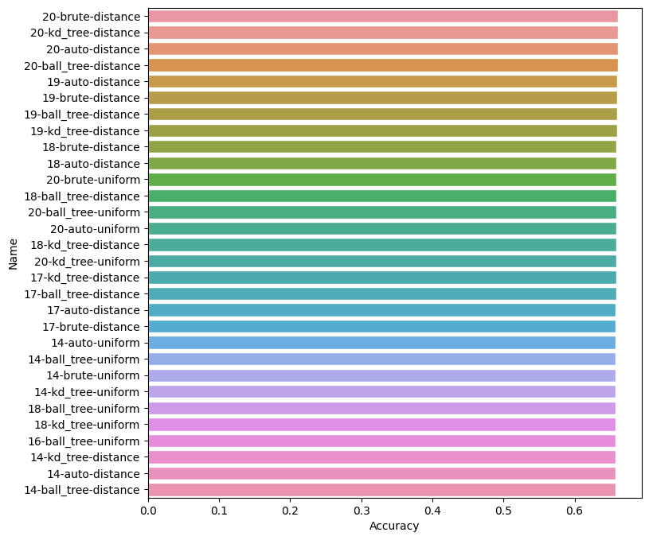  

-------------------------------------  

  
Using seed for random split 1  
SIZES:   
	train 0.7  
	test 0.15  
	validate 0.15  
  
Data shape
	Training rows:	6099  
	columns:	1  
  
Vectorizing summary  
Vectorizing summary  
Vectorizing summary  
### Working on Guassian Naive Bayes -- no_linked [2021-11-18 10:42:11]  
Using columns:  []  
NB does not have hyperparams to tune  
Start training.  
Fit model in 0.44 seconds  
Start prediction  
Finished prediction in 0.72  

Accuracy train set = 		{}
Accuracy test set = 		{}
Accuracy validation set = 	{}
Average Accuracy = 		0.6807673389080177
  

-------------------------------------  

  
Using seed for random split 1  
SIZES:   
	train 0.7  
	test 0.15  
	validate 0.15  
  
Data shape
	Training rows:	6099  
	columns:	1  
  
Vectorizing summary  
Vectorizing summary  
Vectorizing summary  
### Working on Multinominal Naive Bayes -- no_linked [2021-11-18 10:42:13]  
Using columns:  []  
NB does not have hyperparams to tune  
Start training.  
Fit model in 0.06 seconds  
Start prediction  
Finished prediction in 0.05  

Accuracy train set = 		{}
Accuracy test set = 		{}
Accuracy validation set = 	{}
Average Accuracy = 		0.7916051811772422
  

-------------------------------------  

  
Using seed for random split 1  
SIZES:   
	train 0.7  
	test 0.15  
	validate 0.15  
  
Data shape
	Training rows:	6099  
	columns:	1  
  
Vectorizing summary  
Vectorizing summary  
Vectorizing summary  
### Working on Decision Tree -- no_linked [2021-11-18 10:42:15]  
Using columns:  []  
Optimized config with:  
Depth               Log
Depth Count           9
Criterion          gini
Splitter           best
Accuracy       0.671254
Name: 1, dtype: object  

  
|    | Depth   |   Depth Count | Criterion   | Splitter   |   Accuracy |
|---:|:--------|--------------:|:------------|:-----------|-----------:|
|  1 | Log     |             9 | gini        | best       |   0.671254 |
| 15 | Log     |             9 | entropy     | best       |   0.671254 |
|  8 | Log     |             9 | gini        | random     |   0.66896  |
| 13 | 5       |             5 | gini        | random     |   0.666284 |
|  6 | 5       |             5 | gini        | best       |   0.664755 |
| 27 | 5       |             5 | entropy     | random     |   0.663991 |
| 20 | 5       |             5 | entropy     | best       |   0.663609 |
| 22 | Log     |             9 | entropy     | random     |   0.661697 |
|  9 | Sqrt    |            78 | gini        | random     |   0.63341  |
|  2 | Sqrt    |            78 | gini        | best       |   0.628823 |
| 23 | Sqrt    |            78 | entropy     | random     |   0.622324 |
| 16 | Sqrt    |            78 | entropy     | best       |   0.619266 |
| 24 | 75%     |          4574 | entropy     | random     |   0.616208 |
| 17 | 75%     |          4574 | entropy     | best       |   0.612768 |
| 26 | 25%     |          1525 | entropy     | random     |   0.611239 |
| 21 | All     |               | entropy     | random     |   0.609709 |
| 18 | 50%     |          3050 | entropy     | best       |   0.609327 |
| 19 | 25%     |          1525 | entropy     | best       |   0.607416 |
|  7 | All     |               | gini        | random     |   0.607034 |
| 14 | All     |               | entropy     | best       |   0.603976 |
|  4 | 50%     |          3050 | gini        | best       |   0.603211 |
|  0 | All     |               | gini        | best       |   0.602829 |
| 25 | 50%     |          3050 | entropy     | random     |   0.602446 |
|  5 | 25%     |          1525 | gini        | best       |   0.6013   |
| 11 | 50%     |          3050 | gini        | random     |   0.599388 |
|  3 | 75%     |          4574 | gini        | best       |   0.596713 |
| 10 | 75%     |          4574 | gini        | random     |   0.595948 |
| 12 | 25%     |          1525 | gini        | random     |   0.586391 | 

  
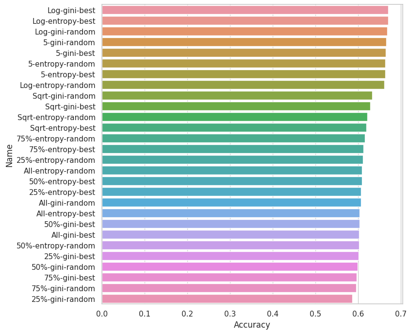  

-------------------------------------  

  
Using seed for random split 1  
SIZES:   
	train 0.7  
	test 0.15  
	validate 0.15  
  
Data shape
	Training rows:	6099  
	columns:	1  
  
Vectorizing summary  
Vectorizing summary  
Vectorizing summary  
### Working on Support Vector Machine (classifier) -- no_linked [2021-11-18 10:43:50]  
Using columns:  []  
Using Gridsearch to find optimal model, using -1 cores  
Grid search to find best params took 3820.66 seconds  
Fitted using gridsearch  
Best parameters found:
 {'class_weight': 'balanced', 'gamma': 'scale', 'kernel': 'poly'} 
  
Start prediction  
Finished prediction in 156.53  

Accuracy train set = 		{}
Accuracy test set = 		{}
Accuracy validation set = 	{}
Average Accuracy = 		0.9544187571733072
  
Showing 6 best and 6 worst results  

  
|    |     mean |         std |     time | class_weight   | gamma   | kernel   |
|---:|---------:|------------:|---------:|:---------------|:--------|:---------|
|  2 | 0.673717 | 0.000613487 | 1131.89  | balanced       | scale   | poly     |
| 11 | 0.671586 | 0.0037317   |  984.322 |                | scale   | rbf      |
| 10 | 0.669946 | 0.00160649  | 1071.94  |                | scale   | poly     |
|  8 | 0.665191 | 0.00440565  |  679.747 |                | scale   | sigmoid  |
| 12 | 0.657485 | 0.000231876 |  576.69  |                | auto    | sigmoid  |
| 14 | 0.657485 | 0.000231876 |  448.731 |                | auto    | poly     |
|  1 | 0.558452 | 0.00771838  |  818.484 | balanced       | scale   | linear   |
|  5 | 0.558452 | 0.00771838  |  826.555 | balanced       | auto    | linear   |
|  0 | 0.510084 | 0.0122544   |  961.927 | balanced       | scale   | sigmoid  |
|  4 | 0.365634 | 0.206138    | 1153.62  | balanced       | auto    | sigmoid  |
|  6 | 0.365634 | 0.206138    | 1136.24  | balanced       | auto    | poly     |
|  7 | 0.365634 | 0.206138    | 1237.26  | balanced       | auto    | rbf      | 

  
  

-------------------------------------  

  
Using seed for random split 1  
SIZES:   
	train 0.7  
	test 0.15  
	validate 0.15  
  
Data shape
	Training rows:	6099  
	columns:	1  
  
Vectorizing summary  
Vectorizing summary  
Vectorizing summary  
### Working on Stochastic Gradient Descent -- no_linked [2021-11-18 11:50:09]  
Using columns:  []  
Using Gridsearch to find optimal model, using -1 cores  
Grid search to find best params took 2882.33 seconds  
Fitted using gridsearch  
Best parameters found:
 {'alpha': 0.05, 'learning_rate': 'adaptive', 'loss': 'modified_huber', 'penalty': 'l2'} 
  
Start prediction  
Finished prediction in 0.05  

Accuracy train set = 		{}
Accuracy test set = 		{}
Accuracy validation set = 	{}
Average Accuracy = 		0.6606000983767831
  
Showing 6 best and 6 worst results  

  
|     |     mean |         std |     time |   alpha | learning_rate   | loss           | penalty    |
|----:|---------:|------------:|---------:|--------:|:----------------|:---------------|:-----------|
| 153 | 0.660108 | 0.000401622 | 26.8696  |   0.05  | adaptive        | modified_huber | l2         |
| 156 | 0.660108 | 0.000401622 | 28.2239  |   0.05  | adaptive        | squared_hinge  | l2         |
| 111 | 0.659944 | 0.000463753 |  4.02139 |   0.05  | optimal         | modified_huber | l2         |
|  82 | 0.658797 | 0.00433181  | 65.9698  |   1e-05 | adaptive        | huber          | l1         |
| 114 | 0.658633 | 0.00120486  |  6.15047 |   0.05  | optimal         | squared_hinge  | l2         |
| 147 | 0.657485 | 0.000231876 | 19.8753  |   0.05  | adaptive        | hinge          | l2         |
|  99 | 0.30464  | 0.240773    |  3.71466 |   0.05  | constant        | squared_loss   | l2         |
| 102 | 0.288244 | 0.170267    |  3.26632 |   0.05  | constant        | huber          | l2         |
|  17 | 0.275619 | 0.0514739   |  7.34241 |   1e-05 | constant        | squared_loss   | elasticnet |
|  18 | 0.266929 | 0.0755959   |  2.41687 |   1e-05 | constant        | huber          | l2         |
| 101 | 0.208723 | 0.0161167   |  6.73426 |   0.05  | constant        | squared_loss   | elasticnet |
| 118 | 0.155107 | 0.0461434   |  3.20951 |   0.05  | optimal         | perceptron     | l1         | 

  
Force ordering of graph due to size, limiting output to 30 best performers  
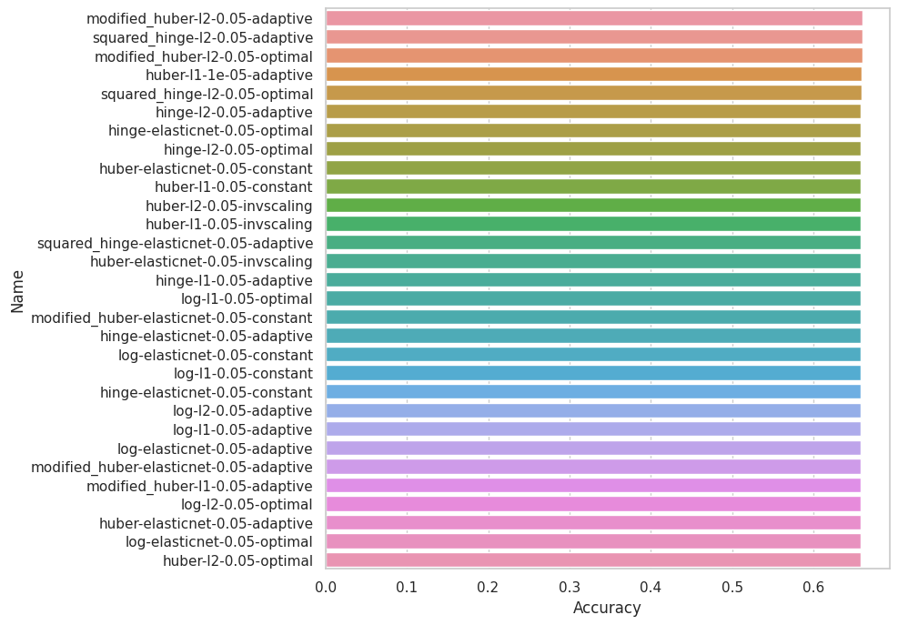  

-------------------------------------  

  
Using seed for random split 1  
SIZES:   
	train 0.7  
	test 0.15  
	validate 0.15  
  
Data shape
	Training rows:	6099  
	columns:	1  
  
Vectorizing summary  
Vectorizing summary  
Vectorizing summary  
### Working on Multi-layer Perceptron -- no_linked [2021-11-18 12:38:13]  
Using columns:  []  
Using Gridsearch to find optimal model, using -1 cores  
Grid search to find best params took 3870.07 seconds  
Fitted using gridsearch  
Best parameters found:
 {'activation': 'relu', 'alpha': 0.05, 'learning_rate': 'constant', 'solver': 'sgd'} 
  
Start prediction  
Finished prediction in 0.14  

Accuracy train set = 		{}
Accuracy test set = 		{}
Accuracy validation set = 	{}
Average Accuracy = 		0.882275782915232
  
Showing 6 best and 6 worst results  

  
|    |     mean |        std |     time | activation   |   alpha | learning_rate   | solver   |
|---:|---------:|-----------:|---------:|:-------------|--------:|:----------------|:---------|
| 18 | 0.639613 | 0.00846587 | 1156     | relu         |  0.05   | constant        | sgd      |
| 21 | 0.636662 | 0.00228372 |  977.43  | relu         |  0.05   | adaptive        | sgd      |
| 12 | 0.634366 | 0.00516413 | 1185.43  | relu         |  0.0001 | constant        | sgd      |
| 15 | 0.633383 | 0.00442392 | 1171.68  | relu         |  0.0001 | adaptive        | sgd      |
|  0 | 0.629611 | 0.0077566  | 1209.78  | tanh         |  0.0001 | constant        | sgd      |
|  9 | 0.629447 | 0.0040229  | 1235.69  | tanh         |  0.05   | adaptive        | sgd      |
| 11 | 0.564027 | 0.0138331  |  421.138 | tanh         |  0.05   | adaptive        | lbfgs    |
|  7 | 0.562715 | 0.00120486 |  177.233 | tanh         |  0.05   | constant        | adam     |
|  5 | 0.562223 | 0.0130573  |  203.541 | tanh         |  0.0001 | adaptive        | lbfgs    |
| 10 | 0.561076 | 0.0046201  |  204.85  | tanh         |  0.05   | adaptive        | adam     |
|  4 | 0.540908 | 0.00815532 |  279.227 | tanh         |  0.0001 | adaptive        | adam     |
|  1 | 0.538449 | 0.00539331 |  297.058 | tanh         |  0.0001 | constant        | adam     | 

  
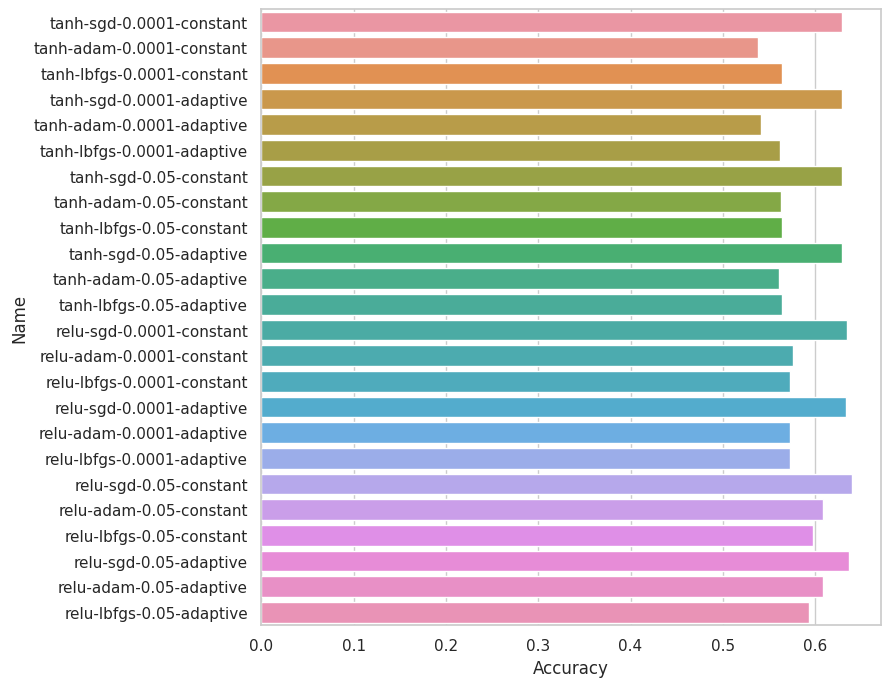  

-------------------------------------  

  
Finished comparing 2021-11-18 14:42:43+01:00  
Total seconds: 12657.150355577469:  
Exact: HH:3.00 	MM:30.00 	 ss:57.15  
Time: 03:30:58  

### model comparisons for no_linked  

  
|    | name                                | variation   |   accuracy_overall |   accuracy_train |   accuracy_test |   accuracy_val |   fit_time | model_config                                                                |   column_count |
|---:|:------------------------------------|:------------|-------------------:|-----------------:|----------------:|---------------:|-----------:|:----------------------------------------------------------------------------|---------------:|
|  0 | k-Nearest Neighbour                 | no_linked   |           0.668196 |         1        |        0.655963 |       0.680428 |  6.83864   | KNeighborsClassifier(n_neighbors=20, weights='distance')                    |           4698 |
|  1 | Guassian Naive Bayes                | no_linked   |           0.376147 |         0.680767 |        0.40367  |       0.348624 |  0.443307  | GaussianNB()                                                                |           4698 |
|  2 | Multinominal Naive Bayes            | no_linked   |           0.659786 |         0.791605 |        0.655199 |       0.664373 |  0.0598912 | MultinomialNB()                                                             |           4698 |
|  3 | Decision Tree                       | no_linked   |           0.663991 |         0.667978 |        0.655199 |       0.672783 |  0.409913  | DecisionTreeClassifier(criterion='entropy', max_depth=5, splitter='random') |           4698 |
|  4 | Support Vector Machine (classifier) | no_linked   |           0.662844 |         0.954419 |        0.661315 |       0.664373 | 73.1221    | SVC(class_weight='balanced', kernel='poly', probability=True)               |           4698 |
|  5 | Stochastic Gradient Descent         | no_linked   |           0.66208  |         0.6606   |        0.652141 |       0.672018 |  0.04201   | SGDClassifier(alpha=0.05, eta0=100.0, learning_rate='adaptive',             |           4698 |
|    |                                     |             |                    |                  |                 |                |            |               loss='modified_huber')                                        |                |
|  6 | Multi-layer Perceptron              | no_linked   |           0.613914 |         0.882276 |        0.607798 |       0.620031 |  0.116672  | MLPClassifier(alpha=0.05, max_iter=1000, solver='sgd')                      |           4698 | 

  

  
|    | name                                | variation   |   accuracy_overall |   accuracy_train |   accuracy_test |   accuracy_val |   fit_time | model_config                                                                |   column_count |
|---:|:------------------------------------|:------------|-------------------:|-----------------:|----------------:|---------------:|-----------:|:----------------------------------------------------------------------------|---------------:|
|  0 | k-Nearest Neighbour                 | no_linked   |           0.668196 |         1        |        0.655963 |       0.680428 |  6.83864   | KNeighborsClassifier(n_neighbors=20, weights='distance')                    |           4698 |
|  3 | Decision Tree                       | no_linked   |           0.663991 |         0.667978 |        0.655199 |       0.672783 |  0.409913  | DecisionTreeClassifier(criterion='entropy', max_depth=5, splitter='random') |           4698 |
|  4 | Support Vector Machine (classifier) | no_linked   |           0.662844 |         0.954419 |        0.661315 |       0.664373 | 73.1221    | SVC(class_weight='balanced', kernel='poly', probability=True)               |           4698 |
|  5 | Stochastic Gradient Descent         | no_linked   |           0.66208  |         0.6606   |        0.652141 |       0.672018 |  0.04201   | SGDClassifier(alpha=0.05, eta0=100.0, learning_rate='adaptive',             |           4698 |
|    |                                     |             |                    |                  |                 |                |            |               loss='modified_huber')                                        |                |
|  2 | Multinominal Naive Bayes            | no_linked   |           0.659786 |         0.791605 |        0.655199 |       0.664373 |  0.0598912 | MultinomialNB()                                                             |           4698 |
|  6 | Multi-layer Perceptron              | no_linked   |           0.613914 |         0.882276 |        0.607798 |       0.620031 |  0.116672  | MLPClassifier(alpha=0.05, max_iter=1000, solver='sgd')                      |           4698 |
|  1 | Guassian Naive Bayes                | no_linked   |           0.376147 |         0.680767 |        0.40367  |       0.348624 |  0.443307  | GaussianNB()                                                                |           4698 | 

  
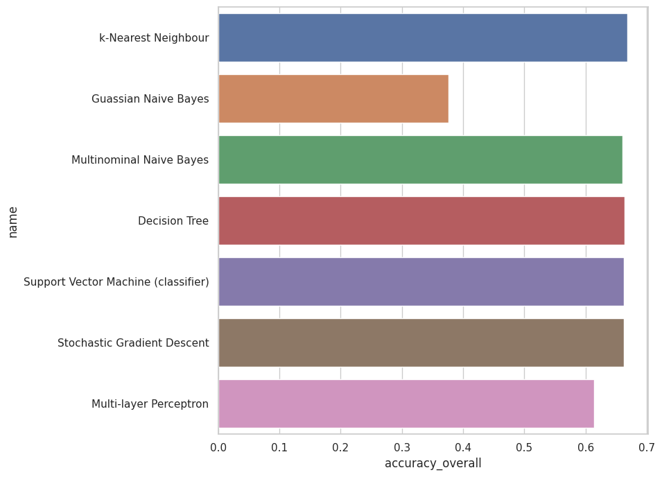  

  

 |    | Name                                |   Accuracy |       Time |   Optimization_time |
|---:|:------------------------------------|-----------:|-----------:|--------------------:|
|  0 | k-Nearest Neighbour                 |   0.668196 |  6.83864   |         1820.21     |
|  1 | Guassian Naive Bayes                |   0.376147 |  0.443307  |            1.17308  |
|  2 | Multinominal Naive Bayes            |   0.659786 |  0.0598912 |            0.125065 |
|  3 | Decision Tree                       |   0.663991 |  0.409913  |           94.6294   |
|  4 | Support Vector Machine (classifier) |   0.662844 | 73.1221    |         3977.59     |
|  5 | Stochastic Gradient Descent         |   0.66208  |  0.04201   |         2882.92     |
|  6 | Multi-layer Perceptron              |   0.613914 |  0.116672  |         3870.67     | 

  
Best in set was k-Nearest Neighbour with an accuracy 0.6681957186544343  

==  no_linked == 
================================  

  
Validating feature set summary  
Standardizing text columns:  {'summary'}  
## summary  
Start comparing 2021-11-18 14:42:44+01:00  
Using non cached frame with columns:  Index(['Unnamed: 0', 'assignee', 'component_names', 'components_descriptions',
       'created', 'description', 'harm', 'id', 'labels',
       'last_sprint_activatedDate', 'last_sprint_autoStartStop',
       'last_sprint_completeDate', 'last_sprint_endDate', 'last_sprint_goal',
       'last_sprint_id', 'last_sprint_name', 'last_sprint_rapidViewId',
       'last_sprint_sequence', 'last_sprint_startDate', 'last_sprint_state',
       'link', 'points', 'probability', 'probability_final', 'project',
       'requirement_prio', 'resolution', 'resolutiondate', 'risk_impact',
       'risk_likelyhood', 'severity', 'sprint_count', 'status', 'status_key',
       'summary', 'type', 'updated', 'urgent', 'component_count',
       'labels_count', 'summary_raw', 'summary_stopword_count'],
      dtype='object')  
No preprocess fields found returning df summary  
Extracted columns from non cached frame:  Index(['Unnamed: 0', 'assignee', 'component_names', 'components_descriptions',
       'created', 'description', 'harm', 'id', 'labels',
       'last_sprint_activatedDate', 'last_sprint_autoStartStop',
       'last_sprint_completeDate', 'last_sprint_endDate', 'last_sprint_goal',
       'last_sprint_id', 'last_sprint_name', 'last_sprint_rapidViewId',
       'last_sprint_sequence', 'last_sprint_startDate', 'last_sprint_state',
       'link', 'points', 'probability', 'probability_final', 'project',
       'requirement_prio', 'resolution', 'resolutiondate', 'risk_impact',
       'risk_likelyhood', 'severity', 'sprint_count', 'status', 'status_key',
       'summary', 'type', 'updated', 'urgent', 'component_count',
       'labels_count', 'summary_raw', 'summary_stopword_count'],
      dtype='object')  
Using seed for random split 1  
SIZES:   
	train 0.7  
	test 0.15  
	validate 0.15  
  
Data shape
	Training rows:	6099  
	columns:	3  
  
Vectorizing summary  
Vectorizing summary  
Vectorizing summary  
### Working on k-Nearest Neighbour -- summary [2021-11-18 13:42:48]  
Using columns:  ['sprint_count', 'points']  
Using Gridsearch to find optimal model, using -1 cores  
Grid search to find best params took 1828.18 seconds  
Fitted using gridsearch  
Best parameters found:
 {'algorithm': 'auto', 'n_neighbors': 20, 'weights': 'distance'} 
  
Start prediction  
Finished prediction in 3.42  

Accuracy train set = 		{}
Accuracy test set = 		{}
Accuracy validation set = 	{}
Average Accuracy = 		1.0
  
Showing 6 best and 6 worst results  

  
|     |     mean |        std |     time | algorithm   |   n_neighbors | weights   |
|----:|---------:|-----------:|---------:|:------------|--------------:|:----------|
| 159 | 0.66224  | 0.00322133 | 0.76195  | brute       |            20 | distance  |
| 119 | 0.66224  | 0.00322133 | 4.03968  | kd_tree     |            20 | distance  |
|  79 | 0.66224  | 0.00322133 | 3.13296  | ball_tree   |            20 | distance  |
|  39 | 0.66224  | 0.00322133 | 0.636579 | auto        |            20 | distance  |
| 115 | 0.661092 | 0.00473505 | 4.02813  | kd_tree     |            18 | distance  |
|  75 | 0.661092 | 0.00473505 | 3.17504  | ball_tree   |            18 | distance  |
|   1 | 0.593704 | 0.0370473  | 0.609127 | auto        |             1 | distance  |
|  43 | 0.593704 | 0.0370473  | 3.3503   | ball_tree   |             2 | distance  |
|  41 | 0.593704 | 0.0370473  | 3.48208  | ball_tree   |             1 | distance  |
|  40 | 0.593704 | 0.0370473  | 3.62755  | ball_tree   |             1 | uniform   |
|   3 | 0.593704 | 0.0370473  | 0.733756 | auto        |             2 | distance  |
|  80 | 0.593704 | 0.0370473  | 4.10531  | kd_tree     |             1 | uniform   | 

  
Force ordering of graph due to size, limiting output to 30 best performers  
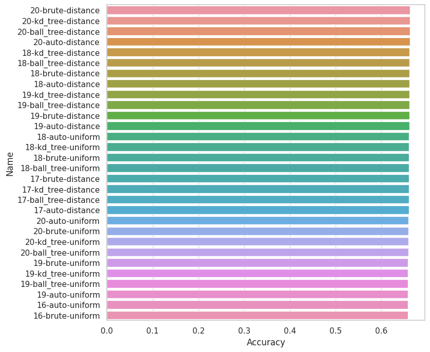  

-------------------------------------  

  
Using seed for random split 1  
SIZES:   
	train 0.7  
	test 0.15  
	validate 0.15  
  
Data shape
	Training rows:	6099  
	columns:	3  
  
Vectorizing summary  
Vectorizing summary  
Vectorizing summary  
### Working on Guassian Naive Bayes -- summary [2021-11-18 14:13:21]  
Using columns:  ['sprint_count', 'points']  
NB does not have hyperparams to tune  
Start training.  
Fit model in 0.44 seconds  
Start prediction  
Finished prediction in 0.71  

Accuracy train set = 		{}
Accuracy test set = 		{}
Accuracy validation set = 	{}
Average Accuracy = 		0.6807673389080177
  

-------------------------------------  

  
Using seed for random split 1  
SIZES:   
	train 0.7  
	test 0.15  
	validate 0.15  
  
Data shape
	Training rows:	6099  
	columns:	3  
  
Vectorizing summary  
Vectorizing summary  
Vectorizing summary  
### Working on Multinominal Naive Bayes -- summary [2021-11-18 14:13:23]  
Using columns:  ['sprint_count', 'points']  
NB does not have hyperparams to tune  
Start training.  
Fit model in 0.06 seconds  
Start prediction  
Finished prediction in 0.05  

Accuracy train set = 		{}
Accuracy test set = 		{}
Accuracy validation set = 	{}
Average Accuracy = 		0.7907853746515823
  

-------------------------------------  

  
Using seed for random split 1  
SIZES:   
	train 0.7  
	test 0.15  
	validate 0.15  
  
Data shape
	Training rows:	6099  
	columns:	3  
  
Vectorizing summary  
Vectorizing summary  
Vectorizing summary  
### Working on Decision Tree -- summary [2021-11-18 14:13:24]  
Using columns:  ['sprint_count', 'points']  
Optimized config with:  
Depth               Log
Depth Count           9
Criterion          gini
Splitter           best
Accuracy       0.691514
Name: 1, dtype: object  

  
|    | Depth   |   Depth Count | Criterion   | Splitter   |   Accuracy |
|---:|:--------|--------------:|:------------|:-----------|-----------:|
|  1 | Log     |             9 | gini        | best       |   0.691514 |
| 22 | Log     |             9 | entropy     | random     |   0.687309 |
| 15 | Log     |             9 | entropy     | best       |   0.686544 |
| 20 | 5       |             5 | entropy     | best       |   0.686544 |
|  6 | 5       |             5 | gini        | best       |   0.68578  |
|  8 | Log     |             9 | gini        | random     |   0.683104 |
|  2 | Sqrt    |            78 | gini        | best       |   0.673165 |
|  0 | All     |               | gini        | best       |   0.669343 |
| 23 | Sqrt    |            78 | entropy     | random     |   0.668578 |
|  3 | 75%     |          4574 | gini        | best       |   0.665902 |
| 13 | 5       |             5 | gini        | random     |   0.665138 |
| 27 | 5       |             5 | entropy     | random     |   0.665138 |
| 25 | 50%     |          3050 | entropy     | random     |   0.664373 |
|  4 | 50%     |          3050 | gini        | best       |   0.663226 |
|  5 | 25%     |          1525 | gini        | best       |   0.661697 |
| 19 | 25%     |          1525 | entropy     | best       |   0.660933 |
| 14 | All     |               | entropy     | best       |   0.659404 |
| 11 | 50%     |          3050 | gini        | random     |   0.658639 |
| 17 | 75%     |          4574 | entropy     | best       |   0.658639 |
| 16 | Sqrt    |            78 | entropy     | best       |   0.657492 |
| 10 | 75%     |          4574 | gini        | random     |   0.656728 |
| 24 | 75%     |          4574 | entropy     | random     |   0.656346 |
| 26 | 25%     |          1525 | entropy     | random     |   0.654817 |
| 18 | 50%     |          3050 | entropy     | best       |   0.652141 |
|  9 | Sqrt    |            78 | gini        | random     |   0.652141 |
| 21 | All     |               | entropy     | random     |   0.650612 |
|  7 | All     |               | gini        | random     |   0.649847 |
| 12 | 25%     |          1525 | gini        | random     |   0.648318 | 

  
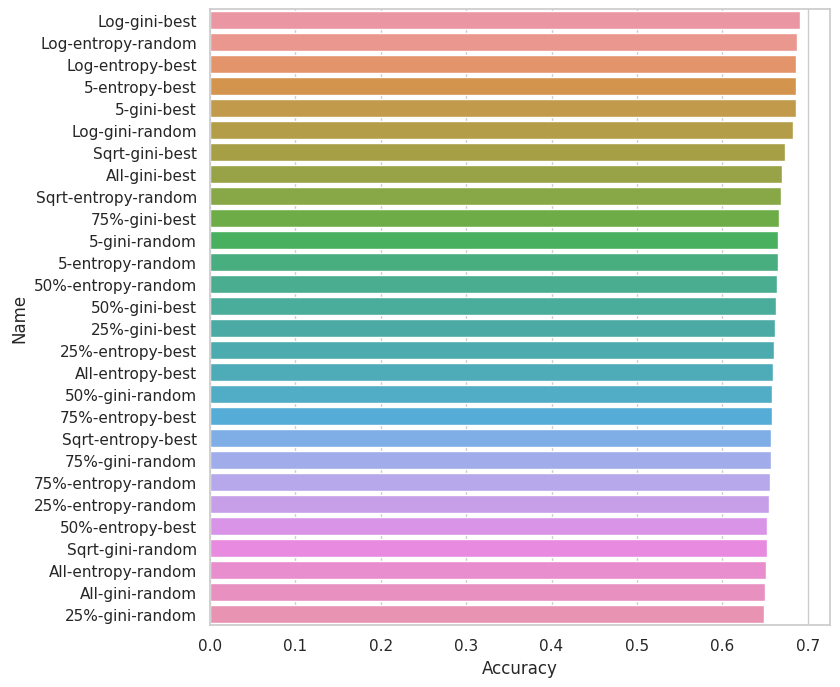  

-------------------------------------  

  
Using seed for random split 1  
SIZES:   
	train 0.7  
	test 0.15  
	validate 0.15  
  
Data shape
	Training rows:	6099  
	columns:	3  
  
Vectorizing summary  
Vectorizing summary  
Vectorizing summary  
### Working on Support Vector Machine (classifier) -- summary [2021-11-18 14:14:16]  
Using columns:  ['sprint_count', 'points']  
Using Gridsearch to find optimal model, using -1 cores  
Grid search to find best params took 3803.0 seconds  
Fitted using gridsearch  
Best parameters found:
 {'class_weight': 'balanced', 'gamma': 'scale', 'kernel': 'poly'} 
  
Start prediction  
Finished prediction in 155.31  

Accuracy train set = 		{}
Accuracy test set = 		{}
Accuracy validation set = 	{}
Average Accuracy = 		0.9547466797835711
  
Showing 6 best and 6 worst results  

  
|    |     mean |         std |     time | class_weight   | gamma   | kernel   |
|---:|---------:|------------:|---------:|:---------------|:--------|:---------|
|  2 | 0.673881 | 0.000695629 | 1115.93  | balanced       | scale   | poly     |
| 11 | 0.672241 | 0.0033682   |  987.627 |                | scale   | rbf      |
| 10 | 0.669946 | 0.00120486  | 1081.46  |                | scale   | poly     |
|  8 | 0.666667 | 0.00479149  |  666.47  |                | scale   | sigmoid  |
| 12 | 0.657485 | 0.000231876 |  556.934 |                | auto    | sigmoid  |
| 14 | 0.657485 | 0.000231876 |  428.356 |                | auto    | poly     |
|  1 | 0.570749 | 0.00152051  |  825.002 | balanced       | scale   | linear   |
|  5 | 0.570749 | 0.00152051  |  790.066 | balanced       | auto    | linear   |
|  0 | 0.52484  | 0.0056227   |  966.367 | balanced       | scale   | sigmoid  |
|  4 | 0.365634 | 0.206138    | 1158.9   | balanced       | auto    | sigmoid  |
|  6 | 0.365634 | 0.206138    | 1139.92  | balanced       | auto    | poly     |
|  7 | 0.365634 | 0.206138    | 1256.47  | balanced       | auto    | rbf      | 

  
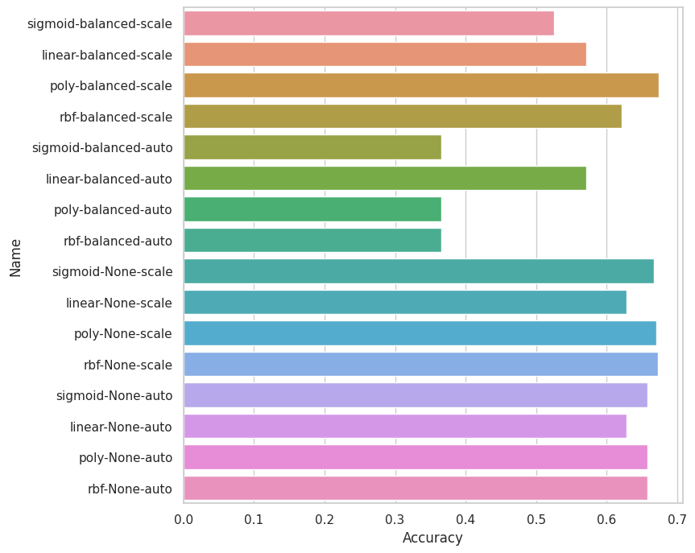  

-------------------------------------  

  
Using seed for random split 1  
SIZES:   
	train 0.7  
	test 0.15  
	validate 0.15  
  
Data shape
	Training rows:	6099  
	columns:	3  
  
Vectorizing summary  
Vectorizing summary  
Vectorizing summary  
### Working on Stochastic Gradient Descent -- summary [2021-11-18 15:20:16]  
Using columns:  ['sprint_count', 'points']  
Using Gridsearch to find optimal model, using -1 cores  
Grid search to find best params took 2788.66 seconds  
Fitted using gridsearch  
Best parameters found:
 {'alpha': 0.05, 'learning_rate': 'optimal', 'loss': 'squared_hinge', 'penalty': 'l2'} 
  
Start prediction  
Finished prediction in 0.05  

Accuracy train set = 		{}
Accuracy test set = 		{}
Accuracy validation set = 	{}
Average Accuracy = 		0.660436137071651
  
Showing 6 best and 6 worst results  

  
|     |     mean |         std |     time |   alpha | learning_rate   | loss           | penalty    |
|----:|---------:|------------:|---------:|--------:|:----------------|:---------------|:-----------|
| 114 | 0.660928 | 0.000836042 |  4.52277 |   0.05  | optimal         | squared_hinge  | l2         |
| 111 | 0.660436 | 0.000613487 |  4.0195  |   0.05  | optimal         | modified_huber | l2         |
| 156 | 0.660272 | 0.000613487 | 27.8515  |   0.05  | adaptive        | squared_hinge  | l2         |
| 153 | 0.660272 | 0.000613487 | 27.2428  |   0.05  | adaptive        | modified_huber | l2         |
|  82 | 0.65978  | 0.0046201   | 67.7974  |   1e-05 | adaptive        | huber          | l1         |
| 126 | 0.658469 | 0.00152051  |  9.03149 |   0.05  | invscaling      | hinge          | l2         |
| 119 | 0.210854 | 0.0687727   |  3.22259 |   0.05  | optimal         | perceptron     | elasticnet |
|  99 | 0.191671 | 0.0476651   |  3.63012 |   0.05  | constant        | squared_loss   | l2         |
|  17 | 0.186096 | 0.0377638   |  7.27033 |   1e-05 | constant        | squared_loss   | elasticnet |
| 102 | 0.156419 | 0.0428871   |  3.3291  |   0.05  | constant        | huber          | l2         |
| 140 | 0.154943 | 0.0459115   | 17.1582  |   0.05  | invscaling      | perceptron     | elasticnet |
| 101 | 0.137891 | 0.0129041   |  4.5727  |   0.05  | constant        | squared_loss   | elasticnet | 

  
Force ordering of graph due to size, limiting output to 30 best performers  
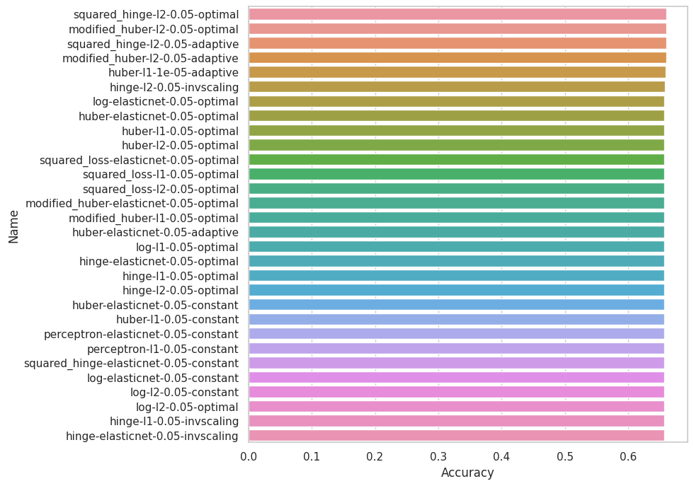  

-------------------------------------  

  
Using seed for random split 1  
SIZES:   
	train 0.7  
	test 0.15  
	validate 0.15  
  
Data shape
	Training rows:	6099  
	columns:	3  
  
Vectorizing summary  
Vectorizing summary  
Vectorizing summary  
### Working on Multi-layer Perceptron -- summary [2021-11-18 16:06:46]  
Using columns:  ['sprint_count', 'points']  
Using Gridsearch to find optimal model, using -1 cores  
Grid search to find best params took 3639.03 seconds  
Fitted using gridsearch  
Best parameters found:
 {'activation': 'relu', 'alpha': 0.0001, 'learning_rate': 'constant', 'solver': 'sgd'} 
  
Start prediction  
Finished prediction in 0.14  

Accuracy train set = 		{}
Accuracy test set = 		{}
Accuracy validation set = 	{}
Average Accuracy = 		0.8942449581898672
  
Showing 6 best and 6 worst results  

  
|    |     mean |        std |     time | activation   |   alpha | learning_rate   | solver   |
|---:|---------:|-----------:|---------:|:-------------|--------:|:----------------|:---------|
| 12 | 0.640105 | 0.00760257 | 1206.32  | relu         |  0.0001 | constant        | sgd      |
| 21 | 0.640105 | 0.0037317  |  956.284 | relu         |  0.05   | adaptive        | sgd      |
| 18 | 0.639613 | 0.00783248 | 1121.04  | relu         |  0.05   | constant        | sgd      |
| 15 | 0.637318 | 0.0040628  | 1189.9   | relu         |  0.0001 | adaptive        | sgd      |
|  3 | 0.635514 | 0.00602432 | 1285.06  | tanh         |  0.0001 | adaptive        | sgd      |
|  9 | 0.633219 | 0.00602878 | 1205.77  | tanh         |  0.05   | adaptive        | sgd      |
|  7 | 0.574356 | 0.00273378 |  189.9   | tanh         |  0.05   | constant        | adam     |
|  5 | 0.573373 | 0.0134728  |  194.931 | tanh         |  0.0001 | adaptive        | lbfgs    |
| 11 | 0.573045 | 0.0101365  |  420.16  | tanh         |  0.05   | adaptive        | lbfgs    |
|  2 | 0.569438 | 0.012407   |  183.196 | tanh         |  0.0001 | constant        | lbfgs    |
|  1 | 0.549926 | 0.00618288 |  265.355 | tanh         |  0.0001 | constant        | adam     |
|  4 | 0.542712 | 0.00947293 |  350.924 | tanh         |  0.0001 | adaptive        | adam     | 

  
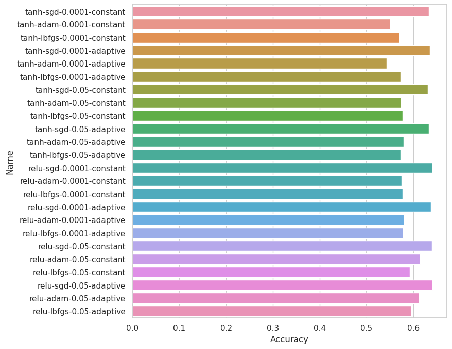  

-------------------------------------  

  
Finished comparing 2021-11-18 18:07:26+01:00  
Total seconds: 12282.052770137787:  
Exact: HH:3.00 	MM:24.00 	 ss:42.05  
Time: 03:24:43  

### model comparisons for summary  

  
|    | name                                | variation   |   accuracy_overall |   accuracy_train |   accuracy_test |   accuracy_val |   fit_time | model_config                                                                |   column_count |
|---:|:------------------------------------|:------------|-------------------:|-----------------:|----------------:|---------------:|-----------:|:----------------------------------------------------------------------------|---------------:|
|  0 | k-Nearest Neighbour                 | summary     |           0.668196 |         1        |        0.655963 |       0.680428 |  5.39164   | KNeighborsClassifier(n_neighbors=20, weights='distance')                    |           4700 |
|  1 | Guassian Naive Bayes                | summary     |           0.376147 |         0.680767 |        0.40367  |       0.348624 |  0.44196   | GaussianNB()                                                                |           4700 |
|  2 | Multinominal Naive Bayes            | summary     |           0.660168 |         0.790785 |        0.655963 |       0.664373 |  0.062757  | MultinomialNB()                                                             |           4700 |
|  3 | Decision Tree                       | summary     |           0.665138 |         0.671094 |        0.659786 |       0.670489 |  0.395463  | DecisionTreeClassifier(criterion='entropy', max_depth=5, splitter='random') |           4700 |
|  4 | Support Vector Machine (classifier) | summary     |           0.663226 |         0.954747 |        0.66208  |       0.664373 | 70.489     | SVC(class_weight='balanced', kernel='poly', probability=True)               |           4700 |
|  5 | Stochastic Gradient Descent         | summary     |           0.66208  |         0.660436 |        0.652141 |       0.672018 |  0.0424663 | SGDClassifier(alpha=0.05, eta0=100.0, loss='squared_hinge')                 |           4700 |
|  6 | Multi-layer Perceptron              | summary     |           0.632645 |         0.894245 |        0.63685  |       0.62844  |  0.21738   | MLPClassifier(max_iter=1000, solver='sgd')                                  |           4700 | 

  

  
|    | name                                | variation   |   accuracy_overall |   accuracy_train |   accuracy_test |   accuracy_val |   fit_time | model_config                                                                |   column_count |
|---:|:------------------------------------|:------------|-------------------:|-----------------:|----------------:|---------------:|-----------:|:----------------------------------------------------------------------------|---------------:|
|  0 | k-Nearest Neighbour                 | summary     |           0.668196 |         1        |        0.655963 |       0.680428 |  5.39164   | KNeighborsClassifier(n_neighbors=20, weights='distance')                    |           4700 |
|  3 | Decision Tree                       | summary     |           0.665138 |         0.671094 |        0.659786 |       0.670489 |  0.395463  | DecisionTreeClassifier(criterion='entropy', max_depth=5, splitter='random') |           4700 |
|  4 | Support Vector Machine (classifier) | summary     |           0.663226 |         0.954747 |        0.66208  |       0.664373 | 70.489     | SVC(class_weight='balanced', kernel='poly', probability=True)               |           4700 |
|  5 | Stochastic Gradient Descent         | summary     |           0.66208  |         0.660436 |        0.652141 |       0.672018 |  0.0424663 | SGDClassifier(alpha=0.05, eta0=100.0, loss='squared_hinge')                 |           4700 |
|  2 | Multinominal Naive Bayes            | summary     |           0.660168 |         0.790785 |        0.655963 |       0.664373 |  0.062757  | MultinomialNB()                                                             |           4700 |
|  6 | Multi-layer Perceptron              | summary     |           0.632645 |         0.894245 |        0.63685  |       0.62844  |  0.21738   | MLPClassifier(max_iter=1000, solver='sgd')                                  |           4700 |
|  1 | Guassian Naive Bayes                | summary     |           0.376147 |         0.680767 |        0.40367  |       0.348624 |  0.44196   | GaussianNB()                                                                |           4700 | 

  
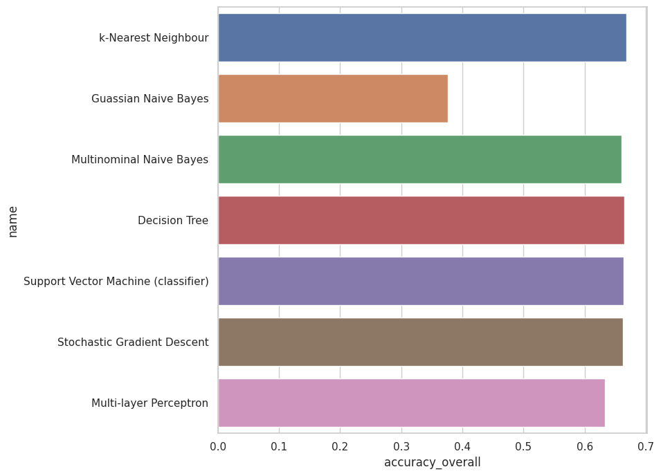  

  

 |    | Name                                |   Accuracy |       Time |   Optimization_time |
|---:|:------------------------------------|-----------:|-----------:|--------------------:|
|  0 | k-Nearest Neighbour                 |   0.668196 |  5.39164   |         1832.03     |
|  1 | Guassian Naive Bayes                |   0.376147 |  0.44196   |            1.16237  |
|  2 | Multinominal Naive Bayes            |   0.660168 |  0.062757  |            0.127207 |
|  3 | Decision Tree                       |   0.665138 |  0.395463  |           50.9345   |
|  4 | Support Vector Machine (classifier) |   0.663226 | 70.489     |         3958.62     |
|  5 | Stochastic Gradient Descent         |   0.66208  |  0.0424663 |         2789.25     |
|  6 | Multi-layer Perceptron              |   0.632645 |  0.21738   |         3639.64     | 

  
Best in set was k-Nearest Neighbour with an accuracy 0.6681957186544343  

==  summary == 
================================  

  
Validating feature set description  
Standardizing text columns:  {'description'}  
## description  
Start comparing 2021-11-18 18:07:27+01:00  
Using non cached frame with columns:  Index(['Unnamed: 0', 'assignee', 'component_names', 'components_descriptions',
       'created', 'description', 'harm', 'id', 'labels',
       'last_sprint_activatedDate', 'last_sprint_autoStartStop',
       'last_sprint_completeDate', 'last_sprint_endDate', 'last_sprint_goal',
       'last_sprint_id', 'last_sprint_name', 'last_sprint_rapidViewId',
       'last_sprint_sequence', 'last_sprint_startDate', 'last_sprint_state',
       'link', 'points', 'probability', 'probability_final', 'project',
       'requirement_prio', 'resolution', 'resolutiondate', 'risk_impact',
       'risk_likelyhood', 'severity', 'sprint_count', 'status', 'status_key',
       'summary', 'type', 'updated', 'urgent', 'component_count',
       'labels_count', 'description_raw', 'description_stopword_count'],
      dtype='object')  
No preprocess fields found returning df description  
Extracted columns from non cached frame:  Index(['Unnamed: 0', 'assignee', 'component_names', 'components_descriptions',
       'created', 'description', 'harm', 'id', 'labels',
       'last_sprint_activatedDate', 'last_sprint_autoStartStop',
       'last_sprint_completeDate', 'last_sprint_endDate', 'last_sprint_goal',
       'last_sprint_id', 'last_sprint_name', 'last_sprint_rapidViewId',
       'last_sprint_sequence', 'last_sprint_startDate', 'last_sprint_state',
       'link', 'points', 'probability', 'probability_final', 'project',
       'requirement_prio', 'resolution', 'resolutiondate', 'risk_impact',
       'risk_likelyhood', 'severity', 'sprint_count', 'status', 'status_key',
       'summary', 'type', 'updated', 'urgent', 'component_count',
       'labels_count', 'description_raw', 'description_stopword_count'],
      dtype='object')  
Using seed for random split 1  
SIZES:   
	train 0.7  
	test 0.15  
	validate 0.15  
  
Data shape
	Training rows:	5371  
	columns:	3  
  
Vectorizing description  
Vectorizing description  
Vectorizing description  
### Working on k-Nearest Neighbour -- description [2021-11-18 17:07:44]  
Using columns:  ['sprint_count', 'points']  
Using Gridsearch to find optimal model, using -1 cores  
Grid search to find best params took 4957.08 seconds  
Fitted using gridsearch  
Best parameters found:
 {'algorithm': 'auto', 'n_neighbors': 16, 'weights': 'distance'} 
  
Start prediction  
Finished prediction in 7.72  

Accuracy train set = 		{}
Accuracy test set = 		{}
Accuracy validation set = 	{}
Average Accuracy = 		1.0
  
Showing 6 best and 6 worst results  

  
|     |     mean |        std |     time | algorithm   |   n_neighbors | weights   |
|----:|---------:|-----------:|---------:|:------------|--------------:|:----------|
| 151 | 0.672128 | 0.00123773 |  2.69292 | brute       |            16 | distance  |
|  71 | 0.672128 | 0.00123773 | 13.2366  | ball_tree   |            16 | distance  |
|  31 | 0.672128 | 0.00123773 |  5.79725 | auto        |            16 | distance  |
| 111 | 0.672128 | 0.00123773 | 14.4369  | kd_tree     |            16 | distance  |
|  77 | 0.671941 | 0.00223936 | 13.5288  | ball_tree   |            19 | distance  |
|  37 | 0.671941 | 0.00223936 |  4.05931 | auto        |            19 | distance  |
|  43 | 0.536575 | 0.0457579  | 12.8768  | ball_tree   |             2 | distance  |
|   3 | 0.536575 | 0.0457579  |  5.59062 | auto        |             2 | distance  |
|  81 | 0.536388 | 0.0459798  | 15.8257  | kd_tree     |             1 | distance  |
|  41 | 0.536388 | 0.0459798  | 13.615   | ball_tree   |             1 | distance  |
|  40 | 0.536388 | 0.0459798  | 14.1197  | ball_tree   |             1 | uniform   |
|  80 | 0.536388 | 0.0459798  | 15.2351  | kd_tree     |             1 | uniform   | 

  
Force ordering of graph due to size, limiting output to 30 best performers  
  

-------------------------------------  

  
Using seed for random split 1  
SIZES:   
	train 0.7  
	test 0.15  
	validate 0.15  
  
Data shape
	Training rows:	5371  
	columns:	3  
  
Vectorizing description  
Vectorizing description  
Vectorizing description  
### Working on Guassian Naive Bayes -- description [2021-11-18 18:30:33]  
Using columns:  ['sprint_count', 'points']  
NB does not have hyperparams to tune  
Start training.  
Fit model in 1.58 seconds  
Start prediction  
Finished prediction in 2.43  

Accuracy train set = 		{}
Accuracy test set = 		{}
Accuracy validation set = 	{}
Average Accuracy = 		0.7855148017129027
  

-------------------------------------  

  
Using seed for random split 1  
SIZES:   
	train 0.7  
	test 0.15  
	validate 0.15  
  
Data shape
	Training rows:	5371  
	columns:	3  
  
Vectorizing description  
Vectorizing description  
Vectorizing description  
### Working on Multinominal Naive Bayes -- description [2021-11-18 18:30:40]  
Using columns:  ['sprint_count', 'points']  
NB does not have hyperparams to tune  
Start training.  
Fit model in 0.18 seconds  
Start prediction  
Finished prediction in 0.17  

Accuracy train set = 		{}
Accuracy test set = 		{}
Accuracy validation set = 	{}
Average Accuracy = 		0.7894246881400112
  

-------------------------------------  

  
Using seed for random split 1  
SIZES:   
	train 0.7  
	test 0.15  
	validate 0.15  
  
Data shape
	Training rows:	5371  
	columns:	3  
  
Vectorizing description  
Vectorizing description  
Vectorizing description  
### Working on Decision Tree -- description [2021-11-18 18:30:44]  
Using columns:  ['sprint_count', 'points']  
Optimized config with:  
Depth               Log
Depth Count           9
Criterion       entropy
Splitter         random
Accuracy       0.680556
Name: 22, dtype: object  

  
|    | Depth   |   Depth Count | Criterion   | Splitter   |   Accuracy |
|---:|:--------|--------------:|:------------|:-----------|-----------:|
| 22 | Log     |             9 | entropy     | random     |   0.680556 |
| 15 | Log     |             9 | entropy     | best       |   0.680556 |
|  6 | 5       |             5 | gini        | best       |   0.675347 |
| 20 | 5       |             5 | entropy     | best       |   0.675347 |
|  8 | Log     |             9 | gini        | random     |   0.674913 |
|  1 | Log     |             9 | gini        | best       |   0.664497 |
| 13 | 5       |             5 | gini        | random     |   0.662326 |
| 27 | 5       |             5 | entropy     | random     |   0.655816 |
| 17 | 75%     |          4028 | entropy     | best       |   0.650608 |
| 19 | 25%     |          1343 | entropy     | best       |   0.644531 |
| 14 | All     |               | entropy     | best       |   0.642361 |
| 23 | Sqrt    |            73 | entropy     | random     |   0.641927 |
| 25 | 50%     |          2686 | entropy     | random     |   0.640191 |
| 16 | Sqrt    |            73 | entropy     | best       |   0.637587 |
| 12 | 25%     |          1343 | gini        | random     |   0.637153 |
| 18 | 50%     |          2686 | entropy     | best       |   0.633247 |
| 11 | 50%     |          2686 | gini        | random     |   0.632812 |
| 26 | 25%     |          1343 | entropy     | random     |   0.632812 |
| 10 | 75%     |          4028 | gini        | random     |   0.624566 |
|  2 | Sqrt    |            73 | gini        | best       |   0.623698 |
|  4 | 50%     |          2686 | gini        | best       |   0.62283  |
| 21 | All     |               | entropy     | random     |   0.622396 |
|  9 | Sqrt    |            73 | gini        | random     |   0.619792 |
|  3 | 75%     |          4028 | gini        | best       |   0.617188 |
|  7 | All     |               | gini        | random     |   0.616319 |
|  5 | 25%     |          1343 | gini        | best       |   0.615885 |
| 24 | 75%     |          4028 | entropy     | random     |   0.615017 |
|  0 | All     |               | gini        | best       |   0.614583 | 

  
  

-------------------------------------  

  
Using seed for random split 1  
SIZES:   
	train 0.7  
	test 0.15  
	validate 0.15  
  
Data shape
	Training rows:	5371  
	columns:	3  
  
Vectorizing description  
Vectorizing description  
Vectorizing description  
### Working on Support Vector Machine (classifier) -- description [2021-11-18 18:32:48]  
Using columns:  ['sprint_count', 'points']  
Using Gridsearch to find optimal model, using -1 cores  
Grid search to find best params took 13213.79 seconds  
Fitted using gridsearch  
Best parameters found:
 {'class_weight': None, 'gamma': 'scale', 'kernel': 'rbf'} 
  
Start prediction  
Finished prediction in 1528.57  

Accuracy train set = 		{}
Accuracy test set = 		{}
Accuracy validation set = 	{}
Average Accuracy = 		0.7974306460621858
  
Showing 6 best and 6 worst results  

  
|    |     mean |         std |    time | class_weight   | gamma   | kernel   |
|---:|---------:|------------:|--------:|:---------------|:--------|:---------|
| 11 | 0.665053 | 0.00107815  | 2934.15 |                | scale   | rbf      |
|  8 | 0.662818 | 0.00419534  | 2222.38 |                | scale   | sigmoid  |
|  2 | 0.661516 | 0.000381466 | 3435.78 | balanced       | scale   | poly     |
| 10 | 0.661329 | 0.000174099 | 3167.92 |                | scale   | poly     |
| 12 | 0.660771 | 0.000173952 | 1694.89 |                | auto    | sigmoid  |
| 14 | 0.660771 | 0.000173952 | 1453.87 |                | auto    | poly     |
|  5 | 0.617203 | 0.0122324   | 3064    | balanced       | auto    | linear   |
|  3 | 0.609754 | 0.0145006   | 3529.75 | balanced       | scale   | rbf      |
|  0 | 0.56209  | 0.0114347   | 3110.37 | balanced       | scale   | sigmoid  |
|  4 | 0.212996 | 0.000207184 | 3508.91 | balanced       | auto    | sigmoid  |
|  6 | 0.212996 | 0.000207184 | 3491.7  | balanced       | auto    | poly     |
|  7 | 0.212996 | 0.000207184 | 3669.66 | balanced       | auto    | rbf      | 

  
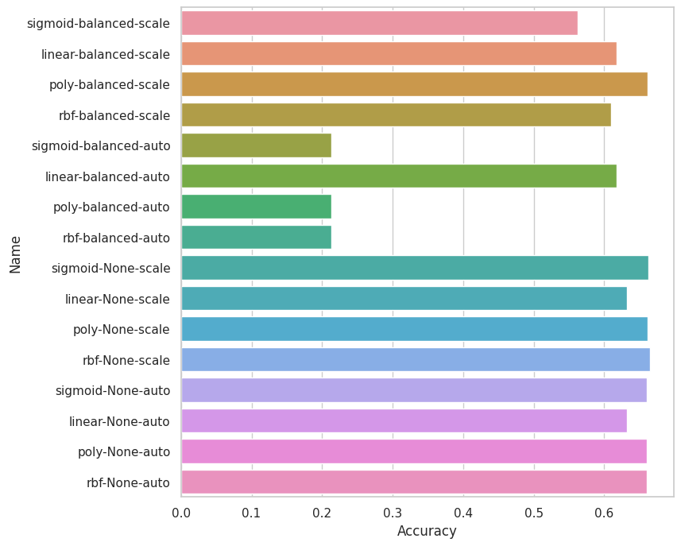  

-------------------------------------  

  
Using seed for random split 1  
SIZES:   
	train 0.7  
	test 0.15  
	validate 0.15  
  
Data shape
	Training rows:	5371  
	columns:	3  
  
Vectorizing description  
Vectorizing description  
Vectorizing description  
### Working on Stochastic Gradient Descent -- description [2021-11-18 22:38:35]  
Using columns:  ['sprint_count', 'points']  
Using Gridsearch to find optimal model, using -1 cores  
Grid search to find best params took 5871.0 seconds  
Fitted using gridsearch  
Best parameters found:
 {'alpha': 0.05, 'learning_rate': 'optimal', 'loss': 'squared_hinge', 'penalty': 'l2'} 
  
Start prediction  
Finished prediction in 0.15  

Accuracy train set = 		{}
Accuracy test set = 		{}
Accuracy validation set = 	{}
Average Accuracy = 		0.6730590206665426
  
Showing 6 best and 6 worst results  

  
|     |     mean |         std |      time |   alpha | learning_rate   | loss          | penalty    |
|----:|---------:|------------:|----------:|--------:|:----------------|:--------------|:-----------|
| 114 | 0.661143 | 0.00114223  |  15.0988  |   0.05  | optimal         | squared_hinge | l2         |
| 116 | 0.660957 | 8.92553e-05 |  27.4653  |   0.05  | optimal         | squared_hinge | elasticnet |
| 126 | 0.660771 | 0.000612856 |  37.3781  |   0.05  | invscaling      | hinge         | l2         |
|  85 | 0.660771 | 0.000173952 |  15.3387  |   0.05  | constant        | hinge         | l1         |
| 124 | 0.660771 | 0.000173952 |  13.8243  |   0.05  | optimal         | huber         | l1         |
| 123 | 0.660771 | 0.000173952 |   8.77721 |   0.05  | optimal         | huber         | l2         |
|  37 | 0.286342 | 0.0411764   | 382.997   |   1e-05 | optimal         | squared_loss  | l1         |
|  17 | 0.285245 | 0.135534    |  26.2782  |   1e-05 | constant        | squared_loss  | elasticnet |
| 102 | 0.255098 | 0.125152    |  10.2469  |   0.05  | constant        | huber         | l2         |
|  20 | 0.217278 | 0.0121403   |  26.7574  |   1e-05 | constant        | huber         | elasticnet |
| 139 | 0.184132 | 0.0409239   |  64.6623  |   0.05  | invscaling      | perceptron    | l1         |
|  99 | 0.174458 | 0.0330394   |  13.6067  |   0.05  | constant        | squared_loss  | l2         | 

  
Force ordering of graph due to size, limiting output to 30 best performers  
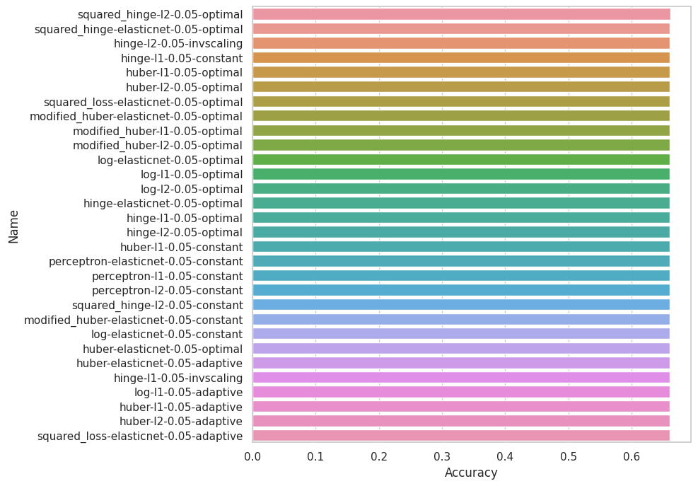  

-------------------------------------  

  
Using seed for random split 1  
SIZES:   
	train 0.7  
	test 0.15  
	validate 0.15  
  
Data shape
	Training rows:	5371  
	columns:	3  
  
Vectorizing description  
Vectorizing description  
Vectorizing description  
### Working on Multi-layer Perceptron -- description [2021-11-19 00:16:30]  
Using columns:  ['sprint_count', 'points']  
Using Gridsearch to find optimal model, using -1 cores  
Grid search to find best params took 11775.49 seconds  
Fitted using gridsearch  
Best parameters found:
 {'activation': 'relu', 'alpha': 0.05, 'learning_rate': 'adaptive', 'solver': 'sgd'} 
  
Start prediction  
Finished prediction in 0.43  

Accuracy train set = 		{}
Accuracy test set = 		{}
Accuracy validation set = 	{}
Average Accuracy = 		0.9428411841370322
  
Showing 6 best and 6 worst results  

  
|    |     mean |        std |     time | activation   |   alpha | learning_rate   | solver   |
|---:|---------:|-----------:|---------:|:-------------|--------:|:----------------|:---------|
| 21 | 0.662261 | 0.00371057 | 2884.86  | relu         |  0.05   | adaptive        | sgd      |
| 12 | 0.659654 | 0.00312982 | 4136.33  | relu         |  0.0001 | constant        | sgd      |
| 18 | 0.659096 | 0.00253027 | 3278.53  | relu         |  0.05   | constant        | sgd      |
|  9 | 0.658538 | 0.00613491 | 4101.56  | tanh         |  0.05   | adaptive        | sgd      |
| 15 | 0.657793 | 0.0035767  | 3792.96  | relu         |  0.0001 | adaptive        | sgd      |
|  3 | 0.657792 | 0.0034794  | 4159.16  | tanh         |  0.0001 | adaptive        | sgd      |
| 13 | 0.591323 | 0.0081532  |  669.845 | relu         |  0.0001 | constant        | adam     |
| 16 | 0.588901 | 0.00864794 |  718.203 | relu         |  0.0001 | adaptive        | adam     |
| 23 | 0.579595 | 0.0109826  |  915.902 | relu         |  0.05   | adaptive        | lbfgs    |
|  8 | 0.579221 | 0.0114925  |  923.584 | tanh         |  0.05   | constant        | lbfgs    |
| 20 | 0.57829  | 0.00660599 | 1427.8   | relu         |  0.05   | constant        | lbfgs    |
| 11 | 0.577361 | 0.00833253 |  953.594 | tanh         |  0.05   | adaptive        | lbfgs    | 

  
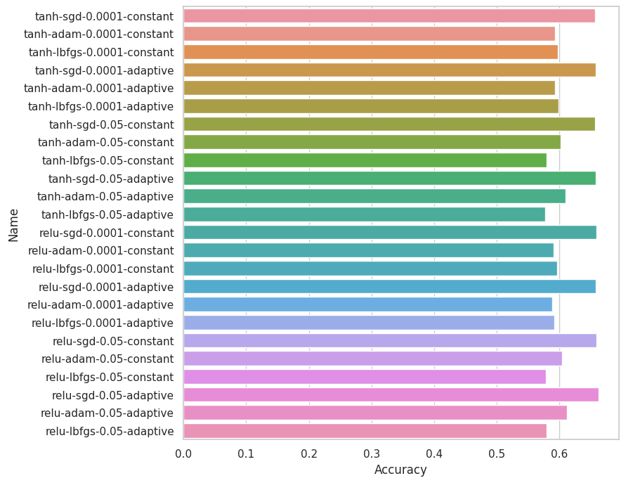  

-------------------------------------  

  
Finished comparing 2021-11-19 04:32:46+01:00  
Total seconds: 37519.648547410965:  
Exact: HH:10.00 	MM:25.00 	 ss:19.65  
Time: 10:25:20  

### model comparisons for description  

  
|    | name                                | variation   |   accuracy_overall |   accuracy_train |   accuracy_test |   accuracy_val |   fit_time | model_config                                                                     |   column_count |
|---:|:------------------------------------|:------------|-------------------:|-----------------:|----------------:|---------------:|-----------:|:---------------------------------------------------------------------------------|---------------:|
|  0 | k-Nearest Neighbour                 | description |           0.66059  |         1        |        0.652778 |       0.668403 |  22.4401   | KNeighborsClassifier(n_neighbors=16, weights='distance')                         |          18333 |
|  1 | Guassian Naive Bayes                | description |           0.44184  |         0.785515 |        0.424479 |       0.459201 |   1.58446  | GaussianNB()                                                                     |          18333 |
|  2 | Multinominal Naive Bayes            | description |           0.655816 |         0.789425 |        0.649306 |       0.662326 |   0.181372 | MultinomialNB()                                                                  |          18333 |
|  3 | Decision Tree                       | description |           0.655816 |         0.676038 |        0.651042 |       0.66059  |   1.29237  | DecisionTreeClassifier(criterion='entropy', max_depth=5, splitter='random')      |          18333 |
|  4 | Support Vector Machine (classifier) | description |           0.663194 |         0.797431 |        0.654514 |       0.671875 | 142.013    | SVC(probability=True)                                                            |          18333 |
|  5 | Stochastic Gradient Descent         | description |           0.653212 |         0.673059 |        0.649306 |       0.657118 |   0.161469 | SGDClassifier(alpha=0.05, eta0=100.0, loss='squared_hinge')                      |          18333 |
|  6 | Multi-layer Perceptron              | description |           0.634983 |         0.942841 |        0.624132 |       0.645833 |   0.291633 | MLPClassifier(alpha=0.05, learning_rate='adaptive', max_iter=1000, solver='sgd') |          18333 | 

  

  
|    | name                                | variation   |   accuracy_overall |   accuracy_train |   accuracy_test |   accuracy_val |   fit_time | model_config                                                                     |   column_count |
|---:|:------------------------------------|:------------|-------------------:|-----------------:|----------------:|---------------:|-----------:|:---------------------------------------------------------------------------------|---------------:|
|  4 | Support Vector Machine (classifier) | description |           0.663194 |         0.797431 |        0.654514 |       0.671875 | 142.013    | SVC(probability=True)                                                            |          18333 |
|  0 | k-Nearest Neighbour                 | description |           0.66059  |         1        |        0.652778 |       0.668403 |  22.4401   | KNeighborsClassifier(n_neighbors=16, weights='distance')                         |          18333 |
|  2 | Multinominal Naive Bayes            | description |           0.655816 |         0.789425 |        0.649306 |       0.662326 |   0.181372 | MultinomialNB()                                                                  |          18333 |
|  3 | Decision Tree                       | description |           0.655816 |         0.676038 |        0.651042 |       0.66059  |   1.29237  | DecisionTreeClassifier(criterion='entropy', max_depth=5, splitter='random')      |          18333 |
|  5 | Stochastic Gradient Descent         | description |           0.653212 |         0.673059 |        0.649306 |       0.657118 |   0.161469 | SGDClassifier(alpha=0.05, eta0=100.0, loss='squared_hinge')                      |          18333 |
|  6 | Multi-layer Perceptron              | description |           0.634983 |         0.942841 |        0.624132 |       0.645833 |   0.291633 | MLPClassifier(alpha=0.05, learning_rate='adaptive', max_iter=1000, solver='sgd') |          18333 |
|  1 | Guassian Naive Bayes                | description |           0.44184  |         0.785515 |        0.424479 |       0.459201 |   1.58446  | GaussianNB()                                                                     |          18333 | 

  
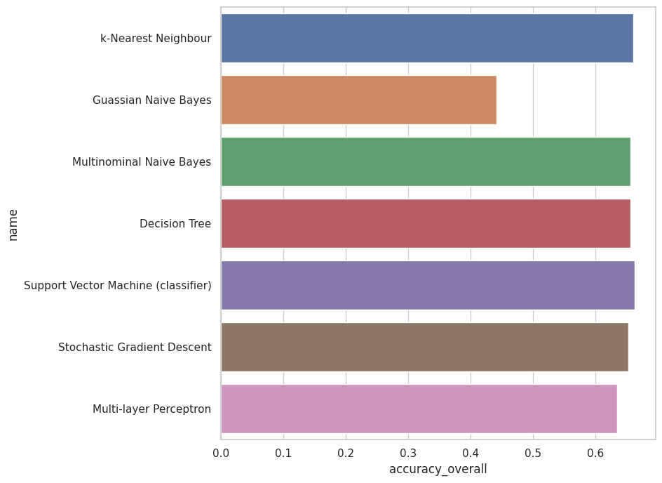  

  

 |    | Name                                |   Accuracy |       Time |   Optimization_time |
|---:|:------------------------------------|-----------:|-----------:|--------------------:|
|  0 | k-Nearest Neighbour                 |   0.66059  |  22.4401   |         4965.24     |
|  1 | Guassian Naive Bayes                |   0.44184  |   1.58446  |            4.02274  |
|  2 | Multinominal Naive Bayes            |   0.655816 |   0.181372 |            0.362103 |
|  3 | Decision Tree                       |   0.655816 |   1.29237  |          120.415    |
|  4 | Support Vector Machine (classifier) |   0.663194 | 142.013    |        14742.7      |
|  5 | Stochastic Gradient Descent         |   0.653212 |   0.161469 |         5871.78     |
|  6 | Multi-layer Perceptron              |   0.634983 |   0.291633 |        11776.4      | 

  
Best in set was Support Vector Machine (classifier) with an accuracy 0.6631944444444444  

==  description == 
================================  

  
Validating feature set summary_and_desc  
Standardizing text columns:  {'summary', 'description'}  
## summary_and_desc  
Start comparing 2021-11-19 04:32:48+01:00  
Using non cached frame with columns:  Index(['Unnamed: 0', 'assignee', 'component_names', 'components_descriptions',
       'created', 'description', 'harm', 'id', 'labels',
       'last_sprint_activatedDate', 'last_sprint_autoStartStop',
       'last_sprint_completeDate', 'last_sprint_endDate', 'last_sprint_goal',
       'last_sprint_id', 'last_sprint_name', 'last_sprint_rapidViewId',
       'last_sprint_sequence', 'last_sprint_startDate', 'last_sprint_state',
       'link', 'points', 'probability', 'probability_final', 'project',
       'requirement_prio', 'resolution', 'resolutiondate', 'risk_impact',
       'risk_likelyhood', 'severity', 'sprint_count', 'status', 'status_key',
       'summary', 'type', 'updated', 'urgent', 'component_count',
       'labels_count', 'summary_raw', 'summary_stopword_count',
       'description_raw', 'description_stopword_count'],
      dtype='object')  
No preprocess fields found returning df summary_and_desc  
Extracted columns from non cached frame:  Index(['Unnamed: 0', 'assignee', 'component_names', 'components_descriptions',
       'created', 'description', 'harm', 'id', 'labels',
       'last_sprint_activatedDate', 'last_sprint_autoStartStop',
       'last_sprint_completeDate', 'last_sprint_endDate', 'last_sprint_goal',
       'last_sprint_id', 'last_sprint_name', 'last_sprint_rapidViewId',
       'last_sprint_sequence', 'last_sprint_startDate', 'last_sprint_state',
       'link', 'points', 'probability', 'probability_final', 'project',
       'requirement_prio', 'resolution', 'resolutiondate', 'risk_impact',
       'risk_likelyhood', 'severity', 'sprint_count', 'status', 'status_key',
       'summary', 'type', 'updated', 'urgent', 'component_count',
       'labels_count', 'summary_raw', 'summary_stopword_count',
       'description_raw', 'description_stopword_count'],
      dtype='object')  
Using seed for random split 1  
SIZES:   
	train 0.7  
	test 0.15  
	validate 0.15  
  
Data shape
	Training rows:	5371  
	columns:	4  
  
Vectorizing summary  
Vectorizing description  
Vectorizing summary  
Vectorizing description  
Vectorizing summary  
Vectorizing description  
### Working on k-Nearest Neighbour -- summary_and_desc [2021-11-19 03:33:09]  
Using columns:  ['sprint_count', 'points']  
Using Gridsearch to find optimal model, using -1 cores  
Grid search to find best params took 6257.97 seconds  
Fitted using gridsearch  
Best parameters found:
 {'algorithm': 'auto', 'n_neighbors': 15, 'weights': 'distance'} 
  
Start prediction  
Finished prediction in 9.36  

Accuracy train set = 		{}
Accuracy test set = 		{}
Accuracy validation set = 	{}
Average Accuracy = 		1.0
  
Showing 6 best and 6 worst results  

  
|     |     mean |        std |     time | algorithm   |   n_neighbors | weights   |
|----:|---------:|-----------:|---------:|:------------|--------------:|:----------|
|  69 | 0.666543 | 0.00190037 | 17.9066  | ball_tree   |            15 | distance  |
| 149 | 0.666543 | 0.00190037 |  4.16747 | brute       |            15 | distance  |
|  29 | 0.666543 | 0.00190037 |  7.17585 | auto        |            15 | distance  |
| 109 | 0.666543 | 0.00190037 | 18.3336  | kd_tree     |            15 | distance  |
| 147 | 0.666357 | 0.00181327 |  4.30839 | brute       |            14 | distance  |
|  27 | 0.666357 | 0.00181327 |  6.57534 | auto        |            14 | distance  |
|   1 | 0.572346 | 0.0503001  |  7.56752 | auto        |             1 | distance  |
|  43 | 0.572346 | 0.0503001  | 18.2388  | ball_tree   |             2 | distance  |
|  41 | 0.572346 | 0.0503001  | 17.5801  | ball_tree   |             1 | distance  |
|  40 | 0.572346 | 0.0503001  | 17.5181  | ball_tree   |             1 | uniform   |
|   3 | 0.572346 | 0.0503001  |  7.45999 | auto        |             2 | distance  |
|  80 | 0.572346 | 0.0503001  | 21.0787  | kd_tree     |             1 | uniform   | 

  
Force ordering of graph due to size, limiting output to 30 best performers  
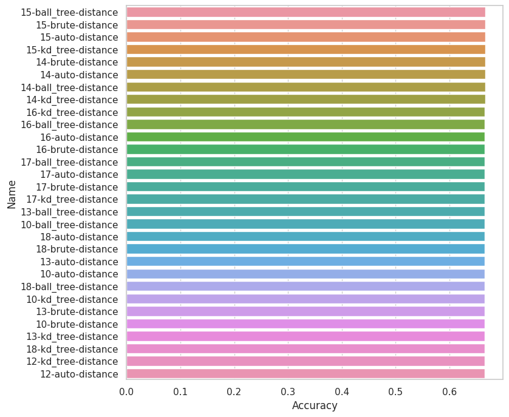  

-------------------------------------  

  
Using seed for random split 1  
SIZES:   
	train 0.7  
	test 0.15  
	validate 0.15  
  
Data shape
	Training rows:	5371  
	columns:	4  
  
Vectorizing summary  
Vectorizing description  
Vectorizing summary  
Vectorizing description  
Vectorizing summary  
Vectorizing description  
### Working on Guassian Naive Bayes -- summary_and_desc [2021-11-19 05:17:41]  
Using columns:  ['sprint_count', 'points']  
NB does not have hyperparams to tune  
Start training.  
Fit model in 1.99 seconds  
Start prediction  
Finished prediction in 3.03  

Accuracy train set = 		{}
Accuracy test set = 		{}
Accuracy validation set = 	{}
Average Accuracy = 		0.8998324334388382
  

-------------------------------------  

  
Using seed for random split 1  
SIZES:   
	train 0.7  
	test 0.15  
	validate 0.15  
  
Data shape
	Training rows:	5371  
	columns:	4  
  
Vectorizing summary  
Vectorizing description  
Vectorizing summary  
Vectorizing description  
Vectorizing summary  
Vectorizing description  
### Working on Multinominal Naive Bayes -- summary_and_desc [2021-11-19 05:17:51]  
Using columns:  ['sprint_count', 'points']  
NB does not have hyperparams to tune  
Start training.  
Fit model in 0.21 seconds  
Start prediction  
Finished prediction in 0.21  

Accuracy train set = 		{}
Accuracy test set = 		{}
Accuracy validation set = 	{}
Average Accuracy = 		0.8288959225470117
  

-------------------------------------  

  
Using seed for random split 1  
SIZES:   
	train 0.7  
	test 0.15  
	validate 0.15  
  
Data shape
	Training rows:	5371  
	columns:	4  
  
Vectorizing summary  
Vectorizing description  
Vectorizing summary  
Vectorizing description  
Vectorizing summary  
Vectorizing description  
### Working on Decision Tree -- summary_and_desc [2021-11-19 05:17:56]  
Using columns:  ['sprint_count', 'points']  
Optimized config with:  
Depth               Log
Depth Count           9
Criterion       entropy
Splitter         random
Accuracy       0.679253
Name: 22, dtype: object  

  
|    | Depth   |   Depth Count | Criterion   | Splitter   |   Accuracy |
|---:|:--------|--------------:|:------------|:-----------|-----------:|
| 22 | Log     |             9 | entropy     | random     |   0.679253 |
| 15 | Log     |             9 | entropy     | best       |   0.677083 |
| 20 | 5       |             5 | entropy     | best       |   0.675781 |
|  6 | 5       |             5 | gini        | best       |   0.672743 |
|  8 | Log     |             9 | gini        | random     |   0.667535 |
|  1 | Log     |             9 | gini        | best       |   0.664931 |
| 13 | 5       |             5 | gini        | random     |   0.65842  |
| 27 | 5       |             5 | entropy     | random     |   0.65625  |
| 18 | 50%     |          2686 | entropy     | best       |   0.641927 |
| 21 | All     |               | entropy     | random     |   0.641059 |
|  9 | Sqrt    |            73 | gini        | random     |   0.638021 |
| 16 | Sqrt    |            73 | entropy     | best       |   0.637587 |
|  2 | Sqrt    |            73 | gini        | best       |   0.635851 |
| 23 | Sqrt    |            73 | entropy     | random     |   0.635417 |
| 19 | 25%     |          1343 | entropy     | best       |   0.633681 |
| 25 | 50%     |          2686 | entropy     | random     |   0.632812 |
| 17 | 75%     |          4028 | entropy     | best       |   0.630208 |
| 12 | 25%     |          1343 | gini        | random     |   0.627604 |
|  0 | All     |               | gini        | best       |   0.626736 |
| 11 | 50%     |          2686 | gini        | random     |   0.626302 |
| 26 | 25%     |          1343 | entropy     | random     |   0.625    |
|  5 | 25%     |          1343 | gini        | best       |   0.624566 |
| 24 | 75%     |          4028 | entropy     | random     |   0.620226 |
|  7 | All     |               | gini        | random     |   0.619792 |
|  3 | 75%     |          4028 | gini        | best       |   0.61849  |
| 14 | All     |               | entropy     | best       |   0.617622 |
| 10 | 75%     |          4028 | gini        | random     |   0.616319 |
|  4 | 50%     |          2686 | gini        | best       |   0.615885 | 

  
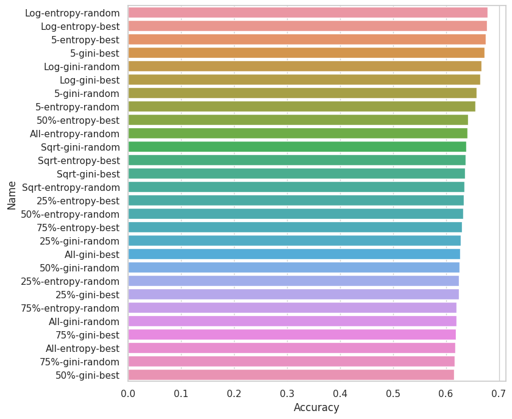  

-------------------------------------  

  
Using seed for random split 1  
SIZES:   
	train 0.7  
	test 0.15  
	validate 0.15  
  
Data shape
	Training rows:	5371  
	columns:	4  
  
Vectorizing summary  
Vectorizing description  
Vectorizing summary  
Vectorizing description  
Vectorizing summary  
Vectorizing description  
### Working on Support Vector Machine (classifier) -- summary_and_desc [2021-11-19 05:20:29]  
Using columns:  ['sprint_count', 'points']  
Using Gridsearch to find optimal model, using -1 cores  
Grid search to find best params took 15928.34 seconds  
Fitted using gridsearch  
Best parameters found:
 {'class_weight': None, 'gamma': 'scale', 'kernel': 'rbf'} 
  
Start prediction  
Finished prediction in 1851.89  

Accuracy train set = 		{}
Accuracy test set = 		{}
Accuracy validation set = 	{}
Average Accuracy = 		0.8326196239061627
  
Showing 6 best and 6 worst results  

  
|    |     mean |         std |    time | class_weight   | gamma   | kernel   |
|---:|---------:|------------:|--------:|:---------------|:--------|:---------|
| 11 | 0.665984 | 0.000464541 | 3913.7  |                | scale   | rbf      |
|  2 | 0.665239 | 0.00110002  | 4242.6  | balanced       | scale   | poly     |
|  8 | 0.665053 | 0.00453675  | 2765.25 |                | scale   | sigmoid  |
| 10 | 0.662447 | 0.000613265 | 4062.63 |                | scale   | poly     |
| 12 | 0.660771 | 0.000173952 | 2052.52 |                | auto    | sigmoid  |
| 14 | 0.660771 | 0.000173952 | 1858.8  |                | auto    | poly     |
|  1 | 0.609201 | 0.0235188   | 3733.99 | balanced       | scale   | linear   |
|  5 | 0.609201 | 0.0235188   | 3721.8  | balanced       | auto    | linear   |
|  0 | 0.574014 | 0.0299219   | 3800.98 | balanced       | scale   | sigmoid  |
|  4 | 0.212996 | 0.000207184 | 4327.52 | balanced       | auto    | sigmoid  |
|  6 | 0.212996 | 0.000207184 | 4282.09 | balanced       | auto    | poly     |
|  7 | 0.212996 | 0.000207184 | 4756.12 | balanced       | auto    | rbf      | 

  
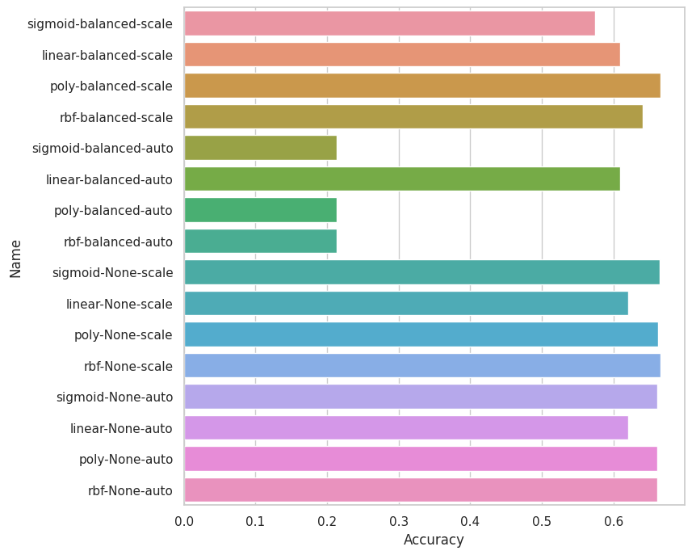  

-------------------------------------  

  
Using seed for random split 1  
SIZES:   
	train 0.7  
	test 0.15  
	validate 0.15  
  
Data shape
	Training rows:	5371  
	columns:	4  
  
Vectorizing summary  
Vectorizing description  
Vectorizing summary  
Vectorizing description  
Vectorizing summary  
Vectorizing description  
### Working on Stochastic Gradient Descent -- summary_and_desc [2021-11-19 10:16:55]  
Using columns:  ['sprint_count', 'points']  
Using Gridsearch to find optimal model, using -1 cores  
Grid search to find best params took 8208.41 seconds  
Fitted using gridsearch  
Best parameters found:
 {'alpha': 0.05, 'learning_rate': 'adaptive', 'loss': 'modified_huber', 'penalty': 'l2'} 
  
Start prediction  
Finished prediction in 0.2  

Accuracy train set = 		{}
Accuracy test set = 		{}
Accuracy validation set = 	{}
Average Accuracy = 		0.6758517966859058
  
Showing 6 best and 6 worst results  

  
|     |     mean |         std |      time |   alpha | learning_rate   | loss           | penalty    |
|----:|---------:|------------:|----------:|--------:|:----------------|:---------------|:-----------|
| 153 | 0.661888 | 0.00122028  |  124.608  |   0.05  | adaptive        | modified_huber | l2         |
| 156 | 0.661888 | 0.00122028  |  110.193  |   0.05  | adaptive        | squared_hinge  | l2         |
| 111 | 0.661515 | 0.00129402  |   21.083  |   0.05  | optimal         | modified_huber | l2         |
|  82 | 0.660771 | 0.00288804  |  320.926  |   1e-05 | adaptive        | huber          | l1         |
| 167 | 0.660771 | 0.000173952 |  150.934  |   0.05  | adaptive        | huber          | elasticnet |
|  98 | 0.660771 | 0.000173952 |   23.3434 |   0.05  | constant        | perceptron     | elasticnet |
| 142 | 0.297332 | 0.0227351   |  177.841  |   0.05  | invscaling      | squared_loss   | l1         |
|  80 | 0.295658 | 0.0317976   | 4949.66   |   1e-05 | adaptive        | squared_loss   | elasticnet |
|  19 | 0.281538 | 0.193229    |  126.792  |   1e-05 | constant        | huber          | l1         |
|  59 | 0.25991  | 0.0209461   |  329.035  |   1e-05 | invscaling      | squared_loss   | elasticnet |
|  18 | 0.214671 | 0.04867     |   11.2748 |   1e-05 | constant        | huber          | l2         |
|  99 | 0.189536 | 0.00320012  |   15.9278 |   0.05  | constant        | squared_loss   | l2         | 

  
Force ordering of graph due to size, limiting output to 30 best performers  
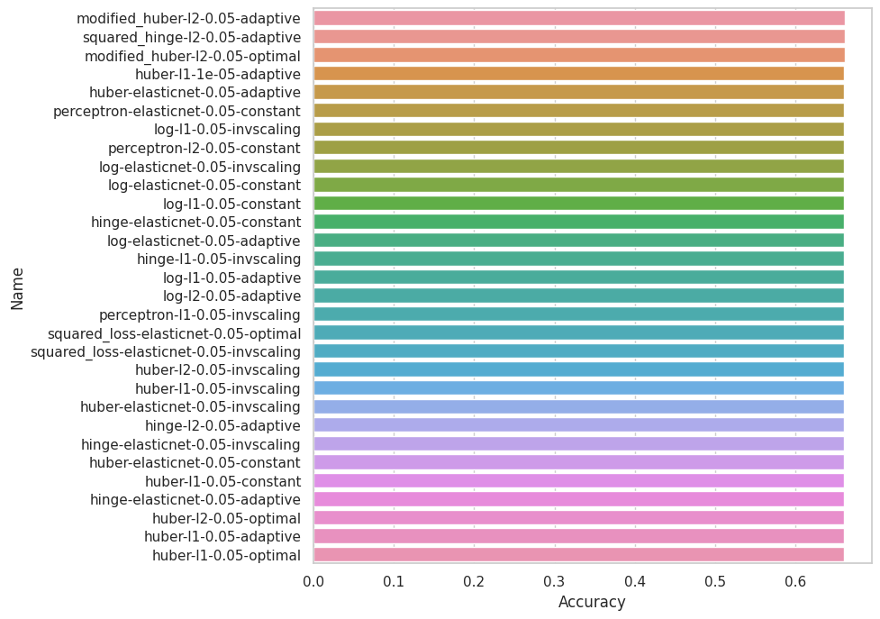  

-------------------------------------  

  
Using seed for random split 1  
SIZES:   
	train 0.7  
	test 0.15  
	validate 0.15  
  
Data shape
	Training rows:	5371  
	columns:	4  
  
Vectorizing summary  
Vectorizing description  
Vectorizing summary  
Vectorizing description  
Vectorizing summary  
Vectorizing description  
### Working on Multi-layer Perceptron -- summary_and_desc [2021-11-19 12:33:49]  
Using columns:  ['sprint_count', 'points']  
Using Gridsearch to find optimal model, using -1 cores  
Grid search to find best params took 13399.09 seconds  
Fitted using gridsearch  
Best parameters found:
 {'activation': 'relu', 'alpha': 0.0001, 'learning_rate': 'constant', 'solver': 'sgd'} 
  
Start prediction  
Finished prediction in 0.54  

Accuracy train set = 		{}
Accuracy test set = 		{}
Accuracy validation set = 	{}
Average Accuracy = 		0.9919940420778254
  
Showing 6 best and 6 worst results  

  
|    |     mean |        std |     time | activation   |   alpha | learning_rate   | solver   |
|---:|---------:|-----------:|---------:|:-------------|--------:|:----------------|:---------|
| 12 | 0.654629 | 0.0107496  | 5291.31  | relu         |  0.0001 | constant        | sgd      |
|  6 | 0.653512 | 0.0101316  | 5239.44  | tanh         |  0.05   | constant        | sgd      |
| 21 | 0.653139 | 0.00984761 | 3467.98  | relu         |  0.05   | adaptive        | sgd      |
| 18 | 0.652953 | 0.00834634 | 3789.42  | relu         |  0.05   | constant        | sgd      |
| 15 | 0.652581 | 0.0115778  | 3959.19  | relu         |  0.0001 | adaptive        | sgd      |
|  3 | 0.65109  | 0.0088977  | 5272.17  | tanh         |  0.0001 | adaptive        | sgd      |
|  4 | 0.609013 | 0.00814781 |  545.304 | tanh         |  0.0001 | adaptive        | adam     |
| 16 | 0.608455 | 0.00934165 |  539.306 | relu         |  0.0001 | adaptive        | adam     |
|  8 | 0.582015 | 0.0161631  |  427.176 | tanh         |  0.05   | constant        | lbfgs    |
| 11 | 0.577548 | 0.0248861  |  481.672 | tanh         |  0.05   | adaptive        | lbfgs    |
| 23 | 0.560607 | 0.0323931  |  698.175 | relu         |  0.05   | adaptive        | lbfgs    |
| 20 | 0.557073 | 0.0383074  |  659.646 | relu         |  0.05   | constant        | lbfgs    | 

  
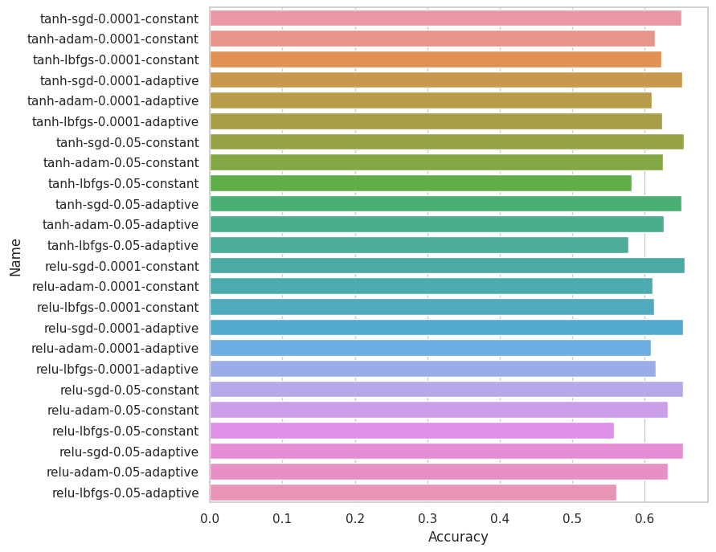  

-------------------------------------  

  
Finished comparing 2021-11-19 17:17:09+01:00  
Total seconds: 45860.73554611206:  
Exact: HH:12.00 	MM:44.00 	 ss:20.74  
Time: 12:44:21  

### model comparisons for summary_and_desc  

  
|    | name                                | variation        |   accuracy_overall |   accuracy_train |   accuracy_test |   accuracy_val |   fit_time | model_config                                                                |   column_count |
|---:|:------------------------------------|:-----------------|-------------------:|-----------------:|----------------:|---------------:|-----------:|:----------------------------------------------------------------------------|---------------:|
|  0 | k-Nearest Neighbour                 | summary_and_desc |           0.657986 |         1        |        0.652778 |       0.663194 |  27.7885   | KNeighborsClassifier(n_neighbors=15, weights='distance')                    |          22851 |
|  1 | Guassian Naive Bayes                | summary_and_desc |           0.527778 |         0.899832 |        0.496528 |       0.559028 |   1.98891  | GaussianNB()                                                                |          22851 |
|  2 | Multinominal Naive Bayes            | summary_and_desc |           0.660156 |         0.828896 |        0.652778 |       0.667535 |   0.212237 | MultinomialNB()                                                             |          22851 |
|  3 | Decision Tree                       | summary_and_desc |           0.65625  |         0.674362 |        0.645833 |       0.666667 |   1.68039  | DecisionTreeClassifier(criterion='entropy', max_depth=5, splitter='random') |          22851 |
|  4 | Support Vector Machine (classifier) | summary_and_desc |           0.667535 |         0.83262  |        0.657986 |       0.677083 | 175.474    | SVC(probability=True)                                                       |          22851 |
|  5 | Stochastic Gradient Descent         | summary_and_desc |           0.653212 |         0.675852 |        0.650174 |       0.65625  |   0.175207 | SGDClassifier(alpha=0.05, eta0=100.0, learning_rate='adaptive',             |          22851 |
|    |                                     |                  |                    |                  |                 |                |            |               loss='modified_huber')                                        |                |
|  6 | Multi-layer Perceptron              | summary_and_desc |           0.631944 |         0.991994 |        0.618924 |       0.644965 |   0.803726 | MLPClassifier(max_iter=1000, solver='sgd')                                  |          22851 | 

  

  
|    | name                                | variation        |   accuracy_overall |   accuracy_train |   accuracy_test |   accuracy_val |   fit_time | model_config                                                                |   column_count |
|---:|:------------------------------------|:-----------------|-------------------:|-----------------:|----------------:|---------------:|-----------:|:----------------------------------------------------------------------------|---------------:|
|  4 | Support Vector Machine (classifier) | summary_and_desc |           0.667535 |         0.83262  |        0.657986 |       0.677083 | 175.474    | SVC(probability=True)                                                       |          22851 |
|  2 | Multinominal Naive Bayes            | summary_and_desc |           0.660156 |         0.828896 |        0.652778 |       0.667535 |   0.212237 | MultinomialNB()                                                             |          22851 |
|  0 | k-Nearest Neighbour                 | summary_and_desc |           0.657986 |         1        |        0.652778 |       0.663194 |  27.7885   | KNeighborsClassifier(n_neighbors=15, weights='distance')                    |          22851 |
|  3 | Decision Tree                       | summary_and_desc |           0.65625  |         0.674362 |        0.645833 |       0.666667 |   1.68039  | DecisionTreeClassifier(criterion='entropy', max_depth=5, splitter='random') |          22851 |
|  5 | Stochastic Gradient Descent         | summary_and_desc |           0.653212 |         0.675852 |        0.650174 |       0.65625  |   0.175207 | SGDClassifier(alpha=0.05, eta0=100.0, learning_rate='adaptive',             |          22851 |
|    |                                     |                  |                    |                  |                 |                |            |               loss='modified_huber')                                        |                |
|  6 | Multi-layer Perceptron              | summary_and_desc |           0.631944 |         0.991994 |        0.618924 |       0.644965 |   0.803726 | MLPClassifier(max_iter=1000, solver='sgd')                                  |          22851 |
|  1 | Guassian Naive Bayes                | summary_and_desc |           0.527778 |         0.899832 |        0.496528 |       0.559028 |   1.98891  | GaussianNB()                                                                |          22851 | 

  
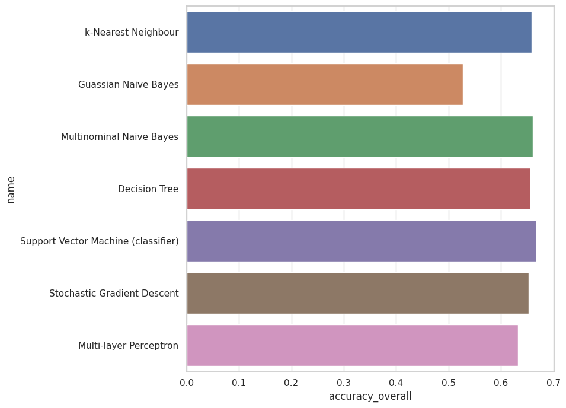  

  

 |    | Name                                |   Accuracy |       Time |   Optimization_time |
|---:|:------------------------------------|-----------:|-----------:|--------------------:|
|  0 | k-Nearest Neighbour                 |   0.657986 |  27.7885   |         6267.77     |
|  1 | Guassian Naive Bayes                |   0.527778 |   1.98891  |            5.02857  |
|  2 | Multinominal Naive Bayes            |   0.660156 |   0.212237 |            0.437772 |
|  3 | Decision Tree                       |   0.65625  |   1.68039  |          148.301    |
|  4 | Support Vector Machine (classifier) |   0.667535 | 175.474    |        17780.6      |
|  5 | Stochastic Gradient Descent         |   0.653212 |   0.175207 |         8209.15     |
|  6 | Multi-layer Perceptron              |   0.631944 |   0.803726 |        13400.1      | 

  
Best in set was Support Vector Machine (classifier) with an accuracy 0.6675347222222223  

==  summary_and_desc == 
================================  

  
# Configs  
[  
[('no_linked', 0.6681957186544343, 'k-Nearest Neighbour', KNeighborsClassifier(n_neighbors=20, weights='distance'))] ,  
[('summary', 0.6681957186544343, 'k-Nearest Neighbour', KNeighborsClassifier(n_neighbors=20, weights='distance'))] ,  
[('description', 0.6631944444444444, 'Support Vector Machine (classifier)', SVC(probability=True))] ,  
[('summary_and_desc', 0.6675347222222223, 'Support Vector Machine (classifier)', SVC(probability=True))] ,  
]  
# RESULTS:  
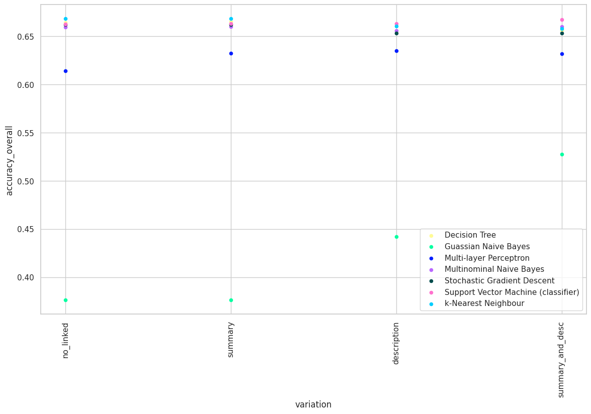  
## all  

  
|    | name                                | variation        |   accuracy_overall |   accuracy_train |   accuracy_test |   accuracy_val |    fit_time | model_config                                                                     |   column_count |
|---:|:------------------------------------|:-----------------|-------------------:|-----------------:|----------------:|---------------:|------------:|:---------------------------------------------------------------------------------|---------------:|
|  0 | k-Nearest Neighbour                 | no_linked        |           0.668196 |         1        |        0.655963 |       0.680428 |   6.83864   | KNeighborsClassifier(n_neighbors=20, weights='distance')                         |           4698 |
|  7 | k-Nearest Neighbour                 | summary          |           0.668196 |         1        |        0.655963 |       0.680428 |   5.39164   | KNeighborsClassifier(n_neighbors=20, weights='distance')                         |           4700 |
| 25 | Support Vector Machine (classifier) | summary_and_desc |           0.667535 |         0.83262  |        0.657986 |       0.677083 | 175.474     | SVC(probability=True)                                                            |          22851 |
| 10 | Decision Tree                       | summary          |           0.665138 |         0.671094 |        0.659786 |       0.670489 |   0.395463  | DecisionTreeClassifier(criterion='entropy', max_depth=5, splitter='random')      |           4700 |
|  3 | Decision Tree                       | no_linked        |           0.663991 |         0.667978 |        0.655199 |       0.672783 |   0.409913  | DecisionTreeClassifier(criterion='entropy', max_depth=5, splitter='random')      |           4698 |
| 11 | Support Vector Machine (classifier) | summary          |           0.663226 |         0.954747 |        0.66208  |       0.664373 |  70.489     | SVC(class_weight='balanced', kernel='poly', probability=True)                    |           4700 |
| 18 | Support Vector Machine (classifier) | description      |           0.663194 |         0.797431 |        0.654514 |       0.671875 | 142.013     | SVC(probability=True)                                                            |          18333 |
|  4 | Support Vector Machine (classifier) | no_linked        |           0.662844 |         0.954419 |        0.661315 |       0.664373 |  73.1221    | SVC(class_weight='balanced', kernel='poly', probability=True)                    |           4698 |
|  5 | Stochastic Gradient Descent         | no_linked        |           0.66208  |         0.6606   |        0.652141 |       0.672018 |   0.04201   | SGDClassifier(alpha=0.05, eta0=100.0, learning_rate='adaptive',                  |           4698 |
|    |                                     |                  |                    |                  |                 |                |             |               loss='modified_huber')                                             |                |
| 12 | Stochastic Gradient Descent         | summary          |           0.66208  |         0.660436 |        0.652141 |       0.672018 |   0.0424663 | SGDClassifier(alpha=0.05, eta0=100.0, loss='squared_hinge')                      |           4700 |
| 14 | k-Nearest Neighbour                 | description      |           0.66059  |         1        |        0.652778 |       0.668403 |  22.4401    | KNeighborsClassifier(n_neighbors=16, weights='distance')                         |          18333 |
|  9 | Multinominal Naive Bayes            | summary          |           0.660168 |         0.790785 |        0.655963 |       0.664373 |   0.062757  | MultinomialNB()                                                                  |           4700 |
| 23 | Multinominal Naive Bayes            | summary_and_desc |           0.660156 |         0.828896 |        0.652778 |       0.667535 |   0.212237  | MultinomialNB()                                                                  |          22851 |
|  2 | Multinominal Naive Bayes            | no_linked        |           0.659786 |         0.791605 |        0.655199 |       0.664373 |   0.0598912 | MultinomialNB()                                                                  |           4698 |
| 21 | k-Nearest Neighbour                 | summary_and_desc |           0.657986 |         1        |        0.652778 |       0.663194 |  27.7885    | KNeighborsClassifier(n_neighbors=15, weights='distance')                         |          22851 |
| 24 | Decision Tree                       | summary_and_desc |           0.65625  |         0.674362 |        0.645833 |       0.666667 |   1.68039   | DecisionTreeClassifier(criterion='entropy', max_depth=5, splitter='random')      |          22851 |
| 16 | Multinominal Naive Bayes            | description      |           0.655816 |         0.789425 |        0.649306 |       0.662326 |   0.181372  | MultinomialNB()                                                                  |          18333 |
| 17 | Decision Tree                       | description      |           0.655816 |         0.676038 |        0.651042 |       0.66059  |   1.29237   | DecisionTreeClassifier(criterion='entropy', max_depth=5, splitter='random')      |          18333 |
| 26 | Stochastic Gradient Descent         | summary_and_desc |           0.653212 |         0.675852 |        0.650174 |       0.65625  |   0.175207  | SGDClassifier(alpha=0.05, eta0=100.0, learning_rate='adaptive',                  |          22851 |
|    |                                     |                  |                    |                  |                 |                |             |               loss='modified_huber')                                             |                |
| 19 | Stochastic Gradient Descent         | description      |           0.653212 |         0.673059 |        0.649306 |       0.657118 |   0.161469  | SGDClassifier(alpha=0.05, eta0=100.0, loss='squared_hinge')                      |          18333 |
| 20 | Multi-layer Perceptron              | description      |           0.634983 |         0.942841 |        0.624132 |       0.645833 |   0.291633  | MLPClassifier(alpha=0.05, learning_rate='adaptive', max_iter=1000, solver='sgd') |          18333 |
| 13 | Multi-layer Perceptron              | summary          |           0.632645 |         0.894245 |        0.63685  |       0.62844  |   0.21738   | MLPClassifier(max_iter=1000, solver='sgd')                                       |           4700 |
| 27 | Multi-layer Perceptron              | summary_and_desc |           0.631944 |         0.991994 |        0.618924 |       0.644965 |   0.803726  | MLPClassifier(max_iter=1000, solver='sgd')                                       |          22851 |
|  6 | Multi-layer Perceptron              | no_linked        |           0.613914 |         0.882276 |        0.607798 |       0.620031 |   0.116672  | MLPClassifier(alpha=0.05, max_iter=1000, solver='sgd')                           |           4698 |
| 22 | Guassian Naive Bayes                | summary_and_desc |           0.527778 |         0.899832 |        0.496528 |       0.559028 |   1.98891   | GaussianNB()                                                                     |          22851 |
| 15 | Guassian Naive Bayes                | description      |           0.44184  |         0.785515 |        0.424479 |       0.459201 |   1.58446   | GaussianNB()                                                                     |          18333 |
|  8 | Guassian Naive Bayes                | summary          |           0.376147 |         0.680767 |        0.40367  |       0.348624 |   0.44196   | GaussianNB()                                                                     |           4700 |
|  1 | Guassian Naive Bayes                | no_linked        |           0.376147 |         0.680767 |        0.40367  |       0.348624 |   0.443307  | GaussianNB()                                                                     |           4698 | 

  
Image for accuracy over variation  
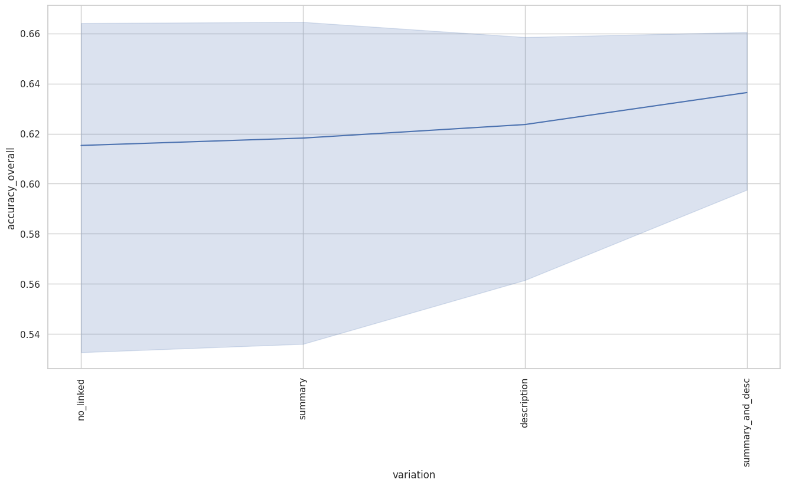  
Accuracy over time  
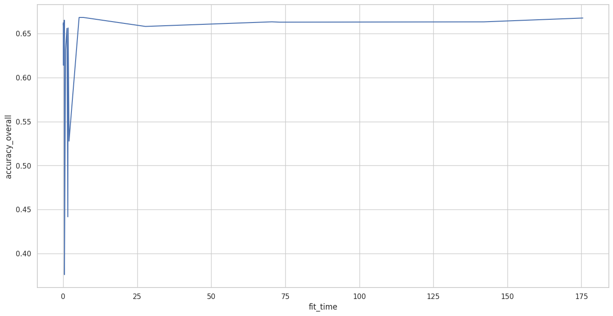  
Acc over colcount for feature variation   
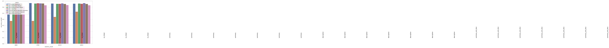  
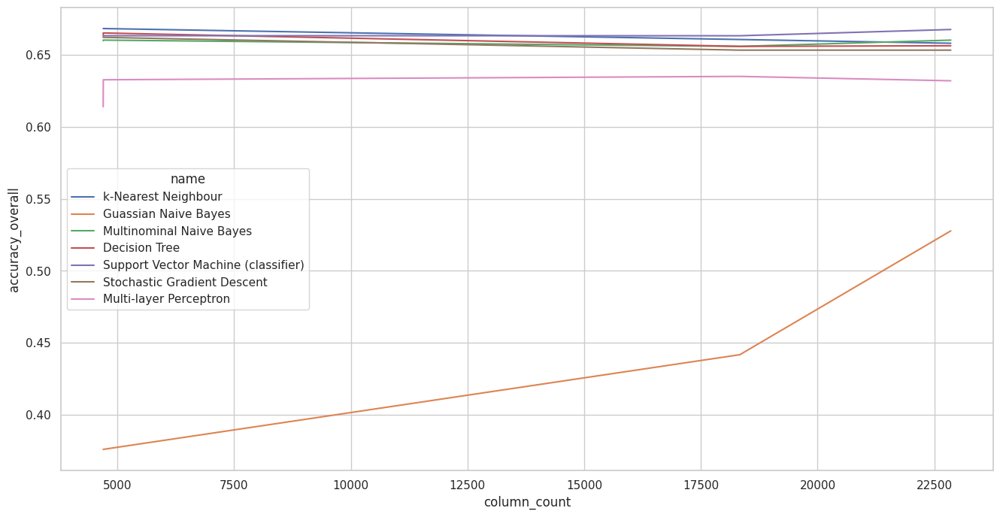  
Could not create heatmap Index contains duplicate entries, cannot reshape  
## best  

  
|    | name                                | variation        |   accuracy_overall |   accuracy_train |   accuracy_test |   accuracy_val |   fit_time | model_config                                             |   column_count |
|---:|:------------------------------------|:-----------------|-------------------:|-----------------:|----------------:|---------------:|-----------:|:---------------------------------------------------------|---------------:|
|  0 | k-Nearest Neighbour                 | no_linked        |           0.668196 |         1        |        0.655963 |       0.680428 |    6.83864 | KNeighborsClassifier(n_neighbors=20, weights='distance') |           4698 |
|  1 | k-Nearest Neighbour                 | summary          |           0.668196 |         1        |        0.655963 |       0.680428 |    5.39164 | KNeighborsClassifier(n_neighbors=20, weights='distance') |           4700 |
|  3 | Support Vector Machine (classifier) | summary_and_desc |           0.667535 |         0.83262  |        0.657986 |       0.677083 |  175.474   | SVC(probability=True)                                    |          22851 |
|  2 | Support Vector Machine (classifier) | description      |           0.663194 |         0.797431 |        0.654514 |       0.671875 |  142.013   | SVC(probability=True)                                    |          18333 | 

  
## best_no_dt  

  
|    | variation        | name                                |   accuracy_overall |   accuracy_train |   accuracy_test |   accuracy_val |   fit_time | model_config                                             |   column_count |
|---:|:-----------------|:------------------------------------|-------------------:|-----------------:|----------------:|---------------:|-----------:|:---------------------------------------------------------|---------------:|
|  1 | no_linked        | k-Nearest Neighbour                 |           0.668196 |         1        |        0.655963 |       0.680428 |    6.83864 | KNeighborsClassifier(n_neighbors=20, weights='distance') |           4698 |
|  2 | summary          | k-Nearest Neighbour                 |           0.668196 |         1        |        0.655963 |       0.680428 |    5.39164 | KNeighborsClassifier(n_neighbors=20, weights='distance') |           4700 |
|  3 | summary_and_desc | Support Vector Machine (classifier) |           0.667535 |         0.83262  |        0.657986 |       0.677083 |  175.474   | SVC(probability=True)                                    |          22851 |
|  0 | description      | Support Vector Machine (classifier) |           0.663194 |         0.797431 |        0.654514 |       0.671875 |  142.013   | SVC(probability=True)                                    |          18333 | 

  
Image for accuracy over variation  
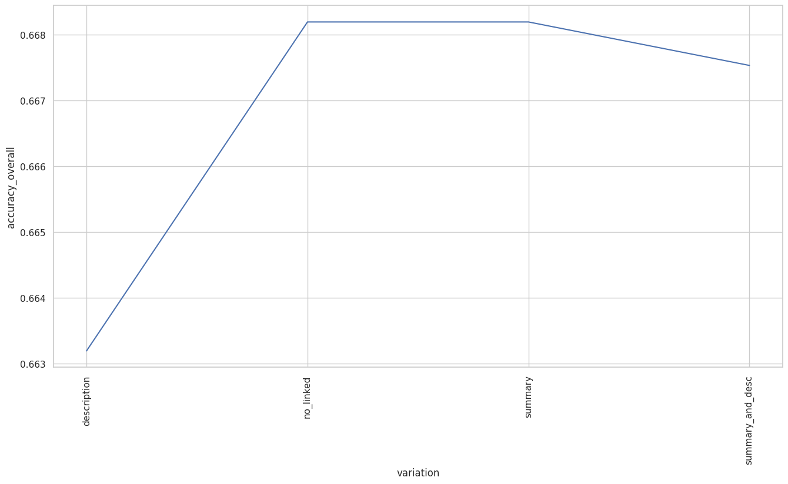  
Accuracy over time  
  
Acc over colcount for feature variation   
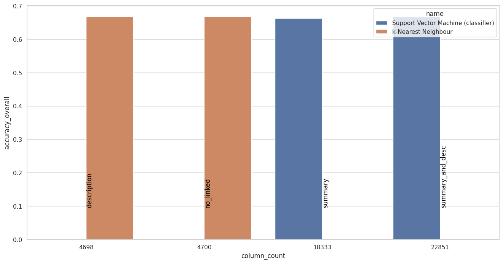  
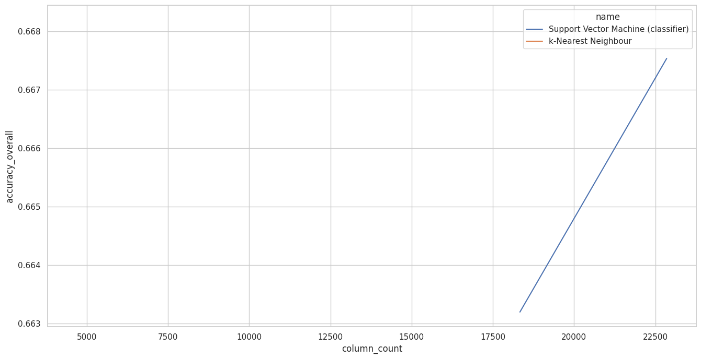  
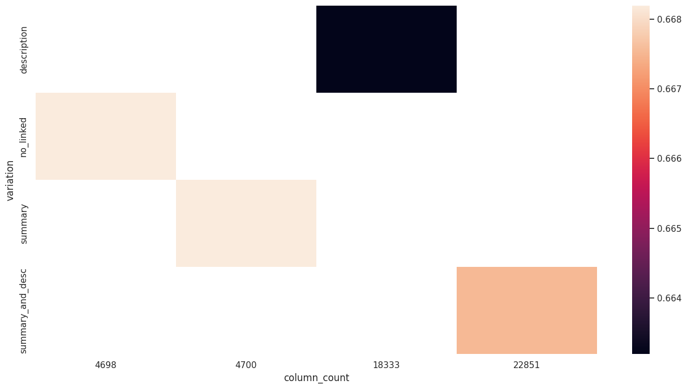  
# Data distribution  
Something went wrong while printing data distribution  
# duration
Times are described in utc.
  
Started 2021-11-18 10:11:46  
Finished 2021-11-19 16:17:14  
Duration: 1 day, 6:05:28.051654  
## Detailed duration  
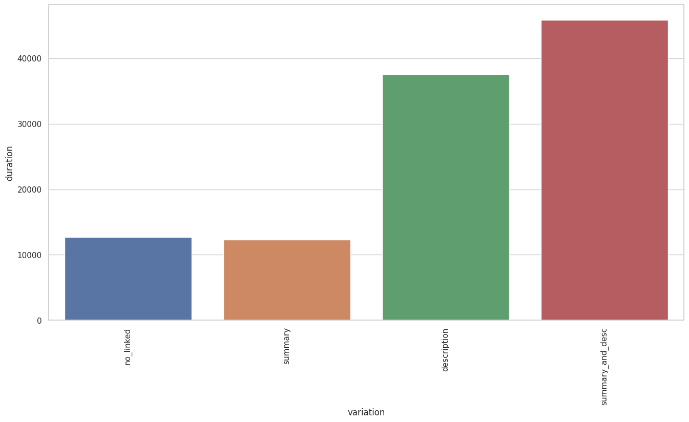  
