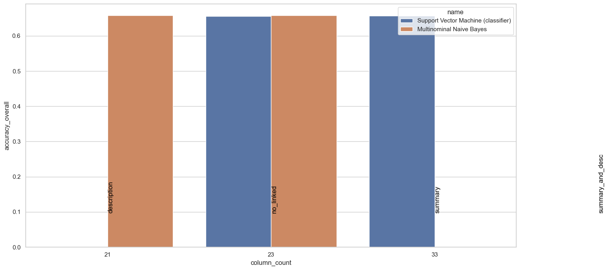
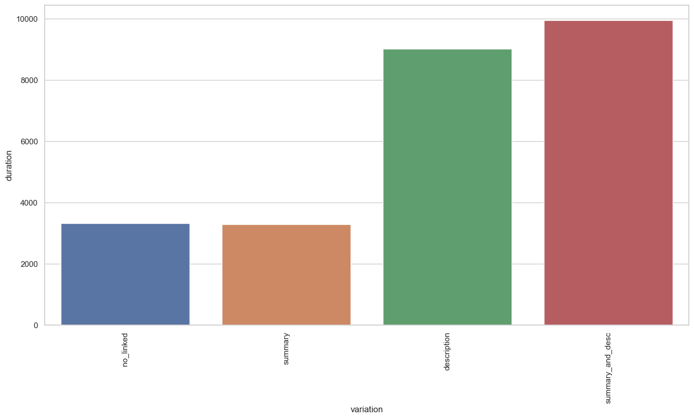

# Comparing variations  
Validating feature set no_linked  
Standardizing text columns:  {'summary'}  
## no_linked  
Start comparing 2021-11-19 20:36:46+01:00  
Using non cached frame with columns:  Index(['Unnamed: 0', 'assignee', 'component_names', 'components_descriptions',
       'created', 'description', 'harm', 'id', 'labels',
       'last_sprint_activatedDate', 'last_sprint_autoStartStop',
       'last_sprint_completeDate', 'last_sprint_endDate', 'last_sprint_goal',
       'last_sprint_id', 'last_sprint_name', 'last_sprint_rapidViewId',
       'last_sprint_sequence', 'last_sprint_startDate', 'last_sprint_state',
       'link', 'points', 'probability', 'probability_final', 'project',
       'requirement_prio', 'resolution', 'resolutiondate', 'risk_impact',
       'risk_likelyhood', 'severity', 'sprint_count', 'status', 'status_key',
       'summary', 'type', 'updated', 'urgent', 'component_count',
       'labels_count', 'summary_raw', 'summary_stopword_count',
       '_lda_summary_dominant_topic', '_lda_summary_topics',
       '_lda_summary_topic_0', '_lda_summary_topic_1', '_lda_summary_topic_2',
       '_lda_summary_topic_3', '_lda_summary_topic_4', '_lda_summary_topic_5',
       '_lda_summary_topic_6', '_lda_summary_topic_7', '_lda_summary_topic_8',
       '_lda_summary_topic_9'],
      dtype='object')  
Preprocessing for no_linked, looking at ['summary']  
Extracted columns from non cached frame:  Index(['Unnamed: 0', 'assignee', 'component_names', 'components_descriptions',
       'created', 'description', 'harm', 'id', 'labels',
       'last_sprint_activatedDate', 'last_sprint_autoStartStop',
       'last_sprint_completeDate', 'last_sprint_endDate', 'last_sprint_goal',
       'last_sprint_id', 'last_sprint_name', 'last_sprint_rapidViewId',
       'last_sprint_sequence', 'last_sprint_startDate', 'last_sprint_state',
       'link', 'points', 'probability', 'probability_final', 'project',
       'requirement_prio', 'resolution', 'resolutiondate', 'risk_impact',
       'risk_likelyhood', 'severity', 'sprint_count', 'status', 'status_key',
       'summary', 'type', 'updated', 'urgent', 'component_count',
       'labels_count', 'summary_raw', 'summary_stopword_count',
       '_lda_summary_dominant_topic', '_lda_summary_topics',
       '_lda_summary_topic_0', '_lda_summary_topic_1', '_lda_summary_topic_2',
       '_lda_summary_topic_3', '_lda_summary_topic_4', '_lda_summary_topic_5',
       '_lda_summary_topic_6', '_lda_summary_topic_7', '_lda_summary_topic_8',
       '_lda_summary_topic_9', '_sentiment', '_urgency', '_general_topic',
       '_se_topic', '_type_topic', '_clarity', '_buzzwords', '_complexity',
       '_emotion', '_testability', '_dependency', '_other_sentiment'],
      dtype='object')  
Using seed for random split 1  
SIZES:   
	train 0.7  
	test 0.15  
	validate 0.15  
  
Data shape
	Training rows:	6099  
	columns:	21  
  
### Working on k-Nearest Neighbour -- no_linked [2021-11-19 20:28:33]  
Using columns:  ['_general_topic', '_buzzwords', '_testability', '_clarity', '_dependency', '_se_topic', '_emotion', '_other_sentiment', '_type_topic', '_urgency', '_complexity', '_lda_summary_topic_0', '_lda_summary_topic_1', '_lda_summary_topic_2', '_lda_summary_topic_3', '_lda_summary_topic_4', '_lda_summary_topic_5', '_lda_summary_topic_6', '_lda_summary_topic_7', '_lda_summary_topic_8', '_lda_summary_topic_9']  
Using Gridsearch to find optimal model, using -1 cores  
Grid search to find best params took 26.29 seconds  
Fitted using gridsearch  
Best parameters found:
 {'algorithm': 'auto', 'n_neighbors': 19, 'weights': 'distance'} 
  
Start prediction  
Finished prediction in 1.08  

Accuracy train set = 		{}
Accuracy test set = 		{}
Accuracy validation set = 	{}
Average Accuracy = 		0.9939334317101164
  
Showing 6 best and 6 worst results  

  
|     |     mean |        std |       time | algorithm   |   n_neighbors | weights   |
|----:|---------:|-----------:|-----------:|:------------|--------------:|:----------|
| 159 | 0.658633 | 0.00281135 | 0.00699743 | brute       |            20 | distance  |
| 157 | 0.658633 | 0.00343146 | 0.00533168 | brute       |            19 | distance  |
|  39 | 0.658633 | 0.00281135 | 0.00733225 | auto        |            20 | distance  |
|  37 | 0.658633 | 0.00343146 | 0.00533136 | auto        |            19 | distance  |
|  79 | 0.658141 | 0.00250813 | 0.0223303  | ball_tree   |            20 | distance  |
| 119 | 0.657977 | 0.00235329 | 0.031662   | kd_tree     |            20 | distance  |
|  41 | 0.528611 | 0.00576902 | 0.0249998  | ball_tree   |             1 | distance  |
|  40 | 0.528611 | 0.00576902 | 0.0263339  | ball_tree   |             1 | uniform   |
| 121 | 0.528447 | 0.00574099 | 0.0053285  | brute       |             1 | distance  |
| 120 | 0.528447 | 0.00574099 | 0.00432611 | brute       |             1 | uniform   |
|   1 | 0.528447 | 0.00574099 | 0.00699933 | auto        |             1 | distance  |
|   0 | 0.528447 | 0.00574099 | 0.00566578 | auto        |             1 | uniform   | 

  
Force ordering of graph due to size, limiting output to 30 best performers  
  

-------------------------------------  

  
Using seed for random split 1  
SIZES:   
	train 0.7  
	test 0.15  
	validate 0.15  
  
Data shape
	Training rows:	6099  
	columns:	21  
  
### Working on Guassian Naive Bayes -- no_linked [2021-11-19 20:29:01]  
Using columns:  ['_general_topic', '_buzzwords', '_testability', '_clarity', '_dependency', '_se_topic', '_emotion', '_other_sentiment', '_type_topic', '_urgency', '_complexity', '_lda_summary_topic_0', '_lda_summary_topic_1', '_lda_summary_topic_2', '_lda_summary_topic_3', '_lda_summary_topic_4', '_lda_summary_topic_5', '_lda_summary_topic_6', '_lda_summary_topic_7', '_lda_summary_topic_8', '_lda_summary_topic_9']  
NB does not have hyperparams to tune  
Start training.  
Fit model in 0.0 seconds  
Start prediction  
Finished prediction in 0.0  

Accuracy train set = 		{}
Accuracy test set = 		{}
Accuracy validation set = 	{}
Average Accuracy = 		0.6102639777012625
  

-------------------------------------  

  
Using seed for random split 1  
SIZES:   
	train 0.7  
	test 0.15  
	validate 0.15  
  
Data shape
	Training rows:	6099  
	columns:	21  
  
### Working on Multinominal Naive Bayes -- no_linked [2021-11-19 20:29:01]  
Using columns:  ['_general_topic', '_buzzwords', '_testability', '_clarity', '_dependency', '_se_topic', '_emotion', '_other_sentiment', '_type_topic', '_urgency', '_complexity', '_lda_summary_topic_0', '_lda_summary_topic_1', '_lda_summary_topic_2', '_lda_summary_topic_3', '_lda_summary_topic_4', '_lda_summary_topic_5', '_lda_summary_topic_6', '_lda_summary_topic_7', '_lda_summary_topic_8', '_lda_summary_topic_9']  
NB does not have hyperparams to tune  
Start training.  
Fit model in 0.01 seconds  
Start prediction  
Finished prediction in 0.0  

Accuracy train set = 		{}
Accuracy test set = 		{}
Accuracy validation set = 	{}
Average Accuracy = 		0.6574848335792753
  

-------------------------------------  

  
Using seed for random split 1  
SIZES:   
	train 0.7  
	test 0.15  
	validate 0.15  
  
Data shape
	Training rows:	6099  
	columns:	21  
  
### Working on Decision Tree -- no_linked [2021-11-19 20:29:01]  
Using columns:  ['_general_topic', '_buzzwords', '_testability', '_clarity', '_dependency', '_se_topic', '_emotion', '_other_sentiment', '_type_topic', '_urgency', '_complexity', '_lda_summary_topic_0', '_lda_summary_topic_1', '_lda_summary_topic_2', '_lda_summary_topic_3', '_lda_summary_topic_4', '_lda_summary_topic_5', '_lda_summary_topic_6', '_lda_summary_topic_7', '_lda_summary_topic_8', '_lda_summary_topic_9']  
Optimized config with:  
Depth                5
Depth Count          5
Criterion         gini
Splitter        random
Accuracy       0.66208
Name: 13, dtype: object  

  
|    | Depth   |   Depth Count | Criterion   | Splitter   |   Accuracy |
|---:|:--------|--------------:|:------------|:-----------|-----------:|
| 13 | 5       |             5 | gini        | random     |   0.66208  |
| 27 | 5       |             5 | entropy     | random     |   0.659786 |
|  6 | 5       |             5 | gini        | best       |   0.656728 |
| 20 | 5       |             5 | entropy     | best       |   0.651758 |
| 22 | Log     |             9 | entropy     | random     |   0.643349 |
| 15 | Log     |             9 | entropy     | best       |   0.638379 |
|  8 | Log     |             9 | gini        | random     |   0.636086 |
|  1 | Log     |             9 | gini        | best       |   0.615826 |
| 26 | 25%     |          1525 | entropy     | random     |   0.512615 |
|  7 | All     |               | gini        | random     |   0.511086 |
| 23 | Sqrt    |            78 | entropy     | random     |   0.505734 |
| 25 | 50%     |          3050 | entropy     | random     |   0.505352 |
| 21 | All     |               | entropy     | random     |   0.504587 |
| 11 | 50%     |          3050 | gini        | random     |   0.504205 |
|  9 | Sqrt    |            78 | gini        | random     |   0.50344  |
| 10 | 75%     |          4574 | gini        | random     |   0.493884 |
| 12 | 25%     |          1525 | gini        | random     |   0.493884 |
| 24 | 75%     |          4574 | entropy     | random     |   0.493884 |
|  4 | 50%     |          3050 | gini        | best       |   0.475153 |
| 16 | Sqrt    |            78 | entropy     | best       |   0.473242 |
| 14 | All     |               | entropy     | best       |   0.472859 |
| 19 | 25%     |          1525 | entropy     | best       |   0.472095 |
| 18 | 50%     |          3050 | entropy     | best       |   0.470183 |
| 17 | 75%     |          4574 | entropy     | best       |   0.46789  |
|  5 | 25%     |          1525 | gini        | best       |   0.467508 |
|  0 | All     |               | gini        | best       |   0.465214 |
|  3 | 75%     |          4574 | gini        | best       |   0.46445  |
|  2 | Sqrt    |            78 | gini        | best       |   0.459862 | 

  
  

-------------------------------------  

  
Using seed for random split 1  
SIZES:   
	train 0.7  
	test 0.15  
	validate 0.15  
  
Data shape
	Training rows:	6099  
	columns:	21  
  
### Working on Support Vector Machine (classifier) -- no_linked [2021-11-19 20:29:03]  
Using columns:  ['_general_topic', '_buzzwords', '_testability', '_clarity', '_dependency', '_se_topic', '_emotion', '_other_sentiment', '_type_topic', '_urgency', '_complexity', '_lda_summary_topic_0', '_lda_summary_topic_1', '_lda_summary_topic_2', '_lda_summary_topic_3', '_lda_summary_topic_4', '_lda_summary_topic_5', '_lda_summary_topic_6', '_lda_summary_topic_7', '_lda_summary_topic_8', '_lda_summary_topic_9']  
Using Gridsearch to find optimal model, using -1 cores  
Grid search to find best params took 54.99 seconds  
Fitted using gridsearch  
Best parameters found:
 {'class_weight': None, 'gamma': 'scale', 'kernel': 'poly'} 
  
Start prediction  
Finished prediction in 0.76  

Accuracy train set = 		{}
Accuracy test set = 		{}
Accuracy validation set = 	{}
Average Accuracy = 		0.661911788817839
  
Showing 6 best and 6 worst results  

  
|    |     mean |         std |    time | class_weight   | gamma   | kernel   |
|---:|---------:|------------:|--------:|:---------------|:--------|:---------|
| 10 | 0.658141 | 0.000695629 | 8.42733 |                | scale   | poly     |
|  9 | 0.657485 | 0.000231876 | 2.518   |                | scale   | linear   |
| 12 | 0.657485 | 0.000231876 | 5.34533 |                | auto    | sigmoid  |
| 13 | 0.657485 | 0.000231876 | 2.45433 |                | auto    | linear   |
| 14 | 0.657485 | 0.000231876 | 3.05166 |                | auto    | poly     |
| 15 | 0.657485 | 0.000231876 | 4.859   |                | auto    | rbf      |
|  1 | 0.43089  | 0.0273191   | 6.29267 | balanced       | scale   | linear   |
|  5 | 0.43089  | 0.0273191   | 6.196   | balanced       | auto    | linear   |
|  4 | 0.429907 | 0.0639083   | 7.95733 | balanced       | auto    | sigmoid  |
|  3 | 0.425644 | 0.00843724  | 9.792   | balanced       | scale   | rbf      |
|  2 | 0.42302  | 0.0130573   | 6.65166 | balanced       | scale   | poly     |
|  6 | 0.365798 | 0.206022    | 6.86166 | balanced       | auto    | poly     | 

  
  

-------------------------------------  

  
Using seed for random split 1  
SIZES:   
	train 0.7  
	test 0.15  
	validate 0.15  
  
Data shape
	Training rows:	6099  
	columns:	21  
  
### Working on Stochastic Gradient Descent -- no_linked [2021-11-19 20:29:59]  
Using columns:  ['_general_topic', '_buzzwords', '_testability', '_clarity', '_dependency', '_se_topic', '_emotion', '_other_sentiment', '_type_topic', '_urgency', '_complexity', '_lda_summary_topic_0', '_lda_summary_topic_1', '_lda_summary_topic_2', '_lda_summary_topic_3', '_lda_summary_topic_4', '_lda_summary_topic_5', '_lda_summary_topic_6', '_lda_summary_topic_7', '_lda_summary_topic_8', '_lda_summary_topic_9']  
Using Gridsearch to find optimal model, using -1 cores  
Grid search to find best params took 12.92 seconds  
Fitted using gridsearch  
Best parameters found:
 {'alpha': 1e-05, 'learning_rate': 'adaptive', 'loss': 'log', 'penalty': 'l2'} 
  
Start prediction  
Finished prediction in 0.0  

Accuracy train set = 		{}
Accuracy test set = 		{}
Accuracy validation set = 	{}
Average Accuracy = 		0.6576487948844073
  
Showing 6 best and 6 worst results  

  
|     |     mean |         std |      time |   alpha | learning_rate   | loss           | penalty    |
|----:|---------:|------------:|----------:|--------:|:----------------|:---------------|:-----------|
|  66 | 0.658469 | 0.00101073  | 0.164999  |   1e-05 | adaptive        | log            | l2         |
|  67 | 0.658469 | 0.00101073  | 0.349664  |   1e-05 | adaptive        | log            | l1         |
|  68 | 0.658469 | 0.00101073  | 0.316667  |   1e-05 | adaptive        | log            | elasticnet |
|  70 | 0.658141 | 0.000803243 | 0.250334  |   1e-05 | adaptive        | modified_huber | l1         |
|  69 | 0.658141 | 0.000803243 | 0.125331  |   1e-05 | adaptive        | modified_huber | l2         |
|  73 | 0.657977 | 0.000836042 | 0.245999  |   1e-05 | adaptive        | squared_hinge  | l1         |
| 102 | 0.22102  | 0.115546    | 0.0206631 |   0.05  | constant        | huber          | l2         |
|  34 | 0.198721 | 0.0214294   | 0.111336  |   1e-05 | optimal         | perceptron     | l1         |
|   8 | 0.189375 | 0.0266284   | 0.0319982 |   1e-05 | constant        | modified_huber | elasticnet |
|  15 | 0.18626  | 0.0405326   | 0.0183349 |   1e-05 | constant        | squared_loss   | l2         |
|  19 | 0.16265  | 0.0406816   | 0.103999  |   1e-05 | constant        | huber          | l1         |
| 101 | 0.12625  | 0.00346265  | 0.0316656 |   0.05  | constant        | squared_loss   | elasticnet | 

  
Force ordering of graph due to size, limiting output to 30 best performers  
  

-------------------------------------  

  
Using seed for random split 1  
SIZES:   
	train 0.7  
	test 0.15  
	validate 0.15  
  
Data shape
	Training rows:	6099  
	columns:	21  
  
### Working on Multi-layer Perceptron -- no_linked [2021-11-19 20:30:12]  
Using columns:  ['_general_topic', '_buzzwords', '_testability', '_clarity', '_dependency', '_se_topic', '_emotion', '_other_sentiment', '_type_topic', '_urgency', '_complexity', '_lda_summary_topic_0', '_lda_summary_topic_1', '_lda_summary_topic_2', '_lda_summary_topic_3', '_lda_summary_topic_4', '_lda_summary_topic_5', '_lda_summary_topic_6', '_lda_summary_topic_7', '_lda_summary_topic_8', '_lda_summary_topic_9']  
Using Gridsearch to find optimal model, using -1 cores  
Grid search to find best params took 112.89 seconds  
Fitted using gridsearch  
Best parameters found:
 {'activation': 'tanh', 'alpha': 0.05, 'learning_rate': 'adaptive', 'solver': 'adam'} 
  
Start prediction  
Finished prediction in 0.01  

Accuracy train set = 		{}
Accuracy test set = 		{}
Accuracy validation set = 	{}
Average Accuracy = 		0.6576487948844073
  
Showing 6 best and 6 worst results  

  
|    |     mean |         std |     time | activation   |   alpha | learning_rate   | solver   |
|---:|---------:|------------:|---------:|:-------------|--------:|:----------------|:---------|
| 10 | 0.658469 | 0.00101073  |  1.26933 | tanh         |  0.05   | adaptive        | adam     |
|  1 | 0.658305 | 0.00101073  |  1.08834 | tanh         |  0.0001 | constant        | adam     |
|  7 | 0.658305 | 0.00101073  |  1.36966 | tanh         |  0.05   | constant        | adam     |
|  4 | 0.658141 | 0.00106259  |  1.016   | tanh         |  0.0001 | adaptive        | adam     |
|  0 | 0.657485 | 0.000231876 |  2.77234 | tanh         |  0.0001 | constant        | sgd      |
|  9 | 0.657485 | 0.000231876 |  3.765   | tanh         |  0.05   | adaptive        | sgd      |
| 11 | 0.549434 | 0.00526722  | 30.688   | tanh         |  0.05   | adaptive        | lbfgs    |
| 17 | 0.54927  | 0.0110013   | 20.1827  | relu         |  0.0001 | adaptive        | lbfgs    |
| 14 | 0.545663 | 0.0111397   | 20.8223  | relu         |  0.0001 | constant        | lbfgs    |
|  8 | 0.542712 | 0.0133706   | 32.6937  | tanh         |  0.05   | constant        | lbfgs    |
|  2 | 0.5273   | 0.00425036  | 33.3923  | tanh         |  0.0001 | constant        | lbfgs    |
|  5 | 0.523528 | 0.011305    | 34.1157  | tanh         |  0.0001 | adaptive        | lbfgs    | 

  
  

-------------------------------------  

  
Finished comparing 2021-11-19 21:32:06+01:00  
Total seconds: 3319.6210148334503:  
Exact: HH:0.00 	MM:55.00 	 ss:19.62  
Time: 00:55:20  

### model comparisons for no_linked  

  
|    | name                                | variation   |   accuracy_overall |   accuracy_train |   accuracy_test |   accuracy_val |   fit_time | model_config                                                                 |   column_count |
|---:|:------------------------------------|:------------|-------------------:|-----------------:|----------------:|---------------:|-----------:|:-----------------------------------------------------------------------------|---------------:|
|  0 | k-Nearest Neighbour                 | no_linked   |           0.647936 |         0.993933 |        0.643731 |       0.652141 | 0.372667   | KNeighborsClassifier(n_neighbors=19, weights='distance')                     |             21 |
|  1 | Guassian Naive Bayes                | no_linked   |           0.603211 |         0.610264 |        0.597095 |       0.609327 | 0.00399971 | GaussianNB()                                                                 |             21 |
|  2 | Multinominal Naive Bayes            | no_linked   |           0.657875 |         0.657485 |        0.649847 |       0.665902 | 0.00699925 | MultinomialNB()                                                              |             21 |
|  3 | Decision Tree                       | no_linked   |           0.659786 |         0.665519 |        0.651376 |       0.668196 | 0.00499868 | DecisionTreeClassifier(criterion='entropy', max_depth=5, splitter='random')  |             21 |
|  4 | Support Vector Machine (classifier) | no_linked   |           0.656346 |         0.661912 |        0.647554 |       0.665138 | 0.212333   | SVC(kernel='poly', probability=True)                                         |             21 |
|  5 | Stochastic Gradient Descent         | no_linked   |           0.65711  |         0.657649 |        0.649083 |       0.665138 | 0.00166901 | SGDClassifier(alpha=1e-05, eta0=100.0, learning_rate='adaptive', loss='log') |             21 |
|  6 | Multi-layer Perceptron              | no_linked   |           0.657875 |         0.657649 |        0.649847 |       0.665902 | 0.0073324  | MLPClassifier(activation='tanh', alpha=0.05, learning_rate='adaptive',       |             21 |
|    |                                     |             |                    |                  |                 |                |            |               max_iter=1000)                                                 |                | 

  

  
|    | name                                | variation   |   accuracy_overall |   accuracy_train |   accuracy_test |   accuracy_val |   fit_time | model_config                                                                 |   column_count |
|---:|:------------------------------------|:------------|-------------------:|-----------------:|----------------:|---------------:|-----------:|:-----------------------------------------------------------------------------|---------------:|
|  3 | Decision Tree                       | no_linked   |           0.659786 |         0.665519 |        0.651376 |       0.668196 | 0.00499868 | DecisionTreeClassifier(criterion='entropy', max_depth=5, splitter='random')  |             21 |
|  2 | Multinominal Naive Bayes            | no_linked   |           0.657875 |         0.657485 |        0.649847 |       0.665902 | 0.00699925 | MultinomialNB()                                                              |             21 |
|  6 | Multi-layer Perceptron              | no_linked   |           0.657875 |         0.657649 |        0.649847 |       0.665902 | 0.0073324  | MLPClassifier(activation='tanh', alpha=0.05, learning_rate='adaptive',       |             21 |
|    |                                     |             |                    |                  |                 |                |            |               max_iter=1000)                                                 |                |
|  5 | Stochastic Gradient Descent         | no_linked   |           0.65711  |         0.657649 |        0.649083 |       0.665138 | 0.00166901 | SGDClassifier(alpha=1e-05, eta0=100.0, learning_rate='adaptive', loss='log') |             21 |
|  4 | Support Vector Machine (classifier) | no_linked   |           0.656346 |         0.661912 |        0.647554 |       0.665138 | 0.212333   | SVC(kernel='poly', probability=True)                                         |             21 |
|  0 | k-Nearest Neighbour                 | no_linked   |           0.647936 |         0.993933 |        0.643731 |       0.652141 | 0.372667   | KNeighborsClassifier(n_neighbors=19, weights='distance')                     |             21 |
|  1 | Guassian Naive Bayes                | no_linked   |           0.603211 |         0.610264 |        0.597095 |       0.609327 | 0.00399971 | GaussianNB()                                                                 |             21 | 

  
  

  

 |    | Name                                |   Accuracy |       Time |   Optimization_time |
|---:|:------------------------------------|-----------:|-----------:|--------------------:|
|  0 | k-Nearest Neighbour                 |   0.647936 | 0.372667   |          27.7828    |
|  1 | Guassian Naive Bayes                |   0.603211 | 0.00399971 |           0.0109992 |
|  2 | Multinominal Naive Bayes            |   0.657875 | 0.00699925 |           0.0129986 |
|  3 | Decision Tree                       |   0.659786 | 0.00499868 |           1.416     |
|  4 | Support Vector Machine (classifier) |   0.656346 | 0.212333   |          55.995     |
|  5 | Stochastic Gradient Descent         |   0.65711  | 0.00166901 |          13.295     |
|  6 | Multi-layer Perceptron              |   0.657875 | 0.0073324  |         113.399     | 

  
Best in set was Decision Tree with an accuracy 0.6597859327217126  

==  no_linked == 
================================  

  
Validating feature set summary  
Standardizing text columns:  {'summary'}  
## summary  
Start comparing 2021-11-19 21:32:06+01:00  
Using non cached frame with columns:  Index(['Unnamed: 0', 'assignee', 'component_names', 'components_descriptions',
       'created', 'description', 'harm', 'id', 'labels',
       'last_sprint_activatedDate', 'last_sprint_autoStartStop',
       'last_sprint_completeDate', 'last_sprint_endDate', 'last_sprint_goal',
       'last_sprint_id', 'last_sprint_name', 'last_sprint_rapidViewId',
       'last_sprint_sequence', 'last_sprint_startDate', 'last_sprint_state',
       'link', 'points', 'probability', 'probability_final', 'project',
       'requirement_prio', 'resolution', 'resolutiondate', 'risk_impact',
       'risk_likelyhood', 'severity', 'sprint_count', 'status', 'status_key',
       'summary', 'type', 'updated', 'urgent', 'component_count',
       'labels_count', 'summary_raw', 'summary_stopword_count',
       '_lda_summary_dominant_topic', '_lda_summary_topics',
       '_lda_summary_topic_0', '_lda_summary_topic_1', '_lda_summary_topic_2',
       '_lda_summary_topic_3', '_lda_summary_topic_4', '_lda_summary_topic_5',
       '_lda_summary_topic_6', '_lda_summary_topic_7', '_lda_summary_topic_8',
       '_lda_summary_topic_9'],
      dtype='object')  
Preprocessing for summary, looking at ['summary']  
Extracted columns from non cached frame:  Index(['Unnamed: 0', 'assignee', 'component_names', 'components_descriptions',
       'created', 'description', 'harm', 'id', 'labels',
       'last_sprint_activatedDate', 'last_sprint_autoStartStop',
       'last_sprint_completeDate', 'last_sprint_endDate', 'last_sprint_goal',
       'last_sprint_id', 'last_sprint_name', 'last_sprint_rapidViewId',
       'last_sprint_sequence', 'last_sprint_startDate', 'last_sprint_state',
       'link', 'points', 'probability', 'probability_final', 'project',
       'requirement_prio', 'resolution', 'resolutiondate', 'risk_impact',
       'risk_likelyhood', 'severity', 'sprint_count', 'status', 'status_key',
       'summary', 'type', 'updated', 'urgent', 'component_count',
       'labels_count', 'summary_raw', 'summary_stopword_count',
       '_lda_summary_dominant_topic', '_lda_summary_topics',
       '_lda_summary_topic_0', '_lda_summary_topic_1', '_lda_summary_topic_2',
       '_lda_summary_topic_3', '_lda_summary_topic_4', '_lda_summary_topic_5',
       '_lda_summary_topic_6', '_lda_summary_topic_7', '_lda_summary_topic_8',
       '_lda_summary_topic_9', '_sentiment', '_urgency', '_general_topic',
       '_se_topic', '_type_topic', '_clarity', '_buzzwords', '_complexity',
       '_emotion', '_testability', '_dependency', '_other_sentiment'],
      dtype='object')  
Using seed for random split 1  
SIZES:   
	train 0.7  
	test 0.15  
	validate 0.15  
  
Data shape
	Training rows:	6099  
	columns:	23  
  
### Working on k-Nearest Neighbour -- summary [2021-11-19 21:23:10]  
Using columns:  ['_general_topic', '_buzzwords', '_testability', '_clarity', '_dependency', '_se_topic', '_emotion', '_complexity', '_type_topic', '_other_sentiment', '_urgency', 'points', 'sprint_count', '_lda_summary_topic_0', '_lda_summary_topic_1', '_lda_summary_topic_2', '_lda_summary_topic_3', '_lda_summary_topic_4', '_lda_summary_topic_5', '_lda_summary_topic_6', '_lda_summary_topic_7', '_lda_summary_topic_8', '_lda_summary_topic_9']  
Using Gridsearch to find optimal model, using -1 cores  
Grid search to find best params took 26.75 seconds  
Fitted using gridsearch  
Best parameters found:
 {'algorithm': 'auto', 'n_neighbors': 19, 'weights': 'distance'} 
  
Start prediction  
Finished prediction in 1.07  

Accuracy train set = 		{}
Accuracy test set = 		{}
Accuracy validation set = 	{}
Average Accuracy = 		0.9977045417281521
  
Showing 6 best and 6 worst results  

  
|     |     mean |        std |       time | algorithm   |   n_neighbors | weights   |
|----:|---------:|-----------:|-----------:|:------------|--------------:|:----------|
| 157 | 0.659616 | 0.00244297 | 0.00866477 | brute       |            19 | distance  |
|  37 | 0.659616 | 0.00244297 | 0.00833193 | auto        |            19 | distance  |
| 117 | 0.659288 | 0.00267413 | 0.0393312  | kd_tree     |            19 | distance  |
|  77 | 0.659288 | 0.00267413 | 0.0283313  | ball_tree   |            19 | distance  |
| 159 | 0.658469 | 0.00122697 | 0.00866429 | brute       |            20 | distance  |
|  39 | 0.658469 | 0.00122697 | 0.00733089 | auto        |            20 | distance  |
| 123 | 0.520413 | 0.00569397 | 0.00899728 | brute       |             2 | distance  |
|   3 | 0.520413 | 0.00569397 | 0.00833225 | auto        |             2 | distance  |
| 121 | 0.519101 | 0.0049079  | 0.00699727 | brute       |             1 | distance  |
| 120 | 0.519101 | 0.0049079  | 0.00599583 | brute       |             1 | uniform   |
|   1 | 0.519101 | 0.0049079  | 0.00767064 | auto        |             1 | distance  |
|   0 | 0.519101 | 0.0049079  | 0.00966382 | auto        |             1 | uniform   | 

  
Force ordering of graph due to size, limiting output to 30 best performers  
  

-------------------------------------  

  
Using seed for random split 1  
SIZES:   
	train 0.7  
	test 0.15  
	validate 0.15  
  
Data shape
	Training rows:	6099  
	columns:	23  
  
### Working on Guassian Naive Bayes -- summary [2021-11-19 21:23:38]  
Using columns:  ['_general_topic', '_buzzwords', '_testability', '_clarity', '_dependency', '_se_topic', '_emotion', '_complexity', '_type_topic', '_other_sentiment', '_urgency', 'points', 'sprint_count', '_lda_summary_topic_0', '_lda_summary_topic_1', '_lda_summary_topic_2', '_lda_summary_topic_3', '_lda_summary_topic_4', '_lda_summary_topic_5', '_lda_summary_topic_6', '_lda_summary_topic_7', '_lda_summary_topic_8', '_lda_summary_topic_9']  
NB does not have hyperparams to tune  
Start training.  
Fit model in 0.0 seconds  
Start prediction  
Finished prediction in 0.01  

Accuracy train set = 		{}
Accuracy test set = 		{}
Accuracy validation set = 	{}
Average Accuracy = 		0.6148548942449582
  

-------------------------------------  

  
Using seed for random split 1  
SIZES:   
	train 0.7  
	test 0.15  
	validate 0.15  
  
Data shape
	Training rows:	6099  
	columns:	23  
  
### Working on Multinominal Naive Bayes -- summary [2021-11-19 21:23:38]  
Using columns:  ['_general_topic', '_buzzwords', '_testability', '_clarity', '_dependency', '_se_topic', '_emotion', '_complexity', '_type_topic', '_other_sentiment', '_urgency', 'points', 'sprint_count', '_lda_summary_topic_0', '_lda_summary_topic_1', '_lda_summary_topic_2', '_lda_summary_topic_3', '_lda_summary_topic_4', '_lda_summary_topic_5', '_lda_summary_topic_6', '_lda_summary_topic_7', '_lda_summary_topic_8', '_lda_summary_topic_9']  
NB does not have hyperparams to tune  
Start training.  
Fit model in 0.01 seconds  
Start prediction  
Finished prediction in 0.0  

Accuracy train set = 		{}
Accuracy test set = 		{}
Accuracy validation set = 	{}
Average Accuracy = 		0.6574848335792753
  

-------------------------------------  

  
Using seed for random split 1  
SIZES:   
	train 0.7  
	test 0.15  
	validate 0.15  
  
Data shape
	Training rows:	6099  
	columns:	23  
  
### Working on Decision Tree -- summary [2021-11-19 21:23:39]  
Using columns:  ['_general_topic', '_buzzwords', '_testability', '_clarity', '_dependency', '_se_topic', '_emotion', '_complexity', '_type_topic', '_other_sentiment', '_urgency', 'points', 'sprint_count', '_lda_summary_topic_0', '_lda_summary_topic_1', '_lda_summary_topic_2', '_lda_summary_topic_3', '_lda_summary_topic_4', '_lda_summary_topic_5', '_lda_summary_topic_6', '_lda_summary_topic_7', '_lda_summary_topic_8', '_lda_summary_topic_9']  
Optimized config with:  
Depth                 5
Depth Count           5
Criterion          gini
Splitter           best
Accuracy       0.668578
Name: 6, dtype: object  

  
|    | Depth   |   Depth Count | Criterion   | Splitter   |   Accuracy |
|---:|:--------|--------------:|:------------|:-----------|-----------:|
|  6 | 5       |             5 | gini        | best       |   0.668578 |
| 20 | 5       |             5 | entropy     | best       |   0.666667 |
| 13 | 5       |             5 | gini        | random     |   0.657492 |
| 27 | 5       |             5 | entropy     | random     |   0.654817 |
| 15 | Log     |             9 | entropy     | best       |   0.651758 |
|  8 | Log     |             9 | gini        | random     |   0.651758 |
|  1 | Log     |             9 | gini        | best       |   0.650994 |
| 22 | Log     |             9 | entropy     | random     |   0.647554 |
| 10 | 75%     |          4574 | gini        | random     |   0.580275 |
| 14 | All     |               | entropy     | best       |   0.574541 |
| 26 | 25%     |          1525 | entropy     | random     |   0.571483 |
| 19 | 25%     |          1525 | entropy     | best       |   0.567278 |
| 23 | Sqrt    |            78 | entropy     | random     |   0.566131 |
| 21 | All     |               | entropy     | random     |   0.565749 |
| 18 | 50%     |          3050 | entropy     | best       |   0.565367 |
|  5 | 25%     |          1525 | gini        | best       |   0.564602 |
| 17 | 75%     |          4574 | entropy     | best       |   0.56422  |
|  3 | 75%     |          4574 | gini        | best       |   0.563838 |
|  2 | Sqrt    |            78 | gini        | best       |   0.562691 |
| 16 | Sqrt    |            78 | entropy     | best       |   0.561162 |
| 11 | 50%     |          3050 | gini        | random     |   0.559251 |
|  0 | All     |               | gini        | best       |   0.558869 |
|  4 | 50%     |          3050 | gini        | best       |   0.557339 |
| 25 | 50%     |          3050 | entropy     | random     |   0.556575 |
| 24 | 75%     |          4574 | entropy     | random     |   0.556575 |
|  9 | Sqrt    |            78 | gini        | random     |   0.55581  |
|  7 | All     |               | gini        | random     |   0.551606 |
| 12 | 25%     |          1525 | gini        | random     |   0.547401 | 

  
  

-------------------------------------  

  
Using seed for random split 1  
SIZES:   
	train 0.7  
	test 0.15  
	validate 0.15  
  
Data shape
	Training rows:	6099  
	columns:	23  
  
### Working on Support Vector Machine (classifier) -- summary [2021-11-19 21:23:40]  
Using columns:  ['_general_topic', '_buzzwords', '_testability', '_clarity', '_dependency', '_se_topic', '_emotion', '_complexity', '_type_topic', '_other_sentiment', '_urgency', 'points', 'sprint_count', '_lda_summary_topic_0', '_lda_summary_topic_1', '_lda_summary_topic_2', '_lda_summary_topic_3', '_lda_summary_topic_4', '_lda_summary_topic_5', '_lda_summary_topic_6', '_lda_summary_topic_7', '_lda_summary_topic_8', '_lda_summary_topic_9']  
Using Gridsearch to find optimal model, using -1 cores  
Grid search to find best params took 54.33 seconds  
Fitted using gridsearch  
Best parameters found:
 {'class_weight': None, 'gamma': 'scale', 'kernel': 'poly'} 
  
Start prediction  
Finished prediction in 0.77  

Accuracy train set = 		{}
Accuracy test set = 		{}
Accuracy validation set = 	{}
Average Accuracy = 		0.6607640596819151
  
Showing 6 best and 6 worst results  

  
|    |     mean |         std |     time | class_weight   | gamma   | kernel   |
|---:|---------:|------------:|---------:|:---------------|:--------|:---------|
| 10 | 0.657813 | 0.000463753 |  6.81033 |                | scale   | poly     |
|  9 | 0.657485 | 0.000231876 |  2.935   |                | scale   | linear   |
| 11 | 0.657485 | 0.000231876 |  7.648   |                | scale   | rbf      |
| 12 | 0.657485 | 0.000231876 |  5.69967 |                | auto    | sigmoid  |
| 13 | 0.657485 | 0.000231876 |  2.88533 |                | auto    | linear   |
| 14 | 0.657485 | 0.000231876 |  3.14166 |                | auto    | poly     |
|  0 | 0.437121 | 0.00562748  |  7.201   | balanced       | scale   | sigmoid  |
|  2 | 0.424824 | 0.00964171  |  7.096   | balanced       | scale   | poly     |
|  3 | 0.417282 | 0.00627781  | 10.6263  | balanced       | scale   | rbf      |
|  1 | 0.40564  | 0.000927505 |  6.72567 | balanced       | scale   | linear   |
|  5 | 0.40564  | 0.000927505 |  6.38866 | balanced       | auto    | linear   |
|  6 | 0.365634 | 0.206138    |  7.303   | balanced       | auto    | poly     | 

  
  

-------------------------------------  

  
Using seed for random split 1  
SIZES:   
	train 0.7  
	test 0.15  
	validate 0.15  
  
Data shape
	Training rows:	6099  
	columns:	23  
  
### Working on Stochastic Gradient Descent -- summary [2021-11-19 21:24:36]  
Using columns:  ['_general_topic', '_buzzwords', '_testability', '_clarity', '_dependency', '_se_topic', '_emotion', '_complexity', '_type_topic', '_other_sentiment', '_urgency', 'points', 'sprint_count', '_lda_summary_topic_0', '_lda_summary_topic_1', '_lda_summary_topic_2', '_lda_summary_topic_3', '_lda_summary_topic_4', '_lda_summary_topic_5', '_lda_summary_topic_6', '_lda_summary_topic_7', '_lda_summary_topic_8', '_lda_summary_topic_9']  
Using Gridsearch to find optimal model, using -1 cores  
Grid search to find best params took 14.38 seconds  
Fitted using gridsearch  
Best parameters found:
 {'alpha': 1e-05, 'learning_rate': 'adaptive', 'loss': 'log', 'penalty': 'l2'} 
  
Start prediction  
Finished prediction in 0.0  

Accuracy train set = 		{}
Accuracy test set = 		{}
Accuracy validation set = 	{}
Average Accuracy = 		0.6579767174946712
  
Showing 6 best and 6 worst results  

  
|     |     mean |         std |      time |   alpha | learning_rate   | loss           | penalty    |
|----:|---------:|------------:|----------:|--------:|:----------------|:---------------|:-----------|
|  67 | 0.658305 | 0.000613487 | 0.394664  |   1e-05 | adaptive        | log            | l1         |
|  66 | 0.658305 | 0.000613487 | 0.183665  |   1e-05 | adaptive        | log            | l2         |
|  68 | 0.658141 | 0.000401622 | 0.312666  |   1e-05 | adaptive        | log            | elasticnet |
|  69 | 0.657977 | 0.000836042 | 0.145666  |   1e-05 | adaptive        | modified_huber | l2         |
|  71 | 0.657813 | 0.000613487 | 0.278333  |   1e-05 | adaptive        | modified_huber | elasticnet |
|  70 | 0.657813 | 0.000613487 | 0.297998  |   1e-05 | adaptive        | modified_huber | l1         |
|  38 | 0.272504 | 0.0233356   | 0.626333  |   1e-05 | optimal         | squared_loss   | elasticnet |
| 102 | 0.269716 | 0.113886    | 0.0223321 |   0.05  | constant        | huber          | l2         |
|  59 | 0.266765 | 0.118143    | 0.573998  |   1e-05 | invscaling      | squared_loss   | elasticnet |
|  99 | 0.229218 | 0.0621567   | 0.0213331 |   0.05  | constant        | squared_loss   | l2         |
|  93 | 0.178554 | 0.0411069   | 0.0199993 |   0.05  | constant        | squared_hinge  | l2         |
| 101 | 0.169044 | 0.00630345  | 0.0376653 |   0.05  | constant        | squared_loss   | elasticnet | 

  
Force ordering of graph due to size, limiting output to 30 best performers  
  

-------------------------------------  

  
Using seed for random split 1  
SIZES:   
	train 0.7  
	test 0.15  
	validate 0.15  
  
Data shape
	Training rows:	6099  
	columns:	23  
  
### Working on Multi-layer Perceptron -- summary [2021-11-19 21:24:50]  
Using columns:  ['_general_topic', '_buzzwords', '_testability', '_clarity', '_dependency', '_se_topic', '_emotion', '_complexity', '_type_topic', '_other_sentiment', '_urgency', 'points', 'sprint_count', '_lda_summary_topic_0', '_lda_summary_topic_1', '_lda_summary_topic_2', '_lda_summary_topic_3', '_lda_summary_topic_4', '_lda_summary_topic_5', '_lda_summary_topic_6', '_lda_summary_topic_7', '_lda_summary_topic_8', '_lda_summary_topic_9']  
Using Gridsearch to find optimal model, using -1 cores  
Grid search to find best params took 116.46 seconds  
Fitted using gridsearch  
Best parameters found:
 {'activation': 'tanh', 'alpha': 0.0001, 'learning_rate': 'adaptive', 'solver': 'adam'} 
  
Start prediction  
Finished prediction in 0.01  

Accuracy train set = 		{}
Accuracy test set = 		{}
Accuracy validation set = 	{}
Average Accuracy = 		0.6579767174946712
  
Showing 6 best and 6 worst results  

  
|    |     mean |         std |     time | activation   |   alpha | learning_rate   | solver   |
|---:|---------:|------------:|---------:|:-------------|--------:|:----------------|:---------|
|  4 | 0.658633 | 0.000695629 |  1.93333 | tanh         |  0.0001 | adaptive        | adam     |
| 10 | 0.658141 | 0.00106259  |  2.15233 | tanh         |  0.05   | adaptive        | adam     |
|  1 | 0.657977 | 0.000463753 |  2.13267 | tanh         |  0.0001 | constant        | adam     |
|  7 | 0.657977 | 0.000463753 |  1.97533 | tanh         |  0.05   | constant        | adam     |
|  0 | 0.657485 | 0.000231876 |  2.83134 | tanh         |  0.0001 | constant        | sgd      |
|  9 | 0.657485 | 0.000231876 |  3.336   | tanh         |  0.05   | adaptive        | sgd      |
|  5 | 0.581243 | 0.0126771   | 34.3887  | tanh         |  0.0001 | adaptive        | lbfgs    |
| 20 | 0.580751 | 0.00903723  | 19.752   | relu         |  0.05   | constant        | lbfgs    |
| 17 | 0.578947 | 0.00368092  | 20.0067  | relu         |  0.0001 | adaptive        | lbfgs    |
| 11 | 0.5778   | 0.00771838  | 31.2023  | tanh         |  0.05   | adaptive        | lbfgs    |
|  8 | 0.571897 | 0.0106436   | 32.923   | tanh         |  0.05   | constant        | lbfgs    |
|  2 | 0.568454 | 0.00689028  | 33.7747  | tanh         |  0.0001 | constant        | lbfgs    | 

  
  

-------------------------------------  

  
Finished comparing 2021-11-19 22:26:47+01:00  
Total seconds: 3281.072249650955:  
Exact: HH:0.00 	MM:54.00 	 ss:41.07  
Time: 00:54:42  

### model comparisons for summary  

  
|    | name                                | variation   |   accuracy_overall |   accuracy_train |   accuracy_test |   accuracy_val |   fit_time | model_config                                                                 |   column_count |
|---:|:------------------------------------|:------------|-------------------:|-----------------:|----------------:|---------------:|-----------:|:-----------------------------------------------------------------------------|---------------:|
|  0 | k-Nearest Neighbour                 | summary     |           0.65711  |         0.997705 |        0.65367  |       0.66055  | 0.374669   | KNeighborsClassifier(n_neighbors=19, weights='distance')                     |             23 |
|  1 | Guassian Naive Bayes                | summary     |           0.607034 |         0.614855 |        0.600153 |       0.613914 | 0.00499988 | GaussianNB()                                                                 |             23 |
|  2 | Multinominal Naive Bayes            | summary     |           0.657875 |         0.657485 |        0.649847 |       0.665902 | 0.0079999  | MultinomialNB()                                                              |             23 |
|  3 | Decision Tree                       | summary     |           0.654817 |         0.66142  |        0.646024 |       0.663609 | 0.0059998  | DecisionTreeClassifier(criterion='entropy', max_depth=5, splitter='random')  |             23 |
|  4 | Support Vector Machine (classifier) | summary     |           0.655963 |         0.660764 |        0.649847 |       0.66208  | 0.214668   | SVC(kernel='poly', probability=True)                                         |             23 |
|  5 | Stochastic Gradient Descent         | summary     |           0.657492 |         0.657977 |        0.648318 |       0.666667 | 0.00166909 | SGDClassifier(alpha=1e-05, eta0=100.0, learning_rate='adaptive', loss='log') |             23 |
|  6 | Multi-layer Perceptron              | summary     |           0.657875 |         0.657977 |        0.649083 |       0.666667 | 0.00733534 | MLPClassifier(activation='tanh', learning_rate='adaptive', max_iter=1000)    |             23 | 

  

  
|    | name                                | variation   |   accuracy_overall |   accuracy_train |   accuracy_test |   accuracy_val |   fit_time | model_config                                                                 |   column_count |
|---:|:------------------------------------|:------------|-------------------:|-----------------:|----------------:|---------------:|-----------:|:-----------------------------------------------------------------------------|---------------:|
|  2 | Multinominal Naive Bayes            | summary     |           0.657875 |         0.657485 |        0.649847 |       0.665902 | 0.0079999  | MultinomialNB()                                                              |             23 |
|  6 | Multi-layer Perceptron              | summary     |           0.657875 |         0.657977 |        0.649083 |       0.666667 | 0.00733534 | MLPClassifier(activation='tanh', learning_rate='adaptive', max_iter=1000)    |             23 |
|  5 | Stochastic Gradient Descent         | summary     |           0.657492 |         0.657977 |        0.648318 |       0.666667 | 0.00166909 | SGDClassifier(alpha=1e-05, eta0=100.0, learning_rate='adaptive', loss='log') |             23 |
|  0 | k-Nearest Neighbour                 | summary     |           0.65711  |         0.997705 |        0.65367  |       0.66055  | 0.374669   | KNeighborsClassifier(n_neighbors=19, weights='distance')                     |             23 |
|  4 | Support Vector Machine (classifier) | summary     |           0.655963 |         0.660764 |        0.649847 |       0.66208  | 0.214668   | SVC(kernel='poly', probability=True)                                         |             23 |
|  3 | Decision Tree                       | summary     |           0.654817 |         0.66142  |        0.646024 |       0.663609 | 0.0059998  | DecisionTreeClassifier(criterion='entropy', max_depth=5, splitter='random')  |             23 |
|  1 | Guassian Naive Bayes                | summary     |           0.607034 |         0.614855 |        0.600153 |       0.613914 | 0.00499988 | GaussianNB()                                                                 |             23 | 

  
  

  

 |    | Name                                |   Accuracy |       Time |   Optimization_time |
|---:|:------------------------------------|-----------:|-----------:|--------------------:|
|  0 | k-Nearest Neighbour                 |   0.65711  | 0.374669   |          28.158     |
|  1 | Guassian Naive Bayes                |   0.607034 | 0.00499988 |           0.0149937 |
|  2 | Multinominal Naive Bayes            |   0.657875 | 0.0079999  |           0.0139909 |
|  3 | Decision Tree                       |   0.654817 | 0.0059998  |           1.453     |
|  4 | Support Vector Machine (classifier) |   0.655963 | 0.214668   |          55.3461    |
|  5 | Stochastic Gradient Descent         |   0.657492 | 0.00166909 |          14.751     |
|  6 | Multi-layer Perceptron              |   0.657875 | 0.00733534 |         116.781     | 

  
Best in set was Multinominal Naive Bayes with an accuracy 0.6578746177370031  

==  summary == 
================================  

  
Validating feature set description  
Standardizing text columns:  {'description'}  
## description  
Start comparing 2021-11-19 22:26:47+01:00  
Using non cached frame with columns:  Index(['Unnamed: 0', 'assignee', 'component_names', 'components_descriptions',
       'created', 'description', 'harm', 'id', 'labels',
       'last_sprint_activatedDate', 'last_sprint_autoStartStop',
       'last_sprint_completeDate', 'last_sprint_endDate', 'last_sprint_goal',
       'last_sprint_id', 'last_sprint_name', 'last_sprint_rapidViewId',
       'last_sprint_sequence', 'last_sprint_startDate', 'last_sprint_state',
       'link', 'points', 'probability', 'probability_final', 'project',
       'requirement_prio', 'resolution', 'resolutiondate', 'risk_impact',
       'risk_likelyhood', 'severity', 'sprint_count', 'status', 'status_key',
       'summary', 'type', 'updated', 'urgent', 'component_count',
       'labels_count', 'description_raw', 'description_stopword_count',
       '_lda_description_dominant_topic', '_lda_description_topics',
       '_lda_description_topic_0', '_lda_description_topic_1',
       '_lda_description_topic_2', '_lda_description_topic_3',
       '_lda_description_topic_4', '_lda_description_topic_5',
       '_lda_description_topic_6', '_lda_description_topic_7',
       '_lda_description_topic_8', '_lda_description_topic_9'],
      dtype='object')  
Preprocessing for description, looking at ['description']  
Extracted columns from non cached frame:  Index(['Unnamed: 0', 'assignee', 'component_names', 'components_descriptions',
       'created', 'description', 'harm', 'id', 'labels',
       'last_sprint_activatedDate', 'last_sprint_autoStartStop',
       'last_sprint_completeDate', 'last_sprint_endDate', 'last_sprint_goal',
       'last_sprint_id', 'last_sprint_name', 'last_sprint_rapidViewId',
       'last_sprint_sequence', 'last_sprint_startDate', 'last_sprint_state',
       'link', 'points', 'probability', 'probability_final', 'project',
       'requirement_prio', 'resolution', 'resolutiondate', 'risk_impact',
       'risk_likelyhood', 'severity', 'sprint_count', 'status', 'status_key',
       'summary', 'type', 'updated', 'urgent', 'component_count',
       'labels_count', 'description_raw', 'description_stopword_count',
       '_lda_description_dominant_topic', '_lda_description_topics',
       '_lda_description_topic_0', '_lda_description_topic_1',
       '_lda_description_topic_2', '_lda_description_topic_3',
       '_lda_description_topic_4', '_lda_description_topic_5',
       '_lda_description_topic_6', '_lda_description_topic_7',
       '_lda_description_topic_8', '_lda_description_topic_9', '_sentiment',
       '_urgency', '_general_topic', '_se_topic', '_type_topic', '_clarity',
       '_buzzwords', '_complexity', '_emotion', '_testability', '_dependency',
       '_other_sentiment'],
      dtype='object')  
Using seed for random split 1  
SIZES:   
	train 0.7  
	test 0.15  
	validate 0.15  
  
Data shape
	Training rows:	5371  
	columns:	23  
  
### Working on k-Nearest Neighbour -- description [2021-11-19 23:53:46]  
Using columns:  ['_general_topic', '_buzzwords', '_testability', '_clarity', '_dependency', '_se_topic', '_emotion', '_complexity', '_type_topic', '_other_sentiment', '_urgency', 'points', 'sprint_count', '_lda_description_topic_0', '_lda_description_topic_1', '_lda_description_topic_2', '_lda_description_topic_3', '_lda_description_topic_4', '_lda_description_topic_5', '_lda_description_topic_6', '_lda_description_topic_7', '_lda_description_topic_8', '_lda_description_topic_9']  
Using Gridsearch to find optimal model, using -1 cores  
Grid search to find best params took 21.19 seconds  
Fitted using gridsearch  
Best parameters found:
 {'algorithm': 'auto', 'n_neighbors': 20, 'weights': 'distance'} 
  
Start prediction  
Finished prediction in 0.79  

Accuracy train set = 		{}
Accuracy test set = 		{}
Accuracy validation set = 	{}
Average Accuracy = 		0.9960901135728915
  
Showing 6 best and 6 worst results  

  
|     |     mean |        std |       time | algorithm   |   n_neighbors | weights   |
|----:|---------:|-----------:|-----------:|:------------|--------------:|:----------|
| 159 | 0.662819 | 0.00378628 | 0.00599909 | brute       |            20 | distance  |
|  39 | 0.662819 | 0.00378628 | 0.00766436 | auto        |            20 | distance  |
|  79 | 0.662819 | 0.00378628 | 0.0229964  | ball_tree   |            20 | distance  |
| 119 | 0.662633 | 0.00390631 | 0.03033    | kd_tree     |            20 | distance  |
| 117 | 0.662074 | 0.00416468 | 0.0293303  | kd_tree     |            19 | distance  |
|  77 | 0.662074 | 0.00416468 | 0.0226639  | ball_tree   |            19 | distance  |
|  43 | 0.544779 | 0.00903115 | 0.0206617  | ball_tree   |             2 | distance  |
|   3 | 0.544779 | 0.00903115 | 0.00666436 | auto        |             2 | distance  |
|  41 | 0.544592 | 0.00838549 | 0.0286628  | ball_tree   |             1 | distance  |
|  40 | 0.544592 | 0.00838549 | 0.0216669  | ball_tree   |             1 | uniform   |
|  81 | 0.544406 | 0.00853494 | 0.0289985  | kd_tree     |             1 | distance  |
|  80 | 0.544406 | 0.00853494 | 0.0283313  | kd_tree     |             1 | uniform   | 

  
Force ordering of graph due to size, limiting output to 30 best performers  
  

-------------------------------------  

  
Using seed for random split 1  
SIZES:   
	train 0.7  
	test 0.15  
	validate 0.15  
  
Data shape
	Training rows:	5371  
	columns:	23  
  
### Working on Guassian Naive Bayes -- description [2021-11-19 23:54:09]  
Using columns:  ['_general_topic', '_buzzwords', '_testability', '_clarity', '_dependency', '_se_topic', '_emotion', '_complexity', '_type_topic', '_other_sentiment', '_urgency', 'points', 'sprint_count', '_lda_description_topic_0', '_lda_description_topic_1', '_lda_description_topic_2', '_lda_description_topic_3', '_lda_description_topic_4', '_lda_description_topic_5', '_lda_description_topic_6', '_lda_description_topic_7', '_lda_description_topic_8', '_lda_description_topic_9']  
NB does not have hyperparams to tune  
Start training.  
Fit model in 0.0 seconds  
Start prediction  
Finished prediction in 0.0  

Accuracy train set = 		{}
Accuracy test set = 		{}
Accuracy validation set = 	{}
Average Accuracy = 		0.6080804319493577
  

-------------------------------------  

  
Using seed for random split 1  
SIZES:   
	train 0.7  
	test 0.15  
	validate 0.15  
  
Data shape
	Training rows:	5371  
	columns:	23  
  
### Working on Multinominal Naive Bayes -- description [2021-11-19 23:54:09]  
Using columns:  ['_general_topic', '_buzzwords', '_testability', '_clarity', '_dependency', '_se_topic', '_emotion', '_complexity', '_type_topic', '_other_sentiment', '_urgency', 'points', 'sprint_count', '_lda_description_topic_0', '_lda_description_topic_1', '_lda_description_topic_2', '_lda_description_topic_3', '_lda_description_topic_4', '_lda_description_topic_5', '_lda_description_topic_6', '_lda_description_topic_7', '_lda_description_topic_8', '_lda_description_topic_9']  
NB does not have hyperparams to tune  
Start training.  
Fit model in 0.01 seconds  
Start prediction  
Finished prediction in 0.0  

Accuracy train set = 		{}
Accuracy test set = 		{}
Accuracy validation set = 	{}
Average Accuracy = 		0.659653695773599
  

-------------------------------------  

  
Using seed for random split 1  
SIZES:   
	train 0.7  
	test 0.15  
	validate 0.15  
  
Data shape
	Training rows:	5371  
	columns:	23  
  
### Working on Decision Tree -- description [2021-11-19 23:54:09]  
Using columns:  ['_general_topic', '_buzzwords', '_testability', '_clarity', '_dependency', '_se_topic', '_emotion', '_complexity', '_type_topic', '_other_sentiment', '_urgency', 'points', 'sprint_count', '_lda_description_topic_0', '_lda_description_topic_1', '_lda_description_topic_2', '_lda_description_topic_3', '_lda_description_topic_4', '_lda_description_topic_5', '_lda_description_topic_6', '_lda_description_topic_7', '_lda_description_topic_8', '_lda_description_topic_9']  
Optimized config with:  
Depth                5
Depth Count          5
Criterion      entropy
Splitter          best
Accuracy       0.66059
Name: 20, dtype: object  

  
|    | Depth   |   Depth Count | Criterion   | Splitter   |   Accuracy |
|---:|:--------|--------------:|:------------|:-----------|-----------:|
| 20 | 5       |             5 | entropy     | best       |   0.66059  |
|  6 | 5       |             5 | gini        | best       |   0.66059  |
|  8 | Log     |             9 | gini        | random     |   0.657118 |
| 27 | 5       |             5 | entropy     | random     |   0.652778 |
| 13 | 5       |             5 | gini        | random     |   0.652778 |
| 15 | Log     |             9 | entropy     | best       |   0.647135 |
|  1 | Log     |             9 | gini        | best       |   0.641927 |
| 22 | Log     |             9 | entropy     | random     |   0.640625 |
| 25 | 50%     |          2686 | entropy     | random     |   0.575521 |
| 18 | 50%     |          2686 | entropy     | best       |   0.570312 |
| 24 | 75%     |          4028 | entropy     | random     |   0.569444 |
|  5 | 25%     |          1343 | gini        | best       |   0.568576 |
| 19 | 25%     |          1343 | entropy     | best       |   0.566406 |
| 16 | Sqrt    |            73 | entropy     | best       |   0.565972 |
|  4 | 50%     |          2686 | gini        | best       |   0.562934 |
| 17 | 75%     |          4028 | entropy     | best       |   0.5625   |
|  0 | All     |               | gini        | best       |   0.5625   |
|  3 | 75%     |          4028 | gini        | best       |   0.5625   |
| 26 | 25%     |          1343 | entropy     | random     |   0.560764 |
|  2 | Sqrt    |            73 | gini        | best       |   0.56033  |
| 10 | 75%     |          4028 | gini        | random     |   0.559896 |
| 14 | All     |               | entropy     | best       |   0.558594 |
| 23 | Sqrt    |            73 | entropy     | random     |   0.557292 |
| 12 | 25%     |          1343 | gini        | random     |   0.556424 |
| 21 | All     |               | entropy     | random     |   0.554688 |
|  7 | All     |               | gini        | random     |   0.554253 |
|  9 | Sqrt    |            73 | gini        | random     |   0.554253 |
| 11 | 50%     |          2686 | gini        | random     |   0.548611 | 

  
  

-------------------------------------  

  
Using seed for random split 1  
SIZES:   
	train 0.7  
	test 0.15  
	validate 0.15  
  
Data shape
	Training rows:	5371  
	columns:	23  
  
### Working on Support Vector Machine (classifier) -- description [2021-11-19 23:54:10]  
Using columns:  ['_general_topic', '_buzzwords', '_testability', '_clarity', '_dependency', '_se_topic', '_emotion', '_complexity', '_type_topic', '_other_sentiment', '_urgency', 'points', 'sprint_count', '_lda_description_topic_0', '_lda_description_topic_1', '_lda_description_topic_2', '_lda_description_topic_3', '_lda_description_topic_4', '_lda_description_topic_5', '_lda_description_topic_6', '_lda_description_topic_7', '_lda_description_topic_8', '_lda_description_topic_9']  
Using Gridsearch to find optimal model, using -1 cores  
Grid search to find best params took 40.51 seconds  
Fitted using gridsearch  
Best parameters found:
 {'class_weight': None, 'gamma': 'scale', 'kernel': 'rbf'} 
  
Start prediction  
Finished prediction in 2.47  

Accuracy train set = 		{}
Accuracy test set = 		{}
Accuracy validation set = 	{}
Average Accuracy = 		0.6639359523366226
  
Showing 6 best and 6 worst results  

  
|    |     mean |         std |    time | class_weight   | gamma   | kernel   |
|---:|---------:|------------:|--------:|:---------------|:--------|:---------|
| 11 | 0.663564 | 0.00116142  | 5.546   |                | scale   | rbf      |
| 10 | 0.66226  | 0.00230775  | 5.163   |                | scale   | poly     |
|  9 | 0.660771 | 0.000173952 | 2.175   |                | scale   | linear   |
| 12 | 0.660771 | 0.000173952 | 4.43166 |                | auto    | sigmoid  |
| 13 | 0.660771 | 0.000173952 | 2.19566 |                | auto    | linear   |
| 14 | 0.660771 | 0.000173952 | 2.37333 |                | auto    | poly     |
|  2 | 0.438838 | 0.0177936   | 5.124   | balanced       | scale   | poly     |
|  3 | 0.438276 | 0.0247274   | 7.70433 | balanced       | scale   | rbf      |
|  7 | 0.437163 | 0.0030641   | 7.71633 | balanced       | auto    | rbf      |
|  1 | 0.432881 | 0.00329129  | 4.81333 | balanced       | scale   | linear   |
|  5 | 0.432881 | 0.00329129  | 4.82366 | balanced       | auto    | linear   |
|  6 | 0.393443 | 0.128924    | 5.426   | balanced       | auto    | poly     | 

  
  

-------------------------------------  

  
Using seed for random split 1  
SIZES:   
	train 0.7  
	test 0.15  
	validate 0.15  
  
Data shape
	Training rows:	5371  
	columns:	23  
  
### Working on Stochastic Gradient Descent -- description [2021-11-19 23:54:54]  
Using columns:  ['_general_topic', '_buzzwords', '_testability', '_clarity', '_dependency', '_se_topic', '_emotion', '_complexity', '_type_topic', '_other_sentiment', '_urgency', 'points', 'sprint_count', '_lda_description_topic_0', '_lda_description_topic_1', '_lda_description_topic_2', '_lda_description_topic_3', '_lda_description_topic_4', '_lda_description_topic_5', '_lda_description_topic_6', '_lda_description_topic_7', '_lda_description_topic_8', '_lda_description_topic_9']  
Using Gridsearch to find optimal model, using -1 cores  
Grid search to find best params took 15.01 seconds  
Fitted using gridsearch  
Best parameters found:
 {'alpha': 1e-05, 'learning_rate': 'optimal', 'loss': 'huber', 'penalty': 'elasticnet'} 
  
Start prediction  
Finished prediction in 0.0  

Accuracy train set = 		{}
Accuracy test set = 		{}
Accuracy validation set = 	{}
Average Accuracy = 		0.6607708061813442
  
Showing 6 best and 6 worst results  

  
|     |     mean |         std |      time |   alpha | learning_rate   | loss           | penalty    |
|----:|---------:|------------:|----------:|--------:|:----------------|:---------------|:-----------|
| 167 | 0.660771 | 0.000173952 | 0.154995  |   0.05  | adaptive        | huber          | elasticnet |
|  60 | 0.660771 | 0.000173952 | 0.0329978 |   1e-05 | invscaling      | huber          | l2         |
| 154 | 0.660771 | 0.000173952 | 0.219997  |   0.05  | adaptive        | modified_huber | l1         |
|  97 | 0.660771 | 0.000173952 | 0.0276583 |   0.05  | constant        | perceptron     | l1         |
| 153 | 0.660771 | 0.000173952 | 0.129     |   0.05  | adaptive        | modified_huber | l2         |
|  95 | 0.660771 | 0.000173952 | 0.0353317 |   0.05  | constant        | squared_hinge  | elasticnet |
|  17 | 0.311481 | 0.110498    | 0.0286666 |   1e-05 | constant        | squared_loss   | elasticnet |
|  80 | 0.309279 | 0.0992882   | 0.398334  |   1e-05 | adaptive        | squared_loss   | elasticnet |
| 139 | 0.304446 | 0.252047    | 0.125998  |   0.05  | invscaling      | perceptron     | l1         |
|  13 | 0.300303 | 0.0870696   | 0.0986644 |   1e-05 | constant        | perceptron     | l1         |
|  59 | 0.219699 | 0.0401989   | 0.525667  |   1e-05 | invscaling      | squared_loss   | elasticnet |
| 101 | 0.183962 | 0.0408532   | 0.0393315 |   0.05  | constant        | squared_loss   | elasticnet | 

  
Force ordering of graph due to size, limiting output to 30 best performers  
  

-------------------------------------  

  
Using seed for random split 1  
SIZES:   
	train 0.7  
	test 0.15  
	validate 0.15  
  
Data shape
	Training rows:	5371  
	columns:	23  
  
### Working on Multi-layer Perceptron -- description [2021-11-19 23:55:09]  
Using columns:  ['_general_topic', '_buzzwords', '_testability', '_clarity', '_dependency', '_se_topic', '_emotion', '_complexity', '_type_topic', '_other_sentiment', '_urgency', 'points', 'sprint_count', '_lda_description_topic_0', '_lda_description_topic_1', '_lda_description_topic_2', '_lda_description_topic_3', '_lda_description_topic_4', '_lda_description_topic_5', '_lda_description_topic_6', '_lda_description_topic_7', '_lda_description_topic_8', '_lda_description_topic_9']  
Using Gridsearch to find optimal model, using -1 cores  
Grid search to find best params took 111.38 seconds  
Fitted using gridsearch  
Best parameters found:
 {'activation': 'tanh', 'alpha': 0.0001, 'learning_rate': 'constant', 'solver': 'adam'} 
  
Start prediction  
Finished prediction in 0.01  

Accuracy train set = 		{}
Accuracy test set = 		{}
Accuracy validation set = 	{}
Average Accuracy = 		0.6607708061813442
  
Showing 6 best and 6 worst results  

  
|    |     mean |         std |     time | activation   |   alpha | learning_rate   | solver   |
|---:|---------:|------------:|---------:|:-------------|--------:|:----------------|:---------|
|  1 | 0.662075 | 0.00633047  |  6.95001 | tanh         |  0.0001 | constant        | adam     |
|  0 | 0.660771 | 0.000173952 |  3.209   | tanh         |  0.0001 | constant        | sgd      |
| 21 | 0.660771 | 0.000173952 |  4.46167 | relu         |  0.05   | adaptive        | sgd      |
| 18 | 0.660771 | 0.000173952 |  2.749   | relu         |  0.05   | constant        | sgd      |
| 15 | 0.660771 | 0.000173952 |  4.86267 | relu         |  0.0001 | adaptive        | sgd      |
|  6 | 0.660585 | 0.000231957 |  2.883   | tanh         |  0.05   | constant        | sgd      |
| 17 | 0.585366 | 0.00410184  | 18.1813  | relu         |  0.0001 | adaptive        | lbfgs    |
| 14 | 0.583878 | 0.00527152  | 18.185   | relu         |  0.0001 | constant        | lbfgs    |
|  8 | 0.581829 | 0.00220717  | 29.687   | tanh         |  0.05   | constant        | lbfgs    |
|  5 | 0.577173 | 0.00400675  | 30.8677  | tanh         |  0.0001 | adaptive        | lbfgs    |
| 11 | 0.576803 | 0.00742677  | 30.156   | tanh         |  0.05   | adaptive        | lbfgs    |
|  2 | 0.57196  | 0.00625299  | 29.4867  | tanh         |  0.0001 | constant        | lbfgs    | 

  
  

-------------------------------------  

  
Finished comparing 2021-11-20 00:57:01+01:00  
Total seconds: 9013.544897317886:  
Exact: HH:2.00 	MM:30.00 	 ss:13.54  
Time: 02:30:14  

### model comparisons for description  

  
|    | name                                | variation   |   accuracy_overall |   accuracy_train |   accuracy_test |   accuracy_val |   fit_time | model_config                                                                |   column_count |
|---:|:------------------------------------|:------------|-------------------:|-----------------:|----------------:|---------------:|-----------:|:----------------------------------------------------------------------------|---------------:|
|  0 | k-Nearest Neighbour                 | description |           0.651042 |         0.99609  |        0.642361 |       0.659722 | 0.214001   | KNeighborsClassifier(n_neighbors=20, weights='distance')                    |             23 |
|  1 | Guassian Naive Bayes                | description |           0.580295 |         0.60808  |        0.560764 |       0.599826 | 0.00399971 | GaussianNB()                                                                |             23 |
|  2 | Multinominal Naive Bayes            | description |           0.648003 |         0.659654 |        0.641493 |       0.654514 | 0.00899982 | MultinomialNB()                                                             |             23 |
|  3 | Decision Tree                       | description |           0.652778 |         0.666356 |        0.641493 |       0.664062 | 0.00500059 | DecisionTreeClassifier(criterion='entropy', max_depth=5, splitter='random') |             23 |
|  4 | Support Vector Machine (classifier) | description |           0.655816 |         0.663936 |        0.647569 |       0.664062 | 0.619999   | SVC(probability=True)                                                       |             23 |
|  5 | Stochastic Gradient Descent         | description |           0.652344 |         0.660771 |        0.645833 |       0.658854 | 0.00200065 | SGDClassifier(alpha=1e-05, eta0=100.0, loss='huber', penalty='elasticnet')  |             23 |
|  6 | Multi-layer Perceptron              | description |           0.652778 |         0.660771 |        0.646701 |       0.658854 | 0.0063289  | MLPClassifier(activation='tanh', max_iter=1000)                             |             23 | 

  

  
|    | name                                | variation   |   accuracy_overall |   accuracy_train |   accuracy_test |   accuracy_val |   fit_time | model_config                                                                |   column_count |
|---:|:------------------------------------|:------------|-------------------:|-----------------:|----------------:|---------------:|-----------:|:----------------------------------------------------------------------------|---------------:|
|  4 | Support Vector Machine (classifier) | description |           0.655816 |         0.663936 |        0.647569 |       0.664062 | 0.619999   | SVC(probability=True)                                                       |             23 |
|  3 | Decision Tree                       | description |           0.652778 |         0.666356 |        0.641493 |       0.664062 | 0.00500059 | DecisionTreeClassifier(criterion='entropy', max_depth=5, splitter='random') |             23 |
|  6 | Multi-layer Perceptron              | description |           0.652778 |         0.660771 |        0.646701 |       0.658854 | 0.0063289  | MLPClassifier(activation='tanh', max_iter=1000)                             |             23 |
|  5 | Stochastic Gradient Descent         | description |           0.652344 |         0.660771 |        0.645833 |       0.658854 | 0.00200065 | SGDClassifier(alpha=1e-05, eta0=100.0, loss='huber', penalty='elasticnet')  |             23 |
|  0 | k-Nearest Neighbour                 | description |           0.651042 |         0.99609  |        0.642361 |       0.659722 | 0.214001   | KNeighborsClassifier(n_neighbors=20, weights='distance')                    |             23 |
|  2 | Multinominal Naive Bayes            | description |           0.648003 |         0.659654 |        0.641493 |       0.654514 | 0.00899982 | MultinomialNB()                                                             |             23 |
|  1 | Guassian Naive Bayes                | description |           0.580295 |         0.60808  |        0.560764 |       0.599826 | 0.00399971 | GaussianNB()                                                                |             23 | 

  
  

  

 |    | Name                                |   Accuracy |       Time |   Optimization_time |
|---:|:------------------------------------|-----------:|-----------:|--------------------:|
|  0 | k-Nearest Neighbour                 |   0.651042 | 0.214001   |          22.319     |
|  1 | Guassian Naive Bayes                |   0.580295 | 0.00399971 |           0.0109999 |
|  2 | Multinominal Naive Bayes            |   0.648003 | 0.00899982 |           0.0149994 |
|  3 | Decision Tree                       |   0.652778 | 0.00500059 |           1.536     |
|  4 | Support Vector Machine (classifier) |   0.655816 | 0.619999   |          43.282     |
|  5 | Stochastic Gradient Descent         |   0.652344 | 0.00200065 |          15.421     |
|  6 | Multi-layer Perceptron              |   0.652778 | 0.0063289  |         111.711     | 

  
Best in set was Support Vector Machine (classifier) with an accuracy 0.6558159722222222  

==  description == 
================================  

  
Validating feature set summary_and_desc  
Standardizing text columns:  {'summary', 'description'}  
## summary_and_desc  
Start comparing 2021-11-20 00:57:01+01:00  
Using non cached frame with columns:  Index(['Unnamed: 0', 'assignee', 'component_names', 'components_descriptions',
       'created', 'description', 'harm', 'id', 'labels',
       'last_sprint_activatedDate', 'last_sprint_autoStartStop',
       'last_sprint_completeDate', 'last_sprint_endDate', 'last_sprint_goal',
       'last_sprint_id', 'last_sprint_name', 'last_sprint_rapidViewId',
       'last_sprint_sequence', 'last_sprint_startDate', 'last_sprint_state',
       'link', 'points', 'probability', 'probability_final', 'project',
       'requirement_prio', 'resolution', 'resolutiondate', 'risk_impact',
       'risk_likelyhood', 'severity', 'sprint_count', 'status', 'status_key',
       'summary', 'type', 'updated', 'urgent', 'component_count',
       'labels_count', 'summary_raw', 'summary_stopword_count',
       'description_raw', 'description_stopword_count',
       '_lda_summary_dominant_topic', '_lda_summary_topics',
       '_lda_summary_topic_0', '_lda_summary_topic_1', '_lda_summary_topic_2',
       '_lda_summary_topic_3', '_lda_summary_topic_4', '_lda_summary_topic_5',
       '_lda_summary_topic_6', '_lda_summary_topic_7', '_lda_summary_topic_8',
       '_lda_summary_topic_9', '_lda_description_dominant_topic',
       '_lda_description_topics', '_lda_description_topic_0',
       '_lda_description_topic_1', '_lda_description_topic_2',
       '_lda_description_topic_3', '_lda_description_topic_4',
       '_lda_description_topic_5', '_lda_description_topic_6',
       '_lda_description_topic_7', '_lda_description_topic_8',
       '_lda_description_topic_9'],
      dtype='object')  
Preprocessing for summary_and_desc, looking at ['summary', 'description']  
Extracted columns from non cached frame:  Index(['Unnamed: 0', 'assignee', 'component_names', 'components_descriptions',
       'created', 'description', 'harm', 'id', 'labels',
       'last_sprint_activatedDate', 'last_sprint_autoStartStop',
       'last_sprint_completeDate', 'last_sprint_endDate', 'last_sprint_goal',
       'last_sprint_id', 'last_sprint_name', 'last_sprint_rapidViewId',
       'last_sprint_sequence', 'last_sprint_startDate', 'last_sprint_state',
       'link', 'points', 'probability', 'probability_final', 'project',
       'requirement_prio', 'resolution', 'resolutiondate', 'risk_impact',
       'risk_likelyhood', 'severity', 'sprint_count', 'status', 'status_key',
       'summary', 'type', 'updated', 'urgent', 'component_count',
       'labels_count', 'summary_raw', 'summary_stopword_count',
       'description_raw', 'description_stopword_count',
       '_lda_summary_dominant_topic', '_lda_summary_topics',
       '_lda_summary_topic_0', '_lda_summary_topic_1', '_lda_summary_topic_2',
       '_lda_summary_topic_3', '_lda_summary_topic_4', '_lda_summary_topic_5',
       '_lda_summary_topic_6', '_lda_summary_topic_7', '_lda_summary_topic_8',
       '_lda_summary_topic_9', '_lda_description_dominant_topic',
       '_lda_description_topics', '_lda_description_topic_0',
       '_lda_description_topic_1', '_lda_description_topic_2',
       '_lda_description_topic_3', '_lda_description_topic_4',
       '_lda_description_topic_5', '_lda_description_topic_6',
       '_lda_description_topic_7', '_lda_description_topic_8',
       '_lda_description_topic_9', '_sentiment', '_urgency', '_general_topic',
       '_se_topic', '_type_topic', '_clarity', '_buzzwords', '_complexity',
       '_emotion', '_testability', '_dependency', '_other_sentiment'],
      dtype='object')  
Using seed for random split 1  
SIZES:   
	train 0.7  
	test 0.15  
	validate 0.15  
  
Data shape
	Training rows:	5371  
	columns:	33  
  
### Working on k-Nearest Neighbour -- summary_and_desc [2021-11-20 02:39:15]  
Using columns:  ['_general_topic', '_buzzwords', '_testability', '_clarity', '_dependency', '_se_topic', '_emotion', '_complexity', '_type_topic', '_other_sentiment', '_urgency', 'points', 'sprint_count', '_lda_summary_topic_0', '_lda_summary_topic_1', '_lda_summary_topic_2', '_lda_summary_topic_3', '_lda_summary_topic_4', '_lda_summary_topic_5', '_lda_summary_topic_6', '_lda_summary_topic_7', '_lda_summary_topic_8', '_lda_summary_topic_9', '_lda_description_topic_0', '_lda_description_topic_1', '_lda_description_topic_2', '_lda_description_topic_3', '_lda_description_topic_4', '_lda_description_topic_5', '_lda_description_topic_6', '_lda_description_topic_7', '_lda_description_topic_8', '_lda_description_topic_9']  
Using Gridsearch to find optimal model, using -1 cores  
Grid search to find best params took 25.99 seconds  
Fitted using gridsearch  
Best parameters found:
 {'algorithm': 'auto', 'n_neighbors': 20, 'weights': 'distance'} 
  
Start prediction  
Finished prediction in 0.78  

Accuracy train set = 		{}
Accuracy test set = 		{}
Accuracy validation set = 	{}
Average Accuracy = 		0.9985105194563396
  
Showing 6 best and 6 worst results  

  
|     |     mean |        std |       time | algorithm   |   n_neighbors | weights   |
|----:|---------:|-----------:|-----------:|:------------|--------------:|:----------|
| 159 | 0.663564 | 0.00132757 | 0.0110008  | brute       |            20 | distance  |
|  39 | 0.663564 | 0.00132757 | 0.0109979  | auto        |            20 | distance  |
|  79 | 0.663564 | 0.00132757 | 0.0253296  | ball_tree   |            20 | distance  |
| 119 | 0.663564 | 0.00132757 | 0.0346616  | kd_tree     |            20 | distance  |
| 117 | 0.662261 | 0.00266801 | 0.0359979  | kd_tree     |            19 | distance  |
|  77 | 0.662261 | 0.00266801 | 0.0249984  | ball_tree   |            19 | distance  |
|   1 | 0.538263 | 0.0083333  | 0.00999618 | auto        |             1 | distance  |
|  43 | 0.538263 | 0.0083333  | 0.0249965  | ball_tree   |             2 | distance  |
|  41 | 0.538263 | 0.0083333  | 0.0243305  | ball_tree   |             1 | distance  |
|  40 | 0.538263 | 0.0083333  | 0.030663   | ball_tree   |             1 | uniform   |
|   3 | 0.538263 | 0.0083333  | 0.00766587 | auto        |             2 | distance  |
|  80 | 0.538263 | 0.0083333  | 0.0356618  | kd_tree     |             1 | uniform   | 

  
Force ordering of graph due to size, limiting output to 30 best performers  
  

-------------------------------------  

  
Using seed for random split 1  
SIZES:   
	train 0.7  
	test 0.15  
	validate 0.15  
  
Data shape
	Training rows:	5371  
	columns:	33  
  
### Working on Guassian Naive Bayes -- summary_and_desc [2021-11-20 02:39:42]  
Using columns:  ['_general_topic', '_buzzwords', '_testability', '_clarity', '_dependency', '_se_topic', '_emotion', '_complexity', '_type_topic', '_other_sentiment', '_urgency', 'points', 'sprint_count', '_lda_summary_topic_0', '_lda_summary_topic_1', '_lda_summary_topic_2', '_lda_summary_topic_3', '_lda_summary_topic_4', '_lda_summary_topic_5', '_lda_summary_topic_6', '_lda_summary_topic_7', '_lda_summary_topic_8', '_lda_summary_topic_9', '_lda_description_topic_0', '_lda_description_topic_1', '_lda_description_topic_2', '_lda_description_topic_3', '_lda_description_topic_4', '_lda_description_topic_5', '_lda_description_topic_6', '_lda_description_topic_7', '_lda_description_topic_8', '_lda_description_topic_9']  
NB does not have hyperparams to tune  
Start training.  
Fit model in 0.0 seconds  
Start prediction  
Finished prediction in 0.01  

Accuracy train set = 		{}
Accuracy test set = 		{}
Accuracy validation set = 	{}
Average Accuracy = 		0.588530999813815
  

-------------------------------------  

  
Using seed for random split 1  
SIZES:   
	train 0.7  
	test 0.15  
	validate 0.15  
  
Data shape
	Training rows:	5371  
	columns:	33  
  
### Working on Multinominal Naive Bayes -- summary_and_desc [2021-11-20 02:39:42]  
Using columns:  ['_general_topic', '_buzzwords', '_testability', '_clarity', '_dependency', '_se_topic', '_emotion', '_complexity', '_type_topic', '_other_sentiment', '_urgency', 'points', 'sprint_count', '_lda_summary_topic_0', '_lda_summary_topic_1', '_lda_summary_topic_2', '_lda_summary_topic_3', '_lda_summary_topic_4', '_lda_summary_topic_5', '_lda_summary_topic_6', '_lda_summary_topic_7', '_lda_summary_topic_8', '_lda_summary_topic_9', '_lda_description_topic_0', '_lda_description_topic_1', '_lda_description_topic_2', '_lda_description_topic_3', '_lda_description_topic_4', '_lda_description_topic_5', '_lda_description_topic_6', '_lda_description_topic_7', '_lda_description_topic_8', '_lda_description_topic_9']  
NB does not have hyperparams to tune  
Start training.  
Fit model in 0.01 seconds  
Start prediction  
Finished prediction in 0.0  

Accuracy train set = 		{}
Accuracy test set = 		{}
Accuracy validation set = 	{}
Average Accuracy = 		0.6602122509774716
  

-------------------------------------  

  
Using seed for random split 1  
SIZES:   
	train 0.7  
	test 0.15  
	validate 0.15  
  
Data shape
	Training rows:	5371  
	columns:	33  
  
### Working on Decision Tree -- summary_and_desc [2021-11-20 02:39:42]  
Using columns:  ['_general_topic', '_buzzwords', '_testability', '_clarity', '_dependency', '_se_topic', '_emotion', '_complexity', '_type_topic', '_other_sentiment', '_urgency', 'points', 'sprint_count', '_lda_summary_topic_0', '_lda_summary_topic_1', '_lda_summary_topic_2', '_lda_summary_topic_3', '_lda_summary_topic_4', '_lda_summary_topic_5', '_lda_summary_topic_6', '_lda_summary_topic_7', '_lda_summary_topic_8', '_lda_summary_topic_9', '_lda_description_topic_0', '_lda_description_topic_1', '_lda_description_topic_2', '_lda_description_topic_3', '_lda_description_topic_4', '_lda_description_topic_5', '_lda_description_topic_6', '_lda_description_topic_7', '_lda_description_topic_8', '_lda_description_topic_9']  
Optimized config with:  
Depth                 5
Depth Count           5
Criterion       entropy
Splitter           best
Accuracy       0.666667
Name: 20, dtype: object  

  
|    | Depth   |   Depth Count | Criterion   | Splitter   |   Accuracy |
|---:|:--------|--------------:|:------------|:-----------|-----------:|
| 20 | 5       |             5 | entropy     | best       |   0.666667 |
| 13 | 5       |             5 | gini        | random     |   0.665365 |
|  6 | 5       |             5 | gini        | best       |   0.664062 |
| 27 | 5       |             5 | entropy     | random     |   0.657552 |
|  1 | Log     |             9 | gini        | best       |   0.642361 |
|  8 | Log     |             9 | gini        | random     |   0.641059 |
| 15 | Log     |             9 | entropy     | best       |   0.636285 |
| 22 | Log     |             9 | entropy     | random     |   0.633681 |
| 18 | 50%     |          2686 | entropy     | best       |   0.580295 |
| 26 | 25%     |          1343 | entropy     | random     |   0.579427 |
| 12 | 25%     |          1343 | gini        | random     |   0.577257 |
| 14 | All     |               | entropy     | best       |   0.576823 |
| 19 | 25%     |          1343 | entropy     | best       |   0.575087 |
| 17 | 75%     |          4028 | entropy     | best       |   0.571615 |
| 16 | Sqrt    |            73 | entropy     | best       |   0.565538 |
| 24 | 75%     |          4028 | entropy     | random     |   0.565538 |
| 23 | Sqrt    |            73 | entropy     | random     |   0.559896 |
|  4 | 50%     |          2686 | gini        | best       |   0.558594 |
| 11 | 50%     |          2686 | gini        | random     |   0.552083 |
| 10 | 75%     |          4028 | gini        | random     |   0.549913 |
|  3 | 75%     |          4028 | gini        | best       |   0.543837 |
| 25 | 50%     |          2686 | entropy     | random     |   0.542535 |
|  7 | All     |               | gini        | random     |   0.540799 |
|  5 | 25%     |          1343 | gini        | best       |   0.53559  |
|  9 | Sqrt    |            73 | gini        | random     |   0.528646 |
| 21 | All     |               | entropy     | random     |   0.528212 |
|  2 | Sqrt    |            73 | gini        | best       |   0.52474  |
|  0 | All     |               | gini        | best       |   0.524306 | 

  
  

-------------------------------------  

  
Using seed for random split 1  
SIZES:   
	train 0.7  
	test 0.15  
	validate 0.15  
  
Data shape
	Training rows:	5371  
	columns:	33  
  
### Working on Support Vector Machine (classifier) -- summary_and_desc [2021-11-20 02:39:44]  
Using columns:  ['_general_topic', '_buzzwords', '_testability', '_clarity', '_dependency', '_se_topic', '_emotion', '_complexity', '_type_topic', '_other_sentiment', '_urgency', 'points', 'sprint_count', '_lda_summary_topic_0', '_lda_summary_topic_1', '_lda_summary_topic_2', '_lda_summary_topic_3', '_lda_summary_topic_4', '_lda_summary_topic_5', '_lda_summary_topic_6', '_lda_summary_topic_7', '_lda_summary_topic_8', '_lda_summary_topic_9', '_lda_description_topic_0', '_lda_description_topic_1', '_lda_description_topic_2', '_lda_description_topic_3', '_lda_description_topic_4', '_lda_description_topic_5', '_lda_description_topic_6', '_lda_description_topic_7', '_lda_description_topic_8', '_lda_description_topic_9']  
Using Gridsearch to find optimal model, using -1 cores  
Grid search to find best params took 41.74 seconds  
Fitted using gridsearch  
Best parameters found:
 {'class_weight': None, 'gamma': 'scale', 'kernel': 'poly'} 
  
Start prediction  
Finished prediction in 0.6  

Accuracy train set = 		{}
Accuracy test set = 		{}
Accuracy validation set = 	{}
Average Accuracy = 		0.6704524297151369
  
Showing 6 best and 6 worst results  

  
|    |     mean |         std |    time | class_weight   | gamma   | kernel   |
|---:|---------:|------------:|--------:|:---------------|:--------|:---------|
| 10 | 0.661888 | 0.000615523 | 4.388   |                | scale   | poly     |
| 11 | 0.661143 | 0.000631905 | 5.85467 |                | scale   | rbf      |
|  9 | 0.660771 | 0.000173952 | 2.399   |                | scale   | linear   |
| 12 | 0.660771 | 0.000173952 | 5.13466 |                | auto    | sigmoid  |
| 13 | 0.660771 | 0.000173952 | 2.281   |                | auto    | linear   |
| 14 | 0.660771 | 0.000173952 | 2.319   |                | auto    | poly     |
|  3 | 0.446473 | 0.00767689  | 8.58333 | balanced       | scale   | rbf      |
|  7 | 0.444427 | 0.013818    | 9.00133 | balanced       | auto    | rbf      |
|  0 | 0.422827 | 0.00629283  | 7.01733 | balanced       | scale   | sigmoid  |
|  1 | 0.405141 | 0.0116205   | 5.329   | balanced       | scale   | linear   |
|  5 | 0.405141 | 0.0116205   | 5.001   | balanced       | auto    | linear   |
|  6 | 0.212996 | 0.000207184 | 5.684   | balanced       | auto    | poly     | 

  
  

-------------------------------------  

  
Using seed for random split 1  
SIZES:   
	train 0.7  
	test 0.15  
	validate 0.15  
  
Data shape
	Training rows:	5371  
	columns:	33  
  
### Working on Stochastic Gradient Descent -- summary_and_desc [2021-11-20 02:40:27]  
Using columns:  ['_general_topic', '_buzzwords', '_testability', '_clarity', '_dependency', '_se_topic', '_emotion', '_complexity', '_type_topic', '_other_sentiment', '_urgency', 'points', 'sprint_count', '_lda_summary_topic_0', '_lda_summary_topic_1', '_lda_summary_topic_2', '_lda_summary_topic_3', '_lda_summary_topic_4', '_lda_summary_topic_5', '_lda_summary_topic_6', '_lda_summary_topic_7', '_lda_summary_topic_8', '_lda_summary_topic_9', '_lda_description_topic_0', '_lda_description_topic_1', '_lda_description_topic_2', '_lda_description_topic_3', '_lda_description_topic_4', '_lda_description_topic_5', '_lda_description_topic_6', '_lda_description_topic_7', '_lda_description_topic_8', '_lda_description_topic_9']  
Using Gridsearch to find optimal model, using -1 cores  
Grid search to find best params took 18.78 seconds  
Fitted using gridsearch  
Best parameters found:
 {'alpha': 1e-05, 'learning_rate': 'adaptive', 'loss': 'log', 'penalty': 'l1'} 
  
Start prediction  
Finished prediction in 0.0  

Accuracy train set = 		{}
Accuracy test set = 		{}
Accuracy validation set = 	{}
Average Accuracy = 		0.6626326568609198
  
Showing 6 best and 6 worst results  

  
|     |     mean |         std |      time |   alpha | learning_rate   | loss           | penalty    |
|----:|---------:|------------:|----------:|--------:|:----------------|:---------------|:-----------|
|  67 | 0.661888 | 0.000928778 | 0.468669  |   1e-05 | adaptive        | log            | l1         |
|  66 | 0.661702 | 0.00114115  | 0.188334  |   1e-05 | adaptive        | log            | l2         |
|  68 | 0.661702 | 0.000977954 | 0.379332  |   1e-05 | adaptive        | log            | elasticnet |
|  73 | 0.661329 | 0.000718955 | 0.599001  |   1e-05 | adaptive        | squared_hinge  | l1         |
|  70 | 0.661143 | 0.000781374 | 0.348665  |   1e-05 | adaptive        | modified_huber | l1         |
|  40 | 0.660957 | 0.000381348 | 0.0899991 |   1e-05 | optimal         | huber          | l1         |
| 122 | 0.266398 | 0.12557     | 2.43366   |   0.05  | optimal         | squared_loss   | elasticnet |
|  15 | 0.246526 | 0.114045    | 0.0230017 |   1e-05 | constant        | squared_loss   | l2         |
|  99 | 0.238125 | 0.0820326   | 0.0226645 |   0.05  | constant        | squared_loss   | l2         |
|  16 | 0.224729 | 0.0122111   | 0.0369998 |   1e-05 | constant        | squared_loss   | l1         |
| 101 | 0.212251 | 0.00117084  | 0.0406653 |   0.05  | constant        | squared_loss   | elasticnet |
| 102 | 0.198273 | 0.0597381   | 0.0240017 |   0.05  | constant        | huber          | l2         | 

  
Force ordering of graph due to size, limiting output to 30 best performers  
  

-------------------------------------  

  
Using seed for random split 1  
SIZES:   
	train 0.7  
	test 0.15  
	validate 0.15  
  
Data shape
	Training rows:	5371  
	columns:	33  
  
### Working on Multi-layer Perceptron -- summary_and_desc [2021-11-20 02:40:46]  
Using columns:  ['_general_topic', '_buzzwords', '_testability', '_clarity', '_dependency', '_se_topic', '_emotion', '_complexity', '_type_topic', '_other_sentiment', '_urgency', 'points', 'sprint_count', '_lda_summary_topic_0', '_lda_summary_topic_1', '_lda_summary_topic_2', '_lda_summary_topic_3', '_lda_summary_topic_4', '_lda_summary_topic_5', '_lda_summary_topic_6', '_lda_summary_topic_7', '_lda_summary_topic_8', '_lda_summary_topic_9', '_lda_description_topic_0', '_lda_description_topic_1', '_lda_description_topic_2', '_lda_description_topic_3', '_lda_description_topic_4', '_lda_description_topic_5', '_lda_description_topic_6', '_lda_description_topic_7', '_lda_description_topic_8', '_lda_description_topic_9']  
Using Gridsearch to find optimal model, using -1 cores  
Grid search to find best params took 126.13 seconds  
Fitted using gridsearch  
Best parameters found:
 {'activation': 'tanh', 'alpha': 0.05, 'learning_rate': 'constant', 'solver': 'adam'} 
  
Start prediction  
Finished prediction in 0.01  

Accuracy train set = 		{}
Accuracy test set = 		{}
Accuracy validation set = 	{}
Average Accuracy = 		0.6646806926084528
  
Showing 6 best and 6 worst results  

  
|    |     mean |         std |     time | activation   |   alpha | learning_rate   | solver   |
|---:|---------:|------------:|---------:|:-------------|--------:|:----------------|:---------|
|  7 | 0.661702 | 0.00114115  |  1.892   | tanh         |  0.05   | constant        | adam     |
|  0 | 0.660957 | 0.000381348 |  4.968   | tanh         |  0.0001 | constant        | sgd      |
| 21 | 0.660771 | 0.000173952 |  4.314   | relu         |  0.05   | adaptive        | sgd      |
|  3 | 0.660771 | 0.000173952 |  5.16534 | tanh         |  0.0001 | adaptive        | sgd      |
| 18 | 0.660771 | 0.000173952 |  3.94833 | relu         |  0.05   | constant        | sgd      |
| 15 | 0.660771 | 0.000173952 |  5.16733 | relu         |  0.0001 | adaptive        | sgd      |
| 20 | 0.556508 | 0.00273443  | 18.6483  | relu         |  0.05   | constant        | lbfgs    |
| 11 | 0.556506 | 0.00564514  | 28.4117  | tanh         |  0.05   | adaptive        | lbfgs    |
|  5 | 0.555574 | 0.00859339  | 28.579   | tanh         |  0.0001 | adaptive        | lbfgs    |
|  8 | 0.553342 | 0.00216226  | 29.0667  | tanh         |  0.05   | constant        | lbfgs    |
| 17 | 0.549434 | 0.00901983  | 18.0867  | relu         |  0.0001 | adaptive        | lbfgs    |
| 14 | 0.544963 | 0.00245475  | 18.414   | relu         |  0.0001 | constant        | lbfgs    | 

  
  

-------------------------------------  

  
Finished comparing 2021-11-20 03:42:52+01:00  
Total seconds: 9951.029757261276:  
Exact: HH:2.00 	MM:45.00 	 ss:51.03  
Time: 02:45:52  

### model comparisons for summary_and_desc  

  
|    | name                                | variation        |   accuracy_overall |   accuracy_train |   accuracy_test |   accuracy_val |   fit_time | model_config                                                                 |   column_count |
|---:|:------------------------------------|:-----------------|-------------------:|-----------------:|----------------:|---------------:|-----------:|:-----------------------------------------------------------------------------|---------------:|
|  0 | k-Nearest Neighbour                 | summary_and_desc |           0.652778 |         0.998511 |        0.652778 |       0.652778 | 0.206001   | KNeighborsClassifier(n_neighbors=20, weights='distance')                     |             33 |
|  1 | Guassian Naive Bayes                | summary_and_desc |           0.567708 |         0.588531 |        0.563368 |       0.572049 | 0.00499964 | GaussianNB()                                                                 |             33 |
|  2 | Multinominal Naive Bayes            | summary_and_desc |           0.652344 |         0.660212 |        0.645833 |       0.658854 | 0.00699973 | MultinomialNB()                                                              |             33 |
|  3 | Decision Tree                       | summary_and_desc |           0.657552 |         0.669149 |        0.647569 |       0.667535 | 0.00600028 | DecisionTreeClassifier(criterion='entropy', max_depth=5, splitter='random')  |             33 |
|  4 | Support Vector Machine (classifier) | summary_and_desc |           0.656684 |         0.670452 |        0.649306 |       0.664062 | 0.192001   | SVC(kernel='poly', probability=True)                                         |             33 |
|  5 | Stochastic Gradient Descent         | summary_and_desc |           0.653212 |         0.662633 |        0.646701 |       0.659722 | 0.00133133 | SGDClassifier(alpha=1e-05, eta0=100.0, learning_rate='adaptive', loss='log', |             33 |
|    |                                     |                  |                    |                  |                 |                |            |               penalty='l1')                                                  |                |
|  6 | Multi-layer Perceptron              | summary_and_desc |           0.652778 |         0.664681 |        0.645833 |       0.659722 | 0.0086631  | MLPClassifier(activation='tanh', alpha=0.05, max_iter=1000)                  |             33 | 

  

  
|    | name                                | variation        |   accuracy_overall |   accuracy_train |   accuracy_test |   accuracy_val |   fit_time | model_config                                                                 |   column_count |
|---:|:------------------------------------|:-----------------|-------------------:|-----------------:|----------------:|---------------:|-----------:|:-----------------------------------------------------------------------------|---------------:|
|  3 | Decision Tree                       | summary_and_desc |           0.657552 |         0.669149 |        0.647569 |       0.667535 | 0.00600028 | DecisionTreeClassifier(criterion='entropy', max_depth=5, splitter='random')  |             33 |
|  4 | Support Vector Machine (classifier) | summary_and_desc |           0.656684 |         0.670452 |        0.649306 |       0.664062 | 0.192001   | SVC(kernel='poly', probability=True)                                         |             33 |
|  5 | Stochastic Gradient Descent         | summary_and_desc |           0.653212 |         0.662633 |        0.646701 |       0.659722 | 0.00133133 | SGDClassifier(alpha=1e-05, eta0=100.0, learning_rate='adaptive', loss='log', |             33 |
|    |                                     |                  |                    |                  |                 |                |            |               penalty='l1')                                                  |                |
|  0 | k-Nearest Neighbour                 | summary_and_desc |           0.652778 |         0.998511 |        0.652778 |       0.652778 | 0.206001   | KNeighborsClassifier(n_neighbors=20, weights='distance')                     |             33 |
|  6 | Multi-layer Perceptron              | summary_and_desc |           0.652778 |         0.664681 |        0.645833 |       0.659722 | 0.0086631  | MLPClassifier(activation='tanh', alpha=0.05, max_iter=1000)                  |             33 |
|  2 | Multinominal Naive Bayes            | summary_and_desc |           0.652344 |         0.660212 |        0.645833 |       0.658854 | 0.00699973 | MultinomialNB()                                                              |             33 |
|  1 | Guassian Naive Bayes                | summary_and_desc |           0.567708 |         0.588531 |        0.563368 |       0.572049 | 0.00499964 | GaussianNB()                                                                 |             33 | 

  
  

  

 |    | Name                                |   Accuracy |       Time |   Optimization_time |
|---:|:------------------------------------|-----------:|-----------:|--------------------:|
|  0 | k-Nearest Neighbour                 |   0.652778 | 0.206001   |          27.1026    |
|  1 | Guassian Naive Bayes                |   0.567708 | 0.00499964 |           0.0159993 |
|  2 | Multinominal Naive Bayes            |   0.652344 | 0.00699973 |           0.0129967 |
|  3 | Decision Tree                       |   0.657552 | 0.00600028 |           1.946     |
|  4 | Support Vector Machine (classifier) |   0.656684 | 0.192001   |          42.5781    |
|  5 | Stochastic Gradient Descent         |   0.653212 | 0.00133133 |          19.1498    |
|  6 | Multi-layer Perceptron              |   0.652778 | 0.0086631  |         126.477     | 

  
Best in set was Decision Tree with an accuracy 0.6575520833333333  

==  summary_and_desc == 
================================  

  
# Configs  
[  
[('no_linked', 0.6597859327217126, 'Decision Tree', DecisionTreeClassifier(criterion='entropy', max_depth=5, splitter='random'))] ,  
[('summary', 0.6578746177370031, 'Multinominal Naive Bayes', MultinomialNB())] ,  
[('description', 0.6558159722222222, 'Support Vector Machine (classifier)', SVC(probability=True))] ,  
[('summary_and_desc', 0.6575520833333333, 'Decision Tree', DecisionTreeClassifier(criterion='entropy', max_depth=5, splitter='random'))] ,  
]  
# RESULTS:  
  
## all  

  
|    | name                                | variation        |   accuracy_overall |   accuracy_train |   accuracy_test |   accuracy_val |   fit_time | model_config                                                                 |   column_count |
|---:|:------------------------------------|:-----------------|-------------------:|-----------------:|----------------:|---------------:|-----------:|:-----------------------------------------------------------------------------|---------------:|
|  3 | Decision Tree                       | no_linked        |           0.659786 |         0.665519 |        0.651376 |       0.668196 | 0.00499868 | DecisionTreeClassifier(criterion='entropy', max_depth=5, splitter='random')  |             21 |
|  2 | Multinominal Naive Bayes            | no_linked        |           0.657875 |         0.657485 |        0.649847 |       0.665902 | 0.00699925 | MultinomialNB()                                                              |             21 |
|  6 | Multi-layer Perceptron              | no_linked        |           0.657875 |         0.657649 |        0.649847 |       0.665902 | 0.0073324  | MLPClassifier(activation='tanh', alpha=0.05, learning_rate='adaptive',       |             21 |
|    |                                     |                  |                    |                  |                 |                |            |               max_iter=1000)                                                 |                |
|  9 | Multinominal Naive Bayes            | summary          |           0.657875 |         0.657485 |        0.649847 |       0.665902 | 0.0079999  | MultinomialNB()                                                              |             23 |
| 13 | Multi-layer Perceptron              | summary          |           0.657875 |         0.657977 |        0.649083 |       0.666667 | 0.00733534 | MLPClassifier(activation='tanh', learning_rate='adaptive', max_iter=1000)    |             23 |
| 24 | Decision Tree                       | summary_and_desc |           0.657552 |         0.669149 |        0.647569 |       0.667535 | 0.00600028 | DecisionTreeClassifier(criterion='entropy', max_depth=5, splitter='random')  |             33 |
| 12 | Stochastic Gradient Descent         | summary          |           0.657492 |         0.657977 |        0.648318 |       0.666667 | 0.00166909 | SGDClassifier(alpha=1e-05, eta0=100.0, learning_rate='adaptive', loss='log') |             23 |
|  5 | Stochastic Gradient Descent         | no_linked        |           0.65711  |         0.657649 |        0.649083 |       0.665138 | 0.00166901 | SGDClassifier(alpha=1e-05, eta0=100.0, learning_rate='adaptive', loss='log') |             21 |
|  7 | k-Nearest Neighbour                 | summary          |           0.65711  |         0.997705 |        0.65367  |       0.66055  | 0.374669   | KNeighborsClassifier(n_neighbors=19, weights='distance')                     |             23 |
| 25 | Support Vector Machine (classifier) | summary_and_desc |           0.656684 |         0.670452 |        0.649306 |       0.664062 | 0.192001   | SVC(kernel='poly', probability=True)                                         |             33 |
|  4 | Support Vector Machine (classifier) | no_linked        |           0.656346 |         0.661912 |        0.647554 |       0.665138 | 0.212333   | SVC(kernel='poly', probability=True)                                         |             21 |
| 11 | Support Vector Machine (classifier) | summary          |           0.655963 |         0.660764 |        0.649847 |       0.66208  | 0.214668   | SVC(kernel='poly', probability=True)                                         |             23 |
| 18 | Support Vector Machine (classifier) | description      |           0.655816 |         0.663936 |        0.647569 |       0.664062 | 0.619999   | SVC(probability=True)                                                        |             23 |
| 10 | Decision Tree                       | summary          |           0.654817 |         0.66142  |        0.646024 |       0.663609 | 0.0059998  | DecisionTreeClassifier(criterion='entropy', max_depth=5, splitter='random')  |             23 |
| 26 | Stochastic Gradient Descent         | summary_and_desc |           0.653212 |         0.662633 |        0.646701 |       0.659722 | 0.00133133 | SGDClassifier(alpha=1e-05, eta0=100.0, learning_rate='adaptive', loss='log', |             33 |
|    |                                     |                  |                    |                  |                 |                |            |               penalty='l1')                                                  |                |
| 17 | Decision Tree                       | description      |           0.652778 |         0.666356 |        0.641493 |       0.664062 | 0.00500059 | DecisionTreeClassifier(criterion='entropy', max_depth=5, splitter='random')  |             23 |
| 27 | Multi-layer Perceptron              | summary_and_desc |           0.652778 |         0.664681 |        0.645833 |       0.659722 | 0.0086631  | MLPClassifier(activation='tanh', alpha=0.05, max_iter=1000)                  |             33 |
| 21 | k-Nearest Neighbour                 | summary_and_desc |           0.652778 |         0.998511 |        0.652778 |       0.652778 | 0.206001   | KNeighborsClassifier(n_neighbors=20, weights='distance')                     |             33 |
| 20 | Multi-layer Perceptron              | description      |           0.652778 |         0.660771 |        0.646701 |       0.658854 | 0.0063289  | MLPClassifier(activation='tanh', max_iter=1000)                              |             23 |
| 23 | Multinominal Naive Bayes            | summary_and_desc |           0.652344 |         0.660212 |        0.645833 |       0.658854 | 0.00699973 | MultinomialNB()                                                              |             33 |
| 19 | Stochastic Gradient Descent         | description      |           0.652344 |         0.660771 |        0.645833 |       0.658854 | 0.00200065 | SGDClassifier(alpha=1e-05, eta0=100.0, loss='huber', penalty='elasticnet')   |             23 |
| 14 | k-Nearest Neighbour                 | description      |           0.651042 |         0.99609  |        0.642361 |       0.659722 | 0.214001   | KNeighborsClassifier(n_neighbors=20, weights='distance')                     |             23 |
| 16 | Multinominal Naive Bayes            | description      |           0.648003 |         0.659654 |        0.641493 |       0.654514 | 0.00899982 | MultinomialNB()                                                              |             23 |
|  0 | k-Nearest Neighbour                 | no_linked        |           0.647936 |         0.993933 |        0.643731 |       0.652141 | 0.372667   | KNeighborsClassifier(n_neighbors=19, weights='distance')                     |             21 |
|  8 | Guassian Naive Bayes                | summary          |           0.607034 |         0.614855 |        0.600153 |       0.613914 | 0.00499988 | GaussianNB()                                                                 |             23 |
|  1 | Guassian Naive Bayes                | no_linked        |           0.603211 |         0.610264 |        0.597095 |       0.609327 | 0.00399971 | GaussianNB()                                                                 |             21 |
| 15 | Guassian Naive Bayes                | description      |           0.580295 |         0.60808  |        0.560764 |       0.599826 | 0.00399971 | GaussianNB()                                                                 |             23 |
| 22 | Guassian Naive Bayes                | summary_and_desc |           0.567708 |         0.588531 |        0.563368 |       0.572049 | 0.00499964 | GaussianNB()                                                                 |             33 | 

  
Image for accuracy over variation  
  
Accuracy over time  
  
Acc over colcount for feature variation   
  
  
Could not create heatmap Index contains duplicate entries, cannot reshape  
## best  

  
|    | name                                | variation        |   accuracy_overall |   accuracy_train |   accuracy_test |   accuracy_val |   fit_time | model_config                                                                |   column_count |
|---:|:------------------------------------|:-----------------|-------------------:|-----------------:|----------------:|---------------:|-----------:|:----------------------------------------------------------------------------|---------------:|
|  0 | Decision Tree                       | no_linked        |           0.659786 |         0.665519 |        0.651376 |       0.668196 | 0.00499868 | DecisionTreeClassifier(criterion='entropy', max_depth=5, splitter='random') |             21 |
|  1 | Multinominal Naive Bayes            | summary          |           0.657875 |         0.657485 |        0.649847 |       0.665902 | 0.0079999  | MultinomialNB()                                                             |             23 |
|  3 | Decision Tree                       | summary_and_desc |           0.657552 |         0.669149 |        0.647569 |       0.667535 | 0.00600028 | DecisionTreeClassifier(criterion='entropy', max_depth=5, splitter='random') |             33 |
|  2 | Support Vector Machine (classifier) | description      |           0.655816 |         0.663936 |        0.647569 |       0.664062 | 0.619999   | SVC(probability=True)                                                       |             23 | 

  
## best_no_dt  

  
|    | variation        | name                                |   accuracy_overall |   accuracy_train |   accuracy_test |   accuracy_val |   fit_time | model_config                         |   column_count |
|---:|:-----------------|:------------------------------------|-------------------:|-----------------:|----------------:|---------------:|-----------:|:-------------------------------------|---------------:|
|  1 | no_linked        | Multinominal Naive Bayes            |           0.657875 |         0.657485 |        0.649847 |       0.665902 | 0.00699925 | MultinomialNB()                      |             21 |
|  2 | summary          | Multinominal Naive Bayes            |           0.657875 |         0.657485 |        0.649847 |       0.665902 | 0.0079999  | MultinomialNB()                      |             23 |
|  3 | summary_and_desc | Support Vector Machine (classifier) |           0.656684 |         0.670452 |        0.649306 |       0.664062 | 0.192001   | SVC(kernel='poly', probability=True) |             33 |
|  0 | description      | Support Vector Machine (classifier) |           0.655816 |         0.663936 |        0.647569 |       0.664062 | 0.619999   | SVC(probability=True)                |             23 | 

  
Image for accuracy over variation  
  
Accuracy over time  
  
Acc over colcount for feature variation   
  
  
  
# Data distribution  
Using seed for random split 1  
SIZES:   
	train 0.7  
	test 0.15  
	validate 0.15  
  
Data shape
	Training rows:	6099  
	columns:	15  
  
Distribution for: TRAIN, status with a rowcount of 6099  
  
Distribution for: VALIDATE, status with a rowcount of 1308  
  
Distribution for: TEST, status with a rowcount of 1308  
  
# duration
Times are described in utc.
  
Started 2021-11-19 19:36:46  
Finished 2021-11-20 02:42:56  
Duration: 7:06:10.401122  
## Detailed duration  
  
